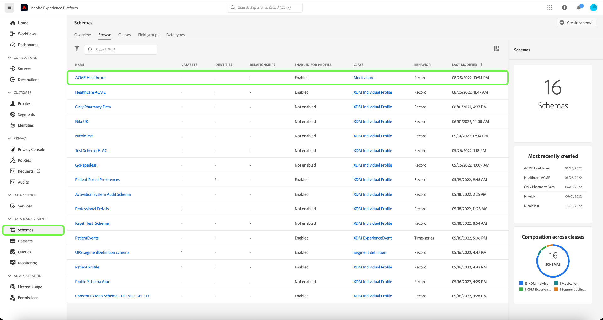

# 속성 기반 액세스 제어 엔드투엔드 가이드

Adobe Experience Platform에서 속성 기반 액세스 제어를 사용하여 개인 정보 보호를 중요하게 생각하는 자신과 다른 다중 브랜드 고객에게 사용자 액세스를 더 유연하게 관리할 수 있도록 합니다. 스키마 필드 및 세그먼트와 같은 개별 객체에 대한 액세스는 객체의 속성 및 역할에 따른 정책으로 부여될 수 있습니다. 이 기능을 사용하면 조직 내 특정 플랫폼 사용자에 대한 개별 오브젝트에 액세스를 허용하거나 취소할 수 있습니다.

이 기능을 사용하면 조직 또는 데이터 사용 범위를 정의하는 레이블을 사용하여 스키마 필드, 세그먼트 등을 분류할 수 있습니다. Adobe Journey Optimizer의 여정, 오퍼 및 기타 개체에 동일한 레이블을 적용할 수 있습니다. 이와 동시에 관리자는 XDM(Experience Data Model) 스키마 필드를 둘러싼 액세스 정책을 정의하고 이러한 필드에 액세스할 수 있는 사용자 또는 그룹(내부, 외부 또는 타사 사용자)을 더 잘 관리할 수 있습니다.

>[!NOTE]
>
>이 문서는 액세스 제어 정책의 사용 사례를 중점적으로 다룹니다. 플랫폼 사용자가 액세스할 수 있는 데이터가 아닌 데이터의 **사용**&#x200B;을 제어하는 정책을 설정하는 경우 대신 [데이터 거버넌스](../../data-governance/e2e.md)에 대한 전체 안내서를 참조하십시오.

## 시작하기

이 자습서에서는 다음 플랫폼 구성 요소를 이해하고 있어야 합니다.

* [[!DNL Experience Data Model (XDM)] 시스템](../../xdm/home.md): Experience Platform이 고객 경험 데이터를 구성하는 표준화된 프레임워크입니다.
   * [스키마 컴포지션의 기본 사항](../../xdm/schema/composition.md): 스키마 컴포지션의 주요 원칙 및 모범 사례를 포함하여 XDM 스키마의 기본 구성 요소에 대해 알아봅니다.
   * [스키마 편집기 튜토리얼](../../xdm/tutorials/create-schema-ui.md): 스키마 편집기 UI를 사용하여 사용자 지정 스키마를 만드는 방법을 알아봅니다.
* [Adobe Experience Platform 세분화 서비스](../../segmentation/home.md): [!DNL Platform] 내의 세분화 엔진은 고객 동작 및 특성을 기반으로 고객 프로필에서 대상 세그먼트를 만드는 데 사용됩니다.

### 사용 사례 개요

예제 속성 기반 액세스 제어 워크플로를 통해 역할, 레이블 및 정책을 만들고 할당하여 사용자가 조직의 특정 리소스에 액세스할 수 있는지 여부를 구성할 수 있습니다. 이 안내서에서는 워크플로우를 보여 주기 위해 중요한 데이터에 대한 액세스를 제한하는 예를 사용합니다. 이 사용 사례는 아래에 요약되어 있습니다.

의료 서비스 제공업체로서 조직의 리소스에 대한 액세스를 구성하려고 합니다.

* 내부 마케팅 팀에서 **[!UICONTROL PHI/ 규제 상태 데이터]** 데이터에 액세스할 수 있어야 합니다.
* 외부 에이전트에서 **[!UICONTROL PHI/ 규제 상태 데이터]** 데이터에 액세스할 수 없습니다.

이렇게 하려면 역할, 리소스 및 정책을 구성해야 합니다.

다음을 수행할 수 있습니다.

* [사용자의 역할에 레이블 지정](#label-roles): 마케팅 그룹이 외부 에이전시와 함께 작동하는 의료 공급자(ACME 비즈니스 그룹)의 예를 사용하십시오.
* [리소스(스키마 필드 및 세그먼트)에 레이블 지정](#label-resources): 스키마 리소스 및 세그먼트에 **[!UICONTROL PHI/ 규제 상태 데이터]** 레이블을 지정합니다.
* [함께 연결할 정책을 활성화합니다](#policy): 기본 정책을 활성화하여 리소스의 레이블을 역할의 레이블에 연결하여 스키마 필드 및 세그먼트에 대한 액세스를 차단합니다. 그러면 레이블이 일치하는 사용자에게 모든 샌드박스의 스키마 필드 및 세그먼트에 대한 액세스 권한이 제공됩니다.

## 권한

[!UICONTROL 권한]은(는) 관리자가 사용자 역할과 정책을 정의하여 제품 응용 프로그램 내의 기능 및 개체에 대한 권한을 관리할 수 있는 Experience Cloud 영역입니다.

[!UICONTROL 권한]을 통해 역할을 만들고 관리하며 이러한 역할에 대해 원하는 리소스 권한을 할당할 수 있습니다. [!UICONTROL 권한]을 통해 레이블, 샌드박스 및 특정 역할과 연결된 사용자를 관리할 수도 있습니다.

관리자 권한이 없는 경우 시스템 관리자에게 문의하여 액세스 권한을 받으십시오.

관리자 권한이 있으면 [Adobe Experience Cloud](https://experience.adobe.com/)(으)로 이동하여 Adobe 자격 증명을 사용하여 로그인하십시오. 로그인하면 관리자 권한이 있는 조직의 **[!UICONTROL 개요]** 페이지가 나타납니다. 이 페이지에는 조직이 구독한 제품과 함께 사용자 및 관리자를 조직에 추가할 수 있는 다른 컨트롤이 표시됩니다. **[!UICONTROL 권한]**&#x200B;을 선택하여 Platform 통합을 위한 작업 영역을 엽니다.

Platform UI에 대한 권한 작업 영역이 표시되어 **[!UICONTROL 역할]** 페이지에서 열립니다.

## 역할에 레이블 적용 {#label-roles}

>[!CONTEXTUALHELP]
>id="platform_permissions_labels_about"
>title="레이블이란 무엇입니까?"
>abstract="레이블을 사용하면 해당 데이터에 적용되는 사용 정책에 따라 데이터 세트 및 필드를 분류할 수 있습니다. Platform은 데이터 거버넌스에 적용할 수 있는 다양한 공통 제한 사항을 다루는 Adobe에서 정의한 여러 “핵심” 데이터 사용 레이블을 제공합니다. 예를 들어 RHD(규제 건강 데이터)와 같은 중요한 “S” 레이블을 사용하면 PHI(개인건강정보)를 참조하는 데이터를 분류할 수 있습니다. 조직의 요구 사항에 맞는 고유한 사용자 정의 레이블을 정의할 수도 있습니다."
>additional-url="https://experienceleague.adobe.com/docs/experience-platform/data-governance/labels/overview.html#understanding-data-usage-labels" text="데이터 사용 레이블 개요"

>[!CONTEXTUALHELP]
>id="platform_permissions_labels_about_create"
>title="새 레이블 만들기"
>abstract="조직의 요구 사항에 맞게 고유한 사용자 정의 레이블을 만들 수 있습니다. 사용자 정의 레이블을 사용하여 데이터 거버넌스와 액세스 제어 구성을 모두 데이터에 적용할 수 있습니다."
>additional-url="https://experienceleague.adobe.com/docs/experience-platform/data-governance/labels/overview.html#manage-labels" text="사용자 정의 레이블 관리"

>[!CONTEXTUALHELP]
>id="platform_permissions_roles_about"
>title="역할이란 무엇입니까?"
>abstract="역할은 Platform 인스턴스와 상호 작용하고 액세스 제어 정책의 블록을 구성하는 사용자 유형을 분류하는 방법입니다. 역할에는 주어진 권한 집합이 있으며 조직의 멤버들은 필요한 보기 또는 쓰기 액세스 범위에 따라 하나 이상의 역할에 할당될 수 있습니다."
>additional-url="https://experienceleague.adobe.com/docs/experience-platform/access-control/abac/permissions-ui/roles.html?lang=ko" text="역할 관리"

>[!CONTEXTUALHELP]
>id="platform_permissions_roles_about_create"
>title="새 역할 만들기"
>abstract="Platform 인스턴스에 액세스하는 사용자를 더 잘 분류하기 위해 새 역할을 생성할 수 있습니다. 예를 들어 내부 마케팅 팀에 대한 역할을 생성하고 해당 역할에 RHD 레이블을 적용하여 내부 마케팅 팀이 PHI(개인건강정보)에 액세스하도록 허용할 수 있습니다. 또는 외부 에이전시에 대한 역할을 생성하고 해당 역할에 RHD 레이블을 적용하지 않음으로써 PHI 데이터에 대한 해당 역할의 액세스를 거부할 수도 있습니다."
>additional-url="https://experienceleague.adobe.com/docs/experience-platform/access-control/abac/permissions-ui/roles.html#create-a-new-role" text="새 역할 만들기"

>[!CONTEXTUALHELP]
>id="platform_permissions_roles_details"
>title="역할 개요"
>abstract="역할 개요 대화 상자에는 지정된 역할이 액세스할 수 있는 리소스 및 샌드박스가 표시됩니다."

역할은 Platform 인스턴스와 상호 작용하는 사용자 유형을 분류하는 방법이며 액세스 제어 정책을 작성하는 빌딩 블록입니다. 역할에는 지정된 권한 집합이 있으며, 필요한 액세스 범위에 따라 조직 구성원을 하나 이상의 역할에 할당할 수 있습니다.

시작하려면 **[!UICONTROL 역할]** 페이지에서 **[!UICONTROL ACME 비즈니스 그룹]**&#x200B;을(를) 선택하십시오.

**[!UICONTROL 레이블]**&#x200B;을 선택한 다음 **[!UICONTROL 레이블 추가]**&#x200B;를 선택합니다.

조직의 모든 레이블 목록이 나타납니다. **[!UICONTROL PHI/규제 상태 데이터]**&#x200B;에 대한 레이블을 추가하려면 **[!UICONTROL RHD]**&#x200B;을(를) 선택하십시오. 레이블 옆에 파란색 확인 표시가 나타날 때까지 잠시 기다렸다가 **[!UICONTROL 저장]**&#x200B;을 선택합니다.

>[!NOTE]
>
>역할에 조직 그룹을 추가하면 해당 그룹의 모든 사용자가 역할에 추가됩니다. 조직 그룹(제거되거나 추가된 사용자)에 대한 모든 변경 사항은 역할 내에서 자동으로 업데이트됩니다.

## 스키마 필드에 레이블 적용 {#label-resources}

[!UICONTROL RHD] 레이블로 사용자 역할을 구성했으므로 다음 단계에서는 해당 역할에 대해 제어할 리소스에 동일한 레이블을 추가합니다.

왼쪽 탐색에서 **[!UICONTROL 스키마]**&#x200B;를 선택한 다음 표시되는 스키마 목록에서 **[!UICONTROL ACME 의료 서비스]**&#x200B;를 선택하십시오.

그런 다음 **[!UICONTROL 레이블]**&#x200B;을 선택하여 스키마와 연결된 필드를 표시하는 목록을 확인합니다. 여기에서 한 번에 하나 또는 여러 필드에 레이블을 할당할 수 있습니다. **[!UICONTROL 혈당]** 및 **[!UICONTROL 인슐린 수준]** 필드를 선택한 다음 **[!UICONTROL 액세스 및 데이터 거버넌스 레이블 적용]**&#x200B;을 선택하십시오.

스키마 필드에 적용할 레이블을 선택할 수 있는 **[!UICONTROL 레이블 편집]** 대화 상자가 나타납니다. 이 사용 사례의 경우 **[!UICONTROL PHI/ 규제 상태 데이터]** 레이블을 선택한 다음 **[!UICONTROL 저장]**&#x200B;을 선택합니다.

>[!NOTE]
>
>레이블이 필드에 추가되면 해당 레이블은 해당 필드의 상위 리소스(클래스 또는 필드 그룹)에 적용됩니다. 상위 클래스 또는 필드 그룹이 다른 스키마에서 사용되는 경우 해당 스키마는 동일한 레이블을 상속합니다.

## 세그먼트에 레이블 적용

>[!NOTE]
>
>동일한 액세스 제한을 적용하려면 레이블이 지정된 속성을 사용하는 세그먼트에도 마찬가지로 레이블이 지정되어야 합니다.

스키마 필드에 레이블 지정을 완료한 후에는 세그먼트에 레이블 지정을 시작할 수 있습니다.

왼쪽 탐색에서 **[!UICONTROL 세그먼트]**&#x200B;를 선택합니다. 조직에서 사용 가능한 세그먼트 목록이 표시됩니다. 이 예에서는 다음 두 세그먼트에 중요한 상태 데이터가 포함되어 있으므로 레이블을 지정합니다.

* 혈당 >100
* 인슐린 &lt;50

세그먼트 레이블을 지정하려면 **[!UICONTROL 혈당 > 100]**&#x200B;을(를) 선택하십시오.

세그먼트 **[!UICONTROL 세부 정보]** 화면이 나타납니다. **[!UICONTROL 액세스 관리]**&#x200B;를 선택합니다.

세그먼트에 적용할 레이블을 선택할 수 있는 **[!UICONTROL 레이블 편집]** 대화 상자가 나타납니다. 이 사용 사례의 경우 **[!UICONTROL PHI/ 규제 상태 데이터]** 레이블을 선택한 다음 **[!UICONTROL 저장]**&#x200B;을 선택합니다.

**[!UICONTROL 인슐린 &lt;50]**(으)로 위의 단계를 반복합니다.

>[!NOTE]
>
> [개체 수준 액세스 제어](https://experienceleague.adobe.com/en/docs/journey-optimizer/using/access-control/object-based-access)를 사용하여 [!UICONTROL 권한] 작업 영역에서 만든 레이블(예: 위의 세그먼트 레이블)을 Adobe Journey Optimizer의 다양한 개체에 할당합니다.&quot;

## 액세스 제어 정책 활성화 {#policy}

기본 액세스 제어 정책은 레이블을 활용하여 특정 플랫폼 리소스에 액세스할 수 있는 사용자 역할을 정의합니다. 이 예에서는 스키마 필드에 해당 레이블이 있는 역할에 없는 사용자의 경우 모든 샌드박스에서 스키마 필드 및 세그먼트에 대한 액세스가 거부됩니다.

액세스 제어 정책을 활성화하려면 왼쪽 탐색에서 [!UICONTROL 권한]을 선택한 다음 **[!UICONTROL 정책]**&#x200B;을 선택하십시오.

그런 다음 정책 이름 옆에 있는 줄임표(`...`)를 선택합니다. 드롭다운에 역할을 편집, 활성화, 삭제 또는 복제할 컨트롤이 표시됩니다. 드롭다운에서 **[!UICONTROL 활성화]**&#x200B;를 선택합니다.

정책을 활성화하기 위한 

활성화를 확인하라는 메시지가 표시되는 정책 활성화 대화 상자가 나타납니다. **[!UICONTROL 확인]**&#x200B;을 선택합니다.

정책 활성화를 확인하면 [!UICONTROL 정책] 페이지로 돌아갑니다.

<!-- ## Create an access control policy {#policy}

>[!CONTEXTUALHELP]
>id="platform_permissions_policies_about"
>title="What are policies?"
>abstract="Policies are statements that bring attributes together to establish permissible and impermissible actions. Every organization comes with a default policy that you must activate to define rules for resources like segments and schema fields. Default policies can neither be edited nor deleted. However, default policies can be activated or deactivated."
>additional-url="https://experienceleague.adobe.com/docs/experience-platform/access-control/abac/permissions-ui/policies.html" text="Manage policies"

>[!CONTEXTUALHELP]
>id="platform_permissions_policies_about_create"
>title="Create a policy"
>abstract="Create a policy to define the actions that your users can and cannot take against your segments and schema fields."
>additional-url="https://experienceleague.adobe.com/docs/experience-platform/access-control/abac/permissions-ui/policies.html#create-a-new-policy" text="Create a policy"

>[!CONTEXTUALHELP]
>id="platform_permissions_policies_edit_permitdeny"
>title="Configure permissible and impermissible actions for a policy"
>abstract="A <b>deny access to</b> policy will deny users access when the criteria is met. Combined with <b>The following being false</b> - all users will be denied access unless they meet the matching criteria set. This type of policy allows you to protect a sensitive resource and only allow access to users with matching labels.  A <b>permit access to</b> policy will permit users access when the criteria are met. When combined with <b>The following being true</b> - users will be given access if they meet the matching criteria set. This does not explicitly deny access to users, but adds a permit access. This type of policy allows you to give additional access to resource and in addition to those users who might already have access through role permissions."
>additional-url="https://experienceleague.adobe.com/docs/experience-platform/access-control/abac/permissions-ui/policies.html#edit-a-policy" text="Edit a policy"

>[!CONTEXTUALHELP]
>id="platform_permissions_policies_edit_resource"
>title="Configure permissions for a resource"
>abstract="A resource is the asset or object that a user can or cannot access. Resources can be segments or schemas fields. You can configure write, read, or delete permissions for segments and schema fields."

>[!CONTEXTUALHELP]
>id="platform_permissions_policies_edit_condition"
>title="Edit conditions"
>abstract="Apply conditional statements to your policy to configure user access to certain resources. Select match all to require users to have roles with the same labels as a resource to be permitted access. Select match any to require users to have a role with just one label matching a label on a resource. Labels can either be defined as core or custom labels, with core labels representing labels created and provided by Adobe and custom labels representing labels that you created for your organization."

Access control policies leverage labels to define which user roles have access to specific Platform resources. Policies can either be local or global and can override other policies. In this example, access to schema fields and segments will be denied in all sandboxes for users who don't have the corresponding labels in the schema field.

>[!NOTE]
>
>A "deny policy" is created to grant access to sensitive resources because the role grants permission to the subjects. The written policy in this example **denies** you access if you are missing the required labels.

To create an access control policy, select **[!UICONTROL Permissions]** from the left navigation and then select **[!UICONTROL Policies]**. Next, select **[!UICONTROL Create policy]**.

The **[!UICONTROL Create new policy]** dialog appears, prompting you to enter a name and an optional description. Select **[!UICONTROL Confirm]** when finished.

To deny access to the schema fields, use the dropdown arrow and select **[!UICONTROL Deny access to]** and then select **[!UICONTROL No resource selected]**. Next, select **[!UICONTROL Schema Field]** and then select **[!UICONTROL All]**.

The table below shows the conditions available when creating a policy:

| Conditions | Description |
| --- | --- |
| The following being false| When 'Deny access to' is set, access will be restricted if the user does not meet the criteria selected. |
| The following being true| When 'Permit access to' is set, access will be permitted if the user meets the selected criteria. |
| Matches any| The user has a label that matches any label applied to a resource. |
| Matches all| The user has all labels that matches all labels applied to a resource. |
| Core label| A core label is an Adobe-defined label that is available in all Platform instances.|
| Custom label| A custom label is a label that has been created by your organization.|

Select **[!UICONTROL The following being false]** and then select **[!UICONTROL No attribute selected]**. Next, select the user **[!UICONTROL Core label]**, then select **[!UICONTROL Matches all]**. Select the resource **[!UICONTROL Core label]** and finally select **[!UICONTROL Add resource]**.

>[!TIP]
>
>A resource is the asset or object that a subject can or cannot access. Resources can be segments or schemas.

To deny access to the segments, use the dropdown arrow and select **[!UICONTROL Deny access to]** and then select **[!UICONTROL No resource selected]**. Next, select **[!UICONTROL Segment]** and then select **[!UICONTROL All]**.

Select **[!UICONTROL The following being false]** and then select **[!UICONTROL No attribute selected]**. Next, select the user **[!UICONTROL Core label]**, then select **[!UICONTROL Matches all]**. Select the resource **[!UICONTROL Core label]** and finally select **[!UICONTROL Save]**.

Select **[!UICONTROL Activate]** to activate the policy, and a dialog appears which prompts you to confirm activation. Select **[!UICONTROL Confirm]** and then select **[!UICONTROL Close]**.

 -->

## 다음 단계

역할, 스키마 필드 및 세그먼트에 레이블 적용을 완료했습니다. 이러한 역할에 할당된 외부 에이전시에서는 스키마, 데이터 세트 및 프로필 보기에서 이러한 레이블과 해당 값을 볼 수 없습니다. 또한 이러한 필드는 세그먼트 빌더를 사용할 때 세그먼트 정의에서 사용할 수 없도록 제한됩니다.

특성 기반 액세스 제어에 대한 자세한 내용은 [특성 기반 액세스 제어 개요](./overview.md)를 참조하십시오.

다음 비디오에서는 속성 기반 액세스 제어에 대한 이해를 돕기 위해 역할, 리소스 및 정책을 구성하는 방법에 대해 설명합니다.

>[!VIDEO](https://video.tv.adobe.com/v/345641?learn=on)
