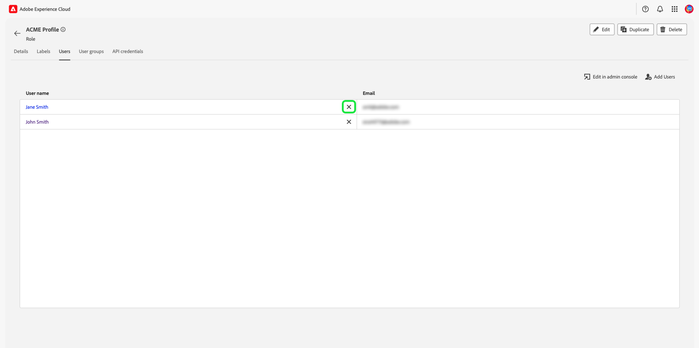

# 역할에 대한 권한 관리

>[!IMPORTANT]
>
>액세스 제어는 권한 부여에 사용자 ID(사용자에게 할당된 내부 고유 ID)를 사용합니다. 조직이 Adobe ID에서 비즈니스 ID로 마이그레이션되면 사용자 ID가 변경되고 액세스 제어가 새로 생성된 사용자 ID를 사용하므로 해당 사용자에 대해 설정된 모든 권한이 손실됩니다. 조직이 비즈니스 ID로 마이그레이션된 경우 Adobe 담당자에게 문의하여 사용자 ID를 Adobe ID에서 비즈니스 ID로 마이그레이션하십시오.

권한은 관리자가 사용자 역할 및 액세스 정책을 정의하여 제품 응용 프로그램 내의 기능 및 개체에 대한 액세스 권한을 관리할 수 있는 Experience Cloud 영역입니다.

권한을 통해 역할을 만들고 관리하고 이러한 역할에 대해 원하는 리소스 권한을 할당할 수 있습니다. 또한 권한을 사용하여 특정 역할과 연관된 레이블, 샌드박스 및 사용자를 관리할 수도 있습니다.

바로 다음 [새 역할 만들기](#create-a-new-role)를 반환하면 **[!UICONTROL 역할]** 탭. 기존 역할에 대한 권한을 편집하는 경우 **[!UICONTROL 역할]** 탭. 또는 필터 옵션을 사용하여 결과를 필터링하여 역할을 찾습니다.

## 역할 필터링

단계 아이콘( )을 선택합니다)을 클릭하여 필터 컨트롤 목록을 표시하여 결과를 좁힐 수 있습니다.

UI에서 역할에 다음 필터를 사용할 수 있습니다.

| 필터 | 설명 |
| --- | --- |
| [!UICONTROL 다음 사이] | 결과를 필터링할 날짜 범위를 정의하려면 시작 날짜 및/또는 종료 날짜를 선택합니다. |
| [!UICONTROL 작성자] | 드롭다운에서 사용자를 선택하여 역할 작성자별로 필터링합니다. |
| [!UICONTROL 다음 사이 수정됨] | 결과를 필터링할 날짜 범위를 정의하려면 시작 날짜 및/또는 종료 날짜를 선택합니다. |
| [!UICONTROL 수정한 사람] | 드롭다운에서 사용자를 선택하여 역할별 필터링 수정자. |

필터를 제거하려면 해당 필터의 알약 아이콘에서 &quot;X&quot;를 선택하거나 을 선택합니다 **[!UICONTROL 모두 지우기]** 모든 필터를 제거하려면 다음을 수행하십시오.

## 역할 세부 사항

에서 역할을 선택합니다 **[!UICONTROL 역할]** 탭의 역할 세부 사항 페이지가 열립니다.

세부 사항 탭에서는 역할에 대한 개요를 제공합니다. 개요에는 역할 이름, 역할 설명, 역할을 만들고 수정한 사용자의 이름, 역할을 만들고 수정할 때 및 역할에 첨부된 권한이 표시됩니다. 필요한 경우 역할 이름 및 역할 설명을 수정할 수 있습니다.

## 역할에 대한 레이블 관리

을(를) 선택합니다 **[!UICONTROL 레이블]** 탭하여 역할 레이블 페이지를 연 다음, 을 선택합니다 **[!UICONTROL 레이블 추가]** 역할에 레이블을 할당하려면 다음을 수행하십시오.

이 페이지에는 레이블이 나열됩니다. 목록에는 레이블 이름, 친숙한 이름, 카테고리 및 해당 설명이 표시됩니다.

목록에 추가할 레이블을 선택한 다음 을(를) 선택합니다 **[!UICONTROL 저장]**

추가된 레이블은 아래에 나타납니다. **[!UICONTROL 레이블]** 탭.

롤에서 레이블을 제거하려면 **X** 레이블 이름 옆에 있는 아이콘을 클릭합니다.

## 역할에 대한 샌드박스 관리

을(를) 선택합니다 **[!UICONTROL 샌드박스]** 탭하여 역할 샌드박스 페이지를 엽니다. 역할에 추가된 샌드박스 목록을 확인할 수 있습니다.

역할에 샌드박스를 더 추가하려면 을 선택합니다 **[!UICONTROL 편집]**.

다음 화면에서는 드롭다운을 사용하여 역할에 포함할 샌드박스에 있는 리소스 권한을 선택하라는 메시지를 표시합니다. 완료되면 을 선택합니다 **[!UICONTROL 저장 및 종료]**.

## 역할에 대한 사용자 관리

을(를) 선택합니다 **[!UICONTROL 사용자]** 탭을 사용하여 역할 사용자 페이지를 열고 을 선택합니다 **[!UICONTROL 사용자 추가]** 사용자를 역할에 할당합니다.

목록에 추가할 사용자를 목록에서 선택합니다. 또는 검색 창에서 이름 또는 이메일 주소를 입력하여 사용자를 검색한 다음 을 선택합니다 **[!UICONTROL 저장]**

추가된 사용자는 **[!UICONTROL 사용자]** 탭.

역할에서 사용자를 제거하려면 **X** 사용자 이름 옆에 있는 아이콘을 클릭합니다.

## 역할에 대한 API 자격 증명 관리

을(를) 선택합니다 **[!UICONTROL API 자격 증명]** 탭을 클릭하여 역할 API 자격 증명 페이지를 연 다음 을 선택합니다 **[!UICONTROL API 자격 증명 추가]** 역할에 API 자격 증명을 할당하기 위해 사용됩니다.

목록에 추가할 API 자격 증명을 선택하고 을 선택합니다 **[!UICONTROL 저장]**

추가된 API 자격 증명은 아래에 나타납니다. **[!UICONTROL API 자격 증명]** 탭.

역할에서 API 자격 증명을 제거하려면 **X** api 자격 증명 이름 옆에 있는 아이콘을 클릭합니다.

다음 **[!UICONTROL API 자격 증명 제거]** 대화 상자가 나타나서 삭제를 확인하는 메시지가 나타납니다.

그러면 로 돌아갑니다. **[!UICONTROL API 자격 증명]** 탭.

## 역할에 대한 사용자 그룹 관리

사용자 그룹은 그룹화된 여러 사용자이며 동일한 기능을 실행할 수 있는 액세스 권한이 있습니다.

을(를) 선택합니다 **[!UICONTROL 사용자 그룹]** 탭을 사용하여 역할 사용자 그룹 페이지를 열고 을 선택합니다 **[!UICONTROL 그룹 추가]** 역할에 사용자 그룹을 할당하려면 다음을 수행합니다.

목록에 추가할 사용자 그룹을 선택합니다. 또는 검색 막대를 사용하여 그룹의 이름을 입력하여 사용자 그룹을 검색한 다음, 을 선택합니다 **[!UICONTROL 저장]**

추가된 사용자 그룹은 아래에 나타납니다. **[!UICONTROL 사용자 그룹]** 탭.

역할에서 사용자 그룹을 제거하려면 **X** 사용자 그룹 이름 옆에 있는 아이콘을 클릭합니다.

다음 **[!UICONTROL 사용자 그룹 제거]** 대화 상자가 나타나서 삭제를 확인하는 메시지가 나타납니다.

그러면 로 돌아갑니다. **[!UICONTROL 사용자 그룹]** 탭.

## 다음 단계

권한이 설정되어 있으면 다음 단계로 진행할 수 있습니다. [사용자 관리](users.md).
