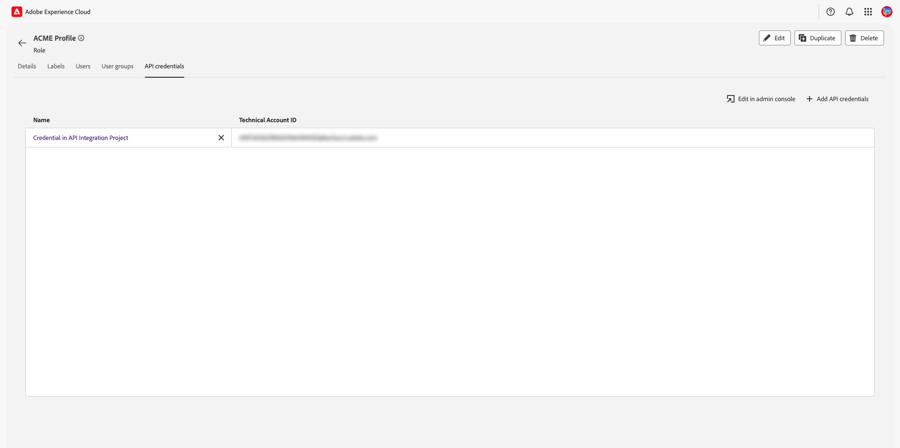

# 역할에 대한 권한 관리 {#manage-role-permissions}

>[!CONTEXTUALHELP]
>id="platform_permissions_roles_about"
>title="역할이란 무엇입니까?"
>abstract="역할은 관리자, 전문가 또는 최종 사용자가 조직 내 리소스에 접근할 수 있는 권한을 정의합니다. 이들은 Experience Platform 인스턴스와 상호 작용하는 사용자를 분류하며 액세스 제어 정책의 기본 구성단위입니다. 역할에는 주어진 권한 집합이 있으며 조직의 멤버들은 필요한 보기 또는 쓰기 액세스 범위에 따라 하나 이상의 역할에 할당될 수 있습니다."
>additional-url="https://experienceleague.adobe.com/docs/experience-platform/access-control/abac/permissions-ui/roles.html?lang=ko" text="역할 관리"

>[!IMPORTANT]
>
>액세스 컨트롤은 권한 부여에 사용자 ID(사용자에게 할당된 내부 고유 ID)를 사용합니다. 조직이 Adobe ID에서 Business ID로 마이그레이션되면 사용자 ID가 변경되고 액세스 제어가 새로 생성된 사용자 ID를 사용하게 되므로 해당 사용자에 대해 설정된 모든 권한이 손실됩니다. 조직이 Business ID로 마이그레이션되는 경우 Adobe 담당자에게 문의하여 사용자 ID를 Adobe ID에서 Business ID로 마이그레이션하십시오.

권한은 관리자가 사용자 역할 및 액세스 정책을 정의하여 제품 애플리케이션 내의 기능 및 개체에 대한 액세스 권한을 관리할 수 있는 Experience Cloud 영역입니다.

권한을 통해 역할을 만들고 관리하며, 이러한 역할에 대해 원하는 리소스 권한을 할당할 수 있습니다. 또한 권한을 사용하여 레이블, 샌드박스 및 특정 역할과 연관된 사용자를 관리할 수 있습니다.

[새 역할을 만드는 중](#create-a-new-role) 직후에 **[!UICONTROL 역할]** 탭으로 돌아갑니다. 기존 역할에 대한 권한을 편집하는 경우 **[!UICONTROL 역할]** 탭에서 역할을 선택합니다. 또는 필터 옵션을 사용하여 결과를 필터링하여 역할을 찾습니다.

## 역할 필터링

단계 아이콘()을 선택하여 결과를 좁히는 데 도움이 되는 필터 컨트롤 목록을 표시합니다.

UI의 역할에 사용할 수 있는 필터는 다음과 같습니다.

| 필터 | 설명 |
| --- | --- |
| [!UICONTROL 생성 기간] | 시작 날짜 및/또는 종료 날짜를 선택하여 결과를 필터링할 날짜 범위를 정의합니다. |
| [!UICONTROL 만든 사람] | 드롭다운에서 사용자를 선택하여 역할 생성자별로 필터링합니다. |
| [!UICONTROL 다음 기간 동안 수정됨] | 시작 날짜 및/또는 종료 날짜를 선택하여 결과를 필터링할 날짜 범위를 정의합니다. |
| [!UICONTROL 수정한 사람] | 드롭다운에서 사용자를 선택하여 역할 수정자로 필터링합니다. |

필터를 제거하려면 해당 필터의 알약 아이콘에서 &quot;X&quot;를 선택하거나 **[!UICONTROL 모두 지우기]**&#x200B;를 선택하여 모든 필터를 제거합니다.

## 역할 세부 정보 {#role-details}

>[!CONTEXTUALHELP]
>id="platform_permissions_roles_details"
>title="역할 개요"
>abstract="역할 개요 대화 상자에는 지정된 역할에 접근할 수 있는 리소스 및 샌드박스 등 역할의 세부 정보가 표시됩니다. 역할 작업 영역 내의 해당 탭으로 이동하여 역할에 대한 레이블, 사용자, 사용자 그룹 및 API 자격 증명을 관리할 수 있습니다."
>additional-url="https://experienceleague.adobe.com/ko/docs/experience-platform/access-control/abac/permissions-ui/permissions#manage-labels-for-a-role" text="역할에 대한 레이블 관리"
>additional-url="https://experienceleague.adobe.com/ko/docs/experience-platform/access-control/abac/permissions-ui/permissions#manage-users-for-a-role" text="역할에 대한 사용자 관리"

**[!UICONTROL 역할]** 탭에서 역할을 선택하면 해당 역할의 [!UICONTROL 세부 정보] 대시보드가 열립니다.

[!UICONTROL 세부 정보] 대시보드에서는 역할에 대한 개요를 제공합니다. 개요에는 생성 및 수정 날짜와 함께 역할 이름, 설명, 생성자 및 마지막 수정자가 표시됩니다. 또한 역할에 첨부된 권한과 할당된 샌드박스 목록도 표시됩니다. 필요한 경우 역할 이름 및 설명을 수정할 수 있습니다.

## 역할에 대한 레이블 관리

**[!UICONTROL 레이블]** 탭을 선택하여 역할 레이블 작업 영역을 연 다음 **[!UICONTROL 레이블 추가]**&#x200B;를 선택하여 역할에 레이블을 지정합니다.

레이블 목록을 표시하는 **[!UICONTROL 액세스 및 데이터 거버넌스 레이블 적용]** 대화 상자가 표시됩니다. 이 목록에는 레이블 이름, 친숙한 이름, 범주 및 해당 설명이 표시됩니다.

역할에 추가할 목록에서 레이블을 선택한 다음 **[!UICONTROL 저장]**&#x200B;을 선택합니다.

추가된 레이블은 **[!UICONTROL 레이블]** 탭에 나타납니다.

역할에서 레이블을 제거하려면 레이블을 선택한 다음 **[!UICONTROL 레이블 제거]**&#x200B;를 선택하십시오.

## 역할의 샌드박스 관리

**[!UICONTROL 세부 정보]** 탭을 선택하고 **[!UICONTROL 샌드박스]** 섹션으로 이동합니다. 역할에 추가된 전체 샌드박스 목록을 보려면 **[!UICONTROL 모두 보기]**&#x200B;를 선택하십시오.

역할에 샌드박스를 더 추가하려면 UI의 오른쪽 상단에서 **[!UICONTROL 편집]**&#x200B;을 선택합니다.

다음 화면에서는 드롭다운을 사용하여 역할에 포함할 샌드박스 리소스를 선택하라는 메시지가 표시됩니다. 완료되면 **[!UICONTROL 저장]**&#x200B;을 선택한 다음 **[!UICONTROL 닫기]**&#x200B;를 선택합니다.

## 역할에 대한 사용자 관리

**[!UICONTROL 사용자]** 탭을 선택하여 [!UICONTROL 사용자] 작업 영역을 연 다음 **[!UICONTROL 사용자 추가]**&#x200B;를 선택하여 역할에 사용자를 할당합니다.

![역할의 사용자 작업 영역이 [사용자] 탭과 [사용자 추가] 옵션이 강조 표시된 상태로 표시됩니다.](../../images/flac-ui/flac-users.png)

**[!UICONTROL 사용자 추가]** 대화 상자가 나타납니다. 목록에서 역할에 추가할 사용자를 선택합니다. 또는 검색 창을 사용하여 이름이나 전자 메일 주소를 입력하여 사용자를 검색한 다음 **[!UICONTROL 저장]**&#x200B;을 선택합니다

![사용자가 선택된 상태에서 [사용자 추가] 대화 상자가 열리고 검색 창과 저장 옵션이 강조 표시됩니다.](../../images/flac-ui/flac-add-users.png)

추가된 사용자는 **[!UICONTROL 사용자]** 탭에 표시됩니다.

역할에서 사용자를 제거하려면 사용자 이름 옆에 있는 **X** 아이콘을 선택하십시오.

다음 비디오는 새 역할을 만들고 해당 역할에 대한 사용자를 관리하는 방법에 대한 이해를 돕기 위한 것입니다.

>[!VIDEO](https://video.tv.adobe.com/v/336081/?learn=on)

## 역할에 대한 API 자격 증명 관리 {#manage-api-credentials-for-role}

>[!CONTEXTUALHELP]
>id="platform_permissions_apicredentials_about"
>title="API 자격 증명이란 무엇입니까?"
>abstract="API 자격 증명은 사용자 및 개발자에게 Experience Platform API에 대한 액세스 권한을 부여하는 역할에 할당됩니다. Experience Platform API를 사용하면 계산된 속성 구성, 데이터/엔티티 액세스, 데이터 내보내기, 불필요한 데이터 또는 배치 삭제 등과 같은 데이터에 대한 기본 CRUD(만들기, 읽기, 업데이트, 삭제) 작업을 프로그래밍 방식으로 수행할 수 있습니다."
>additional-url="https://experienceleague.adobe.com/ko/docs/experience-platform/landing/platform-apis/api-guide" text="Experience Platform API 안내서"

>[!IMPORTANT]
>
> [!UICONTROL 권한]에서 API 자격 증명을 사용하고 관리하려면 사용자에게 시스템 관리자 권한이 있어야 합니다.

Experience Platform API를 사용자 또는 개발자로 사용하려면 시스템 관리자가 역할에 지정된 권한 집합 외에 API 자격 증명을 추가해야 합니다. API 자격 증명 만들기 및 할당과 필요한 권한에 대한 전체 안내서는 [Experience Platform API 인증 및 액세스](../../../landing/api-authentication.md#generate-credentials)의 단계별 자습서를 참조하십시오.

**[!UICONTROL API 자격 증명]** 탭을 선택하여 역할 API 자격 증명 작업 영역을 연 다음 **[!UICONTROL API 자격 증명 추가]**&#x200B;를 선택하여 역할에 API 자격 증명을 할당합니다.

**[!UICONTROL API 자격 증명 추가]** 대화 상자가 나타납니다. 목록에서 역할에 추가할 API 자격 증명을 선택한 다음 **[!UICONTROL 저장]**&#x200B;을 선택합니다.

![자격 증명을 선택하고 [저장] 옵션이 강조 표시된 API 자격 증명 추가 대화 상자.](../../images/flac-ui/flac-add-api-credentials.png)

추가된 API 자격 증명은 **[!UICONTROL API 자격 증명]** 탭에 나타납니다.

역할에서 API 자격 증명을 제거하려면 API 자격 증명 이름 옆에 있는 **X** 아이콘을 선택하십시오.

**[!UICONTROL API 자격 증명 제거]** 대화 상자가 나타나고 삭제를 확인하는 메시지가 표시됩니다. 선택한 자격 증명 제거를 완료하려면 **[!UICONTROL 확인]**&#x200B;을 선택하세요.

**[!UICONTROL API 자격 증명]** 탭으로 돌아갑니다.

## 역할에 대한 사용자 그룹 관리 {#manage-user-groups}

>[!CONTEXTUALHELP]
>id="platform_permissions_usergroups_about"
>title="사용자 그룹이란 무엇입니까?"
>abstract="사용자 그룹은 동일한 기능에 대한 액세스 권한을 공유하는 여러 사용자의 집합입니다. 조직 내 리소스에 대한 액세스는 사용자 그룹에 할당된 역할을 통해 관리됩니다."
>additional-url="https://experienceleague.adobe.com/ko/docs/experience-platform/access-control/abac/permissions-ui/roles" text="역할 관리"

사용자 그룹은 함께 그룹화된 여러 사용자이며 동일한 기능을 실행할 수 있는 액세스 권한이 있습니다.

**[!UICONTROL 사용자 그룹]** 탭을 선택하여 역할의 사용자 그룹 작업 영역을 연 다음 **[!UICONTROL 그룹 추가]**&#x200B;를 선택하여 역할에 사용자 그룹을 할당합니다.

**[!UICONTROL 그룹 추가]** 대화 상자가 나타납니다. 역할에 추가할 목록에서 사용자 그룹을 선택합니다. 또는 검색 창을 사용하여 그룹 이름을 입력하여 사용자 그룹을 검색한 다음 **[!UICONTROL 저장]**&#x200B;을 선택합니다

추가된 사용자 그룹은 **[!UICONTROL 사용자 그룹]** 탭에 표시됩니다.

역할에서 사용자 그룹을 제거하려면 사용자 그룹 이름 옆에 있는 **X** 아이콘을 선택하십시오.

**[!UICONTROL 사용자 그룹 제거]** 대화 상자가 나타나고 삭제를 확인하는 메시지가 표시됩니다. 선택한 사용자 그룹을 제거하려면 **[!UICONTROL 확인]**&#x200B;을 선택하십시오.

**[!UICONTROL 사용자 그룹]** 탭으로 돌아갑니다.

## Experience Platform에 사용자 추가

시스템 관리자는 개발자에게 Adobe Developer Console에서 [통합 만들기](../../../landing/api-authentication.md#generate-credentials)를 수행할 수 있도록 사용자에게 액세스 권한을 부여할 수 있습니다.

사용자 Experience Platform을 추가하려면 [Admin Console](https://adminconsole.adobe.com)에 로그인하고 **[!UICONTROL 사용자 추가]**&#x200B;를 선택하십시오.

**[!UICONTROL 팀에 사용자 추가]** 대화 상자가 표시됩니다. 사용자의 이메일 주소, 이름(선택 사항) 및 성(선택 사항)을 입력합니다. 그런 다음 **[!UICONTROL 제품]**&#x200B;을 선택하세요.

**[!UICONTROL 제품 선택]** 대화 상자가 나타납니다. **[!UICONTROL Adobe Experience Platform]**&#x200B;을(를) 선택합니다.

**[!UICONTROL 제품 프로필 선택]** 대화 상자가 나타납니다. **[!UICONTROL AEP-Default-All-Users]**&#x200B;를 선택한 다음 **[!UICONTROL 저장]**&#x200B;을 선택합니다.

정보를 검토한 다음 **[!UICONTROL 저장]**&#x200B;을 선택하여 사용자를 추가합니다.

## 다음 단계

권한을 설정한 상태에서 [사용자 관리](users.md)를 위한 다음 단계로 진행할 수 있습니다.
