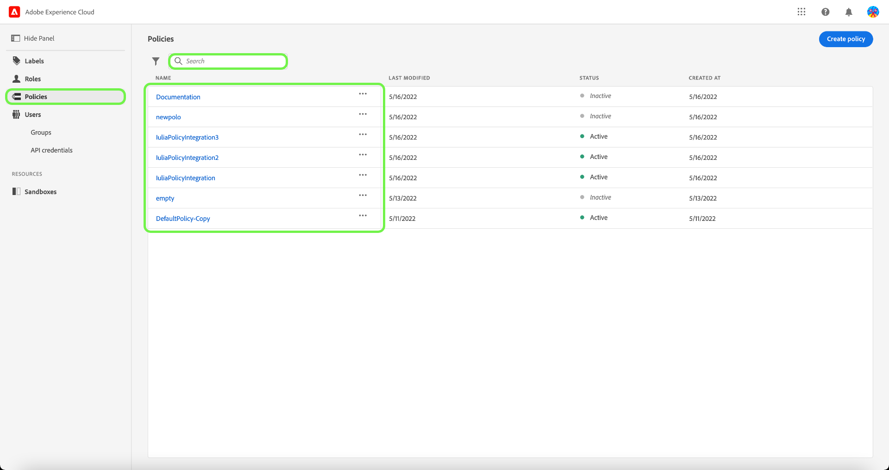

# 액세스 제어 정책 관리

액세스 제어 정책은 속성을 함께 가져와서 허용 가능한 작업과 허용 불가능한 작업을 설정하는 명령문입니다. 액세스 정책은 로컬 또는 전역일 수 있으며 다른 정책을 무시할 수 있습니다. Adobe은 조직에서 레이블을 기반으로 특정 오브젝트에 대한 액세스 제어를 시작할 준비가 될 때마다 또는 즉시 활성화할 수 있는 기본 정책을 제공합니다. 기본 정책은 사용자가 일치하는 레이블이 있는 역할에 있지 않는 한 리소스에 적용된 레이블을 활용하여 액세스를 거부합니다.

>[!IMPORTANT]
>
>액세스 정책은 조직의 사용자가 액세스할 수 있는 Adobe Experience Platform 대신 데이터가 에서 사용되는 방식을 제어하는 데이터 사용 정책과 혼동하지 않습니다. 자세한 내용은 [데이터 사용 정책](../../../data-governance/policies/create.md) 만들기에 대한 안내서를 참조하세요.

<!-- ## Create a new policy

To create a new policy, select the **[!UICONTROL Policies]** tab in the sidebar and select **[!UICONTROL Create Policy]**.

The **[!UICONTROL Create a new policy]** dialog appears, prompting you to enter a name, and an optional description. When finished, select **[!UICONTROL Confirm]**.

Using the dropdown arrow select if you would like to **Permit access to** () a resource or **Deny access to** () a resource.

Next, select the resource that you would like to include in the policy using the dropdown menu and search access type, read or write.

Next, using the dropdown arrow select the condition you would like to apply to this policy, **The following being true** () or **The following being false** ().

Select the plus icon to **Add matches expression** or **Add expression group** for the resource. 

Using the dropdown, select the **Resource**.

Next, using the dropdown select the **Matches**.

Next, using the dropdown, select the type of label (**[!UICONTROL Core label]** or **[!UICONTROL Custom label]**) to match the label assigned to the User in roles.

Finally, select the **Sandbox** that you would like the policy conditions to apply to, using the dropdown menu.

Select **Add resource** to add more resources. Once finished, select **[!UICONTROL Save and exit]**.

The new policy is successfully created, and you are redirected to the **[!UICONTROL Policies]** tab, where you will see the newly created policy appear in the list. 

## Edit a policy

To edit an existing policy, select the policy from the **[!UICONTROL Policies]** tab. Alternatively, use the filter option to filter the results to find the policy you want to edit.

Next, select the ellipsis (`…`) next to the policies name, and a dropdown displays controls to edit, deactivate, delete, or duplicate the role. Select edit from the dropdown.

The policy permissions screen appears. Make the updates then select **[!UICONTROL Save and exit]**.

The policy is successfully updated, and you are redirected to the **[!UICONTROL Policies]** tab.

## Duplicate a policy

To duplicate an existing policy, select the policy from the **[!UICONTROL Policies]** tab. Alternatively, use the filter option to filter the results to find the policy you want to edit.

Next, select the ellipsis (`…`) next to a policies name, and a dropdown displays controls to edit, deactivate, delete, or duplicate the role. Select duplicate from the dropdown.

The **[!UICONTROL Duplicate policy]** dialog appears, prompting you to confirm the duplication. 

The new policy appears in the list as a copy of the original on the **[!UICONTROL Policies]** tab.

## Delete a policy

To delete an existing policy, select the policy from the **[!UICONTROL Policies]** tab. Alternatively, use the filter option to filter the results to find the policy you want to delete.

Next, select the ellipsis (`…`) next to a policies name, and a dropdown displays controls to edit, deactivate, delete, or duplicate the role. Select delete from the dropdown.

The **[!UICONTROL Delete user policy]** dialog appears, prompting you to confirm the deletion. 

You are returned to the **[!UICONTROL policies]** tab and a confirmation of deletion pop over appears.

 -->

## 샌드박스에 대한 정책 구성

>[!IMPORTANT]
>
>기본적으로 모든 고객에 대해 [!UICONTROL 자동 포함] 기능이 설정되어 있으므로 모든 샌드박스가 정책에 추가됩니다.

>[!NOTE]
>
>**[!UICONTROL Default-Label-Based-Access-Control-Policy]** 정책만 현재 구성할 수 있습니다.

정책과 연결된 샌드박스를 보려면 **[!UICONTROL 정책]** 탭에서 정책을 선택합니다.

정책을 선택한 다음 **[!UICONTROL 샌드박스]** 탭을 선택합니다. 정책과 연결된 샌드박스 목록이 표시됩니다.

### 모든 샌드박스에 정책 추가

**[!UICONTROL 샌드박스]** 탭의 **[!UICONTROL 자동 포함]** 토글을 사용하여 모든 샌드박스에 대한 정책을 활성화합니다.

![[!UICONTROL 자동 포함] 전환을 표시하는 [!UICONTROL 샌드박스] 탭입니다.](../../images/flac-ui/abac-policies-auto-include.png)

**[!UICONTROL 자동 포함 사용]** 대화 상자가 나타나 선택 내용을 확인할 수 있습니다. 구성 설정을 완료하려면 **[!UICONTROL 사용]**&#x200B;을 선택하세요.

![자동 포함 사용] 대화 상자 강조 표시 [!UICONTROL 사용].](../../images/flac-ui/abac-policies-auto-include-enable.png)[!UICONTROL 

>[!SUCCESS]
>
>정책은 모든 기존 샌드박스에 대해 활성화되며, 새 샌드박스를 사용할 수 있게 되면 자동으로 모든 샌드박스에 추가됩니다.

### 샌드박스를 선택할 정책 추가

>[!IMPORTANT]
>
>[!UICONTROL 자동 포함] 토글이 꺼지면 향후 샌드박스가 기본적으로 정책에 포함되지 않습니다. 정책에 샌드박스를 수동으로 관리하고 추가해야 합니다.

**[!UICONTROL 샌드박스]** 탭의 **[!UICONTROL 자동 포함]** 토글을 사용하여 모든 샌드박스에 대한 정책을 사용하지 않도록 설정합니다.

![[!UICONTROL 자동 포함] 전환을 표시하는 [!UICONTROL 샌드박스] 탭입니다.](../../images/flac-ui/abac-policies-auto-include.png)

**[!UICONTROL 샌드박스]** 탭에서 **[!UICONTROL 샌드박스 추가]**&#x200B;를 선택하여 이 정책이 적용될 샌드박스를 선택합니다.

![정책에 추가된 샌드박스 목록을 표시하는 [!UICONTROL 샌드박스] 탭입니다.](../../images/flac-ui/abac-policies-sandboxes-tab-add.png)

샌드박스 목록이 나타납니다. 목록에서 추가할 샌드박스를 선택합니다. 또는 검색 창을 사용하여 샌드박스를 검색합니다. **[!UICONTROL 저장]**&#x200B;을 선택합니다.

![정책에 추가할 수 있는 기존 샌드박스 목록을 표시하는 [!UICONTROL 샌드박스 추가] 페이지입니다.](../../images/flac-ui/abac-policies-sandboxes-list.png)

>[!SUCCESS]
>
>선택한 샌드박스가 정책에 정상적으로 추가되었습니다.

### 정책에서 샌드박스 제거

샌드박스를 제거하려면 샌드박스 이름 옆에 있는 **X** 아이콘을 선택하십시오.

![샌드박스 목록을 표시하는 [!UICONTROL 샌드박스] 탭에서 삭제할 [!UICONTROL X]을(를) 강조 표시합니다.](../../images/flac-ui/abac-policies-remove-sandbox-x.png)

**[!UICONTROL 제거]** 대화 상자가 표시되어 선택을 확인하라는 메시지가 표시됩니다. **[!UICONTROL 확인]**&#x200B;을 선택하여 제거를 완료합니다.

![[!UICONTROL 확인]을 강조 표시하는 [!UICONTROL 제거] 대화 상자](../../images/flac-ui/abac-policies-remove-sandbox.png)

>[!SUCCESS]
>
>선택한 샌드박스가 정책에서 정상적으로 제거되었습니다.

## 정책 활성화 {#activate-policy}

>[!CONTEXTUALHELP]
>id="platform_permissions_policies_about"
>title="정책이란 무엇입니까?"
>abstract="정책은 속성을 함께 가져와서 허용되는 작업과 허용되지 않는 작업을 설정하는 문입니다. 모든 조직에는 레이블을 기반으로 특정 오브젝트에 대한 액세스를 제어하기 위해 활성화해야 하는 기본 정책이 있습니다. 리소스에 적용된 레이블은 사용자에게 레이블에 해당하는 역할이 할당된 경우가 아니라면 액세스를 거부합니다. 기본 정책은 편집하거나 삭제할 수 없지만, 활성화하거나 비활성화할 수는 있습니다."
>additional-url="https://experienceleague.adobe.com/ko/docs/experience-platform/access-control/abac/permissions-ui/labels" text="레이블 관리"

기존 정책을 활성화하려면 **[!UICONTROL 정책]** 탭에서 정책을 선택합니다.

그런 다음 정책 이름 옆의 생략 부호(`…`)를 선택합니다. 드롭다운에 역할을 편집, 활성화, 삭제 또는 복제할 컨트롤이 표시됩니다. 드롭다운에서 활성화 를 선택합니다.

**[!UICONTROL 정책 활성화]** 대화 상자가 나타나고 활성화를 확인하는 메시지가 표시됩니다.

**[!UICONTROL 정책]** 탭으로 돌아왔고 활성화 팝업이 나타납니다. 정책 상태가 활성으로 표시됩니다.

## 다음 단계

정책이 활성화되면 [역할에 대한 권한을 관리](permissions.md)하기 위한 다음 단계로 진행할 수 있습니다.
