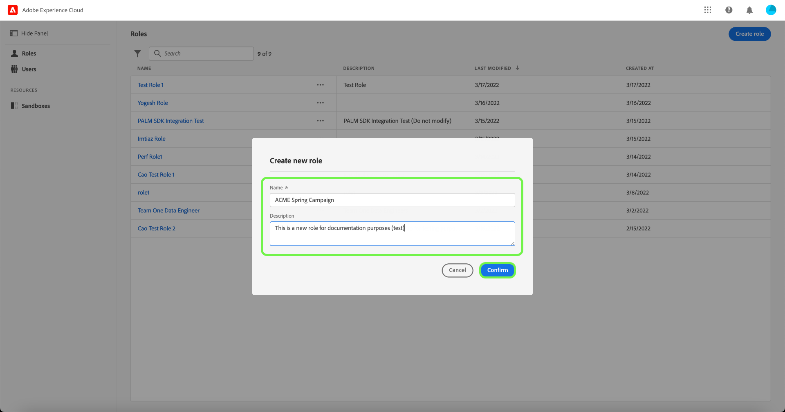
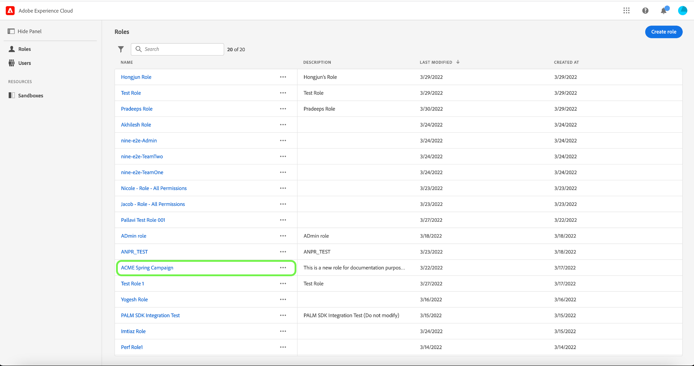
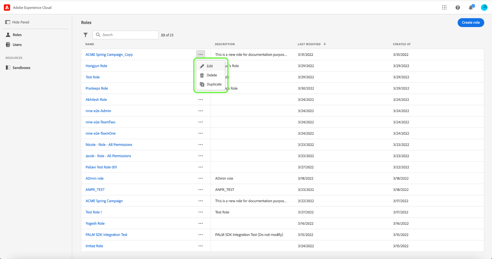

# 역할 관리

역할은 관리자, 전문가 또는 최종 사용자가 조직의 리소스에 액세스할 수 있는 권한을 정의합니다. 역할 기반 액세스 제어 환경에서 사용자 액세스 프로비저닝은 일반적인 책임과 요구 사항을 통해 그룹화됩니다. 역할에는 주어진 권한 집합이 있으며 조직의 멤버들은 필요한 보기 또는 쓰기 액세스 범위에 따라 하나 이상의 역할에 할당될 수 있습니다.

## 새 역할 만들기 {#create-new-role}

>[!CONTEXTUALHELP]
>id="platform_permissions_roles_about_create"
>title="새 역할 만들기"
>abstract="Platform 인스턴스와 상호 작용하는 사용자를 더 잘 분류하는 새 역할을 만듭니다. 예를 들어 내부 마케팅 팀에 대한 역할을 만들고 RHD(규제 상태 데이터) 레이블을 해당 역할에 적용하여 내부 마케팅 팀이 PHI(보호 상태 정보)에 액세스할 수 있도록 할 수 있습니다. 또는 외부 에이전시에 대한 역할을 만들고 해당 역할에 RHD 레이블을 적용하지 않음으로써 PHI 데이터에 대한 해당 역할 액세스를 거부할 수도 있습니다."
>additional-url="https://experienceleague.adobe.com/docs/experience-platform/access-control/abac/permissions-ui/roles.html?lang=ko" text="역할 관리"
>additional-url="https://experienceleague.adobe.com/en/docs/experience-platform/access-control/abac/end-to-end-guide#label-roles" text="역할에 레이블 적용"

새 역할을 만들려면 사이드바에서 **[!UICONTROL 역할]** 탭을 선택하고 **[!UICONTROL 역할 만들기]**&#x200B;를 선택하십시오.

**[!UICONTROL 새 역할 만들기]** 대화 상자가 나타나고 이름과 선택적 설명을 입력하라는 메시지가 표시됩니다.

완료되면 **[!UICONTROL 확인]**&#x200B;을 선택합니다.

그런 다음 드롭다운 메뉴를 사용하여 역할에 포함할 리소스 권한을 선택합니다.

추가 리소스를 추가하려면 리소스 목록을 표시하는 왼쪽 탐색 패널에서 **[!UICONTROL Adobe Experience Platform]**&#x200B;을(를) 선택합니다. 또는 왼쪽 탐색 패널의 검색 막대에 리소스 이름을 입력합니다.

관련 리소스를 클릭하고 드래그하여 기본 패널에 놓습니다.

드롭다운 메뉴를 사용하여 역할에 포함할 리소스 권한을 선택합니다. 역할에 포함할 모든 리소스에 대해 이 작업을 반복합니다. 완료되면 **[!UICONTROL 저장 및 종료]**&#x200B;를 선택합니다.

새 역할이 만들어졌고 **[!UICONTROL 역할]** 페이지로 리디렉션됩니다. 그러면 새로 만든 역할이 목록에 표시됩니다.

역할 권한을 만든 후 관리하는 방법에 대한 자세한 내용은 [역할에 대한 권한 관리](#manage-permissions-for-a-role)의 섹션을 참조하십시오.

다음 비디오는 새 역할을 만들고 해당 역할에 대한 사용자를 관리하는 방법에 대한 이해를 돕기 위한 것입니다.

>[!VIDEO](https://video.tv.adobe.com/v/336081/?learn=on)

## 역할 복제

기존 역할을 복제하려면 **[!UICONTROL 역할]** 탭에서 역할을 선택하십시오. 또는 필터 옵션을 사용하여 결과를 필터링하여 복제할 역할을 찾습니다.

그런 다음 화면 오른쪽 상단에서 **[!UICONTROL 복제]**&#x200B;를 선택합니다.

**[!UICONTROL 역할 복제]** 대화 상자가 나타나고 복제를 확인하라는 메시지가 표시됩니다.

그런 다음 역할의 이름 및 권한을 변경할 수 있는 역할의 세부 사항 페이지로 이동합니다. 세부 정보, 레이블 및 샌드박스는 이전 역할과 중복됩니다. 사용자 탭을 통해 사용자를 추가해야 합니다. 역할에 세부 정보, 레이블, 샌드박스 및 사용자를 추가하는 방법에 대한 자세한 내용을 보려면 [역할에 대한 권한 관리](permissions.md) 문서를 볼 수 있습니다.

왼쪽 화살표를 클릭하여 **[!UICONTROL 역할]** 탭으로 돌아갑니다.

**[!UICONTROL 역할]** 페이지의 목록에 새 역할이 나타납니다.

## 역할 삭제

역할 이름 옆의 생략 부호(`…`)를 선택하면 드롭다운에 역할을 편집, 삭제 또는 복제할 컨트롤이 표시됩니다. 드롭다운에서 삭제 를 선택합니다.

**[!UICONTROL 사용자 역할 삭제]** 대화 상자가 나타나고 삭제를 확인하는 메시지가 표시됩니다.

**[!UICONTROL 역할]** 탭으로 돌아갑니다.

## 다음 단계

새 역할이 만들어지면 [역할에 대한 권한을 관리](permissions.md)하는 다음 단계로 진행할 수 있습니다.
