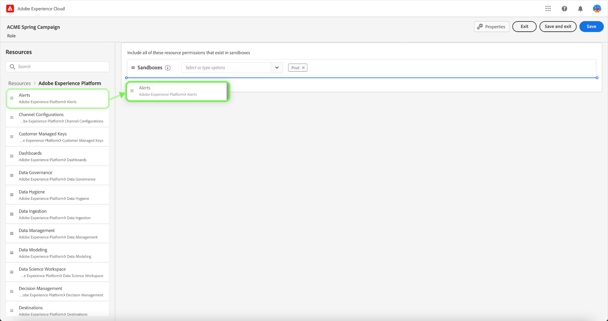
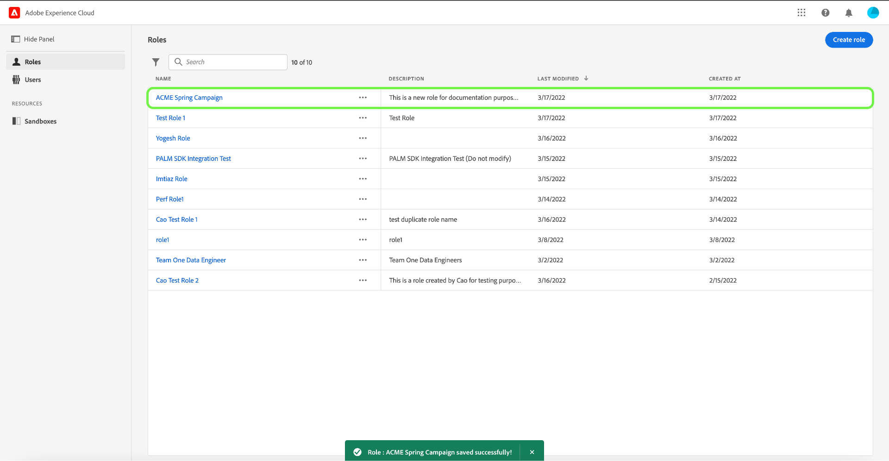

# 역할 관리

역할은 관리자, 전문가 또는 최종 사용자가 조직의 리소스에 대한 액세스를 정의합니다. 역할 기반 액세스 제어 환경에서 사용자 액세스 프로비저닝은 일반적인 책임 및 요구 사항을 통해 그룹화됩니다. 역할에는 주어진 권한 세트가 있으며 필요한 보기 또는 쓰기 액세스 범위에 따라 조직의 구성원을 하나 이상의 역할에 할당할 수 있습니다.

## 새 역할 만들기

새 역할을 만들려면 **[!UICONTROL 역할]** 탭하고 을 선택합니다. **[!UICONTROL 역할 만들기]**.

다음 **[!UICONTROL 새 역할 만들기]** 이름 및 선택적 설명을 입력하라는 대화 상자가 나타납니다.

완료되면 을 선택합니다 **[!UICONTROL 확인]**.

그런 다음 드롭다운 메뉴를 사용하여 역할에 포함할 리소스 권한을 선택합니다.

리소스를 더 추가하려면 을(를) 선택합니다 **[!UICONTROL Adobe Experience Platform]** 왼쪽 탐색 패널에서 리소스 목록을 표시합니다. 또는 왼쪽 탐색 패널의 검색 표시줄에 리소스 이름을 입력합니다.

관련 리소스를 클릭하고 기본 패널로 드래그합니다.

드롭다운 메뉴를 사용하여 역할에 포함할 리소스 권한을 선택합니다. 역할에 포함할 모든 리소스에 대해 이 작업을 반복합니다. 완료되면 을 선택합니다 **[!UICONTROL 저장 및 종료]**.

새 역할이 성공적으로 만들어지면 **[!UICONTROL 역할]** 페이지에 새로 만든 역할이 표시되는 페이지가 표시됩니다.

의 섹션을 참조하십시오. [역할에 대한 권한 관리](#manage-permissions-for-a-role) 역할 권한을 만든 후 관리하는 방법에 대한 자세한 내용은 다음을 참조하십시오.

## 역할 복제

기존 역할을 복제하려면 **[!UICONTROL 역할]** 탭. 또는 필터 옵션을 사용하여 결과를 필터링하여 복제할 역할을 찾습니다.

다음 을 선택합니다. **[!UICONTROL 복제]** 화면 오른쪽 상단에 있습니다.

다음 **[!UICONTROL 역할 복제]** 중복을 확인하는 대화 상자가 나타납니다.

다음으로, 역할의 이름과 권한을 변경할 수 있는 역할의 세부 사항 페이지가 표시됩니다. 세부 사항, 레이블 및 샌드박스는 이전 역할과 복제됩니다. 사용자는 사용자 탭을 통해 추가해야 합니다. 을 볼 수 있습니다 [역할에 대한 권한 관리](permissions.md) 역할에 세부 정보, 레이블, 샌드박스 및 사용자를 추가하는 방법에 대해 자세히 알아보려면 문서입니다.

왼쪽 화살표를 클릭하여 로 돌아갑니다. **[!UICONTROL 역할]** 탭.

새 역할이 **[!UICONTROL 역할]** 페이지.

## 역할 삭제

줄임표(`…`) 역할 이름 옆에 가 표시되고 드롭다운에 역할을 편집, 삭제 또는 복제하는 컨트롤이 표시됩니다. 드롭다운에서 삭제 를 선택합니다.

다음 **[!UICONTROL 사용자 역할 삭제]** 대화 상자가 나타나서 삭제를 확인하는 메시지가 나타납니다.

그러면 로 돌아갑니다. **[!UICONTROL 역할]** 탭.

## 다음 단계

새 역할을 만든 후에는 다음 단계로 진행할 수 있습니다. [역할에 대한 권한 관리](permissions.md).
