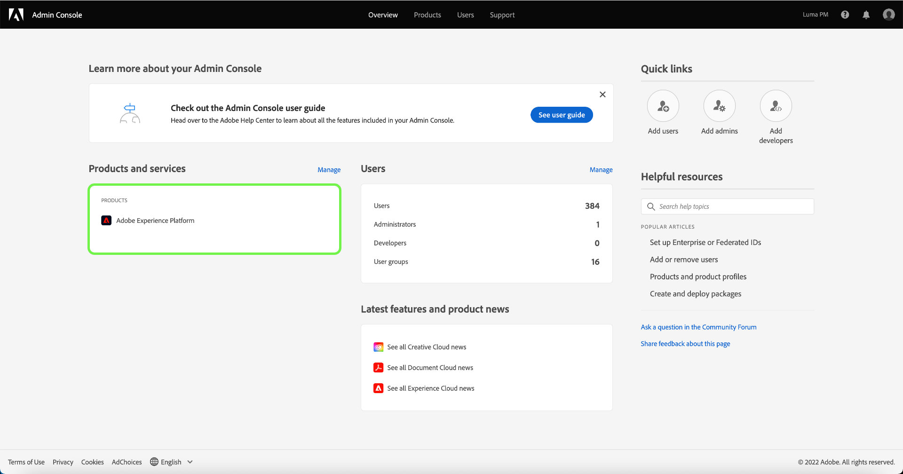

# 제품 프로필을 선택하여 액세스 제어 권한 관리

Adobe Admin Console을 통해 [!DNL Experience Platform]에 대한 액세스 제어를 구성하려면 [!DNL Experience Platform]에 대한 구독이 있는 조직의 관리자여야 합니다. Adobe은 조직에 대해 유연한 관리자 계층을 지원하지만 액세스 제어를 구성하려면 시스템 관리자, 제품 관리자 또는 제품 프로필 관리자 권한이 있어야 합니다. 자세한 내용은 [관리자 역할](https://helpx.adobe.com/enterprise/using/admin-roles.html)에 대한 Adobe Help Center 문서를 참조하십시오.

관리자 권한이 없는 경우 시스템 관리자에게 문의하여 액세스 권한을 받으십시오.

관리자 권한이 있으면 [Adobe Admin Console](https://adminconsole.adobe.com)(으)로 이동하여 Adobe 자격 증명을 사용하여 로그인하십시오. 로그인하면 관리자 권한이 있는 조직의 **[!UICONTROL 개요]** 페이지가 나타납니다. 이 페이지에는 조직이 구독 중인 제품과 함께 사용자 및 관리자를 조직 전체에 추가할 수 있는 다른 컨트롤이 표시됩니다. **[!UICONTROL Adobe Experience Platform]**&#x200B;을(를) 선택하여 Platform 통합을 위한 액세스 제어 작업 영역을 엽니다.

Adobe Experience Platform용 액세스 제어 작업 영역이 표시되어 **[!UICONTROL 제품 프로필]** 탭에서 열립니다. 이 탭에서는 이 문서에 설명된 대로 모든 제품 프로필을 보고 다양한 설정을 관리할 수 있습니다.

이 사용 안내서는 [!DNL Admin Console]을(를) 사용하여 Platform에 대한 액세스 권한을 할당하는 방법에 중점을 둡니다. [!DNL Admin Console]을(를) 탐색하는 방법에 대한 자세한 내용은 [Admin Console 사용 안내서](https://helpx.adobe.com/enterprise/using/admin-console.html)를 참조하십시오.

## 다음 단계

액세스 제어 작업 영역을 탐색했으면 다음 단계로 이동하여 [새 제품 프로필을 만듭니다](create-profile.md)
