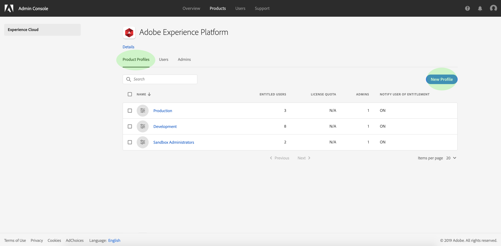
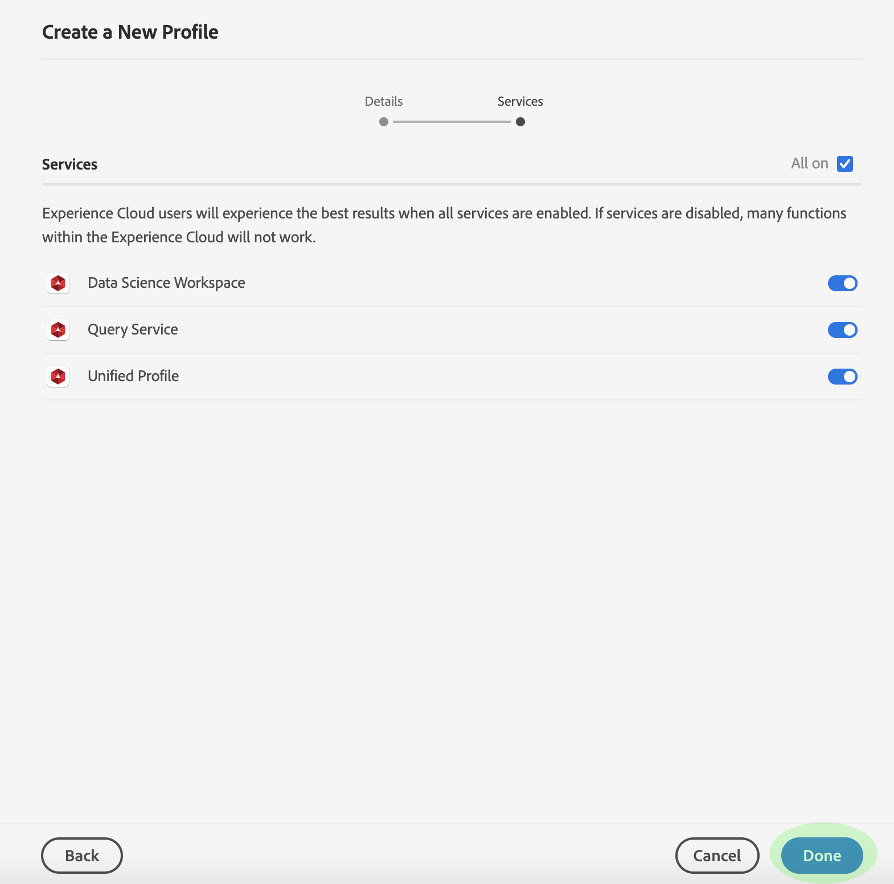

# Adobe Admin Console에서 새 제품 프로필 만들기

새 프로필 만들기를 시작하려면 **[!UICONTROL Product Profiles]** 탭으로 이동하고 **[!UICONTROL New Profile]**&#x200B;를 클릭합니다.

새 프로필에 대한 프로필 이름과 설명을 입력하라는 메시지가 **[!UICONTROL Create New Profile]** 대화 상자가 나타납니다. 프로파일의 표시 이름이 다르도록 하려면 **[!UICONTROL Same as Profile Name]**&#x200B;의 선택을 취소하고 나타나는 텍스트 상자에 표시 이름을 입력합니다. **[!UICONTROL User Notifications]** 아래에서 사용자가 프로필을 추가 또는 삭제할 때 이메일로 알림을 받을지 여부를 전환할 수 있습니다.

완료되었으면 **[!UICONTROL Next]**&#x200B;을 클릭합니다.

다음 화면에 프로필에 포함할 [!DNL Platform] 서비스를 선택하라는 메시지가 표시됩니다. 서비스 옆에 있는 전환 버튼을 클릭하여 비활성화합니다. 서비스가 비활성화되면 이 제품 프로필에 할당된 사용자가 해당 서비스와 관련된 모든 기능을 사용할 수 없습니다. 완료되었으면 **[!UICONTROL Done]**&#x200B;을 클릭합니다.

새 제품 프로필이 만들어지고 프로필의 [편집 권한 페이지](#edit-permissions)로 리디렉션됩니다. 제품 프로필을 만든 후 관리하는 방법에 대한 자세한 내용은 [관리 권한](#manage-permissions-for-a-product-profile) 및 [사용자 관리](#manage-users-for-a-product-profile)의 섹션을 참조하십시오.

## 다음 단계

새 제품 프로필이 만들어지면 [제품 프로필에 대한 권한 관리 단계로 진행할 수 있습니다](permissions.md)
