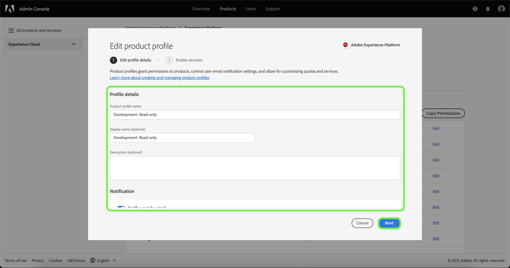

# 제품 프로필에 대한 세부 정보 및 추가 서비스 관리

**[!UICONTROL 프로필 설정]** 메뉴에서 프로필의 세부 정보를 구성하고 추가 서비스에 액세스할 수 있습니다. 메뉴에 액세스하려면 **[!UICONTROL 제품 프로필]** 페이지에서 **[!UICONTROL 설정]**&#x200B;을 선택하세요.

**[!UICONTROL 프로필 세부 정보 편집]** 탭부터 **[!UICONTROL 제품 프로필 편집]** 메뉴가 나타납니다. 이 탭에서는 프로필 이름과 설명을 입력하고 편집할 수 있습니다. 계정에 대한 이메일 알림 설정과 표시 이름을 수정할 수도 있습니다.

**[!UICONTROL 서비스 사용]** 페이지에 액세스하려면 **[!UICONTROL 다음]**&#x200B;을(를) 선택하십시오.

**[!UICONTROL 서비스 사용]** 메뉴를 사용하면 프로필을 만들 때 처음 구성된 추가 [!DNL Experience Platform] 서비스에 대한 프로필의 액세스 권한을 수정할 수 있습니다. [!DNL Experience Platform] 구독에 따라 다음 서비스가 포함될 수 있습니다.

- [!DNL Data Science Workspace]
- [!DNL Query Service]
- [!DNL Adobe Real-Time Customer Data Platform] UI(Real-Time CDP 전용)
- B2B UI

특정 서비스의 오른쪽에서 토글을 클릭하여 활성화하거나 비활성화합니다. **[!UICONTROL 모두]** 확인란을 선택하여 나열된 모든 서비스를 활성화하거나 비활성화할 수도 있습니다.

완료되면 **[!UICONTROL 저장]**&#x200B;을 선택합니다.

B2B 또는 B2P 에디션을 사용할 수 있는 고객은 B2B UI에 액세스할 수 있습니다. [!UICONTROL 서비스 메뉴 사용]을 통해 사용자에게 B2B UI를 제공할 수 있습니다. 특정 제품 프로필에 대한 서비스를 사용하도록 설정하려면 [!UICONTROL B2B UI] 옆의 토글을 선택한 다음 **[!UICONTROL 저장]**&#x200B;을 선택합니다.

B2B UI 토글을 통해 사용자는 계정 및 기회 관리에 대한 B2B 워크플로우를 보고 B2B 관련 세그먼트를 만들 수 있습니다. 자세한 내용은 [[!DNL Adobe Real-Time Customer Data Platform B2B Edition]](../../rtcdp/b2b-overview.md)의 설명서를 참조하십시오.

