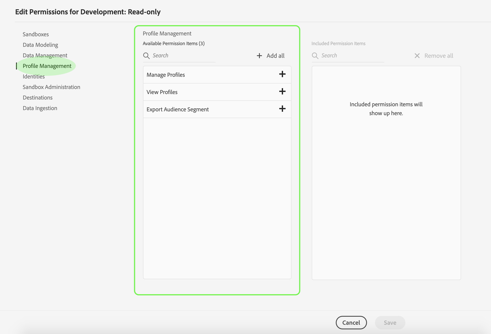

# 제품 프로필에 대한 권한 관리

[새 제품 프로필](#create-a-new-product-profile)을(를) 만든 직후 프로필의 권한을 구성하라는 메시지가 표시됩니다. 기존 프로파일에 대한 편집 권한을 편집할 경우 **[!UICONTROL 제품 프로필]** 탭에서 프로필을 선택하여 프로필의 세부 정보 페이지를 연 다음 **[!UICONTROL 권한]**&#x200B;을 클릭합니다.

권한은 카테고리로 구분되어 이 페이지에 나열됩니다. 목록에는 카테고리 이름, 카테고리에 포함된 권한 수(및 활성 상태의 항목 수) 및 해당 설명이 표시됩니다.

목록에서 범주를 선택하여 **[!UICONTROL 권한 편집]** 페이지를 엽니다.

**[!UICONTROL 권한 편집]** 페이지는 선택한 제품 프로필에서 권한을 추가 및 제거하기 위한 작업 공간을 제공합니다. 화면 왼쪽에 권한 카테고리 목록이 표시됩니다. 범주를 선택하면 **[!UICONTROL 사용 가능한 권한 항목]** 아래에 표시되는 권한이 변경됩니다.

권한을 추가하려면 권한 이름 옆에 있는 **더하기(+)** 아이콘을 선택합니다. 또는 **[!UICONTROL 모두 추가]**&#x200B;를 선택하여 현재 카테고리의 모든 권한을 프로필에 추가할 수 있습니다. 추가된 권한은 **[!UICONTROL 포함된 권한 항목]** 아래에 표시됩니다.

>[!NOTE]
>
>**[!UICONTROL 포함된 권한 항목]** 목록은 현재 선택한 카테고리에서 추가된 권한만 표시합니다.

권한을 제거하려면 권한 이름 옆에 있는 **X** 아이콘을 선택하거나 **[!UICONTROL 모두 제거]**&#x200B;를 선택하여 현재 카테고리에서 모든 권한을 제거합니다. 제거된 권한이 **[!UICONTROL 사용 가능한 권한 항목]** 아래에 다시 나타납니다.

사용 가능한 카테고리를 계속 탐색하고 원하는 권한을 추가합니다. 완료되면 **[!UICONTROL 저장]**&#x200B;을 선택합니다.

제품 프로필에 대한 **[!UICONTROL Permissions]** 탭이 다시 나타나고 선택한 권한이 현재 활성 상태임을 표시합니다.

## 다음 단계

권한이 설정된 상태에서 [제품 프로필에 대한 세부 정보 및 서비스 관리](details-and-services.md)의 다음 단계로 진행할 수 있습니다.