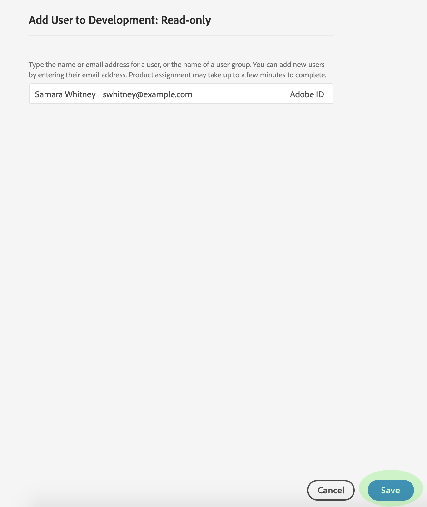

# 제품 프로필의 사용자 관리

제품 프로필에서 사용자를 할당하거나 제거하려면 프로필의 세부 정보 페이지를 열고 **[!UICONTROL Users]** 탭으로 이동합니다. 여기에서 **[!UICONTROL Add User]**&#x200B;을 클릭합니다.

**[!UICONTROL Add User]** 대화 상자가 나타납니다. 검색 필드를 사용하여 사용자를 조회하여 이름 또는 이메일로 추가할 수 있습니다. 입력할 때 일치하는 사용자가 텍스트 상자 아래의 자동 완성 창에 나타납니다.

>[!NOTE]
>
>사용자가 자동 완성 창에 나타나지 않을 경우, 검색 표시줄에 전체 이메일 주소를 입력합니다. Adobe ID 계정 설정에 대한 지침이 포함된 초대 이메일이 전송됩니다.

사용자를 선택하고 나면 **[!UICONTROL Save]**&#x200B;을 클릭하여 제품 프로필에 추가합니다.

추가된 사용자가 이제 나열되는 제품 프로필에 대한 **[!UICONTROL Users]** 탭이 다시 나타납니다.

## 다음 단계

[!DNL Admin Console]을 통해 [!DNL Platform] 기능에 대한 액세스를 제어하는 방법에 대해 학습하였으므로, 각 개인 사용 권한과 액세스 권한을 부여하는 [!DNL Platform] 기능에 대한 자세한 내용은 [액세스 제어 개요](../home.md)의 부록 섹션을 참조하십시오.
