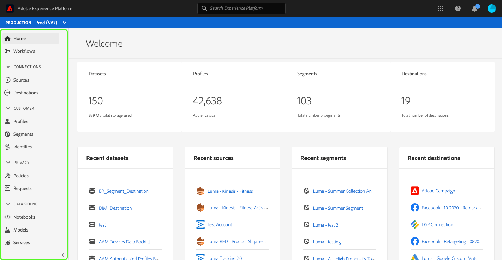
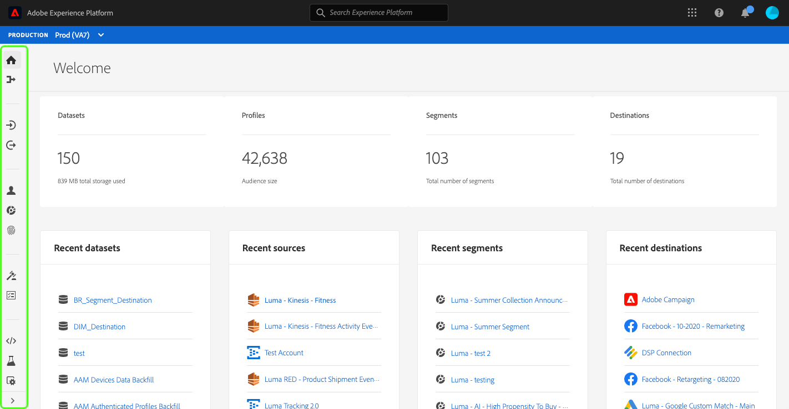
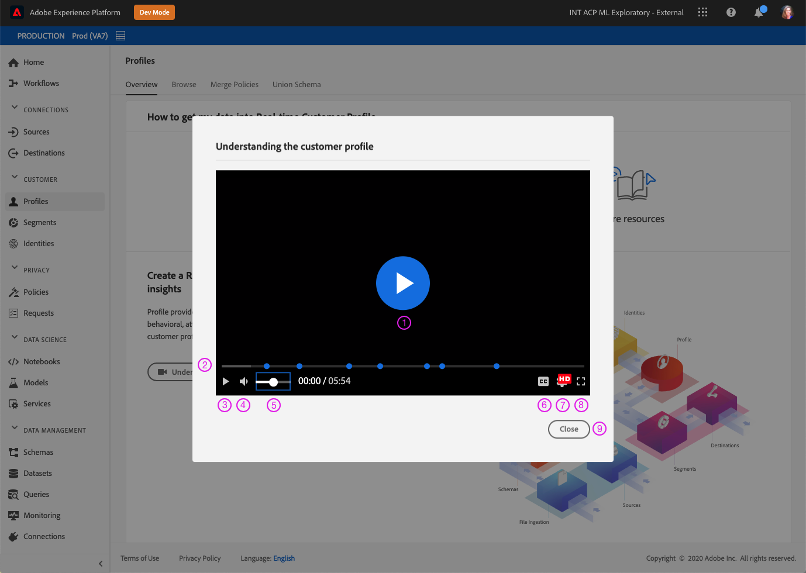

# Experience Platform을 위한 사용자 지정 액세스 가능성 솔루션

Adobe Experience Platform은 모든 유형의 사용자의 요구 사항을 충족하도록 지속적으로 개선되며, 시각, 청각, 이동성 또는 기타 장애가 있는 개인을 포함하는 전 세계 표준을 준수합니다. 이 문서에서는 Experience Platform 사용자 인터페이스 내의 사용자 지정 액세스 가능성 솔루션에 대해 설명합니다.

## 홈페이지 및 UI 개요

Experience Platform 사용자 인터페이스는 일반 텍스트, 그래픽 및 UI 구성 요소에 필요한 대비 비율을 충족합니다. 또한 시각적 장애가 있는 사용자를 포함하여 모든 사용자에 대한 액세서빌러티를 지원하도록 사용자 인터페이스의 색도 선택했습니다.

Platform에서 포인터를 사용하여 클릭하거나 실행할 수 있는 UI 요소를 키보드를 사용하여 참여할 수도 있습니다. 여기에는 왼쪽 탐색, 비디오 플레이어, 표 등이 포함됩니다.

Experience Platform은 웹 컨텐츠 액세스 가능성 지침 2.1 레벨 A 및 레벨 AA 및 웹 액세스 가능성 - WAI-ARIA(Accessible Rich Internet Applications) 웹 표준을 포함하여 국제 액세스 가능성 표준을 준수하기 위해 노력하고 있습니다.

## 왼쪽 탐색

Experience Platform UI 내의 왼쪽 탐색은 키보드 액세스 가능하고 접근성 표준을 충족하는 일반적인, 마우스로 가리키기 및 선택 상태의 색상 대비를 제공합니다.

홈 화면에서 사용자는 왼쪽 탐색 창으로 탭을 이동할 수 있습니다. 선택 **Shift + 탭** 사용자를 홈 화면으로 반환합니다.

왼쪽 탐색에 초점을 맞춰 **탭** 에서는 사용자를 상호 작용을 확장 및 축소합니다. 왼쪽 탐색을 확장하거나 축소하는 기능이 **Enter 키(반환)**.

왼쪽 탐색 영역을 포커스에 두고 위쪽 및 아래쪽 화살표 키를 사용하여 탐색의 각 항목으로 지속적으로 이동하고(즉, 사용자가 왼쪽 탐색 영역에서 탭으로 이동할 때까지 포커스가 이동하지 않습니다.) 선택 시 탐색 항목에 대한 포커스가 표시됩니다. 현재 선택 영역이 강조 표시되고 굵게 표시된 텍스트와 함께 표시됩니다. 왼쪽 탐색 항목을 선택하면 **Enter 키(반환)** 오른쪽 패널에서 선택한 UI 항목을 엽니다. 그러나 포커스는 사용자가 탭을 제거할 때까지 왼쪽 탐색에 남아 있습니다.

Platform 내의 일부 기능은 모든 사용자에게 활성화되지 않습니다. 이러한 항목은 탐색에 표시되지만 선택할 수 없습니다. 키보드를 사용하여 탐색할 때 이러한 항목은 화살표 탐색 중에 건너뛰며 **Enter 키(반환)**.

## 포함된 비디오 대화 상자

키보드 탐색을 사용하여 사용 가능한 비디오 링크를 강조 표시하고 선택하여 Experience Platform 내에서 비디오를 볼 수 있습니다. 플랫폼 UI 내에 포함된 비디오 대화 상자가 열립니다.

## 비디오 대화 상자 키보드 액세스 가능성

키보드를 사용하여 포함된 비디오 대화 상자를 탐색할 수도 있습니다. 다음 표에서는 포함된 비디오 대화 상자에서 사용할 수 있는 전체 키보드 탐색에 대해 설명합니다.

| 대화 상자 요소 | 키보드 접근성 | 설명 |
|---|---|---|
| 재생 및 일시 정지 | 탭 스페이스바 | 사용 **탭** 재생 단추에 포커스를 설정하려면 다음을 수행하십시오. **스페이스바** 비디오 재생을 시작하고 비디오 재생을 일시 중지합니다. |
| 스크러버 | 탭 왼쪽 화살표 오른쪽 화살표 | 비디오를 재생하는 경우 **탭** 스크러버에 집중하기 위해 스크러버를 초점으로 하고 **왼쪽 및 오른쪽 화살표 키** 비디오 재생을 각각 5초 앞당기고 뒤로 건너뜁니다. |
| 음소거 | 탭 스페이스바 | 사용 **탭** 음소거 볼륨 요소에 포커스를 맞추기 위해 사용 **스페이스바** 비디오 재생 음소거 또는 음소거 해제 |
| 볼륨 | 탭 왼쪽 화살표 오른쪽 화살표 | 사용 **탭** 볼륨 요소에 초점을 맞추려면 **왼쪽 및 오른쪽 화살표 키** 볼륨을 위아래로 각각 이동합니다. |
| [!UICONTROL 닫힘 캡션] (&quot;cc&quot;) | 탭 Enter 키 위쪽 화살표 아래쪽 화살표 | **탭** to [!UICONTROL 닫힘 캡션] (&quot;cc&quot;) 요소를 생성하지 않습니다. 사용 **Enter 키** 메뉴를 열려면 **위쪽 및 아래쪽 화살표 키** 캡션 언어를 선택합니다. **Enter 키** 선택을 확인합니다. |
| [!UICONTROL 품질] | 탭 Enter 키 위쪽 화살표 아래쪽 화살표 | 사용 **탭** 초점을 맞추다 [!UICONTROL 품질] 요소를 생성하지 않습니다. 사용 **Enter 키** 메뉴를 열고 **위쪽 및 아래쪽 화살표 키** 를 클릭하여 비디오 품질을 선택합니다. **Enter 키** 선택을 확인합니다. |
| 전체 화면 | 탭 스페이스바 또는 Enter Esc | 사용 **탭** 전체 화면 요소에 포커스를 둡니다. 사용 **스페이스바 또는 Enter** 전체 화면 보기를 활성화하려면 **Esc** (&quot;esc&quot;) 전체 화면 모드를 종료합니다. |
| 닫기 | 탭 스페이스바 또는 Enter | 사용 **탭** 닫기 단추에 초점을 맞춥니다. 사용 **스페이스바 또는 Enter** 키를 눌러 비디오 대화 상자를 종료합니다. |

>[!NOTE]
>
>재생 중에 언제든지 이스케이프(&quot;esc&quot;) 키를 사용하여 포함된 비디오 대화 상자를 닫을 수 있습니다.

## 파일 끌어서 놓기

Experience Platform에서 모든 파일 선택 드래그 앤 드롭 영역은 키보드 액세스 가능 영역입니다. 사용 **탭** 강조 표시 **[!UICONTROL 파일 선택]** 및 **스페이스바 입력** 을(를) 선택하여 운영 체제의 파일 선택 UI를 호출합니다.

파일이 업로드되면 삭제 아이콘이 키보드 탐색이 가능하여 선택한 파일을 제거하고 새 파일을 업로드할 수 있습니다. 사용자는 **탭** 삭제 아이콘에 집중하려면 **스페이스바 입력** 선택합니다. 파일이 제거되면, **[!UICONTROL 파일 선택]** 은 자동으로 포커스에 있고 선택할 수 있습니다.

또는 업로드된 파일이 올바른 형식이 아닌 경우 오류 메시지와 함께 오류 아이콘이 표시됩니다 **[!UICONTROL 파일 선택]** 버튼에 포커스가 있고 선택할 수 있습니다.

![오류 메시지와 [파일 선택] 단추가 포커스 되어 있는 파일 끌어서 놓기 영역입니다.](images/drag-and-drop.png)

마우스를 사용하여 드래그 앤 드롭 영역을 선택하면 파일 선택 UI도 호출됩니다. 또는 마우스 사용자가 파일을 선택하고 영역 위로 드래그하여 업로드를 시작할 수 있습니다.

## 표 찾아보기

Experience Platform 사용자 인터페이스 내의 모든 테이블은 키보드로 액세스할 수 있습니다. 일련의 키보드 단축키를 통해 표 행 및 열과 상호 작용할 수 있습니다.

* 테이블 헤더에서 **아래쪽 화살표** 테이블을 찾아보려면 테이블 헤더는 를 탐색할 때 선택할 수 있습니다 **탭**, 그리고 **스페이스바**.
* **위쪽 및 아래쪽 화살표 키** 테이블의 행을 통해 위아래로 이동합니다.
* 행을 선택하거나 포커스에 있는 경우 **Enter 키** 행의 오른쪽 레일에 세부 사항이 제공됩니다.
* 행을 선택하거나 포커스에 있는 경우 **화살표 키** 행의 각 항목을 이동하는 방법
* 사용 **Enter 키** 를 눌러 행에서 항목을 선택합니다. 새 창을 열어야 하는 경우 화면 판독기를 사용하는 사용자에게 경고가 표시됩니다.
* 200% 이상으로 확대하면 **레일 검사관** 아이콘 오른쪽 레일이 축소되어 표에 더 많은 보기 공간을 제공합니다.

### 찾아보기 테이블 키보드 액세스 가능성

| 키보드 접근성 | 설명 |
|---|---|
| 홈(함수 + 왼쪽 화살표) | 행에 포커스가 있으면 에서는 사용자를 행의 첫 번째 항목으로 이동합니다 |
| END(함수 + 오른쪽 화살표) | 행에 포커스를 둘 때 에서는 사용자를 행의 마지막 항목으로 이동합니다 |
| 페이지 업 | 테이블에서 10개의 행을 나눕니다(페이지당) |
| 페이지 아래로 | 테이블에서 10개의 행을 아래로(페이지당) 트래버스합니다. |
| Control + HOME | 테이블의 첫 행으로 이동 |
| Control + END | 페이지당 테이블에서 첫 번째 작업으로 이동 |

## 스키마 편집기 UI

스키마 편집기 UI는 다음 기능으로 액세스할 수 있습니다.

* 스키마 편집기는 키보드 탐색을 지원하며 **탭** 를 눌러 UI 요소를 탐색합니다.
* **탭** 검색 필드를 입력한 다음 스키마 트리에 들어갑니다.
* 스키마 트리는 화살표 키를 사용하여 스키마 트리 UI를 탐색할 수 있도록 지원합니다
   * **위쪽 및 아래쪽 화살표** 트리를 통과하는 데 사용할 수 있습니다.
   * **왼쪽 및 오른쪽 화살표** 스키마 트리에서 노드를 확장 및 축소하거나 인라인 작업 간을 이동하는 데 사용할 수 있습니다.
* **Enter 키(반환)** 오른쪽의 세부 정보 패널에서 개별 노드 세부 정보를 활성화합니다.
* 다음 **홈** 키가 트리 맨 위로 돌아갑니다.
* 다음 **종료** 키가 트리 아래로 이동합니다.
* 스키마 트리에는 화면 판독기에 대한 ARIA 레이블도 포함되어 있습니다.

## 세그먼트 빌더 UI

세그먼트 빌더 UI를 사용하여 Experience Platform 내의 세그먼트를 만들고, 편집하고, 상호 작용할 때 다음 기능이 액세스 가능성을 개선합니다.

* 세그먼트 빌더 UI는 키보드 탐색을 통해 액세스할 수 있습니다.
* 화면 판독기는 머리글에 대한 마크업 태그를 인식해야 하며 제목과 해당 수준을 함께 발표할 수 있습니다.
* 다른 보조 기술은 개요 또는 대체 보기를 표시하기 위해 적절하게 코딩된 제목을 사용하여 페이지의 시각적 표시를 변경할 수 있습니다.

이제 세그먼트 빌더 캔버스의 왼쪽 및 오른쪽 레일을 축소하거나 확장하여 더 많은 화면 공간을 확보할 수 있습니다. 이 기능은 200% 확대/축소에 전체 기능 기능을 제공하므로 특히 유용합니다.

## 쿼리 서비스 편집기

Query Service 편집기에서 다음 액세스 가능성 기능을 사용할 수 있습니다.

* Query Service 편집기 UI의 색상 대비가 접근성 준수를 충족합니다.
* 편집기 UI 외부에서 키보드 탐색을 지원합니다. 편집기 UI는 포함된 코드 미러입니다.

## 소스 및 대상의 시스템 보기 탭

검색 시 **[!UICONTROL 시스템 보기]** 소스 및 대상에서 다음 기능은 액세스 가능성을 개선합니다.

* **탭** 첫 번째 소스 연결 카드에 초점을 설정합니다.
   * **탭** 카드 내부의 단추에 다시 집중하기
   * 선택 **Enter 키** 카드 내에서 클릭유도문안 단추를 활성화하려면
* 선택 **Enter 키** 연결 카드에서 오른쪽 레일에서 더 자세한 정보가 활성화됩니다
   * 오른쪽 레일이 활성화되면 해당 영역에 초점이 설정됩니다. **탭** 초점 **닫기** 오른쪽 레일 창에 표시됩니다. 선택 **탭** 오른쪽 레일 패널을 통해 포커스를 다시 이동합니다
   * 소스 연결 카드가 두 개 이상 있으면, **탭** 연결을 통해 이동
   * 사용 **화살표 키(위쪽, 아래쪽, 왼쪽 및 오른쪽)** 소스 목록을 통해 이동
   * 선택 **탭** 오른쪽 레일 패널에 포커스 설정
