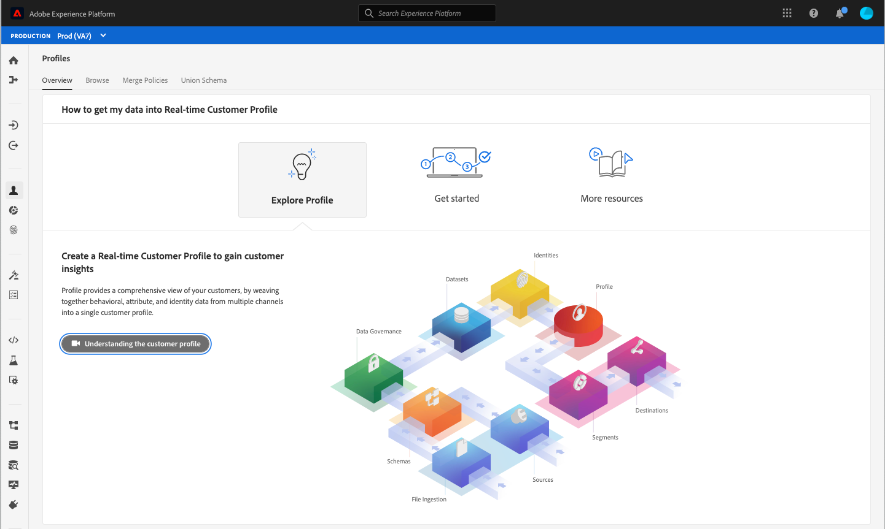

# Experience Platform의 접근성 기능

Adobe Experience Platform은 음성 인식 소프트웨어 및 화면 판독기와 같은 보조 장치로 작업하는 사용자를 포함하여 모든 개인에게 접근 가능하고 포괄적인 기능을 제공하기 위해 노력하고 있습니다. 이 문서에서는 키보드 탐색, 의미 체계 구조, 전경 요소와 배경 요소 간의 충분한 대비 및 보조 기술 지원을 포함하여 플랫폼에서 지원하는 일반적인 접근성 기능에 대해 설명합니다.

## 보조 기술

장애가 있는 사용자는 디지털 콘텐츠에 액세스하고 소프트웨어 제품을 사용하기 위해 보조 기술이라고 하는 하드웨어 및 소프트웨어에 의존하는 경우가 많습니다. Adobe Experience Platform은 필요한 경우 의미 코드, 텍스트 등가물, 레이블 및 ARIA 사용과 같은 접근성 모범 사례를 따라 화면 판독기, 확대/축소 및 음성 인식 소프트웨어와 같은 여러 유형의 보조 기술(AT)을 지원합니다. Experience Platform UI(사용자 인터페이스) 내의 대화형 요소는 해당 레이블과 액세스 가능한 이름 및 역할을 사용하여 목적과 현재 상태를 모두 식별합니다. 이렇게 하면 화면 판독기와 같은 보조 기술이 사용자에게 레이블 및 기타 정보를 읽어 애플리케이션 컨트롤과 쉽게 상호 작용할 수 있습니다.

## 키보드 접근성

Experience Platform은 전체 키보드 접근성을 지원하기 위해 노력합니다.

다음 탐색 요소는 접근성을 용이하게 합니다.
* Tab 키는 UI 요소, 섹션 및 메뉴 그룹 간에 이동합니다.
* 화살표 키를 메뉴 그룹 내에서 이동하여 포커스를 개별 활성 요소로 설정합니다.
* Shift + Tab은 탭 순서를 거꾸로 이동합니다.
* Return 키(Enter 키) 및 스페이스바 키는 선택한 항목을 활성화합니다.
* Esc 키(Esc)는 대화 상자가 있을 때 대화 상자를 닫는 취소 단추 역할을 합니다.
* Experience Platform은 선택한 요소 주위에 파란색 테두리를 표시하여 현재 포커스가 있는 UI 요소를 명확하게 표시합니다.

## 색상 팔레트 및 대비

Experience Platform은 색상 대비 요구 사항을 포함하여 [WCAG 2.1 AA](https://www.w3.org/TR/WCAG/) 적합성을 준수하기 위해 최선을 다합니다. Experience Platform UI는 저시력 또는 색각 이상이 있는 사용자가 편하게 볼 수 있도록 애플리케이션의 충분한 대비를 제공합니다.

## 필수 필드 유효성 검사

데이터를 추가하거나 스키마를 생성하거나 세그먼트를 정의할 때 필수 필드는 시각적으로, 필드의 텍스트 레이블 옆에 별표를 사용하여 프로그래밍 방식으로 모두 표시됩니다. 이러한 필드는 필드에 잘못된 데이터를 입력하고 저장 시 유효성 검사를 트리거합니다. 필수 필드가 유효성 검사를 통과하지 못하면 오류 아이콘과 함께 빨간색으로 요약되고 수정해야 하는 문제에 대한 서면 설명도 표시됩니다.

