# 태그 관리 안내서

태그를 사용하면 메타데이터 분류를 관리하여 비즈니스 객체를 보다 쉽게 검색하고 분류할 수 있습니다. 태그는 팀이 작업할 대상에 대해 중요한 분류 속성을 식별하여 더 빨리 찾을 수 있도록 하고, 설명자 간에 공통 대상을 함께 그룹화하는 데 도움이 될 수 있습니다. 지리적 영역, 비즈니스 단위, 제품 라인, 프로젝트, 팀, 시간 범위(분기, 월, 년) 또는 팀에 의미를 적용하고 대상 검색을 용이하게 하는 데 도움이 되는 다른 모든 것과 같은 일반적인 태그 범주를 식별해야 합니다. 

## 태그 만들기 {#create-tag}

새 태그를 만들려면 다음을 선택합니다 **[!UICONTROL 태그]** 왼쪽 탐색에서 원하는 태그 카테고리를 선택합니다.

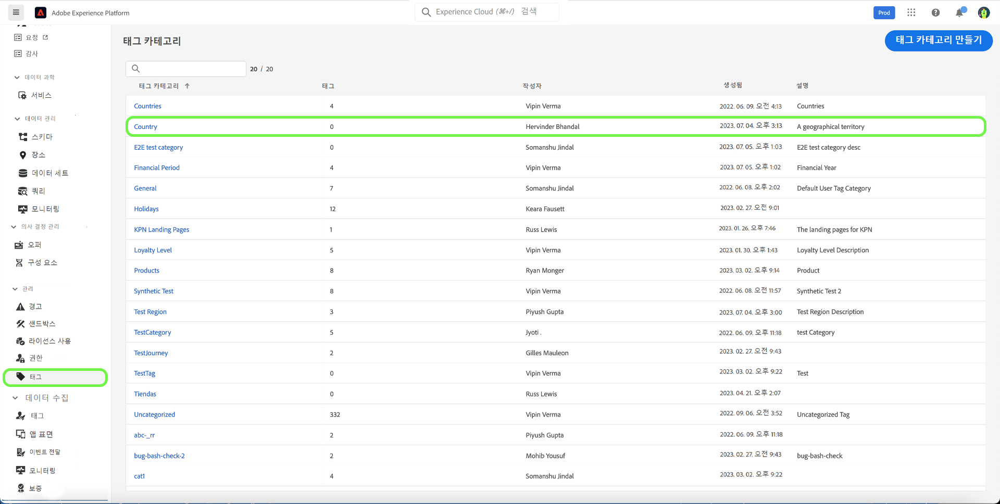

선택 **[!UICONTROL 태그 만들기]** 를 클릭하여 새 태그를 만듭니다.

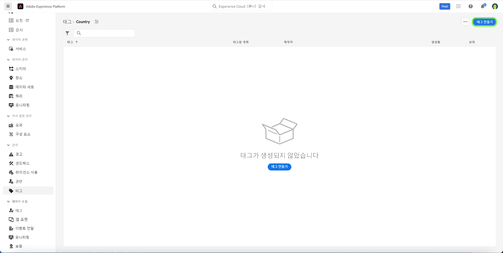

다음 **[!UICONTROL 태그 만들기]** 고유 태그 이름을 입력하라는 대화 상자가 나타납니다. 완료되면 다음을 선택합니다. **[!UICONTROL 저장]**.

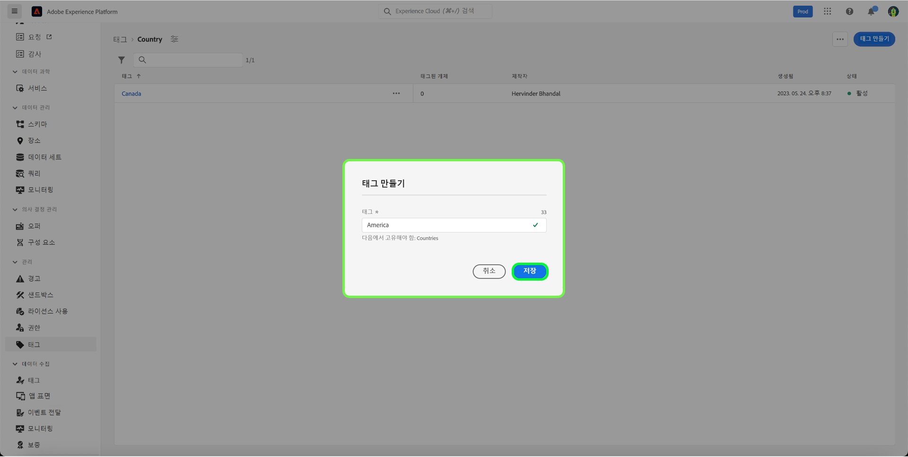

새 태그가 성공적으로 만들어지고 새로 만든 태그가 목록에 표시되는 태그 화면으로 리디렉션됩니다.

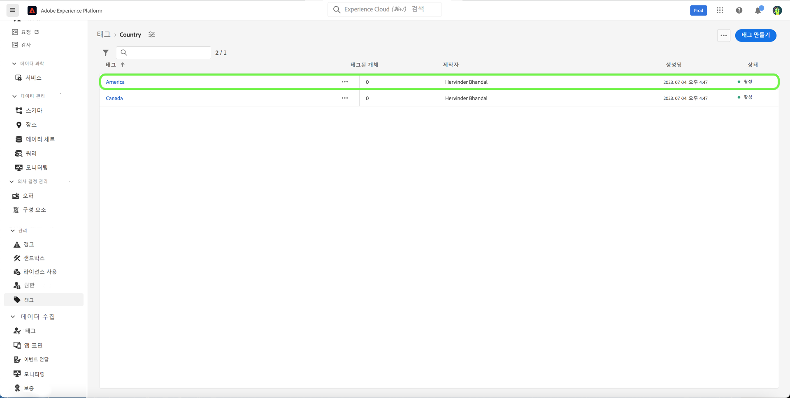

## 태그 편집 {#edit-tag}

태그를 편집하면 철자 오류, 명명 규칙 업데이트 또는 용어 업데이트가 있을 때 도움이 됩니다. 태그를 편집하면 현재 적용된 모든 개체와의 태그 연결이 유지됩니다.

기존 태그를 편집하려면 태그 범주 목록에서 생략 부호(`...`)을 클릭하여 제품에서 사용할 수 있습니다. 드롭다운에 태그를 편집, 이동 또는 보관할 컨트롤이 표시됩니다. 선택 **[!UICONTROL 편집]** 드롭다운에서 을 클릭합니다.

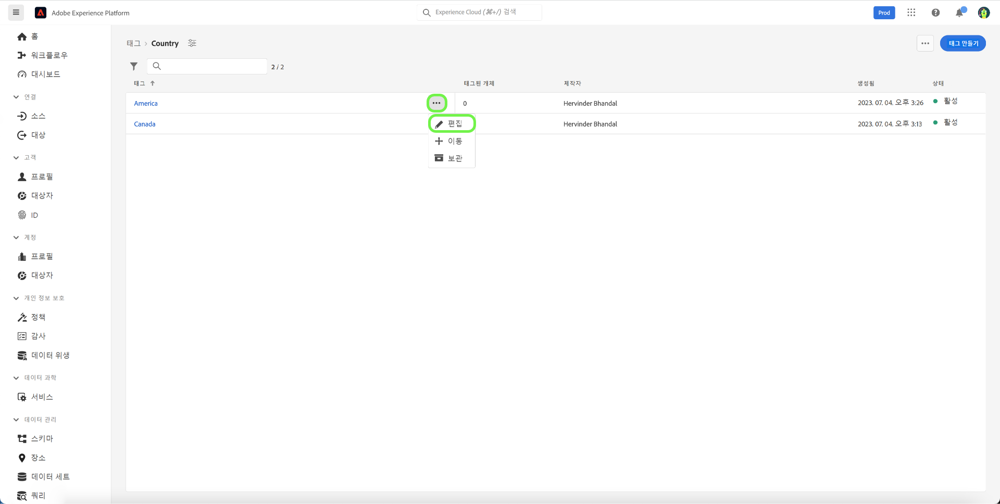

다음 **[!UICONTROL 태그 편집]** 태그 이름을 편집하라는 대화 상자가 나타납니다. 완료되면 다음을 선택합니다. **[!UICONTROL 저장]**.

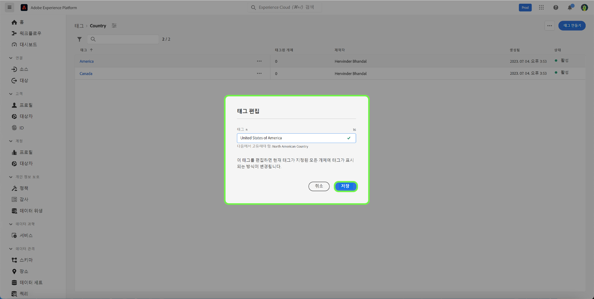

태그 이름이 성공적으로 업데이트되고, 업데이트된 태그가 목록에 표시되는 태그 화면으로 리디렉션됩니다.

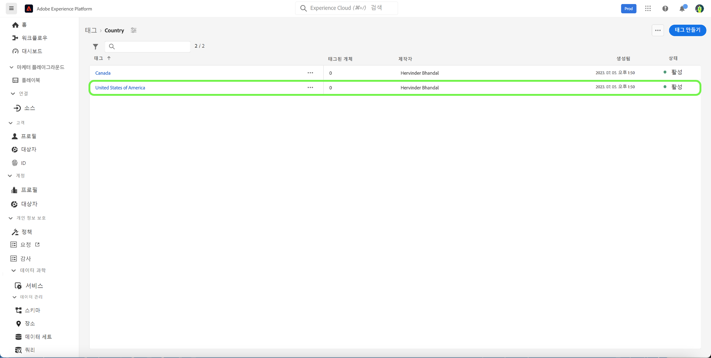

## 범주 간에 태그 이동 {#move-tag}

태그를 다른 태그 카테고리로 이동할 수 있습니다. 태그를 이동하면 현재 적용된 모든 개체와의 태그 연결이 유지됩니다.

기존 태그를 이동하려면 태그 범주 목록에서 생략 부호(`...`)을 클릭하여 제품에서 사용할 태그를 선택합니다. 드롭다운에 태그를 편집, 이동 또는 보관할 컨트롤이 표시됩니다. 선택 **[!UICONTROL 편집]** 드롭다운에서 을 클릭합니다.

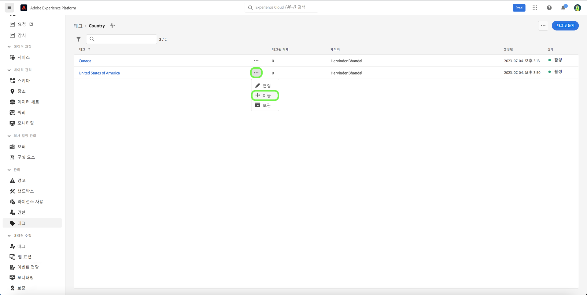

다음 **[!UICONTROL 태그 이동]** 선택한 태그를 이동해야 하는 태그 카테고리를 선택하라는 대화 상자가 나타납니다.

스크롤하여 목록에서 선택하거나 검색 기능을 사용하여 카테고리 이름을 입력할 수 있습니다. 완료되면 다음을 선택합니다. **[!UICONTROL 이동]**.

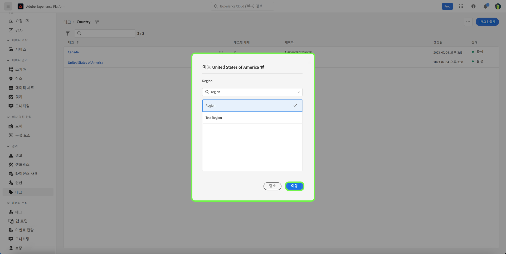

태그가 성공적으로 이동되고 태그 화면으로 리디렉션됩니다. 그러면 업데이트된 태그 목록이 표시되고 태그가 더 이상 표시되지 않습니다.

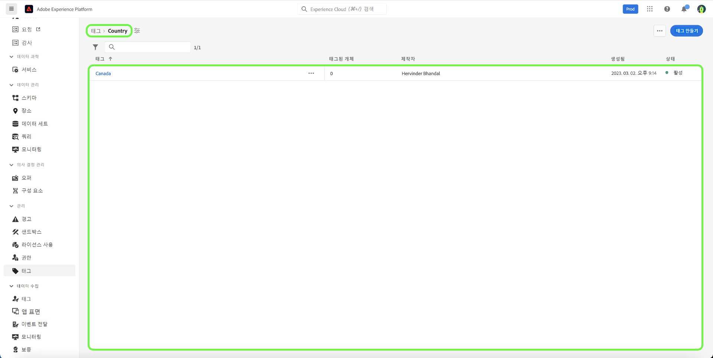

이제 태그가 이전에 선택한 태그 카테고리에 표시됩니다.

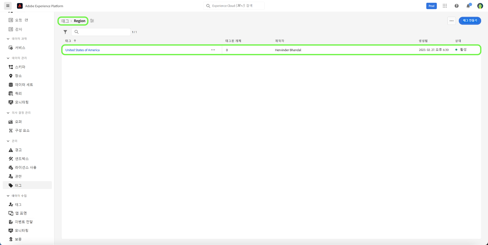

## 태그 보관 {#archive-tag}

태그의 상태는 활성과 아카이브 간에 전환할 수 있습니다. 보관된 태그는 이미 적용된 객체에서는 제거되지 않지만 새 객체에는 더 이상 적용할 수 없습니다. 각 태그에 대해 모든 오브젝트에 동일한 상태가 반영됩니다. 이 기능은 현재 태그-객체 연관을 유지하려고 하지만, 나중에 태그를 사용하지 않으려는 경우에 특히 유용합니다.

기존 태그를 보관하려면 태그 범주 목록에서 생략 부호(`...`)을 클릭하여 제품에서 사용할 수 있습니다. 드롭다운에 태그를 편집, 이동 또는 보관할 컨트롤이 표시됩니다. 선택 **[!UICONTROL 보관]** 드롭다운에서 을 클릭합니다.

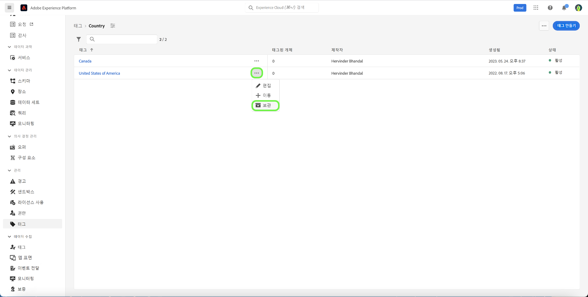

다음 **[!UICONTROL 태그 보관]** 태그 아카이브를 확인하는 대화 상자가 나타납니다. 선택 **[!UICONTROL 보관]**.

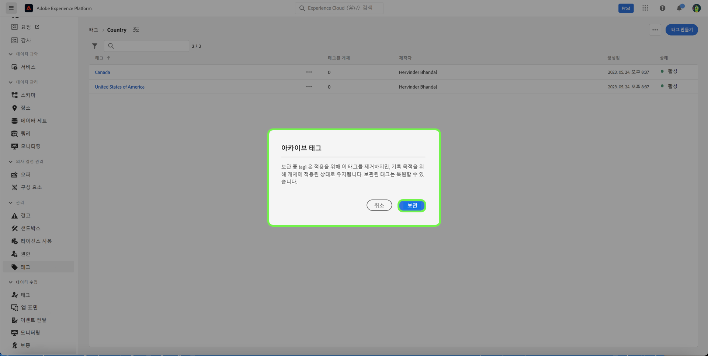

태그가 정상적으로 보관되고 태그 화면으로 리디렉션됩니다. 이제 업데이트된 태그 목록에 태그의 상태가 다음으로 표시됩니다. `Archived`.

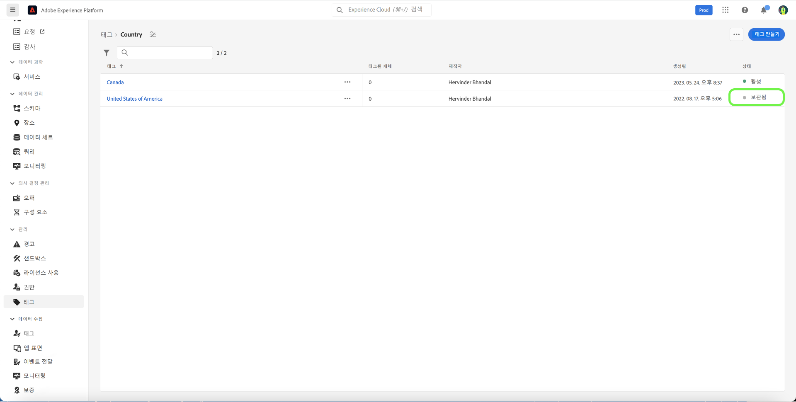

## 보관된 태그 복원 {#restore-archived-tag}

을(를) 적용하려면 `Archived` 태그를 새 개체에 지정하려면 태그가 `Active` 주. 보관된 태그를 복원하면 `Active` 주.

보관된 태그를 복원하려면 태그 범주 목록에서 줄임표(`...`)을 클릭하여 제품에서 사용할 수 있습니다. 드롭다운에 태그를 복원 또는 삭제할 컨트롤이 표시됩니다. 선택 **[!UICONTROL 복원]** 드롭다운에서 을 클릭합니다.

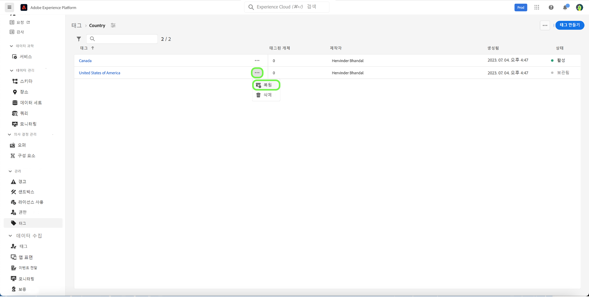

다음 **[!UICONTROL 태그 복원]** 태그 복원을 확인하는 대화 상자가 나타납니다. 선택 **[!UICONTROL 복원]**.

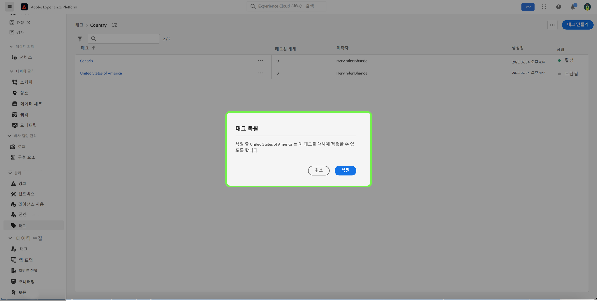

태그가 정상적으로 복원되고 태그 화면으로 리디렉션됩니다. 이제 업데이트된 태그 목록에 태그의 상태가 다음으로 표시됩니다. `Active`.

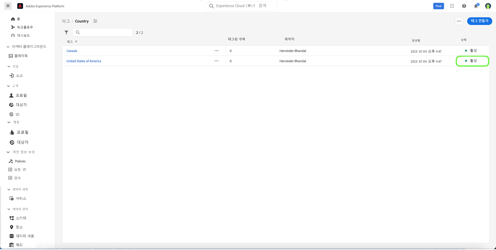

## 태그 삭제 {#delete-tag}

>[!NOTE]
>
>에 있는 태그만 `Archived` 상태 및 와(과) 어떤 객체와도 연관되지 않은 상태는 삭제할 수 있습니다.

태그를 삭제하면 시스템에서 완전히 제거됩니다.

보관된 태그를 삭제하려면 태그 범주 목록에서 생략 부호(`...`)을 클릭하여 제품에서 사용할 수 있습니다. 드롭다운에 태그를 복원 또는 삭제할 컨트롤이 표시됩니다. 선택 **[!UICONTROL 삭제]** 드롭다운에서 을 클릭합니다.

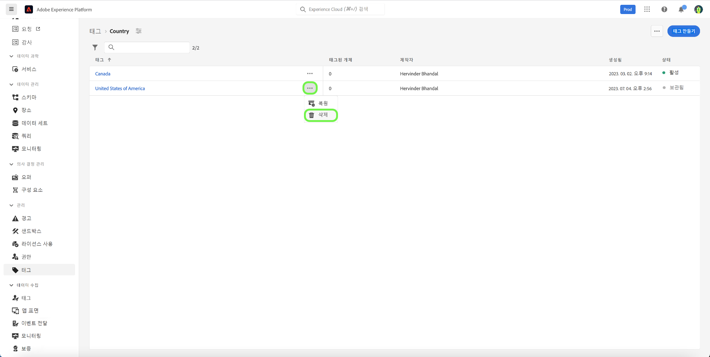

다음 **[!UICONTROL 태그 삭제]** 태그 삭제를 확인하는 대화 상자가 나타납니다. **[!UICONTROL 삭제]**&#x200B;를 선택합니다.

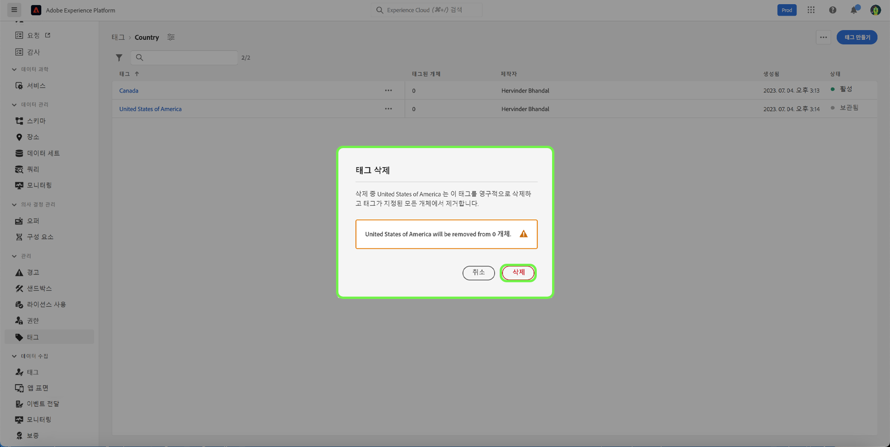

태그가 정상적으로 삭제되고 태그 화면으로 리디렉션됩니다. 태그가 더 이상 목록에 표시되지 않으며 완전히 제거되었습니다.

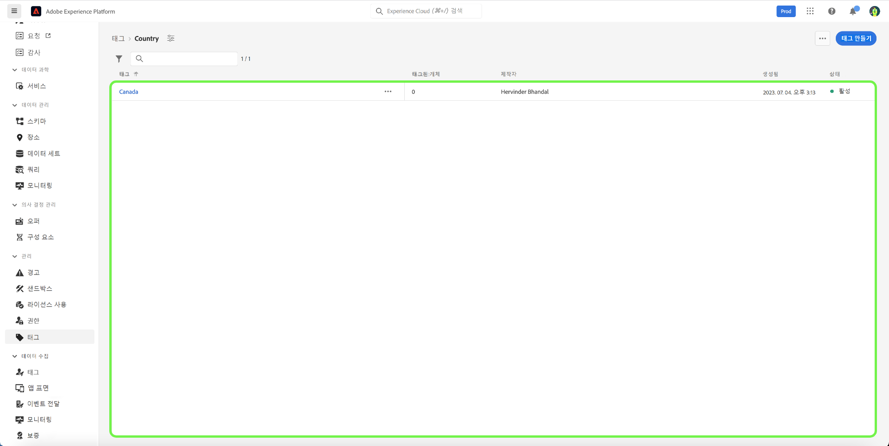

## 태그가 지정된 오브젝트 보기 {#view-tagged}

각 태그에는 태그 인벤토리에서 액세스할 수 있는 세부 사항 페이지가 있습니다. 이 페이지에는 현재 해당 태그가 적용된 모든 오브젝트가 나열되어 사용자가 서로 다른 앱 및 기능의 관련 오브젝트를 단일 보기에서 볼 수 있습니다.

태그가 지정된 개체 목록을 보려면 태그 범주 내에서 태그를 찾은 다음 태그를 선택합니다.

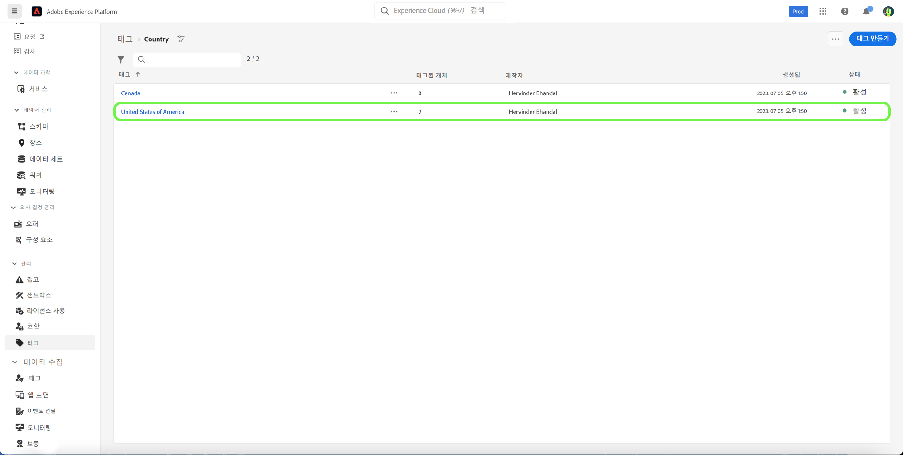

다음 [!UICONTROL 태그가 지정된 오브젝트] 태그가 지정된 오브젝트의 인벤토리를 보여 주는 페이지가 나타납니다.

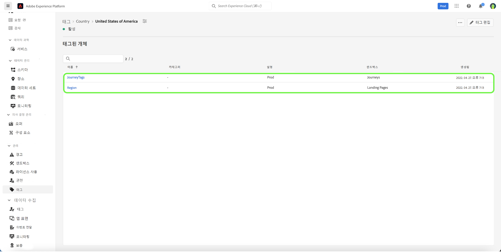

## 다음 단계

이제 태그를 관리하는 방법을 배웠습니다. Experience Platform의 태그에 대한 높은 수준의 개요는 [태그 개요 설명서](../overview.md).
