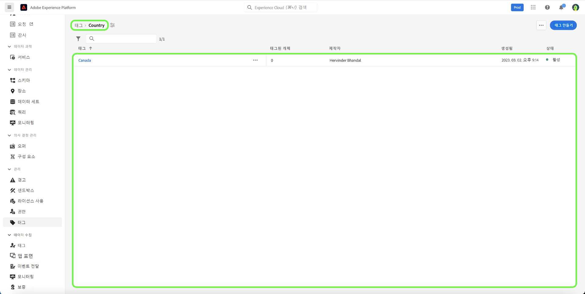
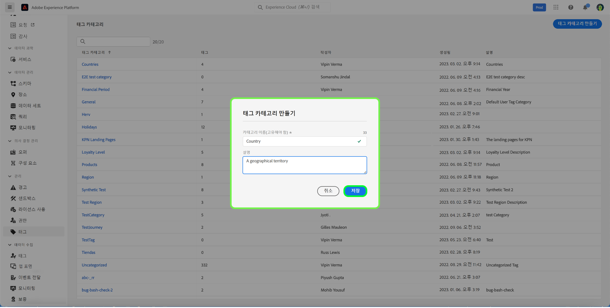
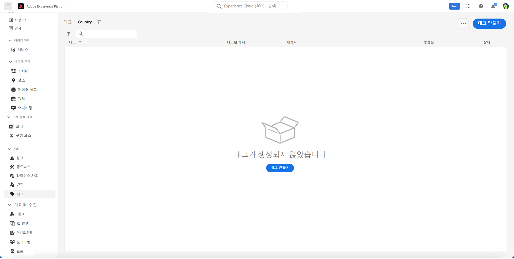
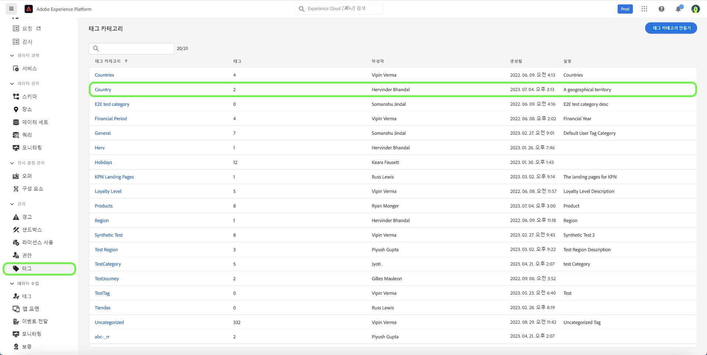
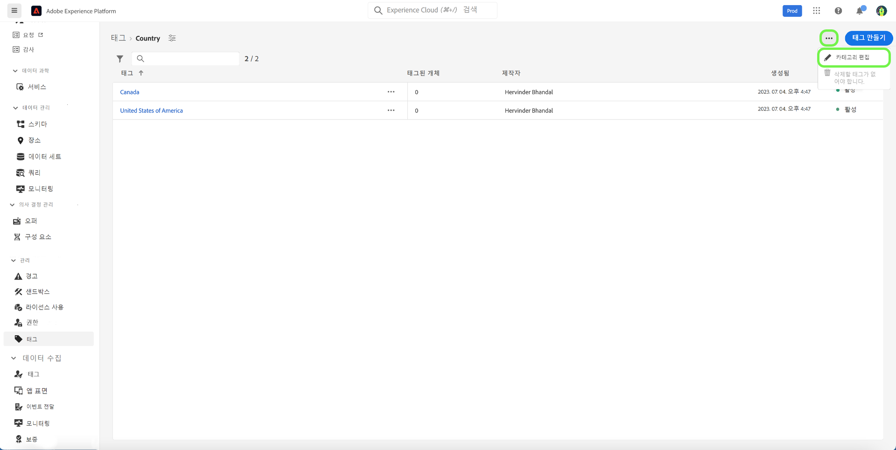
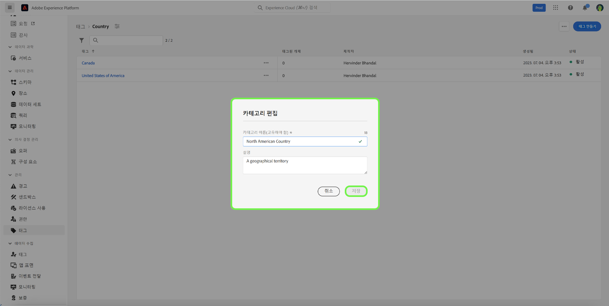
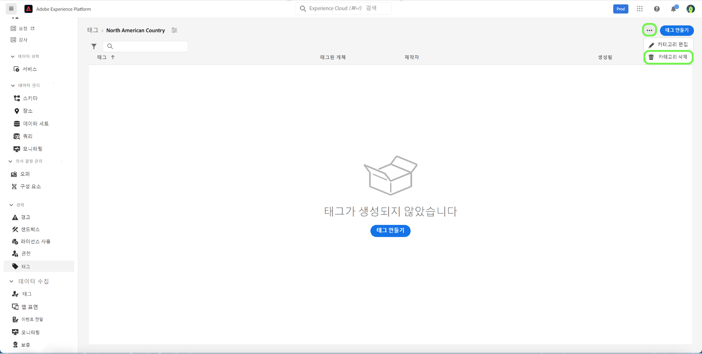
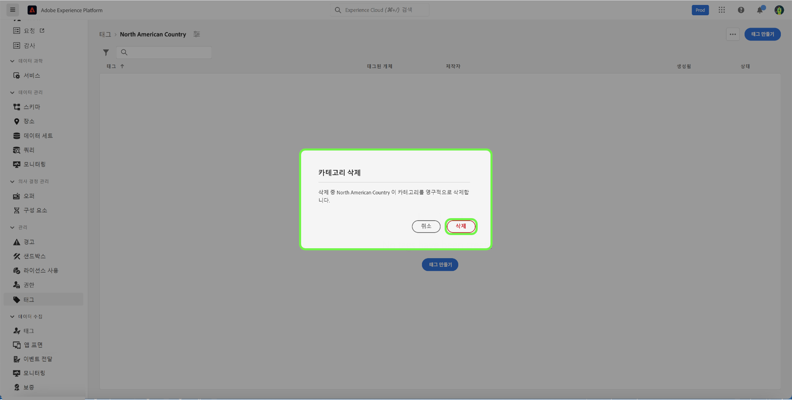

# 태그 카테고리 안내서

태그 카테고리는 더 많은 컨텍스트를 제공하고 태그의 목적을 더 잘 설명하도록 태그를 의미 있는 세트로 그룹화합니다. 범주가 있는 모든 태그에는 해당 범주의 이름 앞에 태그 이름이 붙은 다음 콜론이 표시됩니다.

## 태그 범주 만들기 {#create-tag-category}

새 카테고리를 만들려면 다음을 선택합니다. **[!UICONTROL 태그]** 왼쪽 탐색에서 을(를) 선택합니다. [!UICONTROL 태그 범주 만들기].

다음 **[!UICONTROL 태그 범주 만들기]** 고유한 카테고리 이름과 설명(선택 사항)을 입력하라는 대화 상자가 나타납니다. 완료되면 다음을 선택합니다. **[!UICONTROL 저장]**.

새 태그 카테고리가 성공적으로 만들어지고 새 태그를 할당할 수 있는 태그 만들기 페이지로 리디렉션됩니다. 태그 만들기에 대한 자세한 내용은 [태그 관리](./managing-tags.md#create-a-tag-create-tag) 문서.

## 태그 범주 편집 {#edit-tag-category}

>[!NOTE]
>
>태그 범주를 편집하거나 이름을 바꾸면 현재 적용된 모든 개체와의 태그 연결이 유지됩니다.

태그 범주를 편집하려면 다음을 선택합니다. **[!UICONTROL 태그]** 왼쪽 탐색에서 편집할 태그 범주를 선택합니다.

태그 카테고리에서 줄임표(`...`) 옆에 있는 [!UICONTROL 태그 만들기]. 드롭다운에 카테고리를 편집하거나 삭제하고 선택할 수 있는 컨트롤이 표시됩니다. **[!UICONTROL 범주 편집]**.

다음 **[!UICONTROL 범주 편집]** 범주 이름과 설명(선택 사항)을 업데이트하라는 대화 상자가 나타납니다. 완료되면 다음을 선택합니다. **[!UICONTROL 저장]**.

태그 범주가 정상적으로 업데이트되고, 태그 범주로 리디렉션됩니다.

## 태그 범주 삭제 {#delete-tag-category}

>[!NOTE]
>
>태그 범주를 삭제하려면 먼저 비어 있고 태그가 없어야 합니다.

태그 범주를 삭제하려면 다음을 선택합니다 **[!UICONTROL 태그]** 왼쪽 탐색에서 삭제할 태그 범주를 선택합니다.

태그 카테고리에서 줄임표(`...`) 옆에 있는 [!UICONTROL 태그 만들기]. 드롭다운에 카테고리를 편집하거나 삭제하고 선택할 수 있는 컨트롤이 표시됩니다. **[!UICONTROL 범주 삭제]**.

다음 **[!UICONTROL 범주 삭제]** 태그 범주 삭제를 확인하는 대화 상자가 나타납니다. 선택 **[!UICONTROL 삭제]** 확인할 수 있습니다.

태그 범주가 정상적으로 삭제되고 태그 범주 인벤토리 페이지로 리디렉션됩니다. 태그 범주가 더 이상 목록에 표시되지 않으며 완전히 제거되었습니다.

## 다음 단계

이제 태그 범주를 관리하는 방법을 배웠습니다. 다음 단계로 이동하여 [태그 관리](./managing-tags.md).
