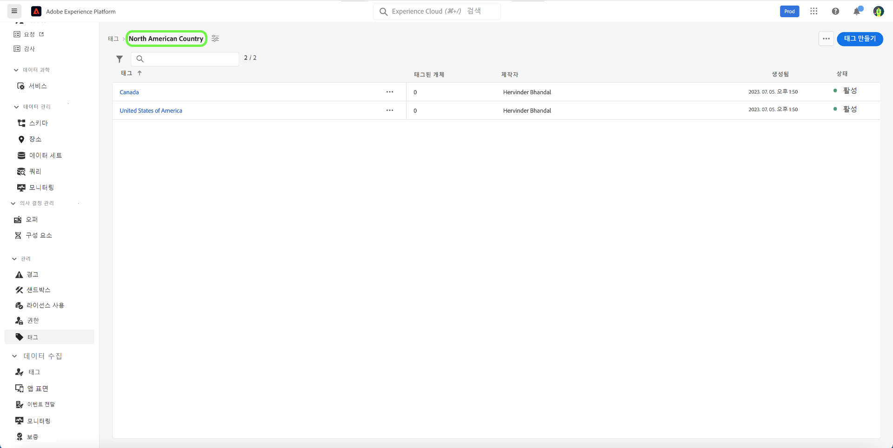

# 태그 카테고리 안내서

태그 카테고리는 태그를 의미 있는 집합으로 그룹화하여 더 많은 컨텍스트를 제공하고 태그 목적을 보다 명확하게 설명합니다. 카테고리가 있는 모든 태그에는 태그 이름 앞에 카테고리 이름이 있고 그 뒤에 콜론이 있습니다.

## 태그 카테고리 만들기 {#create-tag-category}

새 카테고리를 만들려면 왼쪽 탐색 영역에서 **[!UICONTROL 태그]**&#x200B;를 선택한 다음 [!UICONTROL 태그 카테고리 만들기]를 선택합니다.

**[!UICONTROL 태그 카테고리 만들기]** 대화 상자가 나타나고 고유한 카테고리 이름과 설명(옵션)을 입력하라는 메시지가 표시됩니다. 완료되면 **[!UICONTROL 저장]**&#x200B;을 선택합니다.

새 태그 카테고리가 생성되고 새 태그를 할당할 수 있는 태그 만들기 페이지로 리디렉션됩니다. 태그 생성에 대한 자세한 내용은 [태그 관리](./managing-tags.md#create-a-tag-create-tag) 문서를 참조하십시오.

## 태그 카테고리 편집 {#edit-tag-category}

>[!NOTE]
>
>태그 카테고리를 편집하거나 이름을 변경하면 현재 적용된 오브젝트와의 태그 연결이 유지됩니다.

태그 카테고리를 편집하려면 왼쪽 탐색 영역에서 **[!UICONTROL 태그]**&#x200B;를 선택한 다음 편집하려는 태그 카테고리를 선택합니다.

태그 카테고리에서 [!UICONTROL 태그 만들기] 옆의 줄임표(`...`)를 선택합니다. 드롭다운에 카테고리를 편집하거나 삭제할 수 있는 컨트롤이 표시됩니다. **[!UICONTROL 카테고리 편집]**&#x200B;을 선택합니다

**[!UICONTROL 카테고리 편집]** 대화 상자가 나타나고 카테고리 이름 및 설명(옵션)을 업데이트하라는 메시지가 표시됩니다. 완료되면 **[!UICONTROL 저장]**&#x200B;을 선택합니다.

태그 카테고리가 업데이트되고 태그 카테고리로 리디렉션됩니다.

## 태그 카테고리 삭제 {#delete-tag-category}

>[!NOTE]
>
>태그 카테고리를 삭제하려면 비어 있고 태그가 없어야 합니다.

태그 카테고리를 삭제하려면 왼쪽 탐색 영역에서 **[!UICONTROL 태그]**&#x200B;를 선택한 다음 삭제하려는 태그 카테고리를 선택합니다.

태그 카테고리에서 [!UICONTROL 태그 만들기] 옆의 줄임표(`...`)를 선택합니다. 드롭다운에 카테고리를 편집하거나 삭제할 수 있는 컨트롤이 표시됩니다. **[!UICONTROL 카테고리 삭제]**&#x200B;를 선택합니다

**[!UICONTROL 태그 카테고리 삭제]** 대화 상자가 나타나며 태그 카테고리 삭제를 확인하는 메시지가 표시됩니다. **[!UICONTROL 삭제]**&#x200B;를 선택하여 확인합니다.

태그 카테고리가 삭제되고, 태그 카테고리 인벤토리 페이지로 리디렉션됩니다. 태그 카테고리가 더 이상 목록에 나타나지 않으며 완전히 제거되었습니다.

## 다음 단계

이제 태그 카테고리를 관리하는 방법을 배웠습니다. [태그를 관리](./managing-tags.md)하는 다음 단계로 진행할 수 있습니다.
