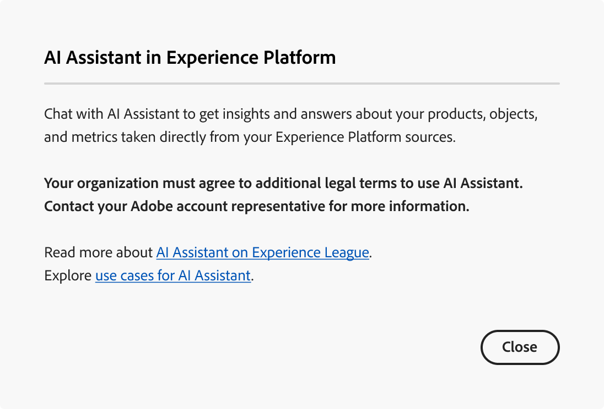
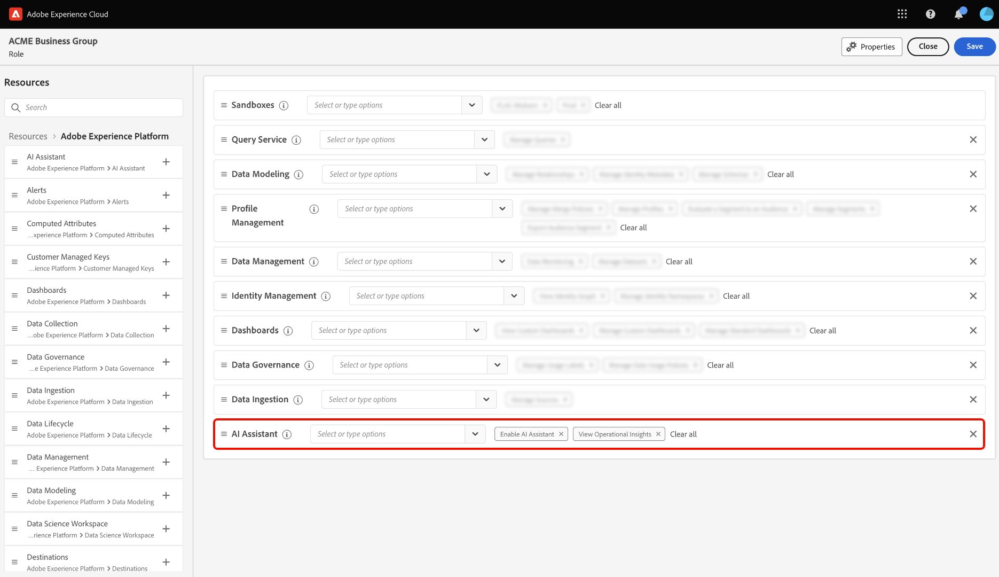

# Experience Platform에서 AI Assistant(기존)에 액세스

>[!IMPORTANT]
>
>이 문서는 AI Assistant(기존)에 적용됩니다. AI Assistant(Next-Gen)에 대한 자세한 내용은 [Experience Cloud의 AI](https://experienceleague.adobe.com/en/docs/experience-cloud-ai/experience-cloud-ai/ai-assistant/ai-assistant-ui) 설명서에서 [AI Assistant UI 안내서](https://experienceleague.adobe.com/ko/docs/experience-cloud-ai/experience-cloud-ai/home)를 참조하십시오.

AI Assistant(기존) 및 AI Assistant(차세대) 비교는 다음 표를 참조하십시오.

| 기능 영역 | AI Assistant(기존) | AI Assistant(차세대) |
| --- | --- | --- |
| 사용자 경험 | AI Assistant(기존)는 오른쪽 레일 패널에서만 사용할 수 있습니다. | AI Assistant(Next-Gen)는 오른쪽 레일 패널과 몰입형 전체 화면 경험 모두에서 사용할 수 있습니다. |
| 기능 범위 | 제품 지식과 운영 통찰력 모두에 AI Assistant(기존)를 사용할 수 있습니다. | 제품 지식, 운영 통찰력은 물론 고급 에이전트 기술 및 여러 단계의 작업 실행에 AI Assistant(차세대)를 사용할 수 있습니다. |
| 플랫폼 아키텍처 | AI Assistant(기존)는 Agent Orchestrator 스택에 빌드되지 않습니다. | AI Assistant(Next-Gen)는 [Adobe Experience Platform Agent Orchestrator](https://experienceleague.adobe.com/ko/docs/experience-cloud-ai/experience-cloud-ai/agents/agent-orchestrator)을 통해 작동하며, 여러 기능에 대한 확장성 및 고급 조정을 지원합니다. |
| 애플리케이션 범위 | AI Assistant(기존)는 애플리케이션별 구현입니다. | 모든 Adobe Experience Cloud 애플리케이션에서 통합 AI Assistant 경험을 위해 AI Assistant(Next-Gen)를 사용할 수 있습니다. |
| 액세스 및 권한 모델 | 개별 제품 경계에 맞게 조정된 애플리케이션 범위 액세스 모델. | 모든 사용자는 AI Assistant(차세대) 및 관련 Experience Platform 에이전트에 액세스할 수 있습니다. **참고**: <ul><li>**Adobe Experience Manager**: 관리자가 [Adobe Admin Console](https://helpx.adobe.com/enterprise/using/admin-console.html)을(를) 통해 AI Assistant(Next-Gen)에 액세스할 수 있는 권한을 부여해야 합니다.</li><li>**Customer Journey Analytics**: 관리자가 [Customer Journey Analytics 액세스 제어](https://experienceleague.adobe.com/en/docs/analytics-platform/using/technotes/access-control?lang=en)를 통해 AI Assistant에 액세스할 수 있는 권한을 부여해야 합니다. 이를 통해 제품 지식 및 데이터 통찰력에 대한 질문을 할 수 있습니다. |

Adobe Experience Cloud의 여러 애플리케이션에서 AI Assistant(기존)에 액세스할 수 있습니다.

>[!NOTE]
>
>AI Assistant(레거시)에 대한 액세스 권한을 얻으려면 먼저 조직이 추가 법률 약관에 동의해야 한다는 것을 알리는 팝업 메시지가 권한 UI에 표시되는 경우 Adobe 계정 팀에 문의하여 이러한 약관에 대한 지침을 확인하십시오.

## 시작하기 {#get-started}

AI Assistant(이전)에 액세스하려면 먼저 두 가지 전제 조건 단계를 완료해야 합니다.

1. 조직은 먼저 법률 약관에 동의해야 합니다. 자세한 내용은 Adobe 계정 팀에 문의하십시오.
2. 관리자는 사용자에게 AI Assistant(기존)에 액세스할 수 있는 충분한 권한을 부여해야 합니다.

이 두 가지 전제 조건 단계 중 하나를 완료하지 않은 경우 Experience Platform UI에서 AI Assistant(기존) 채팅 아이콘을 선택하면 다음 메시지가 표시됩니다.

>[!BEGINTABS]

>[!TAB 조직에서 AI Assistant(레거시)를 사용할 수 없습니다]

AI Assistant(레거시)를 사용할 수 있는 법적 자격이 없는 조직을 사용하는 경우 다음과 같은 메시지가 표시됩니다. 이 시나리오에서는 Adobe 계정 팀에 연락하여 액세스를 해결해야 합니다.

>[!TAB 권한이 없습니다]

귀사에서 AI Assistant(기존)를 사용할 수 있는 법적 자격이 있지만 기능에 액세스할 수 없는 경우 Experience Platform UI에 다음과 같은 메시지가 표시됩니다. 이 시나리오는 기능에 액세스할 수 있는 충분한 권한이 없으며 관리자에게 문의하여 권한을 해결해야 함을 의미합니다.

>[!ENDTABS]

## AI Assistant 액세스 권한 (기존) {#get-access-to-ai-assistant}

AI Assistant(기존)에 대한 액세스는 다음 매개 변수에 의해 제어됩니다.

* **응용 프로그램에 액세스:** Adobe Experience Platform, Adobe Real-Time CDP, Adobe Journey Optimizer 및 [Customer Journey Analytics](https://experienceleague.adobe.com/en/docs/analytics-platform/using/ai-assistant)에서 AI Assistant(기존)에 액세스할 수 있습니다.
<!-- * **Contractual access:** Your company must agree to certain [!DNL GenAI]-related legal terms before your organization can use AI Assistant (Legacy). Contact your organization's administrator or your Adobe Account Team if you are not able to access AI Assistant (Legacy).  -->
* **권한:** [권한 UI](../access-control/abac/ui/permissions.md)를 사용하여 조직의 AI Assistant(레거시)에 대한 액세스 권한을 부여하거나 취소합니다. AI Assistant(레거시)를 사용하려면 지정된 사용자가 **AI Assistant 활성화** 및 **Operational Insights 보기** 권한으로 프로비저닝된 역할에 속해야 합니다.
   * 관리자는 지정된 역할에 **AI Assistant 사용**&#x200B;을 추가하고 해당 역할에 사용자를 추가하여 조직의 AI Assistant(레거시)에 액세스할 수 있도록 할 수 있습니다. **참고**: 이 권한을 사용하면 해당 사용자가 AI Assistant(레거시)에 액세스할 수 있으며, 다른 사용자에게 AI Assistant(레거시)에 대한 액세스 권한을 부여할 수 있는 관리 기능은 부여하지 않습니다.
   * 관리자는 지정된 역할에 **View Operational Insights**&#x200B;를 추가하고 해당 역할에 사용자를 추가하여 AI Assistant(Legacy)의 Operational Insights 기능을 사용할 수 있도록 할 수 있습니다.

[권한 UI](../access-control/abac/ui/roles.md)를 사용하여 Experience Platform 및 Journey Optimizer에서 AI Assistant(기존)를 사용할 수 있는 권한을 부여합니다. Customer Journey Analytics에서 AI Assistant(기존)에 액세스하는 방법에 대한 자세한 내용 [Customer Journey Analytics](https://experienceleague.adobe.com/en/docs/analytics-platform/using/ai-assistant)에서 설명서를 읽어 보십시오.

필요한 권한이 있으면 사용 중인 애플리케이션 상단 헤더에 있는 AI Assistant(기존) 아이콘을 선택하여 AI Assistant(기존)에 액세스할 수 있습니다.

처음 사용자 경험이 있는 

다음 비디오를 통해 조직 및 사용자를 위한 AI Assistant(기존)에 대한 액세스를 구성하는 방법에 대해 알아보십시오.

>[!VIDEO](https://video.tv.adobe.com/v/3436470/?learn=on)

## 다음 단계

AI Assistant(레거시)에 대한 전체 액세스 권한을 보유하고 나면 워크플로 동안 기능을 계속 사용할 수 있습니다. 자세한 내용은 [AI Assistant(레거시) UI 안내서](./ui-guide.md)를 참조하십시오.
