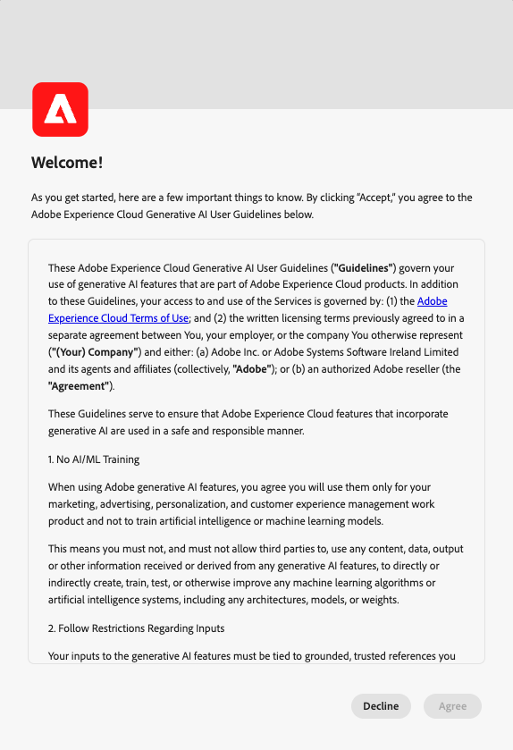

# Adobe Experience Platform의 AI Assistant(기존)

>[!IMPORTANT]
>
>이 문서는 AI Assistant(기존)에 적용됩니다. AI Assistant(Next-Gen)에 대한 자세한 내용은 [Experience Cloud의 AI](https://experienceleague.adobe.com/ko/docs/experience-cloud-ai/experience-cloud-ai/ai-assistant/ai-assistant-ui) 설명서에서 [AI Assistant UI 안내서](https://experienceleague.adobe.com/ko/docs/experience-cloud-ai/experience-cloud-ai/home)를 참조하십시오.

AI Assistant(기존) 및 AI Assistant(차세대) 비교는 다음 표를 참조하십시오.

| 기능 영역 | AI Assistant(기존) | AI Assistant(차세대) |
| --- | --- | --- |
| 사용자 경험 | AI Assistant(기존)는 오른쪽 레일 패널에서만 사용할 수 있습니다. | AI Assistant(Next-Gen)는 오른쪽 레일 패널과 몰입형 전체 화면 경험 모두에서 사용할 수 있습니다. |
| 기능 범위 | 제품 지식과 운영 통찰력 모두에 AI Assistant(기존)를 사용할 수 있습니다. | 제품 지식, 운영 통찰력은 물론 고급 에이전트 기술 및 여러 단계의 작업 실행에 AI Assistant(차세대)를 사용할 수 있습니다. |
| 플랫폼 아키텍처 | AI Assistant(기존)는 Agent Orchestrator 스택에 빌드되지 않습니다. | AI Assistant(Next-Gen)는 [Adobe Experience Platform Agent Orchestrator](https://experienceleague.adobe.com/ko/docs/experience-cloud-ai/experience-cloud-ai/agents/agent-orchestrator)을 통해 작동하며, 여러 기능에 대한 확장성 및 고급 조정을 지원합니다. |
| 애플리케이션 범위 | AI Assistant(기존)는 애플리케이션별 구현입니다. | 모든 Adobe Experience Cloud 애플리케이션에서 통합 AI Assistant 경험을 위해 AI Assistant(Next-Gen)를 사용할 수 있습니다. |
| 액세스 및 권한 모델 | 개별 제품 경계에 맞게 조정된 애플리케이션 범위 액세스 모델. | 모든 사용자는 AI Assistant(차세대) 및 관련 Experience Platform 에이전트에 액세스할 수 있습니다. **참고**: <ul><li>**Adobe Experience Manager**: 관리자가 [Adobe Admin Console](https://helpx.adobe.com/kr/enterprise/using/admin-console.html)을(를) 통해 AI Assistant(Next-Gen)에 액세스할 수 있는 권한을 부여해야 합니다.</li><li>**Customer Journey Analytics**: 관리자가 [Customer Journey Analytics 액세스 제어](https://experienceleague.adobe.com/ko/docs/analytics-platform/using/technotes/access-control?lang=en)를 통해 AI Assistant에 액세스할 수 있는 권한을 부여해야 합니다. 이를 통해 제품 지식 및 데이터 통찰력에 대한 질문을 할 수 있습니다. |

다음 비디오는 AI Assistant에 대한 이해를 돕기 위한 것입니다.

>[!VIDEO](https://video.tv.adobe.com/v/3429845?learn=on)

Adobe Experience Platform의 AI Assistant(기존)에 대해 알아보려면 이 문서 를 참조하십시오.

Adobe Experience Platform의 AI Assistant(레거시)는 Adobe 애플리케이션에서 워크플로를 가속화하는 데 사용할 수 있는 대화형 경험입니다. AI Assistant(기존)를 사용하여 제품 지식을 보다 잘 이해하거나, 문제를 해결하거나, 정보를 검색하고, 운영 통찰력을 찾을 수 있습니다. AI Assistant(기존)는 Experience Platform, Real-Time Customer Data Platform, Adobe Journey Optimizer 및 Customer Journey Analytics을 지원합니다.

>[!IMPORTANT]
>
>AI Assistant(레거시)를 사용하려면 먼저 [사용자 계약](https://www.adobe.com/kr/legal/licenses-terms/adobe-dx-gen-ai-user-guidelines.html)에 동의해야 합니다. 사용자 계약에는 공개 베타 계약도 포함되어 있습니다. 추가 AI Assistant(이전) 기능이 Beta 용량으로 롤아웃될 때 이를 사용할 수 있도록 합니다.

+++사용자 계약 인터페이스를 보려면 선택

+++

## AI Assistant 이해 {#understanding-ai-assistant}

AI Assistant(기존)는 데이터베이스를 쿼리한 다음 데이터베이스의 데이터를 사람이 읽을 수 있는 답변으로 변환하여 제출된 질문에 응답합니다.

기본 데이터의 이러한 내부 표현은 **[!DNL Knowledge Graph]**&#x200B;이라고도 합니다. 이는 특정 질문에 대한 개념, 데이터 및 메타데이터의 포괄적인 웹입니다.

[!DNL Knowledge Graph]은(는) 쿼리가 제출될 때마다 참조되는 하위 그래프로 구성됩니다.

* 고객 운영 통찰력.
* 다양한 메타 스토어에서 고객 운영 통찰력.
* Experience League 설명서입니다.

AI Assistant(기존)를 쿼리하기 전에 고려해야 할 두 가지 유형의 질문이 있습니다.

### 제품 지식 {#product-knowledge}

제품 지식은 Experience League 설명서에 나와 있는 개념과 주제를 나타냅니다. 제품 지식 질문은 다음 하위 그룹에 추가로 지정할 수 있습니다.

| 제품 지식 | 예시 |
| --- | --- |
| 뾰족한 학습 | <ul><li>ID와 기본 또는 외래 키 간의 차이점은 무엇입니까?</li><li>유사 대상자란 무엇입니까?</li></ul> |
| 검색 열기 | <ul><li>이 데이터 세트를 내보내려면 어떻게 해야 합니까?</li><li>의료 서비스 고객을 위한 스키마가 있습니까?</li></ul> |
| 문제 해결 | <ul><li>프로필용으로 Adobe에서 소유한 스키마를 켤 수 없는 이유는 무엇입니까?</li><li>세그먼트를 삭제할 수 없는 이유</li></ul> |

{style="table-layout:auto"}

AI Assistant(기존) 제품 지식에 대한 추가 정보는 다음 비디오를 시청하십시오.

>[!VIDEO](https://video.tv.adobe.com/v/3438032/?learn=on)

### 운영 인사이트 {#operational-insights}

운영 인사이트는 카운트, 조회 및 계보 영향을 포함한 메타데이터 개체(속성, 대상, 데이터 흐름, 데이터 세트, 대상, 여정, 스키마 및 소스)에 대해 AI 지원(기존)이 생성하는 답변을 의미합니다. 샌드박스 내의 데이터는 보지 않습니다.

* 데이터 세트가 얼마나 많이 있습니까?
* 사용된 적이 없는 스키마 속성 수는 몇 개입니까?
* 활성화된 대상은 무엇입니까?

다음 도메인에서 운영 통찰력에 대한 AI 지원(기존) 질문을 할 수 있습니다.

| 도메인 | 지원되는 메타데이터 | 지원되지 않는 메타데이터 |
| --- | --- | --- |
| 속성 | <ul><li>속성 이름 검색</li><li>속성 - 스키마 관계</li><li>속성 - 데이터 세트 관계</li><li>속성 - 대상 관계</li><li>속성 - 대상 관계</li></ul> | <ul><li>Attribute 클래스</li><li>감사</li><li>사용 중단 상태</li><li>레이블</li><li>속성에 저장된 값</li></ul> |
| 대상자 | <ul><li>대상자 수</li><li>대상자 유형(스트리밍 또는 일괄 처리)</li><li>생성/수정 날짜</li><li>활성화 상태</li><li>프로필 개수</li><li>중복 대상자</li><li>대상 정의 검색</li><li>대상 - 대상 관계</li><li>대상 - 속성 관계</li><li>대상자 - 데이터 세트 관계</li><li>대상 - 대상 관계</li><li>이름 검색</li><li>이름 및 ID 검색 | <ul><li>대상자 오버랩</li><li>대상자 활성화</li><li>대상자 - 캠페인 관계</li><li>감사</li><li>만들기/수정</li><li>레이블</li><li>프로필 자격 트렌드</li></ul> |
| 데이터 흐름 | <ul><li>데이터 흐름 카운트</li><li>데이터 흐름 상태</li><li>데이터 흐름 - 데이터 세트 관계</li><li>데이터 흐름 - 소스 관계</li></ul> | <ul><li>생성/수정</li><li>데이터 흐름 일괄 처리 관계</li><li>프로필 개수 수집</li></ul> |
| 데이터 세트 | <ul><li>데이터 세트 수</li><li>프로필 활성화 상태</li><li>생성/수정 날짜</li><li>데이터 세트 - 스키마 관계</li><li>데이터 세트 - 대상 관계</li><li>데이터 세트 - 속성 관계</li><li>데이터 세트 - 데이터 흐름 관계</li><li>데이터 세트 크기</li><li>행 수</li><li>이름 검색 </li><li>이름 및 ID 검색</li></ul> | <ul><li>감사</li><li>생성자</li><li>데이터 세트 - 일괄 처리 관계</li><li>데이터 세트 생성/수정</li><li>프로필 수</li><li>값 검색</li></ul> |
| 대상 | <ul><li>구성된 대상 카운트</li><li>대상 - 대상 관계</li><li>대상 속성 관계</li></ul> | <ul><li>계정 설정</li><li>계정 자격 증명 정보</li><li>고유 프로필 활성화됨</li></ul> |
| 여정 | <ul><li>카운트</li><li>이름 검색</li><li>이름 및 ID 검색</li><li>여정 상태</li><li>트리거된 상태(대상자 대 이벤트)</li><li>생성/수정 날짜</li><li>반복 빈도</li></ul> | <ul><li>속성 - 여정 관계</li><li>감사</li><li>생성/수정</li><li>생성자</li><li>이벤트</li><li>여정 - 데이터 세트</li><li>여정 - 스키마</li><li>오퍼</li><li>프로필 자격 트렌드</li><li>단계 이벤트</li></ul> |
| 스키마 | <ul><li>스키마 카운트</li><li>생성/수정 날짜</li><li>스키마 - 속성 관계</li><li>스키마 - 데이터 세트 관계</li><li>스키마 - 대상 관계</li><li>프로필 활성화 상태</li><li>이름 검색</li><li>이름 및 ID 검색</li></ul> | <ul><li>감사</li><li>생성/수정</li><li>생성자</li><li>필드 그룹</li><li>ID</li><li>ID 네임스페이스</li><li>레이블</li><li>프로필 수</li></ul> |
| 소스 | <ul><li>계정 수</li><li>계정 상태</li><li>각 계정에 대한 활성/비활성 데이터 흐름</li><li>Source 커넥터 - 데이터 흐름 관계</li><li>Source 계정 - 데이터 흐름 관계</li></ul> | <ul><li>계정 자격 증명 정보</li><li>계정 설정</li><li>데이터 수집 지표</li><li>프로필 수</li><li>Source - 일괄 처리 관계</li></ul> |

{style="table-layout:auto"}

운영 통찰력 질문에 대한 답변이 UI의 현재 상태를 반영하지 않을 수 있습니다. 이러한 질문을 뒷받침하는 데이터는 24시간마다 한 번씩 업데이트됩니다. 예를 들어 사용자가 낮에 Real-Time CDP에서 수행하는 변경 사항은 밤에 데이터 스토어와 동기화된 다음 아침에 사용자 질문에 대해 사용할 수 있게 됩니다. 객체와 관련된 특정 데이터를 조회하려면 샌드박스에 로그인해야 합니다.

AI Assistant(기존) 운영 통찰력에 대한 추가 정보는 다음 비디오를 시청하십시오.

>[!VIDEO](https://video.tv.adobe.com/v/3444031?learn=on&enablevpops)

### 기능 범위 {#feature-scope}

현재 AI Assistant(기존)의 범위는 다음과 같습니다.

* [제품 지식](./home.md#product-knowledge): AI Assistant(기존)는 Experience Platform, Real-Time Customer Data Platform 및 Adobe Journey Optimizer에 대한 제품 지식 질문에 답변할 수 있습니다. Customer Journey Analytics UI를 통해서만 Customer Journey Analytics에 대한 제품 지식 항목을 살펴볼 수도 있습니다.
* [Operational insights](./home.md#operational-insights): 특성, 대상, 데이터 흐름, 데이터 세트, 대상, 여정, 스키마 및 원본과 같은 데이터 개체에 대한 Operational Insights에 대한 질문과 함께 AI Assistant(기존)에 물을 수 있습니다.

## 다음 단계

이제 AI Assistant(레거시)에 대해 전반적으로 이해했으므로 워크플로우 동안 계속 진행하여 AI Assistant(레거시)를 사용할 수 있습니다. 자세한 내용은 다음 설명서를 참조하십시오.

* [AI Assistant(기존) UI 안내서](./ui-guide.md)
* [기능 액세스](./access.md)
* [질문 안내서](./questions.md)
* [AI Assistant(기존)의 개인정보 보호, 보안 및 거버넌스](./privacy.md)
* [FAQ](./faq.md)
