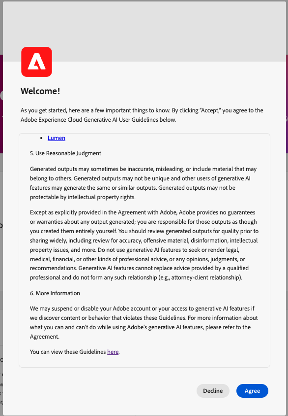

# Adobe Experience Platform의 AI 지원

Adobe Experience Platform의 AI Assistant에 대해 알아보려면 이 문서를 참조하십시오.

Adobe Experience Platform의 AI Assistant는 Adobe 애플리케이션에서 워크플로를 가속화하는 데 사용할 수 있는 대화형 경험입니다. AI Assistant를 사용하여 제품 지식을 보다 잘 이해하고, 문제를 해결하거나, 정보를 검색하고, 운영 통찰력을 찾을 수 있습니다. AI Assistant는 Experience Platform, Real-time Customer Data Platform, Adobe Journey Optimizer 및 Customer Journey Analytics을 지원합니다.

>[!IMPORTANT]
>
>다음에 동의해야 합니다. [사용자 계약](https://www.adobe.com/legal/licenses-terms/adobe-dx-gen-ai-user-guidelines.html) 먼저 AI Assistant를 사용할 수 있습니다. 사용자 계약에는 공개 베타 계약도 포함되어 있습니다. 추가 AI Assistant 기능이 Beta 용량으로 롤아웃될 때 이를 사용할 수 있도록 합니다.

+++사용자 계약 인터페이스를 보려면 선택

+++

## AI Assistant 이해 {#understanding-ai-assistant}

AI Assistant는 데이터베이스에 질의한 다음 데이터베이스의 데이터를 사람이 읽을 수 있는 답변으로 변환하여 제출된 질문에 응답합니다.

기본 데이터의 이러한 내부 표현은 **[!DNL Knowledge Graph]** - 주어진 질문에 대한 개념, 데이터 및 메타데이터의 포괄적인 웹.

다음 [!DNL Knowledge Graph] 는 쿼리가 제출될 때마다 참조되는 하위 그래프로 구성됩니다.

* 고객 운영 통찰력.
* 다양한 메타 스토어에서 고객 운영 통찰력.
* Experience League 설명서입니다.

AI Assistant를 쿼리하기 전에 고려해야 할 두 가지 유형의 질문이 있습니다.

### 제품 지식 {#product-knowledge}

제품 지식은 Experience League 설명서에 기반을 둔 개념과 주제를 의미합니다. 제품 지식 질문은 다음 하위 그룹에 추가로 지정할 수 있습니다.

| 제품 지식 | 예시 |
| --- | --- |
| 뾰족한 학습 | <ul><li>ID와 기본 또는 외래 키 간의 차이점은 무엇입니까?</li><li>프로필 풍부성은 어떻게 계산됩니까?</li></ul> |
| 검색 열기 | <ul><li>이 데이터 세트를 내보내려면 어떻게 해야 합니까?</li><li>의료 서비스 고객을 위한 스키마가 있습니까?</li></ul> |
| 문제 해결 | <ul><li>프로필에 대해 Adobe 소유의 스키마를 켤 수 없는 이유는 무엇입니까?</li><li>세그먼트를 삭제할 수 없는 이유</li></ul> |

{style="table-layout:auto"}

### Operational insights {#operational-insights}

>[!IMPORTANT]
>
>Operational Insights 답변은 Beta 버전입니다. 에 액세스할 수 있는 모든 사용자 **Operational Insights 보기** 권한은 operational insights 응답에 액세스할 수 있습니다.

운영 인사이트는 카운트, 조회 및 계보 영향을 포함하여 AI 비서가 메타 데이터 개체(속성, 대상, 데이터 흐름, 데이터 세트, 대상, 여정, 스키마 및 소스)에 대해 생성하는 답변을 말합니다. 샌드박스 내의 데이터는 보지 않습니다.

* 보유한 데이터 세트는 몇 개입니까?
* 사용된 적이 없는 스키마 속성 수는 몇 개입니까?
* 활성화된 대상은 무엇입니까?

다음 도메인에서 운영 통찰력에 대해 AI Assistant에 질문할 수 있습니다.

* 속성
* 대상자
* 데이터 흐름
* 데이터 세트
* 대상 _(계정에 대한 질문과 데이터 흐름에 대한 일부 질문은 현재 답변할 수 없습니다.)_
* 여정
* 스키마 _(필드 그룹에 대한 질문에 지금은 답변할 수 없습니다.)_
* 소스 _(현재 계정에 대한 질문에 답변할 수 없습니다.)_

운영 통찰력 질문에 대한 답변이 UI의 현재 상태를 반영하지 않을 수 있습니다. 이러한 질문을 뒷받침하는 데이터는 24시간마다 한 번씩 업데이트됩니다. 예를 들어 사용자가 낮에 Real-Time CDP에서 수행하는 변경 사항은 밤에 데이터 스토어와 동기화된 다음 아침에 사용자 질문에 대해 사용할 수 있게 됩니다. 객체와 관련된 특정 데이터를 조회하려면 샌드박스에 로그인해야 합니다.

### 기능 범위 {#feature-scope}

현재 AI Assistant의 범위는 다음과 같습니다.

* [제품 지식](./home.md#product-knowledge): AI Assistant는 Experience Platform, Real-time Customer Data Platform 및 Adobe Journey Optimizer에 대한 제품 지식 질문에 답변할 수 있습니다. Customer Journey Analytics을 위해 제품 지식 항목을 자세히 살펴볼 수도 있지만, Customer Journey Analytics UI를 통해서만 가능합니다.
* [Operational insights](./home.md#operational-insights): 속성, 대상, 데이터 흐름, 데이터 세트, 대상, 여정, 스키마 및 소스와 같은 데이터 개체에 대한 작동 통찰력에 대한 질문이 있는 경우 AI Assistant에 질문할 수 있습니다.

## 다음 단계

이제 AI Assistant에 대해 전반적으로 이해했으므로 워크플로우 동안 AI Assistant를 계속 사용하여 사용할 수 있습니다. 자세한 내용은 다음 설명서를 참조하십시오.

* [AI Assistant UI 안내서](./ui-guide.md)
* [기능 액세스](./access.md)
* [질문 안내서](./questions.md)
* [AI Assistant의 개인정보 보호, 보안 및 거버넌스](./privacy.md)
* [FAQ](./faq.md)
