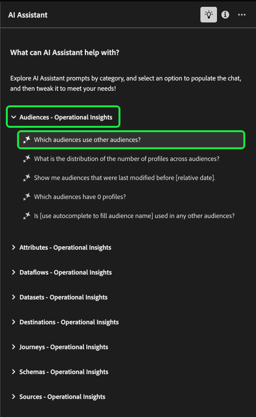

# AI Assistant UI 안내서

Adobe Experience Platform UI에서 AI Assistant를 사용하는 방법을 알려면 이 안내서를 참조하십시오.

## Experience Platform UI에서 AI 지원에 액세스

AI Assistant를 시작하려면 Experience Platform UI의 상단 헤더에서 **[!UICONTROL AI Assistant 아이콘]**&#x200B;을 선택합니다.

AI Assistant 인터페이스가 나타나고 시작하기 위한 정보가 즉시 제공됩니다. [!UICONTROL 아이디어 시작]에 제공된 옵션을 사용하여 다음과 같은 질문과 명령에 답변할 수 있습니다.

* [!UICONTROL 대상자 중 활성화된 대상이 무엇입니까?]
* [!UICONTROL 스키마란 무엇입니까?]
* [!UICONTROL Real-Time CDP에 대한 몇 가지 일반적인 사용 사례 설명]

## AI Assistant UI 안내서

>[!NOTE]
>
>다음 워크플로우는 경험 이벤트 스키마 생성 프로세스를 사용하여 Experience Platform UI 사용 시 AI Assistant를 사용하는 방법을 보여 주는 예제입니다.

**이벤트 스키마의 장치 거래**&#x200B;을 만드는 사용 사례를 고려하십시오. 경험 이벤트 스키마 만들기 프로세스 중에 `eventType` 필드가 표시됩니다. &quot;이제 워크플로우를 종료하고 [스키마 구성의 기본 사항](../xdm/schema/composition.md) 설명서를 참조하거나 AI Assistant를 사용하여 AI Assistant에서 권장하는 설명서 링크를 통해 질문에 대한 답변을 검색하고 추가 리소스를 찾을 수 있습니다.&quot;

시작하려면 제공된 텍스트 상자에 질문을 입력합니다. 아래 예에는 &quot;**ExperienceEvent 스키마의 eventType 필드는 무엇입니까?**&quot;라는 질문이 AI 도우미에 제공됩니다.

그런 다음 AI Assistant는 기술 자료를 쿼리하고 답을 계산합니다. 잠시 후 AI 도우미가 후속 프롬프트로 사용할 수 있는 답변 및 관련 제안을 반환합니다.

AI Assistant로부터 응답을 받은 후 여러 옵션 중에서 선택하여 진행할 방법을 결정할 수 있습니다.

### AI Assistant 기능 {#features}

이 섹션에서는 Experience Platform에서 작업 과정 중에 사용할 수 있는 AI Assistant의 다양한 기능에 대해 간략히 설명합니다.

### 운영 데이터 개체 보기 {#view-operational-data-objects}

쿼리에 따라 AI Assistant는 샌드박스의 데이터와 관련된 추가 정보를 제공합니다. 쿼리에 대한 응답이 특정 샌드박스에 어떻게 적용되는지 보려면 **[!UICONTROL 샌드박스에서]을(를) 선택하십시오.**

샌드박스와 관련된 데이터를 볼 때 AI Assistant는 쿼리된 데이터를 표시하는 특정 UI 페이지에 대한 직접 링크를 제공할 수 있습니다.

+++예를 보려면 선택

이 예에서 AI Assistant는 총 수 및 가장 일반적으로 사용되는 5개 필드를 포함하여 샌드박스의 기존 XDM 스키마에 대한 추가 정보를 반환합니다.

+++

### 인용 보기 {#view-citations}

모든 제품 지식 답변에 사용 가능한 인용을 검토하여 AI Assistant가 반환한 응답을 확인할 수 있습니다.

+++소스 표시 방법의 예를 보려면 선택

인용구를 보고 AI Assistant의 응답을 확인하려면 **[!UICONTROL 소스 표시]**&#x200B;를 선택하십시오.

AI Assistant는 인터페이스를 업데이트하며 초기 응답을 확증하는 설명서 링크를 제공합니다. 또한 인용이 활성화되면 AI Assistant는 제공된 설명서를 참조하는 답변의 특정 부분을 나타내기 위해 각주를 포함하도록 응답을 업데이트합니다.

AI Assistant가 **[!UICONTROL 관련 제안]**&#x200B;에서 제공하는 제안을 사용하여 원래 질문과 관련된 주제를 자세히 살펴볼 수도 있습니다.

+++

### 운영 인사이트 {#operational-insights}

AI Assistant가 작동 인사이트에 대한 질문에 충분히 응답하려면 활성 샌드박스 상태에 있어야 합니다.

+++Operational Insights 질문의 예를 보려면 선택

아래 예에서 AI 도우미에게 다음 쿼리가 표시됩니다. **&quot;Amazon S3 소스를 사용하여 만든 데이터 흐름 표시&quot;**.

그러면 AI Assistant가 데이터 흐름 및 해당 ID를 나열하는 테이블로 응답합니다. 전체 데이터 테이블을 보려면 오른쪽 상단의 확장 아이콘을 선택합니다.

확장된 테이블 보기가 표시되어 쿼리의 매개 변수를 기반으로 보다 포괄적인 데이터 흐름 목록을 제공합니다.

작동 인사이트 질문이 표시되면 AI Assistant는 답을 도출하는 방법에 대한 설명을 제공합니다. 아래 예에서 AI Assistant는 [!DNL Amazon S3] 소스를 사용하여 생성된 데이터 흐름을 식별하기 위해 수행한 단계를 간략하게 설명합니다.

질문에 대한 필터 및 수정 사항을 제공할 수도 있으며, AI Assistant가 사용자가 포함하는 필터를 기반으로 검색 결과를 렌더링하도록 할 수 있습니다. 예를 들어, AI Assistant에 생성된 날짜 순서로 세그먼트 정의 수 트렌드를 보여 달라고 요청하고, 총 프로필이 0인 세그먼트 정의를 제거하고, 데이터를 표시할 때 정수 대신 월 이름을 사용할 수 있습니다.

**참고:** Operational Insights 답변은 현재 Beta 버전입니다. AI Assistant 사용자 인터페이스에서 툴팁 아이콘을 선택하여 Beta 알림 및 설명서 링크를 확인합니다.

+++

### Operational Insights 응답 확인 {#verify-responses}

AI Assistant에서 제공하는 SQL 쿼리를 사용하여 운영 통찰력 질문과 관련된 각 응답을 확인할 수 있습니다.

+++Operational Insights 응답 확인 예를 보려면 선택

Operational Insights 질문에 대한 답변을 받은 후 **[!UICONTROL 원본 표시]**&#x200B;를 선택한 다음 **[!UICONTROL 원본 쿼리 보기]**&#x200B;를 선택하십시오.

작동 인사이트 질문으로 쿼리하면 AI Assistant는 사용자가 답을 계산하는 데 걸린 프로세스를 확인하는 데 사용할 수 있는 SQL 쿼리를 제공합니다. 이 원본 쿼리는 확인 목적으로만 사용되며 쿼리 서비스에서 지원되지 않습니다.

+++

### 자동 완성 사용 {#use-auto-complete}

자동 완성 기능을 사용하여 샌드박스에 있는 데이터 객체 목록을 수신할 수 있습니다. 자동 완성 권장 사항은 대상자, 스키마, 데이터 세트, 소스 및 대상 도메인에서 사용할 수 있습니다.

+++자동 완성의 예를 보려면 선택

쿼리에 더하기 기호(**`+`**)를 포함하여 자동 완성을 사용할 수 있습니다. 또는 텍스트 입력 상자 아래쪽에 있는 더하기 기호(**`+`**)를 선택할 수도 있습니다. 샌드박스의 권장 데이터 개체 목록이 표시된 창이 나타납니다.

+++

### 멀티턴 사용 {#use-multi-turn}

AI 어시스턴트의 멀티턴 기능을 활용해 경험 중 보다 자연스러운 대화가 가능하다. 주어진 후속 질문에 AI 비서가 답변할 수 있습니다. 그 맥락은 이전의 상호 작용으로부터 추론될 수 있다.

+++다중 회전의 예를 보려면 선택

아래 예에서는 먼저 AI Assistant에 총 데이터 흐름 수를 요청한 다음 가장 최근 데이터 흐름 10개를 나열하라는 메시지가 표시됩니다.

+++

### 새 대화 시작

AI Assistant를 사용하여 새 대화를 재설정 및 시작하여 주제를 변경할 수 있습니다.

+++대화 재설정의 예를 보려면 선택

재설정하려면 AI 도우미 인터페이스에서 줄임표(**`...`**)를 선택한 다음 **[!UICONTROL 새 대화 시작]**&#x200B;을 선택하십시오. 이를 통해 항목을 변경할 의도가 있음을 AI Assistant에 알려 주며, 실패하거나 잘못된 정보를 참조하는 쿼리 문제를 해결할 때 특히 도움이 될 수 있습니다.

+++

### 검색 기능 사용 {#use-discoverability}

AI Assistant의 검색 기능 기능을 사용하여 AI Assistant가 지원하는 엔티티로 그룹화된 일반 주제 목록을 볼 수 있습니다.

+++검색 기능의 예를 보려면 선택

검색 기능을 보려면 AI Assistant 인터페이스 상단 헤더에 있는 전구 아이콘을 선택합니다.

그런 다음 범주를 선택한 다음 제공된 목록에서 프롬프트를 선택합니다. 이 기능을 사용하면 AI Assistant가 답할 수 있는 질문 유형을 더 잘 이해할 수 있습니다. 자유 텍스트나 [자동 완성](#use-auto-complete)을 사용하여 샌드박스와 관련된 특정 세부 정보로 기존 프롬프트를 업데이트할 수도 있습니다.

+++

## 피드백 제공 {#feedback}

답변이 제공된 옵션을 사용하여 AI Assistant에서 사용자 경험에 대한 피드백을 제공할 수 있습니다.

피드백을 제공하려면 AI Assistant의 응답을 받은 후 엄지손가락 위로, 엄지손가락 아래로 또는 플래그를 선택한 다음 제공된 텍스트 상자에 피드백을 입력합니다.

+++더 많은 예제를 보려면 선택

>[!BEGINTABS]

>[!TAB 엄지손가락 위로]

썸네일 위로 아이콘을 선택하여 AI 어시스턴트와 함께 경험한 것에 대한 피드백을 제공합니다.

>[!TAB 엄지 손가락 아래로]

썸네일 아래쪽 아이콘을 선택하여 AI Assistant에 대한 경험을 기반으로 개선될 수 있는 사항에 대한 피드백을 제공합니다. 이 단계에서 경험에 대한 특정 설명을 제공할 수도 있습니다. 의견에 제공된 피드백은 매일 검토됩니다.

>[!TAB 플래그]

플래그 아이콘을 선택하여 AI Assistant를 사용한 사용자 경험에 대한 추가 보고서를 제공합니다.

>[!ENDTABS]

+++
