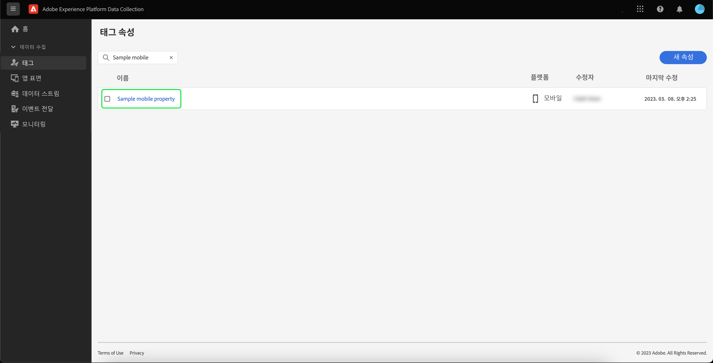

# Adobe Experience Platform Assurance의 확장 기능 구현

이 튜토리얼에서는 모바일 SDK에 Experience Platform Assurance 확장 기능을 설치하고 구현하는 방법을 설명합니다. 애플리케이션에 Assurance 확장 기능을 추가하는 방법에 대한 지침은 [Adobe Experience Platform Assurance 확장 기능 개요](https://developer.adobe.com/client-sdks/documentation/platform-assurance-sdk/#add-the-aep-assurance-extension-to-your-app)를 참조하십시오.

## 시작하기

Assurance 확장 기능을 설치하고 구현하려면 다음 서비스에 액세스해야 합니다.

- [Adobe Experience Platform 데이터 수집 UI](https://experience.adobe.com/#/data-collection/)
- [Adobe Experience Platform Assurance](https://experience.adobe.com/assurance)

## 모바일 속성을 만듭니다

>[!NOTE]
>
>이미 모바일 속성이 있는 경우 다음 단계로 진행할 수 있습니다.

데이터 수집 UI에서 **[!UICONTROL 태그]**&#x200B;를 선택합니다. 조직에 속한 속성에 대한 정보와 함께 모바일 및 웹 속성 목록이 표시됩니다. 새 속성을 생성하려면 **[!UICONTROL 새 속성]**&#x200B;을 선택합니다.

**[!UICONTROL 속성 만들기]** 페이지가 표시됩니다. 새 속성의 이름을 입력하고 플랫폼으로 **[!UICONTROL 모바일]**&#x200B;을 선택합니다. 세부 정보를 삽입한 후 **[!UICONTROL 저장]**&#x200B;을 선택하여 모바일 속성을 만듭니다.

>[!NOTE]
>
>모바일 속성의 **[!UICONTROL 개인정보 보호]** 설정은 Assurance의 데이터 수집에 영향을 주지 **않습니다**.

## Assurance 확장 기능 설치

Assurance 확장 기능을 설치하려는 모바일 속성을 선택합니다.

**모바일 속성 세부 정보** 페이지가 표시됩니다. **[!UICONTROL 확장 기능]**&#x200B;을 선택하여 현재 모바일 속성과 연결된 확장 목록을 표시합니다.

**[!UICONTROL 카탈로그]**&#x200B;를 선택하여 모바일 속성에 추가할 수 있는 확장 기능 목록을 확인합니다. 필터를 사용하여 **[!UICONTROL AEP Assurance]** 확장 기능을 찾은 다음 **[!UICONTROL 설치]**&#x200B;를 선택합니다.

## 다음 단계

이제 모바일 속성에 Assurance 확장 기능이 설치되었으므로 애플리케이션 내에서 Assurance를 사용할 수 있습니다. 애플리케이션에 Assurance 확장 기능을 추가하는 방법에 대한 자세한 내용은 [Adobe Experience Platform Assurance 확장 기능 개요](https://developer.adobe.com/client-sdks/documentation/platform-assurance-sdk/#add-the-aep-assurance-extension-to-your-app)를 참조하십시오. Assurance 사용 방법을 알아보려면 [Assurance 사용 안내서](./using-assurance.md)를 참조하십시오.
