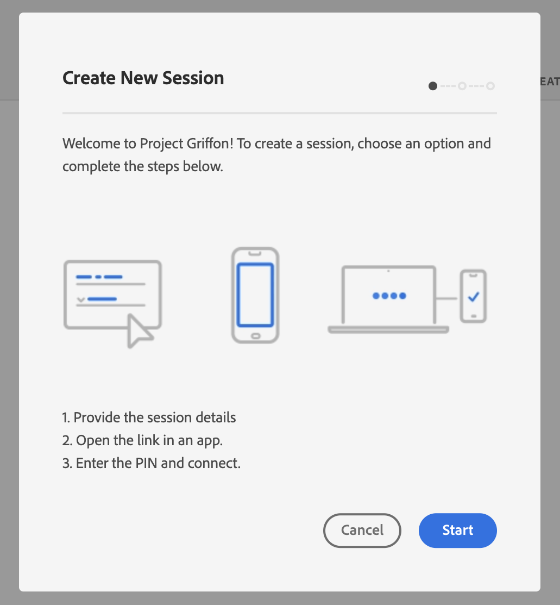
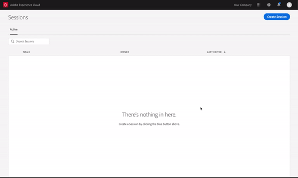

# Adobe Experience Platform Assurance 사용

이 튜토리얼에서는 Adobe Experience Platform Assurance 사용 방법을 설명합니다. Adobe Experience Platform Assurance 확장 설치 및 구현 방법에 대한 지침은 의 자습서를 참조하십시오. [assurance 확장 구현](./implement-assurance.md).

## 세션 만들기

에 로그인한 후 [보증 UI](https://experience.adobe.com/assurance)를 선택합니다. **[!UICONTROL 세션 만들기]** 을 클릭하여 세션 만들기를 시작합니다.

![[세션 생성] 버튼이 강조 표시되어 세션을 생성할 수 있는 위치를 보여 줍니다.](./images/using-assurance/create-session.png)

다음 **[!UICONTROL 새 세션 만들기]** 대화 상자가 나타납니다. 제공된 지침을 검토하고 을(를) 선택하여 진행하십시오. **[!UICONTROL 시작]**.

이제 이름을 입력하여 세션을 식별한 다음 을 제공할 수 있습니다. **[!UICONTROL 기본 URL]** (앱의 딥링크 URL). 이러한 세부 정보를 제공한 후 을(를) 선택합니다 **[!UICONTROL 다음]**.

>[!INFO]
>
>기본 URL은 URL에서 앱을 시작하는 데 사용되는 루트 정의입니다. Assurance 세션을 시작할 수 있는 세션 URL이 생성됩니다. 예제 값은 다음과 같습니다. `myapp://default` 다음에서 **[!UICONTROL 기본 URL]** 필드에 앱의 기본 딥링크 정의를 입력합니다.

## 세션에 연결

세션을 만든 후 다음을 확인합니다. **[!UICONTROL 새 세션 만들기]** 이제 대화 상자에 링크, QR 코드 및 PIN이 표시됩니다.

이 대화 상자가 나타나면 장치의 카메라 앱을 사용하여 QR 코드를 스캔하고 앱을 열거나 링크를 복사하여 앱에서 열 수 있습니다. 앱이 실행되면 PIN 입력 화면이 오버레이되어 표시됩니다. 이전 단계의 PIN을 입력하고 키를 누릅니다 **[!UICONTROL 연결]**.

Adobe Experience Platform 아이콘(빨간색 Adobe &quot;A&quot;)이 앱에 표시되면 앱이 Assurance에 연결되어 있는지 확인할 수 있습니다.

## 세션 내보내기

Assurance 세션을 내보내려면 앱의 세션 세부 정보 페이지에서 을 선택합니다. **[!UICONTROL JSON으로 내보내기]** 세션에서:

내보내기 옵션은 검색 필터 결과를 준수하며 이벤트 보기에 표시된 이벤트만 내보냅니다. 예를 들어 &quot;추적&quot; 이벤트를 검색한 다음 를 선택하는 경우 **[!UICONTROL JSON으로 내보내기]**, &quot;추적&quot; 이벤트 결과만 내보내집니다.
