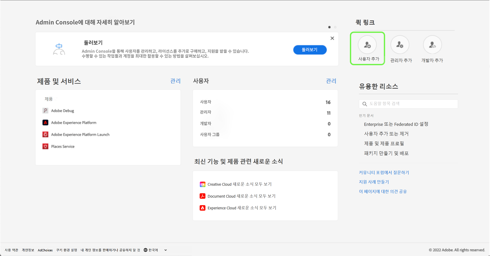
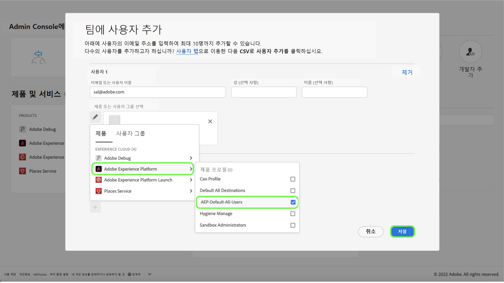

# 사용자 액세스

>[!WARNING]
>
>Assurance에 대한 사용자 액세스가 변경된다는 점에 유의하십시오. Assurance는 베타(Project Griffon)를 모든 Adobe Experience Cloud 고객에게 일반적으로(Assurance로) 제공하므로, Assurance에 대한 액세스는 [Admin Console](https://helpx.adobe.com/enterprise/using/admin-console.html)을 통해 관리됩니다
>
>도움이 필요한 경우 회사의 Adobe Experience Cloud 관리자에게 문의하십시오.

Assurance에 대한 중단 없는 액세스를 받거나 유지하려면 Admin Console에서 다음 단계를 완료해야 합니다.

## 제품 프로필을 통해 Experience Platform에 사용자 추가

제품 프로필에 사용자를 추가하려면 Admin Console에 로그인한 다음 **사용자 추가**&#x200B;를 선택합니다.

**팀에 사용자 추가** 대화 상자가 표시됩니다. 이 대화 상자에서 추가하려는 사용자의 세부 정보를 입력할 수 있습니다. 사용자의 이메일 주소, 이름(옵션) 및 성(옵션)을 입력합니다.

연필 아이콘을 선택하여 제품 및 사용자 그룹을 선택합니다. 여기에서 **Adobe Experience Platform**&#x200B;을 선택한 다음 **AEP-Default-All-Users**&#x200B;와 **저장**&#x200B;을 차례대로 선택합니다.

