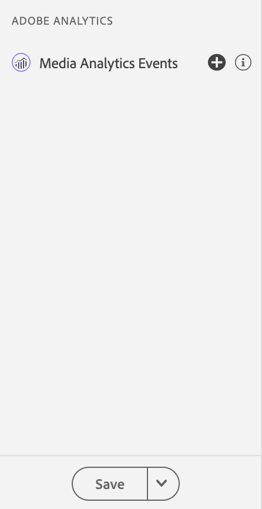

# Assurance에서 스트리밍 미디어용 Adobe Analytics 보기

스트리밍 미디어용 Adobe Analytics와 Adobe Experience Platform Assurance를 통합하여 이제 모바일 앱에서 Media Analytics 구현을 확인할 수 있습니다. Media Analytics 보기는 미디어 세션에서 추적되는 다음과 같은 내용을 표시합니다.

- 모든 콘텐츠 핵심 요소, 표준 메타데이터 및 사용자 정의 메타데이터 속성과 세션 종료 및 세션 완료 이벤트를 포함하는 세션 시작 이벤트.
- 모든 광고 속성이 첨부된 광고 브레이크 시작 및 광고 시작 이벤트와 두 가지 모두에 대한 건너뛰기 및 완료 이벤트.
- 모든 속성이 첨부된 챕터 시작, 챕터 건너뛰기 및 챕터 완료 이벤트.
- 모든 재생 변경 이벤트(재생, 일시 중지, 버퍼링, 오류, 비트율 변경).
- 모든 플레이어 상태 변경 추적 이벤트(시작, 종료).

Analytics에서 데이터가 처리되면 미디어 소요 시간 및 총 일시 중지 시간과 같은 후처리 상태 및 데이터도 이벤트 상세 보기에서 사용할 수 있습니다.

## 시작하기

계속하기 전에 다음 서비스가 있는지 확인하십시오.

- [Adobe Experience Platform 데이터 수집 UI](https://experience.adobe.com/#/data-collection/)
- [Adobe Experience Platform Assurance](https://experience.adobe.com/assurance)

애플리케이션에 Assurance를 설치하는 방법에 대한 내용은 [Assurance 구현 안내서](../tutorials/implement-assurance.md)를 참조하십시오.

## 스트리밍 미디어용 Adobe Analytics로 Assurance 사용

Adobe Analytics용 앱을 연결하고 설정하면 Streaming Media Analytics용으로 구성할 준비가 된 것입니다. 왼쪽 패널 하단에서 **[!UICONTROL 구성]**&#x200B;을 선택하여 Media Analytics Events 보기를 추가하고 **저장**&#x200B;합니다.

추가되면 **[!UICONTROL Adobe Analytics]** 섹션에서 **[!UICONTROL Media Analytics Events]** 보기를 선택하여 세션 추적을 확인합니다.

**[!UICONTROL Media Analytics Events]** 보기에서 세션 ID(VSID)로 검색 및 필터링하여 특정 미디어 세션을 볼 수 있습니다. 추가 이벤트 세부 정보를 보려면 특정 이벤트를 선택합니다.

API 호출을 더 간결하게 보기 위해 **[!UICONTROL 플레이헤드 업데이트 이벤트 숨기기]** 필터를 선택하여 플레이헤드 업데이트 이벤트를 숨길 수도 있습니다.

>[!INFO]
>
>후처리된 미디어 분석 데이터를 보려면 SDK 버전(Android Media 2.1.2 및 iOS AEPMedia 3.0.1 이상)을 사용해야 합니다.

사후 처리된 데이터를 보려면 세션 시작 이벤트를 찾아 상태 열에서 세션이 완료되었는지 확인하십시오. 완료되면 이벤트를 클릭하여 이벤트 상세 보기에서 미디어 세션 요약을 봅니다. 자세한 내용은 아래로 스크롤하여 후처리된 세부 정보를 찾으십시오.

