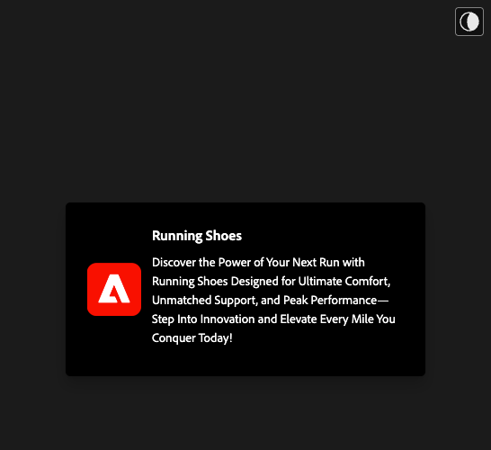
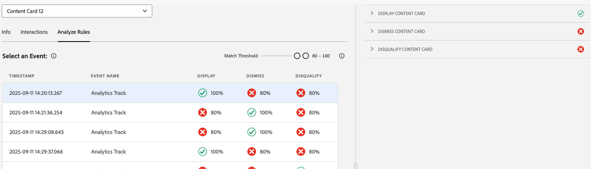
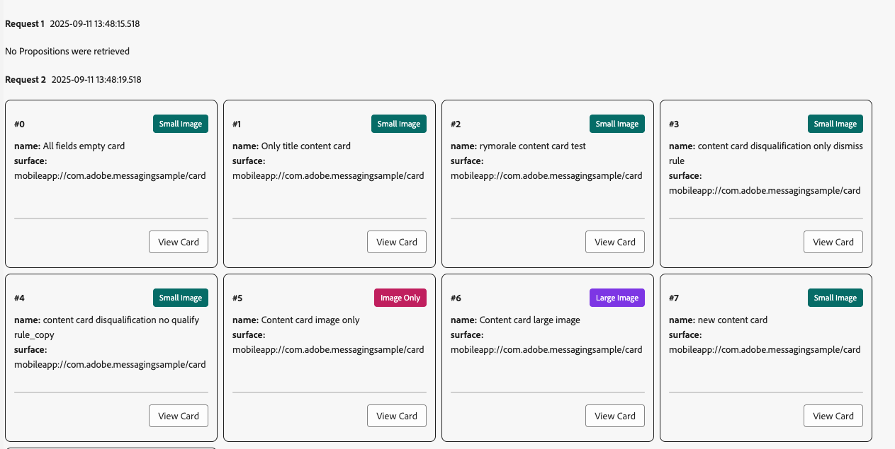

# Assurance의 컨텐츠 카드 보기

Adobe Experience Platform Assurance 내의 인앱 메시지 보기는 앱의 유효성을 검사하고, 장치에 제공되는 콘텐츠 카드를 모니터링하고, 카드를 미리 보는 기능을 제공합니다.

## 콘텐츠 카드

**[!UICONTROL 콘텐츠 카드]** 탭의 맨 위에는 **[!UICONTROL 콘텐츠 카드]** 드롭다운이 있습니다. 이 목록에는 Assurance 세션에서 받은 모든 콘텐츠 카드가 나열됩니다. 카드가 이 목록에 없으면 앱이 받은 적이 없다는 의미입니다.

콘텐츠 카드를 선택하면 아래 섹션에 설명된 대로 해당 카드에 대한 많은 정보가 표시됩니다.

### 카드 미리 보기

오른쪽 패널의 **[!UICONTROL 카드 미리 보기]** 창에는 카드가 일반 템플릿(작은 이미지, 큰 이미지 및 이미지만)에서 렌더링되는 방식이 표시됩니다.

**[!UICONTROL 테마]** 전환을 사용하여 카드를 밝은 모드 또는 어두운 모드로 봅니다.

### 사용 가능한 탭

왼쪽 섹션에서 사용 가능한 탭은 선택한 카드에 따라 다릅니다. 카드에 규칙이 포함된 경우 **[!UICONTROL 정보]**, **[!UICONTROL 상호 작용]** 및 **[!UICONTROL 규칙 분석]**&#x200B;의 세 가지 탭이 표시됩니다.

카드에 규칙이 포함되어 있지 않으면 **[!UICONTROL 정보]** 및 **[!UICONTROL 상호 작용]** 탭이 표시됩니다.

### 정보 탭

**[!UICONTROL 정보]** 탭에는 **[!UICONTROL 현재 상태]**(트리거, 표시, 해제, 자격 상실)에 대한 배지와 **[!UICONTROL 템플릿]**(작은 이미지, 큰 이미지 또는 이미지 전용), **[!UICONTROL 표면]** 및 사용자 지정 키-값 쌍과 같은 메타 세부 정보가 포함된 **[!UICONTROL 카드 속성]** 섹션이 맨 위에 표시됩니다.

그 아래에 **[!UICONTROL 캠페인 속성]** 섹션에는 Adobe Journey Optimizer(AJO)에서 로드된 정보가 표시됩니다.

**[!UICONTROL 캠페인 보기]**&#x200B;를 선택하여 검사 또는 편집을 위해 AJO에서 카드를 열 수도 있습니다.

### 상호 작용 탭

**[!UICONTROL 상호 작용]** 탭은 각 카드의 라이프사이클을 배지의 시퀀스로 요약합니다. **[!UICONTROL 트리거]**&#x200B;로 항상 시작하고, 그 뒤에는 규칙이 생성되는 결과가—**[!UICONTROL 표시]**, **[!UICONTROL 해제]** 또는 **[!UICONTROL 자격 상실]**&#x200B;됩니다.

### 규칙 분석 탭

**[!UICONTROL 분석]** 탭에는 카드의 규칙에 따라 최대 세 개의 규칙 열(**[!UICONTROL 표시]**, **[!UICONTROL 해제]** 및 **[!UICONTROL 자격 취소]**)이 있는 이벤트 테이블이 표시됩니다. 카드가 하나의 규칙만 정의하는 경우 해당 열만 표시됩니다.

각 행은 세션 이벤트를 나타내며, 각 열은 카드의 규칙이 해당 이벤트 조건과 일치하는지 여부를 나타냅니다. 0% 점수는 일치하는 조건이 없음을 의미합니다. 100%는 전체 일치입니다(규칙이 실행됨).

이벤트가 조건과 일치하면 녹색 확인 표시가 나타납니다. 이벤트가 일치하지 않으면 빨간색 아이콘이 표시됩니다.

**[!UICONTROL 일치 임계값]** 슬라이더를 사용하여 최소 일치 비율에 따라 이벤트를 필터링합니다.

이벤트를 선택하면 오른쪽에 세부 정보 패널이 열리고 **[!UICONTROL 표시]**, **[!UICONTROL 취소]** 및 **[!UICONTROL 자격 취소]**&#x200B;의 세 가지 규칙이 나열됩니다.

섹션을 확장하여 규칙의 조건, 일치하는 조건 및 해당 결과에 대한 계산된 일치 백분율을 확인합니다.

## 요청 탭

**[!UICONTROL 요청]** 탭에는 요청된 콘텐츠 카드와 해당 표면이 표시됩니다.

**[!UICONTROL 카드 보기]** 단추를 사용하여 특정 콘텐츠 카드의 정보 탭으로 돌아갑니다.

## 이벤트 목록 탭

**[!UICONTROL 이벤트 목록]** 탭에는 AJO 제안 요청/응답, 카드 라이프사이클 이벤트 및 상호 작용 추적을 포함하여 콘텐츠 카드와 관련된 세션 이벤트가 표시됩니다. 열을 검색, 필터링, 정렬 및 사용자 정의하고 결과를 내보낼 수 있습니다.

이벤트를 선택하면 원시 페이로드 및 키 속성이 있는 오른쪽 세부 정보 패널이 열립니다. 추가 작업을 위해 이벤트에 플래그를 지정할 수도 있습니다. 이 보기는 요청, 규칙 결과 및 세션 간 상호 작용의 상관 관계를 분석하는 데 유용합니다.

## 유효성 검사 탭

**[!UICONTROL 유효성 검사]** 탭은 현재 세션에 대한 유효성 검사를 실행하여 앱이 메시징에 대해 올바르게 구성되었는지 확인합니다.

