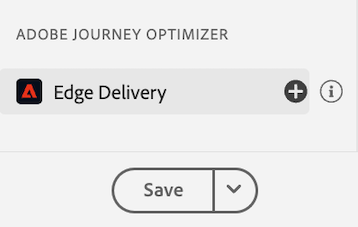

# Assurance의 Edge 게재 보기

다음 **[!UICONTROL Edge 게재]** 내부 보기 **[!UICONTROL Adobe Experience Platform 보증]** 검사 및 유효성 검사 기능 제공 [!UICONTROL AJO 인바운드] 웹 및 모바일 앱에 대한 메시지 에지 전달. 이 보기는 게재 문제 해결에 특히 유용합니다. [!UICONTROL AJO 인바운드] 웹 및 모바일 캠페인 및 여정.

## 시작하기

계속하기 전에 다음 서비스에 액세스할 수 있는지 확인하십시오.

- [Adobe Experience Platform 데이터 수집 UI](https://experience.adobe.com/#/data-collection/)
- [Adobe Experience Platform Assurance](https://experience.adobe.com/assurance)

설치 방법을 알아보려면 **[!UICONTROL 보증]** 응용 프로그램에서 다음을 읽으십시오. [assurance 구현 안내서](../tutorials/implement-assurance.md).

## Edge 게재와 함께 보증 사용

을(를) 열면 **[!UICONTROL 보증]** 세션을 추가할 수 있습니다. **[!UICONTROL Edge 게재]** 보기 대상 **[!UICONTROL 보증]**. 왼쪽 패널 하단에서 을 선택합니다. **[!UICONTROL 구성]** 을(를) 추가하려면 **[!UICONTROL Edge 게재]** 보기 및 **저장** 그래.

추가되면 다음을 선택합니다. **[!UICONTROL Edge 게재]** 다음에서 보기 **[!UICONTROL Adobe Journey Optimizer]** 인바운드 에지 전달의 유효성을 검사하는 섹션입니다.

## 요청 목록

보기의 기본 창에 Edge 게재 요청 목록이 표시됩니다. 이 목록에는 모든 항목이 표시됩니다. [!UICONTROL 인바운드 AJO] experience Edge에 대한 요청 및 다음을 통해 처리됨 **[!UICONTROL 인바운드 게재 서비스]**, 개인화 의사 결정을 검색하는 요청과 개인화 제안 상호 작용(예: 표시, 클릭, 트리거 또는 닫기)을 추적하는 요청이 포함됩니다.

요청은 타임스탬프를 기준으로 정렬되며, 가장 최근 요청은 맨 위에 있습니다. 목록에는 타임스탬프 외에도 요청 ID 열과 다음 중 하나가 될 수 있는 요청 유형도 포함됩니다.

- **[!UICONTROL 경험 전달]**: 개인화 의사 결정 검색 요청
- **[!UICONTROL 경험 상호 작용]**: 개인화 제안 상호 작용을 추적하기 위한 요청
- **[!UICONTROL 경험 전달 및 상호 작용]**: 개인화 제안 상호 작용도 포함하는 개인화 결정을 검색하기 위한 요청입니다
- **[!UICONTROL 게재 미리 보기]**: 개인화 결정 미리보기 검색 요청

목록 상단의 검색 막대에 검색어를 입력하여 요청을 필터링할 수도 있습니다. 이 기능은 ID와 같은 특정 값으로 필터링할 때 유용합니다.

## 자세한 요청 보기

기본 보기에서 요청을 선택하면 선택한 요청에 대한 자세한 정보가 오른쪽에 표시됩니다. 이 보기에는 다음 섹션이 포함됩니다.

### 요청 개요

이 섹션에서는 다음을 포함하여 선택한 요청에 대한 높은 수준의 개요를 제공합니다 [!UICONTROL 조직 ID], [!UICONTROL 에지 클러스터], [!UICONTROL 요청 ID] 및 [!UICONTROL 요청 유형], [!UICONTROL 샌드박스 ID], [!UICONTROL 샌드박스 이름], [!UICONTROL 데이터 스트림 ID], 및 을 사용하는 경우의 요청 표면 목록 [!UICONTROL 경험 전달] 요청.

### 프로필

이 섹션에서는 ID 맵, 세그먼트 멤버십 및 동의 설정을 포함하여 요청을 처리할 때 사용되는 프로필 데이터에 대한 정보를 제공합니다.\
다음 [!UICONTROL 프로필] 섹션은 누락되거나 지연된 세그먼트 멤버십 또는 옵트아웃 동의 설정으로 인해 게재가 예상대로 작동하지 않는 문제를 해결할 때 매우 유용합니다.

### 적격 활동

이 섹션에서는 활동 유형, ID, ID 네임스페이스, 표면, 일정 및 대상을 포함하여 선택한 요청에 대해 정규화된 활동 목록을 제공합니다. 활동에 대한 자세한 내용은 [원시 실행 추적 섹션](#execution).

### 부적격 활동

이 섹션에서는 자격이 부여되지 않은 활동 목록을 제공합니다. 활동 유형, ID, ID 네임스페이스, 표면, 일정 및 대상 외에도 이 섹션에는 활동이 정규화되지 않은 이유 목록도 포함됩니다.

### 메시지 세부 정보

이 섹션에서는 선택한 요청에 대해 전달된 메시지에 대한 자세한 정보를 제공합니다. 여기에는 메시지 ID, 조각, 의사 결정 정책 및 [!UICONTROL Offer decisioning] 매개 변수 및 메시지 선택 컨텍스트가 포함됩니다.

### 인터랙션

이 섹션에서는 선택한 요청에서 추적된 상호 작용에 대한 자세한 정보를 제공합니다. 여기에는 상호 작용 유형(아래)이 포함됩니다. `propositionEventType`)과 연결된 제안 메타데이터(예: 활동 메타데이터) `scopeDetails.activity`) 및 제안 이벤트 토큰(에서 `scopeDetails.characteristics.eventToken`).

### 원시 추적

이 섹션에서는 선택한 요청의 원시 추적을 제공합니다. 여기에는 실제 요청이 수신된 경우를 포함하여 요청의 전체 추적이 포함됩니다 **[!UICONTROL 인바운드 게재 서비스]**, 실행 추적 및 응답 추적. 이 기능은 배달 서비스를 사용할 수 없거나 데이터가 누락되거나 잘못되어 배달이 예상대로 작동하지 않는 것과 같은 고급 문제 해결이나 요청 처리의 전체 흐름을 이해하는 데 유용합니다.

#### 요청

요청 추적에 전체 요청이 포함되었습니다. **[!UICONTROL 인바운드 게재 서비스]** **[!UICONTROL 콘토르스]** 업스트림. 여기에는 요청 헤더, 본문 및 기타 메타데이터가 포함됩니다. 예를 들어 요청의 XDM 페이로드는에서 검사할 수 있습니다. `event.body.xdm` 필드.

#### 실행

실행 추적에는 요청이 처리되었을 때의 전체 추적 요청이 포함됩니다. **[!UICONTROL 인바운드 게재 서비스]**. 실행 컨텍스트, 활동 자격, 메시지 선택 및 기타 처리 단계를 표시합니다. 요청을 처리하는 동안 발생한 오류 또는 경고는에서 찾을 수 있습니다. `context.messages` 및 `context.exceptions` 필드. 자세한 활동 자격 정보는 `context.qualifiedActivitiesDetailed` 및 `context.unqualifiedActivitiesDetailed` 필드.

#### 응답

응답 추적에는에서 반환된 전체 응답이 포함됩니다. **[!UICONTROL 인바운드 게재 서비스]** 다운스트림 대상 **[!UICONTROL 콘토르스]**. 여기에는 응답 헤더, 본문 및 기타 메타데이터가 포함됩니다. 전체 응답 본문은 ID가 있는 메시지를 복사하여 검사할 수 있습니다. `1` 를 사용하여 클립보드에 **[!UICONTROL 값 복사]** 버튼을 누르고 JSON 뷰어에 붙여 넣습니다.

