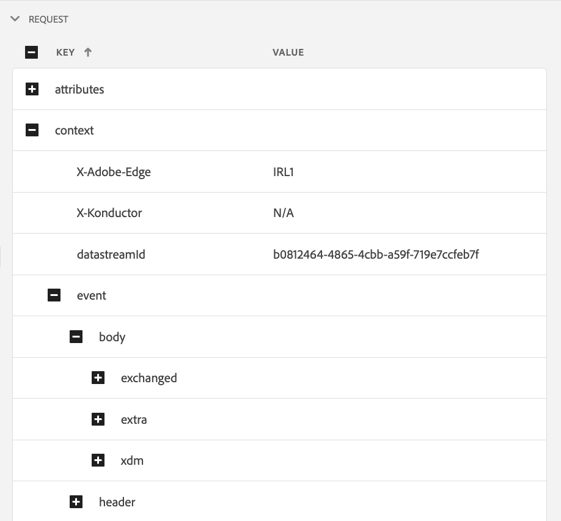

# Assurance의 Edge Delivery 보기

**[!UICONTROL Edge Delivery Assurance]** 내의 **[!UICONTROL Adobe Experience Platform]** 보기는 [!UICONTROL AJO 인바운드] Edge 메시지 배달을 검사하고 유효성을 검사하는 기능을 제공합니다. 이 보기는 [!UICONTROL AJO 인바운드] 웹 및 모바일 캠페인과 여정의 배달 문제를 해결하는 데 특히 유용합니다.

## 시작하기

계속하기 전에 다음 서비스에 액세스할 수 있는지 확인하십시오.

- [Adobe Experience Platform 데이터 수집 UI](https://experience.adobe.com/#/data-collection/)
- [Adobe Experience Platform Assurance](https://experience.adobe.com/assurance)

응용 프로그램에 **[!UICONTROL Assurance]**&#x200B;을(를) 설치하는 방법을 알아보려면 [Assurance 구현 가이드](../tutorials/implement-assurance.md)를 참조하십시오.

## Edge Delivery에서 보증 사용

**[!UICONTROL Assurance]** 세션을 열면 **[!UICONTROL Edge Delivery]** 보기를 **[!UICONTROL Assurance]**&#x200B;에 추가할 수 있습니다. 왼쪽 패널 하단에서 **[!UICONTROL 구성]**&#x200B;을 선택하여 **[!UICONTROL Edge Delivery]** 보기를 추가하고 **저장**&#x200B;합니다.

![왼쪽 아래에서 [구성]을 선택하여 플러그인을 추가하십시오.](./images/edge-delivery/add-plugin.png)

추가되면 **[!UICONTROL Edge Delivery]** 섹션에서 **[!UICONTROL Adobe Journey Optimizer]** 보기를 선택하여 인바운드 에지 배달의 유효성을 검사합니다.

## 요청 목록

보기의 기본 창에 Edge 게재 요청 목록이 표시됩니다. 이 목록에는 개인화 결정을 검색하고 개인화 제안 상호 작용(예: 표시, 클릭, 트리거 또는 닫기)을 추적하기 위한 요청을 포함하여 Experience Edge에 대해 수행되고 **[!UICONTROL 인바운드 배달 서비스]**&#x200B;에서 처리된 모든 [!UICONTROL 인바운드 AJO] 요청이 표시됩니다.

요청은 타임스탬프를 기준으로 정렬되며, 가장 최근 요청은 맨 위에 있습니다. 목록에는 타임스탬프 외에도 요청 ID 열과 다음 중 하나가 될 수 있는 요청 유형도 포함됩니다.

- **[!UICONTROL 경험 게재]**: 개인화 결정 검색 요청
- **[!UICONTROL 경험 상호 작용]**: 개인화 제안 상호 작용을 추적하는 요청
- **[!UICONTROL 경험 전달 및 상호 작용]**: 개인화 제안 상호 작용도 포함하는 개인화 결정을 검색하기 위한 요청입니다.
- **[!UICONTROL 게재 미리 보기]**: 미리 보기 개인화 결정 검색 요청

목록 상단의 검색 막대에 검색어를 입력하여 요청을 필터링할 수도 있습니다. 이 기능은 ID와 같은 특정 값으로 필터링할 때 유용합니다.

## 자세한 요청 보기

기본 보기에서 요청을 선택하면 선택한 요청에 대한 자세한 정보가 오른쪽에 표시됩니다. 이 보기에는 다음 섹션이 포함됩니다.

### 요청 개요

이 섹션에서는 [!UICONTROL 조직 ID], [!UICONTROL Edge 클러스터], [!UICONTROL 요청 ID] 및 [!UICONTROL 요청 유형], [!UICONTROL 샌드박스 ID], [!UICONTROL 샌드박스 이름], [!UICONTROL 데이터스트림 ID] 및 [!UICONTROL Experience Delivery] 요청의 경우 요청 표면 목록을 포함하여 선택한 요청에 대한 높은 수준의 개요를 제공합니다.

### 프로필

이 섹션에서는 ID 맵, 세그먼트 멤버십 및 동의 설정을 포함하여 요청을 처리할 때 사용되는 프로필 데이터에 대한 정보를 제공합니다.\
[!UICONTROL 프로필] 섹션은 누락되거나 지연된 세그먼트 멤버십 또는 옵트아웃 동의 설정으로 인해 게재가 예상대로 작동하지 않는 문제를 해결할 때 매우 유용합니다.

### 적격 활동

이 섹션에서는 활동 유형, ID, ID 네임스페이스, 표면, 일정 및 대상을 포함하여 선택한 요청에 대해 정규화된 활동 목록을 제공합니다. 활동에 대한 자세한 내용은 [원시 실행 추적 섹션](#execution)에서 확인할 수 있습니다.

### 부적격 활동

이 섹션에서는 자격이 부여되지 않은 활동 목록을 제공합니다. 활동 유형, ID, ID 네임스페이스, 표면, 일정 및 대상 외에도 이 섹션에는 활동이 정규화되지 않은 이유 목록도 포함됩니다.

### 메시지 세부 정보

이 섹션에서는 선택한 요청에 대해 전달된 메시지에 대한 자세한 정보를 제공합니다. 여기에는 메시지 ID, 조각, 의사 결정 정책, [!UICONTROL Offer decisioning] 매개 변수와 메시지 선택 컨텍스트가 포함됩니다.

### 인터랙션

이 섹션에서는 선택한 요청에서 추적된 상호 작용에 대한 자세한 정보를 제공합니다. 여기에는 상호 작용 유형(`propositionEventType` 아래)과 활동 메타데이터(`scopeDetails.activity` 아래) 및 제안 이벤트 토큰(`scopeDetails.characteristics.eventToken`의)과 같은 연결된 제안 메타데이터가 포함됩니다.

### 원시 추적

이 섹션에서는 선택한 요청의 원시 추적을 제공합니다. 여기에는 **[!UICONTROL 인바운드 배달 서비스]**&#x200B;에서 받은 실제 요청, 실행 추적 및 응답 추적을 포함하여 요청의 전체 추적이 포함됩니다. 이 기능은 배달 서비스를 사용할 수 없거나 데이터가 누락되거나 잘못되어 배달이 예상대로 작동하지 않는 것과 같은 고급 문제 해결이나 요청 처리의 전체 흐름을 이해하는 데 유용합니다.

#### 요청

**[!UICONTROL 인바운드 배달 서비스]** **[!UICONTROL 콘덕터]** 업스트림에서 받은 요청 추적에 전체 요청이 포함됩니다. 여기에는 요청 헤더, 본문 및 기타 메타데이터가 포함됩니다. 예를 들어 요청의 XDM 페이로드는 `event.body.xdm` 필드에서 검사할 수 있습니다.

#### 실행

**[!UICONTROL 인바운드 배달 서비스]**&#x200B;에서 처리된 요청의 전체 추적이 실행 추적에 포함됩니다. 실행 컨텍스트, 활동 자격, 메시지 선택 및 기타 처리 단계를 표시합니다. 요청을 처리하는 동안 발생한 모든 오류 또는 경고는 `context.messages` 및 `context.exceptions` 필드에서 찾을 수 있습니다. 자세한 활동 자격 정보는 `context.qualifiedActivitiesDetailed` 및 `context.unqualifiedActivitiesDetailed` 필드에서 찾을 수 있습니다.

#### 응답

**[!UICONTROL 인바운드 배달 서비스]** 다운스트림에서 **[!UICONTROL 콘덕터]**(으)로 반환되었으므로 응답 추적에 전체 응답이 포함됩니다. 여기에는 응답 헤더, 본문 및 기타 메타데이터가 포함됩니다. **[!UICONTROL 값 복사]** 단추를 사용하여 ID가 `1`인 메시지를 클립보드에 복사한 다음 JSON 뷰어에 붙여 넣으면 전체 응답 본문을 검사할 수 있습니다.

