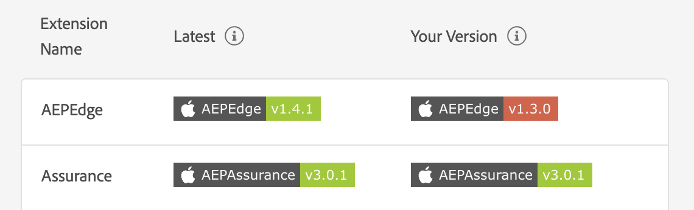

# 확장 버전 보기

확장 버전 보기를 사용하면 설치한 Adobe Experience Platform 모바일 확장 및 Assurance 세션에 연결된 클라이언트에서 최신 상태인 경우 빠르게 순서를 지정하고 볼 수 있습니다.

## 확장 버전 보기 시작

후 [보증 설정](../tutorials/implement-assurance.md)에서 **홈** 보기, 선택 **[!UICONTROL 확장 버전]**

## 버전이 최신 상태인지 확인하십시오

이 보기 내에서는 테이블에 각 Mobile SDK의 최신 버전과 설치한 현재 버전(해당하는 경우)이 모두 표시됩니다. 버전이 최신 버전과 동기화되면 설치된 버전에 녹색 배지가 표시됩니다. 그렇지 않으면 배지가 빨간색으로 표시됩니다.

## 버전 내보내기

보기의 오른쪽 위에서 을 선택할 수 있습니다 **[!UICONTROL 버전 내보내기]** 이 구성 요소는 클라이언트가 사용하는 플랫폼뿐만 아니라 모든 확장 정보가 있는 JSON 페이로드를 제공합니다. 이 데이터를 JSON 파일로 내보내거나 클립보드에 복사할 수 있습니다.

