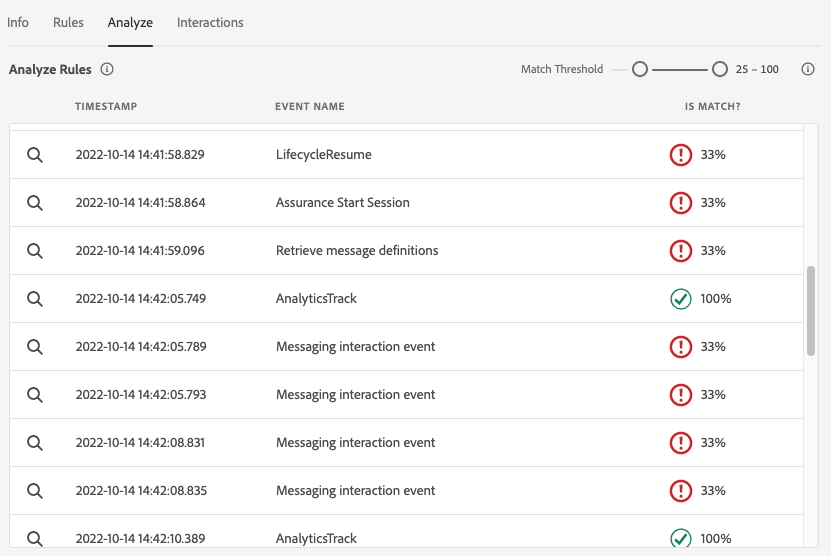

# Assurance의 인앱 메시지 보기

Adobe Experience Platform Assurance 내의 인앱 메시지 보기는 앱의 유효성을 검사하고, 장치에 전달되는 인앱 메시지를 모니터링하고, 장치에 대한 메시지를 시뮬레이션하는 기능을 제공합니다.

## 장치의 메시지

의 맨 위에 **[!UICONTROL 장치의 메시지]** 탭은 **[!UICONTROL 메시지]** 드롭다운입니다. 보증 세션에서 받은 모든 메시지가 여기에 포함됩니다. 메시지가 이 목록에 없으면 앱이 메시지를 받지 못한 것입니다.


메시지를 선택하면 아래 섹션에 설명된 대로 해당 메시지에 대한 많은 정보가 표시됩니다.

### 메시지 미리 보기

오른쪽 패널에는 **[!UICONTROL 메시지 미리 보기]** 창 - 메시지 미리 보기를 표시합니다. 선택 **[!UICONTROL 장치에서 시뮬레이션]** 는 현재 세션에 연결된 모든 장치에 해당 메시지를 보냅니다.


### 메시지 비헤이비어

아래 **[!UICONTROL 메시지 미리 보기]** 창은 **[!UICONTROL 메시지 비헤이비어]** 탭. 메시지 표시 방법에 대한 모든 세부 정보가 여기에 있습니다. 이 정보에는 위치 정보, 애니메이션, 스와이프 제스처 및 모양 설정이 포함됩니다.


### 정보 탭

왼쪽 섹션에는 메시지에 대한 세부 사항을 보여주는 4개의 탭이 있습니다. 다음 **[!UICONTROL 정보]** 탭에는 메시지 캠페인에 대해 Adobe Journey Optimizer(AJO)에서 로드한 정보가 표시됩니다.

다음을 선택할 수도 있습니다. **[!UICONTROL 캠페인 보기]** 검사 또는 편집을 위해 AJO에서 메시지를 엽니다.


### 규칙 탭

다음 **[!UICONTROL 규칙]** 탭에는 이 메시지를 표시하기 위해 필요한 작업이 표시됩니다. 이를 통해 메시지가 표시되도록 트리거할 요소를 정확하게 파악할 수 있습니다. 이 예제를 살펴보십시오.


이 예는 규칙에 대한 세 가지 조건을 보여 줍니다. 이벤트 목록, 분석 탭 또는 타임라인에서 이벤트를 선택하면 해당 이벤트가 이러한 규칙에 대해 평가됩니다. 이벤트가 조건과 일치하면 녹색 확인 표시가 나타납니다.


이벤트가 일치하지 않으면 빨간색 아이콘이 표시됩니다.


세 가지 조건이 모두 현재 이벤트와 일치하는 경우 메시지가 표시됩니다.

### 분석 탭

다음 **[!UICONTROL 분석]** 탭에서는 규칙에 대한 추가 인사이트를 제공합니다. 여기에서는 메시지 규칙이 이벤트와 일치하는 정도를 기준으로 세션의 모든 이벤트를 필터링합니다.



의 예에서 **[!UICONTROL 규칙 탭]** 섹션에는 세 가지 조건이 있습니다. 이 탭은 각 이벤트가 일치하는 규칙의 비율을 보여 줍니다. 대다수 종목은 33%(3가지 조건 중 하나)로 일치하며, 나머지 종목은 100%로 일치한다.

따라서 일치에 가깝지만 규칙과 완전히 일치하지 않는 이벤트를 찾을 수 있습니다.


다음 **[!UICONTROL 일치 임계값]** 슬라이더를 사용하면 표시할 이벤트를 필터링할 수 있습니다. 예를 들어 50% - 90%로 설정하여 세 가지 조건 중 정확히 두 가지 조건과 일치하는 이벤트 목록을 가져올 수 있습니다.

### 상호 작용 탭

다음 **[!UICONTROL 상호 작용]** 탭에는 추적 목적으로 Edge로 전송된 상호 작용 이벤트 목록이 표시됩니다.


일반적으로 메시지가 표시될 때마다 네 가지 상호 작용 이벤트가 있습니다.

```
trigger > display > interact > dismiss
```

&quot;상호 작용&quot; 상호 작용에는 추가 &quot;작업&quot; 값이 연결되어 있습니다. 가능한 값에는 &quot;클릭됨&quot; 또는 &quot;취소&quot;가 포함됩니다.

유효성 검사 열에는 상호 작용 이벤트가 Edge에서 제대로 수신되고 처리되었는지 여부가 표시됩니다.

## 유효성 검사

다음 **[!UICONTROL 유효성 검사]** 탭에서는 현재 세션에 대한 유효성 검사를 실행하여 앱이 인앱 메시지에 대해 올바르게 구성되었는지 확인합니다.


오류가 발견되면 해당 오류를 수정하는 방법에 대한 세부 정보가 제공됩니다.

## 이벤트 목록


다음 **[!UICONTROL 이벤트 목록]** 탭에서는 인앱 메시지와 관련된 Assurance 세션의 모든 이벤트를 간략하게 살펴봅니다. 여기에서 볼 수 있는 일부 이벤트는 다음과 같습니다.

* 메시지 검색을 위한 요청 및 응답
* 메시지 이벤트 표시
* 상호 작용 추적 이벤트

이 보기에서 검색 적용, 필터 적용, 열 추가 또는 제거, 데이터 내보내기 등 많은 표준 이벤트 목록 기능을 사용할 수 있습니다.

이벤트를 선택하여 오른쪽 패널에서 이벤트의 원시 세부 사항을 확인합니다.

오른쪽 세부 정보 패널에서 선택한 이벤트에 플래그를 지정할 수 있습니다. 이는 다른 사용자가 검토해야 하는 항목을 표시하는 데 유용합니다.
