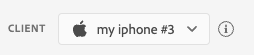
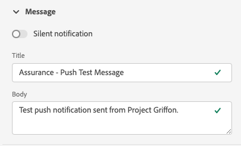

# 푸시 디버그 보기

Adobe Experience Platform Assurance 내의 푸시 디버그 보기는 앱에 대한 푸시 설정의 유효성을 검사하고 디바이스에 테스트 메시지를 보내는 기능을 제공합니다.

## 클라이언트

클라이언트 드롭다운에는 Assurance 세션에 연결된 고유한 각 클라이언트 목록이 있습니다. 클라이언트는 고유 디바이스이거나 디바이스에 대한 고유한 앱 설치입니다. 예를 들어 Android 디바이스와 iOS 디바이스가 세션에 연결된 경우 해당 클라이언트는 클라이언트 드롭다운에 표시됩니다.

디바이스에 앱을 다시 설치하고 다시 연결하면 다른 클라이언트가 표시됩니다. 해당 이름을 가진 디바이스가 이미 있는 경우 새 드롭다운에서 이름에 #2를 추가합니다.

이 보기는 단일 클라이언트에 대해서만 활성화되므로 다른 클라이언트를 선택하면 화면의 세부 정보가 변경됩니다.

## 설정 유효성 검사

**[!UICONTROL 설정 유효성 검사]**&#x200B;탭은 앱의 푸시 설정에 대한 추가 세부 정보를 확인하고 제공합니다. 유효성 검사를 수행하는 세 개의 패널이 있습니다. 유효성 검사가 모두 성공하면 녹색 확인 표시가 표시됩니다. 세 개의 녹색 확인 표시가 있는 경우 앱이 푸시 메시지에 대해 올바르게 구성되었으며 푸시 토큰을 사용자 프로필에 쓰고 관련 채널 구성이 구성되어 있습니다.

예상대로 작동하지 않는 경우 해당 문제를 해결하는 방법에 대한 세부 정보가 포함된 경고가 표시됩니다.

### 클라이언트 세부 정보

이 패널은 디바이스가 올바르게 구성되었는지 확인합니다. 여기에는 데이터 수집 UI의 확장 구성, 애플리케이션에서 확장 기능 및 필수 구성 요소 초기화, 디바이스에서 푸시 토큰 캡처가 포함됩니다.

유효한 경우 패널에 디바이스의 ECID, 푸시 토큰, Edge 샌드박스 이름 및 유형이 표시됩니다.

### 프로필 세부 정보

클라이언트가 올바르게 설정되면 이 패널에서 디바이스가 프로필에 쓰고 있는지 확인합니다. 또한 프로필의 푸시 토큰이 디바이스의 푸시 토큰과 일치하는지 확인합니다.

유효한 경우 패널에 디바이스의 ECID, 푸시 토큰, 애플리케이션의 앱 ID, 메시지 플랫폼 및 푸시 토큰이 거부 목록에 있는지 여부가 표시됩니다. 토큰은 사용자가 앱을 제거했거나 사용자가 앱에 대한 푸시 메시지를 비활성화한 것과 같은 여러 이유로 거부될 수 있습니다.

마지막으로 패널 하단에는 이 특정 프로필을 새 탭에서 여는 링크가 있습니다.

### AppStore 자격 증명 및 구성

이 패널은 프로필에 저장된 앱 ID 및 메시징 플랫폼에 일치하는 채널 구성이 생성되었는지 확인합니다. 채널 구성은 애플리케이션에 대한 푸시 자격 증명이 업로드되는 위치입니다.

유효한 경우 프로필에 채널 구성 이름, 앱 ID 및 메시징 서비스 이름이 표시됩니다.

## 테스트 푸시 보내기

**[!UICONTROL 테스트 푸시 보내기]** 탭을 사용하여 디바이스에 테스트 메시지를 보낼 수 있습니다.

다양한 iOS 및 Android 푸시 기능을 테스트하도록 구성할 수 있는 여러 창이 있습니다. 구성한 다음 **[!UICONTROL 테스트 푸시 알림 보내기]**&#x200B;를 선택하여 메시지를 보냅니다.

### 메시지

**[!UICONTROL 메시지]** 창에 메시지 제목 및 본문을 제공할 수 있습니다. 여기에서도 자동 알림 기능을 활성화할 수 있습니다.

### 푸시 대상

**[!UICONTROL 푸시 대상]** 창을 사용하면 푸시 메시지를 보낼 때 사용할 푸시 토큰 및 채널 구성을 사용자 지정할 수 있습니다.

**[!UICONTROL 설정 유효성 검사]** 탭에 세 개의 녹색 확인 표시가 나타나는 경우 이 정보가 기본적으로 제공됩니다. 하지만 앱이 완전히 구성되지 않은 경우에도 자체 푸시 토큰 및 채널 구성을 제공할 수 있습니다.

### 클릭 시 비헤이비어

**[!UICONTROL 클릭 시 비헤이비어]** 창에서 푸시 알림을 디바이스에서 클릭할 때 수행할 동작을 선택할 수 있습니다. 기본적으로 앱이 열리지만 딥 링크나 웹 페이지를 열 수도 있습니다.

딥 링크를 사용하기로 선택한 경우 앱 개발자가 딥 링크를 생성해야 합니다.

### 리치 미디어

**[!UICONTROL 리치 미디어]** 창을 사용하여 이미지, 비디오 또는 GIF와 같은 미디어를 메시지에 추가할 수 있습니다. 이 기능을 활성화하려면 앱 개발자가 앱에 코드를 추가해야 합니다.

### 버튼

**[!UICONTROL 버튼]** 창을 사용하여 푸시 알림에 추가 버튼을 추가할 수 있습니다. 각 버튼은 앱을 열거나, 앱에 대한 딥 링크를 열거나, 웹 페이지를 열 수 있습니다.

이 기능을 활성화하려면 앱 개발자가 앱에 코드를 추가해야 합니다.

### 사용자 정의 데이터

**[!UICONTROL 사용자 정의 데이터]** 창을 사용하여 푸시 알림에 사용자 정의 데이터를 추가할 수 있습니다. 각 키/값 쌍은 메시지와 함께 메타데이터로 전송되며, 개발자가 이를 사용하여 강력한 경험을 만들고 추가 추적을 추가할 수 있습니다.

## 테스트 결과

메시지를 보내면 **[!UICONTROL 테스트 결과]** 섹션은 메시지에 대한 푸시 서비스로부터 데이터를 수신합니다. 여기에서 메시지가 Google/iOS 메시지 서비스로 전송되었는지 확인할 수 있습니다.

문제가 발생한 경우 여기에 표시됩니다.

## 고급

### 메시지 페이로드 보기

**[!UICONTROL 테스트 푸시 알림 전송]** 버튼 옆에 팝업 메뉴가 있는 줄임표 세트가 있습니다. 여기에서 메시지 페이로드를 볼 수 있습니다. 이렇게 하면 원격 메시지 서비스로 보낼 정확한 메시지를 볼 수 있습니다. 이 페이로드를 검토하거나 데스크탑 푸시 테스트 도구에 복사하여 붙여넣을 수도 있습니다.

