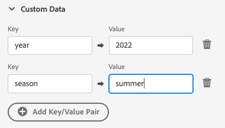

# 푸시 디버그 보기

Adobe Experience Platform Assurance 내의 푸시 디버그 보기는 앱에 대한 푸시 설정의 유효성을 확인하고 테스트 메시지를 장치에 전송하는 기능을 제공합니다.

## 클라이언트

클라이언트 드롭다운에는 이 Assurance 세션에 연결된 각 고유 클라이언트 목록이 있습니다. 클라이언트는 고유 장치이거나 장치에 대한 고유한 앱 설치입니다. 예를 들어 Android 장치와 iOS 장치가 세션에 연결된 경우 해당 클라이언트가 클라이언트 드롭다운에 표시됩니다.

장치에 앱을 다시 설치하고 다시 연결하면 다른 클라이언트가 나타납니다. 해당 이름의 디바이스가 이미 있는 경우 새 드롭다운이 해당 이름에 #2를 추가합니다.

이 보기는 단일 클라이언트에 대해서만 활성화되므로 다른 클라이언트를 선택하면 화면의 세부 사항이 변경됩니다.

## 설정 유효성 검사

다음 **[!UICONTROL 설정 유효성 검사]** 탭은 앱의 푸시 설정에 대한 추가 세부 정보를 확인하고 제공합니다. 유효성 검사를 수행하는 세 개의 패널이 있습니다. 유효성 검사가 모두 성공하면 녹색 확인 표시를 표시합니다. 세 개의 녹색 확인 표시가 있는 경우 앱이 푸시 메시지에 대해 올바르게 구성되었고, 사용자 프로필에 푸시 토큰을 쓰고, 관련 앱 표면이 구성되어 있습니다.

문제가 예상대로 작동하지 않으면 문제 해결 방법에 대한 세부 정보가 포함된 경고가 표시됩니다.

### 클라이언트 세부 정보

이 패널은 장치가 올바르게 구성되었는지 확인합니다. 여기에는 데이터 수집 UI에서 확장 구성, 애플리케이션에서 확장 및 해당 사전 요구 사항 초기화, 디바이스에서 푸시 토큰 캡처 등이 포함됩니다.

유효한 경우 패널에는 장치에 대한 ECID, 푸시 토큰 및 Edge Sandbox 이름과 유형이 표시됩니다.

### 프로필 세부 정보

클라이언트가 올바르게 설정되면 이 패널에서 장치가 프로필에 기록되고 있는지 확인합니다. 또한 프로필의 푸시 토큰이 디바이스의 푸시 토큰과 일치하는지 확인합니다.

유효한 경우 패널에는 장치의 ECID, 푸시 토큰, 애플리케이션의 앱 ID, 메시징 플랫폼 및 푸시 토큰의 거부 목록 여부가 표시됩니다. 사용자가 앱을 제거했거나 사용자가 앱에 대한 푸시 메시지를 사용하지 않도록 설정했을 때와 같은 다양한 이유로 토큰이 거부 목록에 추가될 수 있습니다.

마지막으로, 패널 하단에는 새 탭에서 이 특정 프로필을 여는 링크가 있습니다.

### AppStore 자격 증명 및 구성

이 패널은 프로필에 저장된 앱 ID 및 메시징 플랫폼에 일치하는 앱 표면이 생성되었는지 확인합니다. 앱 표면은 애플리케이션에 대한 푸시 자격 증명이 업로드되는 위치입니다.

유효한 경우 프로필에 앱 표면의 이름, 앱 ID 및 메시징 서비스의 이름이 표시됩니다.

마지막으로, 패널 하단에는 새 탭에서 이 특정 앱 표면을 여는 링크가 있습니다.

## 테스트 푸시 보내기

다음 **[!UICONTROL 테스트 푸시 보내기]** 탭은 장치에 테스트 메시지를 전송하는 데 사용할 수 있습니다.

여러 창에서 서로 다른 iOS 및 Android 푸시 기능을 테스트하도록 구성할 수 있습니다. 구성이 완료되면 다음을 선택합니다. **[!UICONTROL 테스트 푸시 알림 보내기]** 메시지를 보냅니다.

### 메시지

다음에서 **[!UICONTROL 메시지]** 창에서는 메시지의 제목과 본문을 제공할 수 있습니다. 여기서도 자동 알림 기능을 활성화할 수 있습니다.

### 푸시 대상

다음 **[!UICONTROL 푸시 Target]** 창을 사용하면 푸시 메시지를 전송할 때 사용할 푸시 토큰 및 앱 표면을 사용자 지정할 수 있습니다.

이 정보는 기본적으로 제공되며 **[!UICONTROL 설정 유효성 검사]** 탭에 세 개의 녹색 확인 표시가 표시됩니다. 하지만 앱이 완전히 구성되지 않은 경우에도 자체 푸시 토큰 및 앱 표면을 제공할 수 있습니다.

### 클릭 비헤이비어

다음에서 **[!UICONTROL 클릭 비헤이비어]** 창에서 푸시 알림을 장치에서 클릭할 때의 동작을 선택할 수 있습니다. 기본적으로 앱이 열리지만 딥링크나 웹 페이지를 열 수 있습니다.

딥 링크를 사용하도록 선택하는 경우 앱 개발자가 딥 링크를 만들어야 합니다.

### 리치 미디어

다음 **[!UICONTROL 리치 미디어]** 창에서는 이미지, 비디오 또는 GIF과 같은 추가 미디어를 메시지에 추가할 수 있습니다. 이 기능을 사용하려면 앱 개발자가 앱에 코드를 추가해야 합니다.

### 버튼

다음 **[!UICONTROL 단추]** 창에서 푸시 알림에 버튼을 추가할 수 있습니다. 각 버튼은 앱을 열거나, 앱에 딥 링크를 열거나, 웹 페이지를 열 수 있습니다.

이 기능을 사용하려면 앱 개발자가 앱에 코드를 추가해야 합니다.

### 사용자 지정 데이터

다음 **[!UICONTROL 사용자 정의 데이터]** 창을 사용하면 푸시 알림에 사용자 지정 데이터를 추가할 수 있습니다. 각 키/값 쌍은 메시지와 함께 메타데이터로 전송되며 개발자가 강력한 경험을 만들고 추가 추적을 추가하는 데 사용할 수 있습니다.

## 테스트 결과

메시지를 보내면 **[!UICONTROL 테스트 결과]** 섹션은 푸시 서비스에서 메시지에 대한 데이터를 수신합니다. 여기에서 메시지가 Google/iOS 메시징 서비스에 전송되었는지 확인할 수 있습니다.

문제가 발생하면 여기에 표시됩니다.

## 고급

### 메시지 페이로드 보기

다음 옆에 **[!UICONTROL 테스트 푸시 알림 보내기]** button은 팝업 메뉴가 있는 줄임표 세트입니다. 여기에서 메시지 페이로드를 볼 수 있습니다. 이렇게 하면 원격 메시징 서비스에 보낼 정확한 메시지를 볼 수 있습니다. 이 페이로드를 검토하거나 데스크탑 푸시 테스트 도구에 복사하여 붙여넣을 수도 있습니다.

