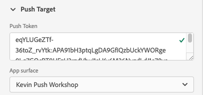

# 푸시 디버그 보기

Adobe Experience Platform Assurance 내의 푸시 디버그 보기는 앱에 대한 푸시 설정의 유효성을 확인하고 테스트 메시지를 장치에 보내는 기능을 제공합니다.

## 클라이언트

클라이언트 드롭다운에는 이 보증 세션에 연결된 각 고유 클라이언트 목록이 있습니다. 클라이언트는 고유한 장치 또는 장치에 대한 고유한 앱 설치입니다. 예를 들어 Android 장치 및 iOS 장치가 세션에 연결되어 있으면 해당 클라이언트가 클라이언트 드롭다운에 표시됩니다.

앱을 장치에 다시 설치하고 다시 연결하면 다른 클라이언트가 나타납니다. 해당 이름의 장치가 이미 있으면, 새 드롭다운이 이름에 #2.

이 보기는 단일 클라이언트에만 활성화되므로 다른 클라이언트를 선택하면 화면의 세부 사항이 변경됩니다.

## 설치 확인

다음 **[!UICONTROL 설정 유효성 검사]** 탭에서 앱의 푸시 설정에 대한 추가 세부 사항을 확인하고 제공합니다. 유효성을 검사하는 세 개의 패널이 있습니다. 유효성 검사가 모두 성공하면 녹색 확인 표시가 나타납니다. 세 개의 녹색 확인 표시가 있는 경우 앱이 푸시 메시지에 대해 올바르게 구성되고 푸시 토큰을 사용자 프로필에 쓰고 있으며, 연결된 앱 면이 구성되어 있습니다.

예상대로 작동하지 않는 경우 해당 문제를 해결하는 방법에 대한 세부 정보가 포함된 경고가 표시됩니다.

### 클라이언트 세부 정보

이 패널에서는 장치가 올바르게 구성되어 있는지 확인합니다. 여기에는 데이터 수집 UI에서 확장을 구성하고, 애플리케이션에서 확장 및 해당 사전 요구 사항을 초기화하며, 장치에서 푸시 토큰을 캡처하는 작업이 포함됩니다.

유효한 경우, 패널에 장치의 ECID, 푸시 토큰, Edge Sandbox 이름 및 유형이 표시됩니다.

### 프로필 세부 사항

클라이언트가 올바로 설정되면 이 패널에서는 장치가 프로필에 쓰기 시작하는지 확인합니다. 또한 프로필의 푸시 토큰이 장치의 푸시 토큰과 일치하는지 확인합니다.

유효한 경우, 패널에 장치의 ECID, 푸시 토큰, 응용 프로그램의 앱 ID, 메시징 플랫폼 및 푸시 토큰이 거부 목록에 추가되었는지 여부가 표시됩니다. 사용자가 앱을 제거했거나 사용자가 앱에 대한 푸시 메시지를 비활성화한 것과 같은 다양한 이유로 토큰이 거부 목록에 추가될 수 있습니다.

마지막으로 패널 하단에 새 탭에서 이 특정 프로필을 열 링크가 있습니다.

### AppStore 자격 증명 및 구성

이 패널에서는 앱 ID와 프로필에 저장된 메시지 플랫폼에 일치하는 앱 면이 만들어졌는지 확인합니다. 앱 서피스는 애플리케이션에 대한 푸시 자격 증명이 업로드되는 것입니다.

유효한 경우 프로필에는 앱 면의 이름, 앱 ID 및 메시징 서비스의 이름이 표시됩니다.

마지막으로 패널 하단에 새 탭에서 이 특정 앱 표면을 여는 링크가 있습니다.

## 테스트 푸시 보내기

다음 **[!UICONTROL 테스트 푸시 보내기]** 탭을 사용하여 테스트 메시지를 장치에 보낼 수 있습니다.

다양한 iOS 및 Android 푸시 기능을 테스트하도록 구성할 수 있는 몇 가지 창이 있습니다. 구성이 완료되면 을(를) 선택합니다. **[!UICONTROL 테스트 푸시 알림 보내기]** 메시지를 보내려면

### 메시지

에서 **[!UICONTROL 메시지]** 창의 제목과 본문을 메시지에 제공할 수 있습니다. 여기서 자동 알림 기능도 활성화할 수 있습니다.

### Target 푸시

다음 **[!UICONTROL 푸시 Target]** 창을 사용하면 푸시 메시지를 전송할 때 사용할 푸시 토큰 및 앱 면을 사용자 지정할 수 있습니다.

이 정보는 기본적으로 **[!UICONTROL 설정 유효성 검사]** 탭에 세 개의 녹색 확인 표시가 표시됩니다. 하지만 앱이 완전히 구성되지 않은 경우에도 고유한 푸시 토큰 및 앱 면을 제공할 수 있습니다.

### 클릭 동작

에서 **[!UICONTROL 클릭 동작]** 창에서 장치에서 푸시 알림을 클릭할 때 동작을 선택할 수 있습니다. 기본적으로 앱을 열지만 딥 링크 또는 웹 페이지를 열 수 있습니다.

딥 링크를 사용하도록 선택하는 경우 앱 개발자가 직접 딥 링크를 만들어야 합니다.

### 리치 미디어

다음 **[!UICONTROL 리치 미디어]** 창에서는 이미지, 비디오 또는 GIF과 같은 추가 미디어를 메시지에 추가할 수 있습니다. 이 기능을 사용하려면 앱 개발자가 앱에 코드를 추가해야 합니다.

### 버튼

다음 **[!UICONTROL 단추]** 창을 사용하면 푸시 알림에 추가 단추를 추가할 수 있습니다. 각 단추를 사용하면 앱을 열거나 앱으로 딥 링크를 열거나 웹 페이지를 열 수 있습니다.

이 기능을 사용하려면 앱 개발자가 앱에 코드를 추가해야 합니다.

### 사용자 지정 데이터

다음 **[!UICONTROL 사용자 지정 데이터]** 창을 사용하면 푸시 알림에 사용자 지정 데이터를 추가할 수 있습니다. 각 키/값 쌍은 메시지와 함께 메타데이터로 전송되며 개발자가 강력한 경험을 만들고 추가 추적을 추가하는 데 사용할 수 있습니다.

## 테스트 결과

메시지를 보내고 나면 **[!UICONTROL 테스트 결과]** 섹션은 메시지에 대한 푸시 서비스로부터 데이터를 수신합니다. 여기에서 메시지가 Google/iOS 메시징 서비스에 전송되었는지 확인할 수 있습니다.

문제가 발생하면 여기에 표시됩니다.

## 고급

### 메시지 페이로드 보기

다음 **[!UICONTROL 테스트 푸시 알림 보내기]** 버튼은 팝업 메뉴가 있는 줄임표 세트입니다. 여기에서 메시지 페이로드를 볼 수 있습니다. 이렇게 하면 원격 메시징 서비스로 전송할 정확한 메시지를 볼 수 있습니다. 이 페이로드를 검토하거나 데스크탑 푸시 테스트 도구에 복사하여 붙여넣을 수 있습니다.

