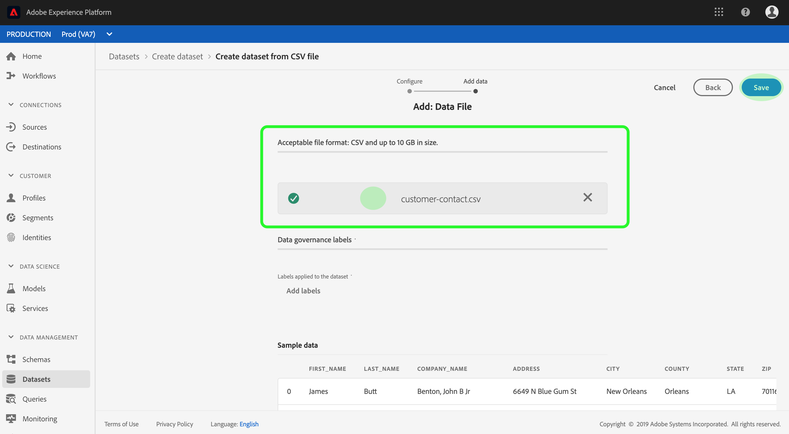

# 데이터 세트 UI 가이드

이 사용자 안내서는 Adobe Experience Platform 사용자 인터페이스 내에서 데이터 세트를 사용하여 작업할 때 일반적인 작업을 수행하는 방법에 대한 지침을 제공합니다.

## 시작하기

이 사용 안내서를 보려면 Adobe Experience Platform의 다음 구성 요소에 대해 자세히 알아야 합니다.

* [데이터 세트](overview.md):데이터 지속성을 위한 스토리지 및 관리 구성 [!DNL Experience Platform]을 참조하십시오.
* [[!DNL Experience Data Model (XDM) System]](../../xdm/home.md):고객 경험 데이터를  [!DNL Experience Platform] 구성하는 표준화된 프레임워크
   * [스키마 컴포지션의 기본 사항](../../xdm/schema/composition.md):스키마 컴포지션의 주요 원칙 및 모범 사례를 포함하여 XDM 스키마의 기본 구성 블록에 대해 알아봅니다.
   * [스키마 편집기](../../xdm/tutorials/create-schema-ui.md):사용자 인터페이스 내에서 사용자 정의 XDM 스키마를 사용하여 고유한 사용자 정의 XDM 스키마 [!DNL Schema Editor] 를 만드는 방법을  [!DNL Platform] 알아봅니다.
* [[!DNL Real-time Customer Profile]](../../profile/home.md):여러 소스에서 집계된 데이터를 기반으로 통합된 실시간 소비자 프로필을 제공합니다.
* [[!DNL Adobe Experience Platform Data Governance]](../../data-governance/home.md):고객 데이터 사용과 관련된 규정, 제한 사항 및 정책을 준수할 수 있습니다.

## 데이터 집합 보기

[!DNL Experience Platform] UI에서 왼쪽 탐색의 **[!UICONTROL Datasets]**&#x200B;을 클릭하여 **[!UICONTROL Datasets]** 대시보드를 엽니다. 대시보드는 조직에 대해 사용 가능한 모든 데이터 세트를 나열합니다. 데이터 세트가 준수하는 스키마, 가장 최근의 통합 실행 상태를 비롯하여 나열된 각 데이터 세트에 대한 세부 사항이 표시됩니다.

데이터 집합 이름을 클릭하여 **[!UICONTROL Dataset activity]** 화면에 액세스하고 선택한 데이터 집합에 대한 세부 정보를 봅니다. 활동 탭에는 성공적인 배치와 실패한 배치의 목록뿐만 아니라 소비되는 메시지 비율을 시각화하는 그래프가 포함되어 있습니다.

## 데이터 세트 미리 보기

**[!UICONTROL Dataset activity]** 화면에서 화면 오른쪽 위 모서리 근처에 있는 **[!UICONTROL Preview dataset]**&#x200B;을 클릭하여 최대 100개의 데이터 행을 미리 봅니다. 데이터 세트가 비어 있으면 미리 보기 링크가 비활성화되고 미리 보기를 사용할 수 없다고 표시됩니다.

미리 보기 창에서 데이터 세트에 대한 스키마의 계층 구조 보기가 오른쪽에 표시됩니다.

데이터에 액세스하기 위한 보다 강력한 방법을 위해 [!DNL Experience Platform]은 [!DNL Query Service] 및 [!DNL JupyterLab]와 같은 다운스트림 서비스를 제공하여 데이터를 탐색 및 분석합니다. 자세한 내용은 다음 문서를 참조하십시오.

* [쿼리 서비스 개요](../../query-service/home.md)
* [JupiterLab 사용 안내서](../../data-science-workspace/jupyterlab/overview.md)

## 데이터 집합 {#create} 만들기

새 데이터 세트를 만들려면 **[!UICONTROL Datasets]** 대시보드에서 **[!UICONTROL Create dataset]**&#x200B;을 클릭하여 시작합니다.

다음 화면에는 새 데이터 세트를 만들기 위한 다음 2가지 옵션이 표시됩니다.

* [스키마에서 데이터 집합 만들기](#schema)
* [CSV 파일에서 데이터 세트 만들기](#csv)

### 기존 스키마 {#schema}을(를) 사용하여 데이터 집합 만들기

**[!UICONTROL Create dataset]** 화면에서 **[!UICONTROL Create dataset from schema]**&#x200B;을 클릭하여 빈 데이터 세트를 새로 만듭니다.

**[!UICONTROL Select schema]** 단계가 나타납니다. 스키마 목록을 탐색하고 **[!UICONTROL Next]**&#x200B;을(를) 클릭하기 전에 데이터 세트에서 유지할 스키마를 선택합니다.

**[!UICONTROL Configure dataset]** 단계가 나타납니다. 데이터 세트에 이름과 선택적 설명을 입력한 다음 **[!UICONTROL Finish]**&#x200B;을 클릭하여 데이터 세트를 만듭니다.

### CSV 파일 {#csv}을(를) 사용하여 데이터 세트 만들기

CSV 파일을 사용하여 데이터 세트를 만들 때 제공된 CSV 파일과 일치하는 구조를 데이터 세트에 제공하기 위해 임시 스키마가 만들어집니다. **[!UICONTROL Create dataset]** 화면에서 **[!UICONTROL Create dataset from CSV file]** 상자를 클릭합니다.

**[!UICONTROL Configure]** 단계가 나타납니다. 데이터 세트에 이름과 선택적 설명을 입력한 다음 **[!UICONTROL Next]**&#x200B;을 클릭합니다.

**[!UICONTROL Add data]** 단계가 나타납니다. CSV 파일을 화면 가운데로 드래그하여 놓거나 **[!UICONTROL Browse]**&#x200B;을 클릭하여 파일 디렉토리를 검색합니다. 파일 크기는 최대 10GB까지 될 수 있습니다. CSV 파일이 업로드되면 **[!UICONTROL Save]**&#x200B;을 클릭하여 데이터 세트를 만듭니다.

>[!NOTE]
>
>CSV 열 이름은 영숫자 문자로 시작해야 하며 문자, 숫자 및 밑줄만 포함할 수 있습니다.

## 실시간 고객 프로필 {#enable-profile}에 대한 데이터 집합 활성화

모든 데이터 세트에 인제스트한 데이터로 고객 프로파일을 강화할 수 있습니다. 이렇게 하려면 데이터 세트가 준수하는 스키마는 [!DNL Real-time Customer Profile]에서 사용할 수 있어야 합니다. 호환되는 스키마는 다음 요구 사항을 충족합니다.

* 스키마에 ID 속성으로 지정된 속성이 하나 이상 있습니다.
* 스키마에 기본 ID로 정의된 ID 속성이 있습니다.

[!DNL Profile]에 대한 스키마 활성화에 대한 자세한 내용은 [스키마 편집기 사용자 안내서](../../xdm/tutorials/create-schema-ui.md)를 참조하십시오.

프로파일에 대한 데이터 세트를 활성화하려면 해당 **[!UICONTROL Dataset activity]** 화면에 액세스하고 **[!UICONTROL Properties]** 열 내에서 **[!UICONTROL Profile]** 전환을 클릭합니다. 활성화되면 데이터 세트에 인제스트된 데이터도 고객 프로필을 채우는 데 사용됩니다.

>[!NOTE]
>
>데이터 세트에 이미 데이터가 포함되어 있고 [!DNL Profile]에 대해 활성화된 경우 기존 데이터는 [!DNL Profile]에 의해 자동으로 사용되지 않습니다. 데이터 세트에 [!DNL Profile]이(가) 활성화되면 기존 데이터를 다시 인제스트하여 고객 프로파일에 기여하는 것이 좋습니다.

## 데이터 세트에 대한 데이터 거버넌스 관리 및 실행

데이터 사용 레이블을 사용하면 해당 데이터에 적용되는 사용 정책에 따라 데이터 세트와 필드를 분류할 수 있습니다. 레이블에 대한 자세한 내용은 [데이터 거버넌스 개요](../../data-governance/home.md)를 참조하거나, 데이터 세트에 레이블을 적용하는 방법에 대한 자세한 내용은 [데이터 사용 레이블 사용자 안내서](../../data-governance/labels/overview.md)를 참조하십시오.

## 데이터 집합 삭제

먼저 **[!UICONTROL Dataset activity]** 화면에 액세스하여 데이터 세트를 삭제할 수 있습니다. 그런 다음 **[!UICONTROL Delete dataset]**&#x200B;을 클릭하여 삭제합니다.

>[!NOTE]
>
>Adobe 응용 프로그램 및 서비스(예: Adobe Analytics, Adobe Audience Manager 또는 [!DNL Offer Decisioning])에서 만들고 사용하는 데이터 세트는 삭제할 수 없습니다.

확인 상자가 나타납니다. **[!UICONTROL Delete]**&#x200B;을 클릭하여 데이터 집합의 삭제를 확인합니다.

## 프로필 사용 데이터 집합 삭제

데이터 세트가 [!DNL Profile]에 대해 활성화된 경우 UI를 통해 해당 데이터 세트를 삭제하면 Data Lake 및 플랫폼 내의 프로필 저장소 모두에서 데이터 세트가 삭제됩니다.

실시간 고객 프로필 API를 사용하여 [!DNL Profile] 저장소에서만 데이터 세트를 삭제할 수 있습니다(Data Lake에 데이터를 두다). 자세한 내용은 [프로필 시스템 작업 API 끝점 안내서](../../profile/api/profile-system-jobs.md)를 참조하십시오.

## 데이터 수집 모니터링

[!DNL Experience Platform] UI의 왼쪽 탐색 영역에서 **[!UICONTROL Monitoring]**&#x200B;을 클릭합니다. **[!UICONTROL Monitoring]** 대시보드를 사용하면 일괄 처리 또는 스트리밍 습득 중 하나에서 인바운드 데이터의 상태를 볼 수 있습니다. 개별 배치의 상태를 보려면 **[!UICONTROL Batch end-to-end]** 또는 **[!UICONTROL Streaming end-to-end]** 중 하나를 클릭합니다. 대시보드에는 성공, 실패 또는 진행 중인 일괄 처리 또는 스트리밍 통합 실행이 모두 표시됩니다. 각 목록에서는 배치 ID, 대상 데이터 세트 이름, 인제스트된 레코드 수를 포함하여 일괄 처리에 대한 세부 사항을 제공합니다. 대상 데이터 세트가 [!DNL Profile]에 대해 활성화된 경우 인제스트된 ID 및 프로필 레코드 수도 표시됩니다.

개별 **[!UICONTROL Batch ID]**&#x200B;을 클릭하여 **[!UICONTROL Batch overview]** 대시보드에 액세스하고 일괄 처리를 인제스트하지 못할 경우 오류 로그를 포함하여 일괄 처리에 대한 세부 정보를 볼 수 있습니다.

배치를 삭제하려면 대시보드의 오른쪽 상단에 있는 **[!UICONTROL Delete batch]**&#x200B;을 클릭하여 삭제할 수 있습니다. 이렇게 하면 배치가 원래 수집되었던 데이터 세트에서 해당 레코드도 제거됩니다.

## 다음 단계

이 사용자 안내서에서는 [!DNL Experience Platform] 사용자 인터페이스에서 데이터 집합을 사용하여 작업할 때 일반적인 작업을 수행하는 지침을 제공합니다. 데이터 세트와 관련된 일반적인 [!DNL Platform] 작업 과정을 수행하는 단계는 다음 자습서를 참조하십시오.

* [API를 사용하여 데이터 세트 만들기](create.md)
* [데이터 액세스 API를 사용하여 데이터 집합 데이터 쿼리](../../data-access/home.md)
* [API를 사용하여 실시간 고객 프로필 및 ID 서비스에 대한 데이터 세트 구성](../../profile/tutorials/dataset-configuration.md)
