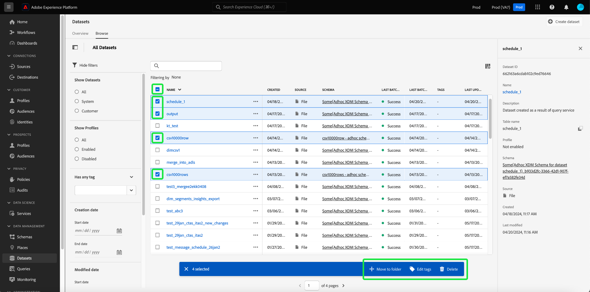

# 데이터 세트 UI 안내서

이 사용 안내서는 Adobe Experience Platform 사용자 인터페이스 내에서 데이터 세트로 작업할 때 일반적인 작업을 수행하는 방법에 대한 지침을 제공합니다.

## 시작하기

이 사용 안내서를 사용하려면 Adobe Experience Platform의 다음 구성 요소에 대해 이해하고 있어야 합니다.

* [데이터 집합](overview.md): [!DNL Experience Platform]의 데이터 지속성을 위한 저장소 및 관리 구성입니다.
* [[!DNL Experience Data Model (XDM) System]](../../xdm/home.md): [!DNL Experience Platform]에서 고객 경험 데이터를 구성하는 표준화된 프레임워크입니다.
   * [스키마 컴포지션의 기본 사항](../../xdm/schema/composition.md): 스키마 컴포지션의 주요 원칙 및 모범 사례를 포함하여 XDM 스키마의 기본 구성 요소에 대해 알아봅니다.
   * [스키마 편집기](../../xdm/tutorials/create-schema-ui.md): [!DNL Experience Platform] 사용자 인터페이스 내에서 [!DNL Schema Editor]을(를) 사용하여 사용자 지정 XDM 스키마를 만드는 방법을 알아봅니다.
* [[!DNL Real-Time Customer Profile]](../../profile/home.md): 여러 원본의 집계된 데이터를 기반으로 통합된 실시간 소비자 프로필을 제공합니다.
* [[!DNL Adobe Experience Platform Data Governance]](../../data-governance/home.md): 고객 데이터 사용과 관련된 규정, 제한 사항 및 정책을 준수하도록 하십시오.

## 데이터 세트 보기 {#view-datasets}

>[!CONTEXTUALHELP]
>id="platform_datasets_negative_numbers"
>title="데이터 세트 활동에 포함된 음수"
>abstract="수집된 레코드에 포함된 음수는 사용자가 선택한 시간 범위에서 특정 배치를 삭제했음을 의미합니다."
>text="Learn more in documentation"

>[!CONTEXTUALHELP]
>id="platform_datasets_browse_daysRemaining"
>title="데이터 세트 만료"
>abstract="이 열은 대상 데이터 세트가 자동으로 만료되기 전에 남은 일 수를 나타냅니다."

>[!CONTEXTUALHELP]
>id="platform_datasets_browse_datalakeretention"
>title="데이터 레이크 보존"
>abstract="각 데이터 세트에 대한 현재 보존 정책을 보여 줍니다. 이 값은 각 데이터 세트의 보존 설정에서 수정할 수 있습니다. ExperienceEvent 데이터 세트에 대해서만 보존 시간을 설정할 수 있습니다."

>[!CONTEXTUALHELP]
>id="platform_datasets_browse_profileretention"
>title="프로필 보존"
>abstract="각 데이터 세트에 대한 현재 보존 정책을 보여 줍니다. 이 값은 각 데이터 세트의 보존 설정에서 수정할 수 있습니다. ExperienceEvent 데이터 세트에 대해서만 보존 시간을 설정할 수 있습니다."

>[!CONTEXTUALHELP]
>id="platform_datasets_datalakesettings_datasetretention"
>title="데이터 세트 보존"
>abstract="데이터 레이크 보존은 다양한 서비스에서 데이터를 저장하는 기간과 데이터를 삭제해야 하는 시점에 대한 규칙을 설정합니다. 이를 통해 규정을 준수하고 저장 비용을 관리하고 데이터 품질을 유지할 수 있습니다."

[!DNL Experience Platform] UI의 왼쪽 탐색에서 **[!UICONTROL 데이터 세트]**&#x200B;를 선택하여 **[!UICONTROL 데이터 세트]** 대시보드를 엽니다. 대시보드에는 조직에서 사용 가능한 모든 데이터 세트가 나열됩니다. 이름, 데이터 세트가 준수하는 스키마, 가장 최근 수집 실행 상태 등 나열된 각 데이터 세트에 대한 세부 사항이 표시됩니다.

[!UICONTROL 찾아보기] 탭에서 데이터 세트 이름을 선택하여 **[!UICONTROL 데이터 세트 활동]** 화면에 액세스하고 선택한 데이터 세트에 대한 세부 정보를 확인합니다. 활동 탭에는 메시지 사용률을 시각화한 그래프와 성공/실패한 일괄 처리 집합 목록이 있습니다.

## 기타 액션 {#more-actions}

[!UICONTROL 데이터 세트] 세부 정보 보기에서 [!UICONTROL Delete] 또는 [!UICONTROL 프로필에 대한 데이터 세트를 사용]할 수 있습니다. 사용 가능한 작업을 보려면 **[!UICONTROL 선택... UI의 오른쪽 상단에]**&#x200B;이(가) 있습니다. 드롭다운 메뉴가 나타납니다.

![[!UICONTROL 이(가) 있는 데이터 세트 작업 영역... 더] 드롭다운 메뉴가 강조 표시되었습니다.](../images/datasets/user-guide/more-actions.png)

**[!UICONTROL 프로필에 대한 데이터 집합 사용]**&#x200B;을 선택하면 확인 대화 상자가 나타납니다. 선택을 확인하려면 **[!UICONTROL 사용]**&#x200B;을 선택하세요.

>[!NOTE]
>
>프로필에 대한 데이터 세트를 활성화하려면 데이터 세트가 준수하는 스키마가 실시간 고객 프로필과 호환되어야 합니다. 자세한 내용은 [프로필에 대한 데이터 집합 사용](#enable-profile) 섹션을 참조하십시오.

**[!UICONTROL 삭제]**&#x200B;를 선택하면 [!UICONTROL 데이터 세트 삭제] 확인 대화 상자가 나타납니다. 선택을 확인하려면 **[!UICONTROL 삭제]**&#x200B;를 선택하세요.

>[!NOTE]
>
>시스템 데이터 세트는 삭제할 수 없습니다.

[!UICONTROL 찾아보기] 탭에 있는 인라인 작업에서 데이터 세트를 삭제하거나 실시간 고객 프로필에 사용할 데이터 세트를 추가할 수도 있습니다. 자세한 내용은 [인라인 작업 섹션](#inline-actions)을 참조하세요.

## 인라인 데이터 세트 작업 {#inline-actions}

이제 데이터 세트 UI는 사용 가능한 각 데이터 세트에 대한 인라인 작업 컬렉션을 제공합니다. 관리할 데이터 세트의 줄임표(...)를 선택하여 팝업 메뉴에서 사용 가능한 옵션을 확인합니다. 사용 가능한 작업은 다음과 같습니다.

* [[!UICONTROL 데이터 집합 미리 보기]](#preview)
* [[!UICONTROL 데이터 및 액세스 레이블 관리]](#manage-and-enforce-data-governance)
* [[!UICONTROL 통합 프로필 사용]](#enable-profile)
* [[!UICONTROL 태그 관리]](#manage-tags)
* [(Beta) [!UICONTROL 데이터 보존 정책 설정]](#data-retention-policy)
* [[!UICONTROL 폴더로 이동]](#move-to-folders)
* [[!UICONTROL 삭제]](#delete).

사용 가능한 이러한 작업에 대한 자세한 내용은 해당 섹션에서 확인할 수 있습니다. 많은 수의 데이터 세트를 동시에 관리하는 방법을 알아보려면 [일괄 작업](#bulk-actions) 섹션을 참조하십시오.

### 데이터 세트 미리 보기 {#preview}

[!UICONTROL 찾아보기] 탭의 인라인 옵션과 [!UICONTROL 데이터 집합 활동] 보기 모두에서 데이터 집합 샘플 데이터를 미리 볼 수 있습니다. [!UICONTROL 찾아보기] 탭에서 미리 보려는 데이터 세트 이름 옆의 생략 부호(...)를 선택합니다. 옵션 메뉴 목록이 나타납니다. 사용 가능한 옵션 목록에서 **[!UICONTROL 데이터 집합 미리 보기]**&#x200B;를 선택합니다. 데이터 세트가 비어 있으면 미리보기 링크가 비활성화되고 대신 미리보기를 사용할 수 없음을 나타냅니다.

그러면 데이터 세트에 대한 스키마의 계층적 보기가 오른쪽에 표시되는 미리보기 창이 열립니다.

>[!NOTE]
>
>보기 왼쪽의 스키마 다이어그램에는 데이터가 포함된 필드만 표시됩니다. 데이터가 없는 필드는 UI를 간소화하고 관련 정보에 집중할 수 있도록 자동으로 숨겨집니다.

또는 **[!UICONTROL 데이터 집합 활동]** 화면에서 화면 오른쪽 상단 근처에 있는 **[!UICONTROL 데이터 집합 미리 보기]**&#x200B;를 선택하여 최대 100개의 데이터 행을 미리 봅니다.

데이터에 액세스하는 보다 강력한 방법을 위해 [!DNL Experience Platform]에서는 데이터를 탐색하고 분석할 수 있도록 [!DNL Query Service] 및 [!DNL JupyterLab]과(와) 같은 다운스트림 서비스를 제공합니다. 자세한 내용은 다음 문서를 참조하십시오.

* [쿼리 서비스 개요](../../query-service/home.md)
* [JupyterLab 사용 안내서](../../data-science-workspace/jupyterlab/overview.md)

### 데이터 세트에 대한 데이터 거버넌스 관리 및 적용 {#manage-and-enforce-data-governance}

[!UICONTROL 찾아보기] 탭의 인라인 옵션을 선택하여 데이터 집합에 대한 데이터 거버넌스 레이블을 관리할 수 있습니다. 관리할 데이터 세트 이름 옆의 생략 부호(...)를 선택한 다음 드롭다운 메뉴에서 **[!UICONTROL 데이터 관리 및 레이블 액세스]**&#x200B;을(를) 선택합니다.

스키마 수준에서 적용되는 데이터 사용 레이블을 사용하면 해당 데이터에 적용되는 사용 정책에 따라 데이터 세트와 필드를 분류할 수 있습니다. 레이블에 대한 자세한 내용은 [데이터 거버넌스 개요](../../data-governance/home.md)를 참조하거나, 데이터 세트에 전파하기 위해 스키마에 레이블을 적용하는 방법에 대한 지침은 [데이터 사용 레이블 사용 안내서](../../data-governance/labels/overview.md)를 참조하세요.

## 실시간 고객 프로필에 대한 데이터 세트 활성화 {#enable-profile}

모든 데이터 세트에는 수집된 데이터로 고객 프로필을 보강하는 기능이 있습니다. 이렇게 하려면 데이터 집합이 준수하는 스키마가 [!DNL Real-Time Customer Profile]에서 사용할 수 있도록 호환되어야 합니다. 호환되는 스키마는 다음 요구 사항을 충족합니다.

* 스키마에 ID 속성으로 지정된 특성이 하나 이상 있습니다.
* 스키마에는 기본 ID로 정의된 ID 속성이 있습니다.

[!DNL Profile]에 대한 스키마를 사용하는 방법에 대한 자세한 내용은 [스키마 편집기 사용 안내서](../../xdm/tutorials/create-schema-ui.md)를 참조하십시오.

[!UICONTROL 찾아보기] 탭의 인라인 옵션과 [!UICONTROL 데이터 세트 활동] 보기 모두에서 프로필에 대한 데이터 세트를 활성화할 수 있습니다. [!UICONTROL 데이터 세트] 작업 영역의 [!UICONTROL 찾아보기] 탭에서 프로필에 사용할 데이터 세트의 줄임표를 선택합니다. 옵션 메뉴 목록이 나타납니다. 사용 가능한 옵션 목록에서 **[!UICONTROL 통합 프로필 사용]**&#x200B;을 선택합니다.

또는 데이터 집합의 **[!UICONTROL 데이터 집합 활동]** 화면에서 **[!UICONTROL 속성]** 열 내의 **[!UICONTROL 프로필]** 전환을 선택합니다. 활성화되면 데이터 세트에 수집된 데이터는 고객 프로필을 채우는 데에도 사용됩니다.

>[!NOTE]
>
>데이터 집합에 이미 데이터가 포함되어 있고 [!DNL Profile]에 대해 활성화된 경우 기존 데이터가 [!DNL Profile]에 의해 자동으로 사용되지 않습니다. [!DNL Profile]에 대해 데이터 집합을 사용하도록 설정한 후에는 기존 데이터를 다시 수집하여 고객 프로필에 기여하는 것이 좋습니다.

프로필에 대해 활성화된 데이터 세트도 이 기준으로 필터링할 수 있습니다. 자세한 내용은 [프로필 사용 데이터 세트를 필터링](#filter-profile-enabled-datasets)하는 방법에 대한 섹션을 참조하십시오.

### 데이터 세트 태그 관리 {#manage-tags}

사용자 지정 생성 태그를 추가하여 데이터 세트를 구성하고 검색, 필터링 및 정렬 기능을 개선합니다. [!UICONTROL 데이터 세트] 작업 영역의 [!UICONTROL 찾아보기] 탭에서 관리할 데이터 세트의 줄임표를 선택한 다음 드롭다운 메뉴에서 **[!UICONTROL 태그 관리]**&#x200B;를 선택합니다.

[!UICONTROL 태그 관리] 대화 상자가 나타납니다. 간단한 설명을 입력하여 사용자 지정 태그를 만들거나 기존 태그 중에서 선택하여 데이터 세트에 레이블을 지정합니다. 설정을 확인하려면 **[!UICONTROL 저장]**&#x200B;을 선택하세요.

[!UICONTROL 태그 관리] 대화 상자에서는 데이터 집합에서 기존 태그를 제거할 수도 있습니다. 제거할 태그 옆에 있는 &#39;x&#39;를 선택하고 **[!UICONTROL 저장]**&#x200B;을 선택하면 됩니다.

태그가 데이터 세트에 추가되면 데이터 세트는 해당 태그를 기반으로 필터링될 수 있습니다. 자세한 내용은 [태그로 데이터 세트를 필터링](#enable-profile)하는 방법에 대한 섹션을 참조하십시오.

쉽게 검색하고 분류할 수 있도록 비즈니스 개체를 분류하는 방법에 대한 자세한 내용은 [메타데이터 분류 관리](../../administrative-tags/ui/managing-tags.md)에 대한 안내서를 참조하십시오. 이 안내서에서는 올바른 권한이 있는 사용자가 Experience Platform UI에서 사전 정의된 태그를 만들고, 이를 범주에 할당하고, 모든 관련 CRUD 작업을 관리하는 방법에 대해 설명합니다.

### (Beta) 데이터 보존 정책 설정 {#data-retention-policy}

>[!AVAILABILITY]
> 
>데이터 보존 설정은 현재 Beta 버전이며 일부 조직의 **제한된 릴리스**&#x200B;에서만 사용할 수 있습니다. 아래 설명된 기능이 UI에 반영되지 않을 수 있습니다.

[!UICONTROL 데이터 세트] 작업 영역의 [!UICONTROL 찾아보기] 탭에서 인라인 작업 메뉴를 사용하여 데이터 세트 만료 및 보존 설정을 관리합니다. 이 기능을 사용하여 데이터가 데이터 레이크 및 프로필 저장소에 유지되는 기간을 구성할 수 있습니다. 만료 날짜는 Experience Platform에 데이터가 수집된 시기 및 구성된 보존 기간을 기반으로 합니다.

>[!TIP]
>
>데이터 레이크는 분석 및 처리를 위해 이벤트 로그, 클릭스트림 데이터 및 대량 수집된 레코드와 같은 처리되지 않은 원시 데이터를 저장합니다. 프로필 스토어에는 실시간 개인화 및 활성화를 지원하기 위해 ID가 결합된 이벤트 및 속성 정보를 포함하여 고객 식별 가능한 데이터가 포함되어 있습니다.

보존 기간을 구성하려면 드롭다운 메뉴에서 데이터 세트 옆에 있는 생략 부호를 선택한 다음 **[!UICONTROL 데이터 보존 정책 설정]**&#x200B;을 선택합니다.

[!UICONTROL 데이터 집합 보존 설정] 대화 상자가 나타납니다. 이 대화 상자에는 샌드박스 수준 라이선스 사용 지표, 데이터 세트 수준 세부 정보 및 현재 데이터 보존 설정이 표시됩니다. 이러한 지표는 사용 권한과 비교하여 사용량을 보여주며 데이터 세트별 스토리지 및 보존 구성을 평가하는 데 도움이 됩니다. 지표에는 데이터 세트 이름, 유형, 프로필 활성화 상태 및 데이터 레이크 및 프로필 스토어 사용이 포함됩니다.

>[!NOTE]
>
>샌드박스 수준의 사용이 허가된 데이터 레이크 스토리지 지표는 아직 개발 중이므로 표시되지 않을 수 있습니다. 라이선스 사용 지표에 대한 전체 분류는 라이선스 사용 대시보드에서 확인할 수 있습니다. 이러한 지표에 대한 설명은 설명서 를 참조하십시오.
<!-- replace this screenshot with a dataset that enabled unified profile so user can see the Profile TTL settings -->

데이터 보존 설정 대화 상자에서 원하는 보존 기간을 구성합니다. 숫자를 입력하고 드롭다운 메뉴에서 시간 단위(일, 월 또는 년)를 선택합니다. 데이터 레이크 및 프로필 서비스에 대해 별도의 보존 설정을 구성할 수 있습니다.

>[!NOTE]
> 
>데이터 레이크의 최소 보존 기간은 30일입니다. Profile Service의 최소 보존 기간은 1일입니다.

투명성 및 모니터링을 지원하기 위해 **last** 및 **next** 데이터 보존 작업 실행에 대한 타임스탬프가 제공됩니다. 타임스탬프를 통해 마지막으로 데이터 정리가 발생한 시점과 다음 데이터 정리가 예약된 시점을 파악할 수 있습니다.

#### 스토리지 영향 통찰력 {#storage-impact-insights}

다른 보존 정책의 저장 효과에 대한 시각적 예측을 열려면 **[!UICONTROL 경험 이벤트 데이터 보기]**&#x200B;를 선택하십시오.

이 차트에는 현재 선택한 데이터 세트에 대한 다양한 보존 기간에 대한 경험 이벤트의 분포가 표시됩니다. 선택한 보존 기간이 적용되면 제거될 정확한 레코드 수를 보려면 각 막대 위로 마우스를 가져갑니다.

시각적 예측을 사용하여 다양한 보존 기간의 영향을 평가하고 정보에 입각한 비즈니스 결정을 내릴 수 있습니다. 예를 들어 30일 보존 기간을 선택하고 차트에 데이터의 60%가 삭제되는 것으로 표시되는 경우 분석을 위해 더 많은 데이터를 보존하기 위해 보존을 확장할 수 있습니다.

>[!NOTE]
>
>경험 이벤트 분포 차트는 데이터 세트별로 다르며 선택한 데이터 세트의 데이터만 반영합니다.

구성에 만족하면 **[!UICONTROL 저장]**&#x200B;을 선택하여 설정을 확인합니다.

>[!IMPORTANT]
>
>데이터 보존 규칙이 적용되면 만료 값으로 정의된 일 수보다 오래된 데이터는 영구적으로 삭제되며 복구할 수 없습니다.

보존 설정을 구성한 후 모니터링 UI를 사용하여 변경 사항이 시스템에 의해 실행되었는지 확인합니다. 모니터링 UI는 모든 데이터 세트에 걸친 데이터 보존 활동을 중앙에서 볼 수 있는 기능을 제공합니다. 여기에서 작업 실행을 추적하고, 삭제된 데이터의 양을 검토하고, 보존 정책이 예상대로 작동하는지 확인할 수 있습니다. 이러한 가시성은 거버넌스, 규정 준수 및 효율적인 데이터 수명주기 관리를 지원합니다.

모니터링 대시보드를 사용하여 Experience Platform UI에서 원본 데이터 흐름을 추적하는 방법에 대해 알아보려면 [UI에서 원본 데이터 흐름 모니터링](../../dataflows/ui/monitor-sources.md) 설명서를 참조하십시오.

<!-- Improve the link above. I cannot link to a 100% appropriate document yet. -->

데이터 세트 만료 날짜 범위를 정의하는 규칙과 데이터 보존 정책을 구성하기 위한 모범 사례에 대한 자세한 내용은 [자주 묻는 질문 페이지](../catalog-faq.md)를 참조하십시오.

#### (Beta) 보존 기간 및 스토리지 지표에 대한 가시성 향상 {#retention-and-storage-metrics}

Beta 사용자는 4개의 새 열을 사용하여 데이터 관리에 대한 가시성을 높일 수 있습니다. **[!UICONTROL 데이터 레이크 저장소]**, **[!UICONTROL 데이터 레이크 유지]**, **[!UICONTROL 프로필 저장소]** 및 **[!UICONTROL 프로필 유지]**. 이 지표는 데이터가 사용하는 스토리지의 양과 데이터 레이크 및 프로필 서비스 모두에서 보존 기간을 보여 줍니다.

가시성이 향상되어 정보에 입각한 결정을 내리고 스토리지 비용을 보다 효과적으로 관리할 수 있습니다. 스토리지 크기별로 데이터 세트를 정렬하여 현재 샌드박스에서 가장 큰 데이터 세트를 식별합니다. 이러한 통찰력은 더 나은 거버넌스를 지원하고 데이터 라이프사이클 및 권한 부여 사용을 이해하는 데 도움이 됩니다.

다음 표는 Beta 릴리스에서 사용할 수 있는 새로운 보존 및 스토리지 지표에 대한 개요를 제공합니다. 각 열의 목적과 데이터 보존 및 저장 관리를 지원하는 방법에 대해 자세히 설명합니다.

| 열 제목 | 설명 |
|---|---|
| [!UICONTROL 데이터 레이크 유지] | 데이터 레이크의 각 데이터 세트에 대한 현재 보존 기간입니다. 이 값은 구성 가능하며 삭제하기 전에 데이터가 유지되는 기간을 결정합니다. |
| [!UICONTROL 데이터 레이크 저장소] | 데이터 레이크의 각 데이터 세트에 대한 현재 저장소 사용량. 이 지표를 사용하여 저장소 제한을 관리하고 사용량을 최적화합니다. |
| [!UICONTROL 프로필 저장소] | 프로필 서비스 내의 각 데이터 세트에 대한 현재 저장소 사용량. 스토리지 사용을 모니터링하고 데이터 관리 결정을 지원합니다. |
| [!UICONTROL 프로필 유지] | 프로필 데이터 세트의 현재 보존 기간입니다. 이 값을 업데이트하여 프로필 데이터가 유지되는 기간을 제어할 수 있습니다. |

{style="table-layout:auto"}

### 폴더로 이동 {#move-to-folders}

더 나은 데이터 세트 관리를 위해 폴더 내에 데이터 세트를 배치할 수 있습니다. 데이터 집합을 폴더로 이동하려면 관리하려는 데이터 집합 이름 옆의 생략 부호(...)를 선택한 다음 드롭다운 메뉴에서 **[!UICONTROL 폴더로 이동]**&#x200B;을 선택합니다.

![줄임표가 있는 [!UICONTROL 데이터 세트] 대시보드와 [!UICONTROL 폴더로 이동]이 강조 표시되어 있습니다.](../images/datasets/user-guide/move-to-folder.png)

[!UICONTROL 폴더로 데이터 세트 이동] 대화 상자가 나타납니다. 대상자를 이동할 폴더를 선택한 다음 **[!UICONTROL 이동]**&#x200B;을 선택합니다. 팝업 알림은 데이터 세트 이동이 성공했음을 알려줍니다.

![[!UICONTROL 이동]이 강조 표시된 [!UICONTROL 이동] 데이터 세트 대화 상자.](../images/datasets/user-guide/move-dialog.png)

>[!TIP]
>
>데이터 세트 이동 대화 상자에서 직접 폴더를 만들 수도 있습니다. 폴더를 만들려면 폴더 만들기 아이콘().
>
>![폴더 만들기 아이콘이 강조 표시된 [!UICONTROL 이동] 데이터 집합 대화 상자입니다.](/help/catalog/images/datasets/user-guide/create-folder.png)

데이터 세트가 폴더에 있으면 특정 폴더에 속하는 데이터 세트만 표시하도록 선택할 수 있습니다. 폴더 구조를 열려면 폴더 표시 아이콘()을 선택합니다. 그런 다음 선택한 폴더를 선택하여 연결된 모든 데이터 세트를 확인합니다.

![데이터 세트 폴더 구조가 표시되고 폴더 표시 아이콘 및 선택한 폴더가 강조 표시된 [!UICONTROL 데이터 세트] 대시보드.](../images/datasets/user-guide/folder-structure.png)

### 데이터 세트 삭제 {#delete}

[!UICONTROL 찾아보기] 탭의 데이터 세트 인라인 작업 또는 [!UICONTROL 데이터 세트 활동] 보기의 오른쪽 상단에서 데이터 세트를 삭제할 수 있습니다. [!UICONTROL 찾아보기] 보기에서 삭제할 데이터 세트 이름 옆의 생략 부호(...)를 선택합니다. 옵션 메뉴 목록이 나타납니다. 그런 다음 드롭다운 메뉴에서 **[!UICONTROL 삭제]**&#x200B;를 선택합니다.

확인 대화 상자가 나타납니다. **[!UICONTROL 삭제]**&#x200B;를 선택하여 확인합니다.

또는 **[!UICONTROL 데이터 집합 활동]** 화면에서 **[!UICONTROL 데이터 집합 삭제]**&#x200B;를 선택하십시오.

>[!NOTE]
>
>Adobe 응용 프로그램 및 서비스(예: Adobe Analytics, Adobe Audience Manager 또는 [!DNL Offer Decisioning])에서 만들고 사용하는 데이터 세트는 삭제할 수 없습니다.

확인 상자가 나타납니다. 데이터 집합 삭제를 확인하려면 **[!UICONTROL 삭제]**&#x200B;를 선택하십시오.

### 프로필 활성화 데이터 세트 삭제

데이터 세트가 프로필에 대해 활성화된 경우 UI를 통해 해당 데이터 세트를 삭제하면 데이터 레이크, ID 서비스 및 프로필 스토어의 해당 데이터 세트와 연결된 모든 프로필 데이터에서도 삭제됩니다.

Real-Time Customer Profile API를 사용하여 [!DNL Profile] 저장소에서 데이터 세트와 연결된 프로필 데이터를 삭제할 수 있습니다(데이터 레이크에 데이터 남김). 자세한 내용은 [프로필 시스템 작업 API 끝점 안내서](../../profile/api/profile-system-jobs.md)를 참조하십시오.

## 데이터 세트 검색 및 필터링 {#search-and-filter}

사용 가능한 데이터 세트 목록을 검색하거나 필터링하려면 필터 아이콘()(작업 영역의 왼쪽 상단). 왼쪽 레일에 필터 옵션 세트가 나타납니다. 사용 가능한 데이터 세트를 필터링하는 방법에는 몇 가지가 있습니다. 여기에는 [[!UICONTROL 시스템 데이터 세트 표시]](#show-system-datasets), [[!UICONTROL 프로필에 포함]](#filter-profile-enabled-datasets), [[!UICONTROL 태그]](#filter-by-tag), [[!UICONTROL 생성 날짜]](#filter-by-creation-date), [[!UICONTROL 수정 날짜], [!UICONTROL 작성자]](#filter-by-creation-date) 및 [[!UICONTROL 스키마]](#filter-by-schema)가 포함됩니다.

적용된 필터 목록이 필터링된 결과 위에 표시됩니다.

### 시스템 데이터 세트 표시 {#show-system-datasets}

기본적으로 데이터를 수집한 데이터 세트만 표시됩니다. 시스템에서 생성한 데이터 세트를 보려면 [!UICONTROL 시스템 데이터 세트 표시] 섹션에서 **[!UICONTROL 예]** 확인란을 선택하십시오. 시스템에서 생성한 데이터 세트는 다른 구성 요소를 처리하는 데만 사용됩니다. 예를 들어 시스템에서 생성한 프로필 내보내기 데이터 세트는 프로필 대시보드를 처리하는 데 사용됩니다.

![시스템 데이터 세트 표시] 섹션이 강조 표시된 데이터 세트 작업 영역의 필터 옵션입니다.(../images/datasets/user-guide/show-system-datasets.png)

### 프로필 사용 데이터 세트 필터링 {#filter-profile-enabled-datasets}

프로필 데이터에 대해 활성화된 데이터 세트는 데이터가 수집된 후 고객 프로필을 채우는 데 사용됩니다. 자세한 내용은 [프로필에 대한 데이터 세트 활성화](#enable-profile)에 대한 섹션을 참조하십시오.

프로필에 대해 데이터 세트가 활성화되었는지 여부를 기준으로 데이터 세트를 필터링하려면 필터 옵션에서 [!UICONTROL 예] 확인란을 선택하십시오.

![프로필에 포함] 섹션이 강조 표시된 데이터 세트 작업 영역의 필터 옵션입니다.(../images/datasets/user-guide/included-in-profile.png)

### 태그로 데이터 세트 필터링 {#filter-by-tag}

[!UICONTROL 태그] 입력에 사용자 지정 태그 이름을 입력한 다음 사용 가능한 옵션 목록에서 태그를 선택하여 해당 태그에 해당하는 데이터 세트를 검색하고 필터링합니다.

![[!UICONTROL 태그] 입력 및 필터 아이콘이 강조 표시된 데이터 세트 작업 영역의 필터 옵션입니다.](../images/datasets/user-guide/filter-tags.png)

### 만든 날짜별로 데이터 세트 필터링 {#filter-by-creation-date}

데이터 세트는 사용자 지정 기간 동안 만든 날짜별로 필터링할 수 있습니다. 이를 사용하여 내역 데이터를 제외하거나 특정 연대순 데이터 인사이트 및 보고를 생성할 수 있습니다. 각 필드의 달력 아이콘을 선택하여 [!UICONTROL 시작 날짜] 및 [!UICONTROL 종료 날짜]를 선택하십시오. 그런 다음 해당 기준을 준수하는 데이터 세트만 찾아보기 탭에 표시됩니다.

### 수정된 날짜별로 데이터 세트 필터링 {#filter-by-modified-date}

생성 날짜 필터와 마찬가지로 마지막으로 수정한 날짜를 기준으로 데이터 세트를 필터링할 수 있습니다. [!UICONTROL 수정된 날짜] 섹션에서 각 필드에 대한 달력 아이콘을 선택하여 [!UICONTROL 시작 날짜] 및 [!UICONTROL 종료 날짜]를 선택하세요. 이후 해당 기간 동안 수정된 데이터 세트만 찾아보기 탭에 표시됩니다.

### 스키마로 필터링 {#filter-by-schema}

구조를 정의하는 스키마를 기준으로 데이터 세트를 필터링할 수 있습니다. 드롭다운 아이콘을 선택하거나 스키마 이름을 텍스트 필드에 입력합니다. 잠재적 일치 목록이 나타납니다. 목록에서 적절한 스키마를 선택합니다.

## 일괄 액션 {#bulk-actions}

일괄 작업을 사용하여 운영 효율성을 높이고 여러 데이터 세트에 대해 여러 작업을 동시에 수행할 수 있습니다. [폴더로 이동](#move-to-folders), [태그 편집](#manage-tags), [삭제](#delete) 데이터 세트와 같은 대량 작업으로 시간을 절약하고 구성된 데이터 구조를 유지할 수 있습니다.

한 번에 두 개 이상의 데이터 세트에 대해 작업하려면 각 행에 확인란이 있는 개별 데이터 세트를 선택하거나 열 헤더 확인란이 있는 전체 페이지를 선택합니다. 선택하면 일괄 작업 막대가 나타납니다.

대량 작업을 데이터 세트에 적용할 때는 다음 조건이 적용됩니다.

* UI의 다양한 페이지에서 데이터 세트를 선택할 수 있습니다.
* 필터를 선택하면 선택한 데이터 세트가 재설정됩니다.

## 만든 날짜별로 데이터 세트 정렬 {#sort}

[!UICONTROL 찾아보기] 탭의 데이터 세트는 오름차순 또는 내림차순 날짜로 정렬할 수 있습니다. 오름차순과 내림차순 간에 번갈아 표시할 [!UICONTROL 생성됨] 또는 [!UICONTROL 마지막으로 업데이트됨] 열 머리글을 선택하십시오. 선택하면, 열 머리글의 옆에 위쪽 또는 아래쪽 화살표가 있는 이 항목이 열에 표시됩니다.

## 데이터 세트 만들기 {#create}

새 데이터 집합을 만들려면 먼저 **[!UICONTROL 데이터 집합]** 대시보드에서 **[!UICONTROL 데이터 집합 만들기]**&#x200B;를 선택하십시오.

다음 화면에서는 새 데이터 세트를 만들기 위한 다음 두 가지 옵션이 표시됩니다.

* [스키마에서 데이터 세트 만들기](#schema)
* [CSV 파일에서 데이터 세트 만들기](#csv)

### 기존 스키마로 데이터 세트 만들기 {#schema}

**[!UICONTROL 데이터 집합 만들기]** 화면에서 **[!UICONTROL 스키마에서 데이터 집합 만들기]**&#x200B;를 선택하여 빈 새 데이터 집합을 만듭니다.

**[!UICONTROL 스키마 선택]** 단계가 나타납니다. **[!UICONTROL 다음]**&#x200B;을(를) 선택하기 전에 스키마 목록을 검색하고 데이터 집합이 준수할 스키마를 선택하십시오.

**[!UICONTROL 데이터 집합 구성]** 단계가 나타납니다. 데이터 집합에 이름과 선택적 설명을 제공한 다음 **[!UICONTROL 완료]**&#x200B;를 선택하여 데이터 집합을 만드십시오.

스키마 필터를 사용하여 UI의 사용 가능한 데이터 세트 목록에서 데이터 세트를 필터링할 수 있습니다. 자세한 내용은 [스키마별로 데이터 세트를 필터링](#filter-by-schema)하는 방법에 대한 섹션을 참조하십시오.

### CSV 파일로 데이터 세트 만들기 {#csv}

CSV 파일을 사용하여 데이터 세트를 만들면 제공된 CSV 파일과 일치하는 구조를 데이터 세트에 제공하는 임시 스키마가 만들어집니다. **[!UICONTROL 데이터 집합 만들기]** 화면에서 **[!UICONTROL CSV 파일에서 데이터 집합 만들기]**&#x200B;를 선택합니다.

**[!UICONTROL 구성]** 단계가 나타납니다. 데이터 집합에 이름과 선택적 설명을 입력한 다음 **[!UICONTROL 다음]**&#x200B;을 선택합니다.

**[!UICONTROL 데이터 추가]** 단계가 나타납니다. CSV 파일을 화면 중앙에 끌어서 놓거나 **[!UICONTROL 찾아보기]**&#x200B;를 선택하여 파일 디렉터리를 탐색합니다. 파일 크기는 최대 10GB입니다. CSV 파일이 업로드되면 **[!UICONTROL 저장]**&#x200B;을 선택하여 데이터 집합을 만드십시오.

>[!NOTE]
>
>CSV 열 이름은 영숫자로 시작해야 하며 문자, 숫자 및 밑줄만 포함할 수 있습니다.

## 데이터 수집 모니터링

[!DNL Experience Platform] UI의 왼쪽 탐색에서 **[!UICONTROL 모니터링]**&#x200B;을 선택합니다. **[!UICONTROL 모니터링]** 대시보드를 사용하면 일괄 처리 또는 스트리밍 수집에서 인바운드 데이터의 상태를 볼 수 있습니다. 개별 일괄 처리의 상태를 보려면 **[!UICONTROL 일괄 처리 전체]** 또는 **[!UICONTROL 스트리밍 전체]**&#x200B;을 선택하십시오. 대시보드에는 성공, 실패 또는 계속 진행 중인 일괄 처리 또는 스트리밍 수집 실행이 모두 나열됩니다. 각 목록은 배치 ID, 대상 데이터 세트의 이름 및 수집된 레코드 수를 포함하여 배치의 세부 정보를 제공합니다. 대상 데이터 집합이 [!DNL Profile]에 대해 활성화된 경우 수집된 ID 및 프로필 레코드 수도 표시됩니다.

개별 **[!UICONTROL 배치 ID]**&#x200B;에서 선택하여 **[!UICONTROL 배치 개요]** 대시보드에 액세스하고 배치가 수집되지 않을 경우 오류 로그를 포함하여 배치에 대한 세부 정보를 볼 수 있습니다.

일괄 처리를 삭제하려면 대시보드 오른쪽 상단 근처에서 **[!UICONTROL 일괄 처리 삭제]**&#x200B;를 선택하십시오. 배치를 삭제하면 원래 배치가 수집된 데이터 세트에서도 배치의 기록이 제거됩니다.

>[!NOTE]
>
>수집된 데이터가 프로필에 대해 활성화되고 처리된 경우 배치를 삭제해도 프로필 스토어에서 해당 데이터가 삭제되지 않습니다.

## 다음 단계

이 사용 안내서는 [!DNL Experience Platform] 사용자 인터페이스에서 데이터 세트로 작업할 때 일반적인 작업을 수행하는 지침을 제공했습니다. 데이터 세트와 관련된 일반적인 [!DNL Experience Platform] 워크플로를 수행하는 단계는 다음 튜토리얼을 참조하십시오.

* [API를 사용하여 데이터 세트 만들기](create.md)
* [데이터 액세스 API를 사용하여 데이터 세트 데이터 쿼리](../../data-access/home.md)
* [API를 사용하여 실시간 고객 프로필 및 ID 서비스에 대한 데이터 세트 구성](../../profile/tutorials/dataset-configuration.md)

