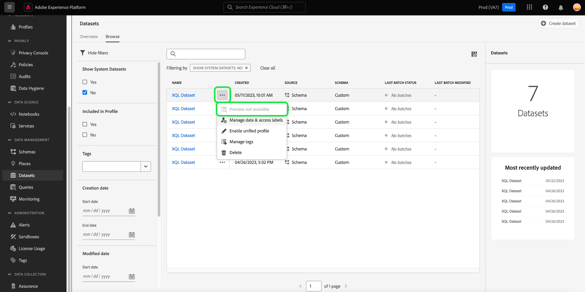

# 데이터 세트 UI 안내서

이 사용 안내서는 Adobe Experience Platform 사용자 인터페이스 내에서 데이터 세트로 작업할 때 일반적인 작업을 수행하는 방법에 대한 지침을 제공합니다.

## 시작하기

이 사용 안내서를 사용하려면 Adobe Experience Platform의 다음 구성 요소에 대해 이해하고 있어야 합니다.

* [데이터 세트](overview.md): 의 데이터 지속성을 위한 스토리지 및 관리 구성 [!DNL Experience Platform].
* [[!DNL Experience Data Model (XDM) System]](../../xdm/home.md): 표준화된 프레임워크 [!DNL Experience Platform] 고객 경험 데이터를 구성합니다.
   * [스키마 컴포지션 기본 사항](../../xdm/schema/composition.md): 스키마 컴포지션의 주요 원칙 및 모범 사례를 포함하여 XDM 스키마의 기본 구성 요소에 대해 알아봅니다.
   * [스키마 편집기](../../xdm/tutorials/create-schema-ui.md): 다음을 사용하여 사용자 지정 XDM 스키마를 구축하는 방법 알아보기 [!DNL Schema Editor] 다음 범위 내 [!DNL Platform] 사용자 인터페이스.
* [[!DNL Real-Time Customer Profile]](../../profile/home.md): 여러 소스의 집계 데이터를 기반으로 통합 실시간 소비자 프로필을 제공합니다.
* [[!DNL Adobe Experience Platform Data Governance]](../../data-governance/home.md): 고객 데이터 사용과 관련된 규정, 제한 및 정책을 준수하도록 합니다.

## 데이터 세트 보기 {#view-datasets}

>[!CONTEXTUALHELP]
>id="platform_datasets_negative_numbers"
>title="데이터 세트 활동의 음수"
>abstract="수집된 레코드의 음수는 사용자가 선택한 시간 범위에서 특정 일괄 처리를 삭제했음을 의미합니다."
>text="Learn more in documentation"

>[!CONTEXTUALHELP]
>id="platform_datasets_browse_daysRemaining"
>title="데이터 세트 만료"
>abstract="이 열은 대상 데이터 세트가 자동으로 만료되기 전에 남은 일 수를 나타냅니다."

다음에서 [!DNL Experience Platform] UI, 선택 **[!UICONTROL 데이터 세트]** 을(를) 왼쪽 탐색에서 열어 **[!UICONTROL 데이터 세트]** 대시보드입니다. 대시보드에는 조직에서 사용 가능한 모든 데이터 세트가 나열됩니다. 목록에 있는 각 데이터 세트에 대해 이름, 데이터 세트가 준수하는 스키마, 최근 수집 실행 상태 등 세부 정보가 표시됩니다.

에서 데이터 세트 이름 선택 [!UICONTROL 찾아보기] 탭을 사용하여 액세스 **[!UICONTROL 데이터 세트 활동]** 선택한 데이터 세트에 대한 세부 정보를 표시합니다. 활동 탭에는 메시지 사용률을 시각화한 그래프와 성공/실패한 일괄 처리 집합 목록이 있습니다.

## 기타 액션 {#more-actions}

다음을 수행할 수 있습니다. [!UICONTROL 삭제] 또는 [!UICONTROL 프로필에 대한 데이터 세트 활성화] 다음에서 [!UICONTROL 데이터 세트] 세부 사항 보기. 사용 가능한 작업을 보려면 **[!UICONTROL ... 자세히]** UI의 오른쪽 상단에서. 드롭다운 메뉴가 나타납니다.

![를 사용하는 데이터 세트 작업 공간 [!UICONTROL ... 자세히] 드롭다운 메뉴가 강조 표시됩니다.](../images/datasets/user-guide/more-actions.png)

다음을 선택하는 경우 **[!UICONTROL 프로필에 대한 데이터 세트 활성화]**&#x200B;확인 대화 상자가 나타납니다. 선택 **[!UICONTROL 사용]** 선택을 확인합니다.

>[!NOTE]
>
>프로필에 대한 데이터 세트를 활성화하려면 데이터 세트가 준수하는 스키마가 실시간 고객 프로필과 호환되어야 합니다. 다음을 참조하십시오. [프로필에 대한 데이터 세트 활성화](#enable-profile) 섹션에 자세히 설명되어 있습니다.

다음을 선택하는 경우 **[!UICONTROL 삭제]**, [!UICONTROL 데이터 세트 삭제] 확인 대화 상자가 나타납니다. 선택 **[!UICONTROL 삭제]** 선택을 확인합니다.

>[!NOTE]
>
>시스템 데이터 세트는 삭제할 수 없습니다.

또한 데이터 세트를 삭제하거나 실시간 고객 프로필과 함께 사용할 데이터 세트를 의 인라인 작업에서 추가할 수 있습니다. [!UICONTROL 찾아보기] 탭. 다음을 참조하십시오. [인라인 작업 섹션](#inline-actions) 추가 정보.

## 인라인 데이터 세트 작업 {#inline-actions}

이제 데이터 세트 UI는 사용 가능한 각 데이터 세트에 대한 인라인 작업 컬렉션을 제공합니다. 관리할 데이터 세트의 줄임표(...)를 선택하여 팝업 메뉴에서 사용 가능한 옵션을 확인합니다. 사용 가능한 작업은 다음과 같습니다.

* [[!UICONTROL 데이터 세트 미리 보기]](#preview),
* [[!UICONTROL 데이터 관리 및 액세스 레이블]](#manage-and-enforce-data-governance)
* [[!UICONTROL 통합 프로필 활성화]](#enable-profile)
* [[!UICONTROL 태그 관리]](#manage-tags)
* [[!UICONTROL 폴더로 이동]](#move-to-folders)
* [[!UICONTROL 삭제]](#delete).

사용 가능한 이러한 작업에 대한 자세한 내용은 해당 섹션에서 확인할 수 있습니다. 많은 수의 데이터 세트를 동시에 관리하는 방법은 다음을 참조하십시오. [대량 작업](#bulk-actions) 섹션.

### 데이터 세트 미리 보기 {#preview}

의 인라인 옵션 모두에서 데이터 세트 샘플 데이터를 미리 볼 수 있습니다. [!UICONTROL 찾아보기] 탭 및 [!UICONTROL 데이터 세트 활동] 보기. 다음에서 [!UICONTROL 찾아보기] 탭에서 미리 보려는 데이터 세트 이름 옆의 생략 부호(...)를 선택합니다. 옵션 메뉴 목록이 나타납니다. 그런 다음 을 선택합니다. **[!UICONTROL 데이터 세트 미리 보기]** 사용 가능한 옵션 목록에서. 데이터 세트가 비어 있으면 미리보기 링크가 비활성화되고 대신 미리보기를 사용할 수 없다고 표시됩니다.

그러면 데이터 세트에 대한 스키마의 계층적 보기가 오른쪽에 표시되는 미리보기 창이 열립니다.

또는 **[!UICONTROL 데이터 세트 활동]** 화면, 선택 **[!UICONTROL 데이터 세트 미리 보기]** 화면의 오른쪽 상단 모서리 근처에서 최대 100개의 데이터 행을 미리 볼 수 있습니다.

데이터에 액세스하는 더 강력한 방법은 [!DNL Experience Platform] 다음과 같은 다운스트림 서비스 제공 [!DNL Query Service] 및 [!DNL JupyterLab] 를 클릭하여 데이터를 탐색하고 분석합니다. 자세한 내용은 다음 문서를 참조하십시오.

* [쿼리 서비스 개요](../../query-service/home.md)
* [JupyterLab 사용 안내서](../../data-science-workspace/jupyterlab/overview.md)

### 데이터 세트에 대한 데이터 거버넌스 관리 및 적용 {#manage-and-enforce-data-governance}

의 인라인 옵션을 선택하여 데이터 세트에 대한 데이터 거버넌스 레이블을 관리할 수 있습니다. [!UICONTROL 찾아보기] 탭. 관리하려는 데이터 세트 이름 옆의 생략 부호(...)를 선택한 후 다음을 수행합니다 **[!UICONTROL 데이터 관리 및 액세스 레이블]** 드롭다운 메뉴를 통해 액세스합니다.

스키마 수준에서 적용되는 데이터 사용 레이블을 사용하면 해당 데이터에 적용되는 사용 정책에 따라 데이터 세트와 필드를 분류할 수 있습니다. 다음을 참조하십시오. [데이터 거버넌스 개요](../../data-governance/home.md) 레이블에 대해 자세히 알아보거나 [데이터 사용 레이블 사용 안내서](../../data-governance/labels/overview.md) 데이터 세트에 전달하기 위해 스키마에 레이블을 적용하는 방법에 대한 지침입니다.

## 실시간 고객 프로필에 대한 데이터 세트 활성화 {#enable-profile}

모든 데이터 세트에는 수집된 데이터로 고객 프로필을 보강하는 기능이 있습니다. 이렇게 하려면 데이터 세트에서 사용할 수 있도록 데이터 세트가 준수하는 스키마가 호환되어야 합니다 [!DNL Real-Time Customer Profile]. 호환되는 스키마는 다음 요구 사항을 충족합니다.

* 스키마에 ID 속성으로 지정된 특성이 하나 이상 있습니다.
* 스키마에는 기본 ID로 정의된 ID 속성이 있습니다.

에 대한 스키마 활성화에 대한 자세한 내용 [!DNL Profile], 다음을 참조하십시오. [스키마 편집기 사용 안내서](../../xdm/tutorials/create-schema-ui.md).

의 인라인 옵션 모두에서 프로필에 대한 데이터 세트를 활성화할 수 있습니다. [!UICONTROL 찾아보기] 탭 및 [!UICONTROL 데이터 세트 활동] 보기. 다음에서 [!UICONTROL 찾아보기] 의 탭 [!UICONTROL 데이터 세트] 작업 영역에서 프로필에 대해 활성화할 데이터 세트의 생략 부호를 선택합니다. 옵션 메뉴 목록이 나타납니다. 그런 다음 을 선택합니다. **[!UICONTROL 통합 프로필 활성화]** 사용 가능한 옵션 목록에서.

또는 데이터 세트의 **[!UICONTROL 데이터 세트 활동]** 화면에서 **[!UICONTROL 프로필]** 내에서 전환 **[!UICONTROL 속성]** 열. 활성화되면 데이터 세트에 수집된 데이터는 고객 프로필을 채우는 데에도 사용됩니다.

>[!NOTE]
>
>데이터 세트에 이미 데이터가 포함되어 있고에 대해 활성화된 경우 [!DNL Profile], 기존 데이터는에서 자동으로 사용되지 않습니다. [!DNL Profile]. 다음에 대해 데이터 세트를 활성화한 후 [!DNL Profile], 기존 데이터를 다시 수집하여 고객 프로필에 기여하는 것이 좋습니다.

프로필에 대해 활성화된 데이터 세트도 이 기준으로 필터링할 수 있습니다. 방법에 대한 섹션 참조 [프로필 사용 데이터 세트 필터링](#filter-profile-enabled-datasets) 추가 정보.

### 데이터 세트 태그 관리 {#manage-tags}

사용자 지정 생성 태그를 추가하여 데이터 세트를 구성하고 검색, 필터링 및 정렬 기능을 개선합니다. 다음에서 [!UICONTROL 찾아보기] 의 탭 [!UICONTROL 데이터 세트] 작업 영역에서 관리할 데이터 세트의 생략 부호를 선택한 다음 **[!UICONTROL 태그 관리]** 드롭다운 메뉴를 통해 액세스합니다.

다음 [!UICONTROL 태그 관리] 대화 상자가 나타납니다. 간단한 설명을 입력하여 사용자 지정 태그를 만들거나 기존 태그 중에서 선택하여 데이터 세트에 레이블을 지정합니다. 선택 **[!UICONTROL 저장]** 설정을 확인합니다.

다음 [!UICONTROL 태그 관리] 대화 상자에서 데이터 세트에서 기존 태그를 제거할 수도 있습니다. 제거할 태그 옆에 있는 &#39;x&#39;를 선택하고 를 선택하면 됩니다 **[!UICONTROL 저장]**.

태그가 데이터 세트에 추가되면 해당 태그를 기반으로 데이터 세트를 필터링할 수 있습니다. 방법에 대한 섹션 참조 [태그로 데이터 세트 필터링](#enable-profile) 추가 정보.

쉽게 검색하고 분류할 수 있도록 비즈니스 객체를 분류하는 방법에 대한 자세한 내용은 [메타데이터 분류 관리](../../administrative-tags/ui/managing-tags.md). 이 안내서에서는 적절한 권한이 있는 사용자가 사전 정의된 태그를 만들고, 카테고리를 태그에 할당하고, Platform UI의 태그 및 태그 카테고리에 대한 모든 관련 CRUD 작업을 수행하는 방법에 대해 자세히 설명합니다.

### 폴더로 이동 {#move-to-folders}

더 나은 데이터 세트 관리를 위해 폴더 내에 데이터 세트를 배치할 수 있습니다. 데이터 세트를 폴더로 이동하려면 관리하려는 데이터 세트 이름 옆에 있는 생략 부호(...)를 선택한 다음 를 클릭합니다 **[!UICONTROL 폴더로 이동]** 드롭다운 메뉴를 통해 액세스합니다.

![다음 [!UICONTROL 데이터 세트] 생략 부호 및 가 있는 대시보드 [!UICONTROL 폴더로 이동] 강조 표시됨.](../images/datasets/user-guide/move-to-folder.png)

다음 [!UICONTROL 이동] 폴더 데이터 세트 대화 상자가 나타납니다. 대상자를 이동할 폴더를 선택한 다음 을 선택합니다 **[!UICONTROL 이동]**. 팝업 알림은 데이터 세트 이동이 성공했음을 알려줍니다.

![다음 [!UICONTROL 이동] 데이터 세트 대화 상자 [!UICONTROL 이동] 강조 표시됨.](../images/datasets/user-guide/move-dialog.png)

>[!TIP]
>
>데이터 세트 이동 대화 상자에서 직접 폴더를 만들 수도 있습니다. 폴더를 만들려면 폴더 만들기 아이콘()을 클릭하여 제품에서 사용할 수 있습니다.
>
>![다음 [!UICONTROL 이동] 폴더 만들기 아이콘이 강조 표시된 데이터 세트 대화 상자.](/help/catalog/images/datasets/user-guide/create-folder.png)

데이터 세트가 폴더에 있으면 특정 폴더에 속하는 데이터 세트만 표시하도록 선택할 수 있습니다. 폴더 구조를 열려면 폴더 표시 아이콘(). 그런 다음 선택한 폴더를 선택하여 연결된 모든 데이터 세트를 확인합니다.

![다음 [!UICONTROL 데이터 세트] 데이터 세트 폴더 구조가 표시되고, 폴더 표시 아이콘 및 선택한 폴더가 강조 표시된 대시보드](../images/datasets/user-guide/folder-structure.png)

### 데이터 세트 삭제 {#delete}

의 데이터 세트 인라인 작업에서 데이터 세트를 삭제할 수 있습니다. [!UICONTROL 찾아보기] 탭 또는 오른쪽 상단 [!UICONTROL 데이터 세트 활동] 보기. 다음에서 [!UICONTROL 찾아보기] 을(를) 보고, 삭제하려는 데이터 세트 이름 옆에 있는 생략 부호(...)를 선택합니다. 옵션 메뉴 목록이 나타납니다. 그런 다음 을 선택합니다. **[!UICONTROL 삭제]** 드롭다운 메뉴를 통해 액세스합니다.

확인 대화 상자가 나타납니다. **[!UICONTROL 삭제]**&#x200B;를 선택하여 확인합니다.

또는 을 선택합니다. **[!UICONTROL 데이터 세트 삭제]** 다음에서 **[!UICONTROL 데이터 세트 활동]** 화면.

>[!NOTE]
>
>Adobe 애플리케이션 및 서비스(예: Adobe Analytics, Adobe Audience Manager 또는 [!DNL Offer Decisioning])은(는) 삭제할 수 없습니다.

확인 상자가 나타납니다. 선택 **[!UICONTROL 삭제]** 데이터 세트 삭제를 확인합니다.

### 프로필 활성화 데이터 세트 삭제

데이터 세트가 프로필에 대해 활성화된 경우 UI를 통해 해당 데이터 세트를 삭제하면 데이터 레이크, ID 서비스 및 프로필 스토어의 해당 데이터 세트와 연결된 모든 프로필 데이터에서도 삭제됩니다.

데이터 세트와 연결된 프로필 데이터를 [!DNL Profile] 실시간 고객 프로필 API를 사용하여 (데이터를 데이터 레이크에 둡니다.) 자세한 내용은 [프로필 시스템 작업 API 끝점 안내서](../../profile/api/profile-system-jobs.md).

## 데이터 세트 검색 및 필터링 {#search-and-filter}

사용 가능한 데이터 세트 목록을 검색하거나 필터링하려면 필터 아이콘()을 클릭하여 제품에서 사용할 수 있습니다. 왼쪽 레일에 필터 옵션 세트가 나타납니다. 사용 가능한 데이터 세트를 필터링하는 방법에는 몇 가지가 있습니다. 여기에는 다음이 포함됩니다. [[!UICONTROL 시스템 데이터 세트 표시]](#show-system-datasets), [[!UICONTROL 프로필에 포함됨]](#filter-profile-enabled-datasets), [[!UICONTROL 태그]](#filter-by-tag), [[!UICONTROL 제작일]](#filter-by-creation-date), [[!UICONTROL 수정한 날짜], [!UICONTROL 작성자:]](#filter-by-creation-date), 및 [[!UICONTROL 스키마]](#filter-by-schema).

적용된 필터 목록이 필터링된 결과 위에 표시됩니다.

### 시스템 데이터 세트 표시 {#show-system-datasets}

기본적으로 데이터를 수집한 데이터 세트만 표시됩니다. 시스템에서 생성한 데이터 세트를 보려면 **[!UICONTROL 예]** 의 확인란 [!UICONTROL 시스템 데이터 세트 표시] 섹션. 시스템에서 생성한 데이터 세트는 다른 구성 요소를 처리하는 데만 사용됩니다. 예를 들어 시스템에서 생성한 프로필 내보내기 데이터 세트는 프로필 대시보드를 처리하는 데 사용됩니다.

![을 사용하는 데이터 세트 작업 공간의 필터 옵션 [!UICONTROL 시스템 데이터 세트 표시] 강조 표시된 섹션입니다.](../images/datasets/user-guide/show-system-datasets.png)

### 프로필 사용 데이터 세트 필터링 {#filter-profile-enabled-datasets}

프로필 데이터에 대해 활성화된 데이터 세트는 데이터가 수집된 후 고객 프로필을 채우는 데 사용됩니다. 의 섹션을 참조하십시오. [프로필에 대한 데이터 세트 활성화](#enable-profile) 자세히 알아보십시오.

프로필에 대해 데이터 세트가 활성화되었는지 여부를 기준으로 데이터 세트를 필터링하려면 [!UICONTROL 예] 필터 옵션에서 확인란을 선택합니다.

![을 사용하는 데이터 세트 작업 공간의 필터 옵션 [!UICONTROL 프로필에 포함됨] 강조 표시된 섹션입니다.](../images/datasets/user-guide/included-in-profile.png)

### 태그로 데이터 세트 필터링 {#filter-by-tag}

에 사용자 지정 태그 이름을 입력합니다. [!UICONTROL 태그] 을 입력한 다음 사용 가능한 옵션 목록에서 태그를 선택하여 해당 태그에 해당하는 데이터 세트를 검색하고 필터링합니다.

![을 사용하는 데이터 세트 작업 공간의 필터 옵션 [!UICONTROL 태그] 입력 및 필터 아이콘이 강조 표시됩니다.](../images/datasets/user-guide/filter-tags.png)

### 만든 날짜별로 데이터 세트 필터링 {#filter-by-creation-date}

데이터 세트는 사용자 지정 기간 동안 만든 날짜별로 필터링할 수 있습니다. 이를 사용하여 내역 데이터를 제외하거나 특정 연대순 데이터 인사이트 및 보고를 생성할 수 있습니다. 선택 [!UICONTROL 시작일] 및 [!UICONTROL 종료일] 각 필드에 대한 달력 아이콘을 선택합니다. 그런 다음 해당 기준을 준수하는 데이터 세트만 찾아보기 탭에 표시됩니다.

### 수정된 날짜별로 데이터 세트 필터링 {#filter-by-modified-date}

생성 날짜 필터와 마찬가지로 마지막으로 수정한 날짜를 기준으로 데이터 세트를 필터링할 수 있습니다. 다음에서 [!UICONTROL 수정한 날짜] 섹션, 선택 [!UICONTROL 시작일] 및 [!UICONTROL 종료일] 각 필드에 대한 달력 아이콘을 선택합니다. 이후 해당 기간 동안 수정된 데이터 세트만 찾아보기 탭에 표시됩니다.

### 스키마로 필터링 {#filter-by-schema}

구조를 정의하는 스키마를 기준으로 데이터 세트를 필터링할 수 있습니다. 드롭다운 아이콘을 선택하거나 스키마 이름을 텍스트 필드에 입력합니다. 잠재적 일치 목록이 나타납니다. 목록에서 적절한 스키마를 선택합니다.

## 대량 작업 {#bulk-actions}

일괄 작업을 사용하여 운영 효율성을 높이고 여러 데이터 세트에 대해 여러 작업을 동시에 수행할 수 있습니다. 다음과 같은 대량 작업으로 시간을 절약하고 구성된 데이터 구조를 유지 관리할 수 있습니다. [폴더로 이동](#move-to-folders), [태그 편집](#manage-tags), 및 [삭제](#delete) 데이터 세트.

한 번에 두 개 이상의 데이터 세트에 대해 작업하려면 각 행에 확인란이 있는 개별 데이터 세트를 선택하거나 열 헤더 확인란이 있는 전체 페이지를 선택합니다. 선택하면 일괄 작업 막대가 나타납니다.

대량 작업을 데이터 세트에 적용할 때는 다음 조건이 적용됩니다.

* UI의 다양한 페이지에서 데이터 세트를 선택할 수 있습니다.
* 필터를 선택하면 선택한 데이터 세트가 재설정됩니다.

## 만든 날짜별로 데이터 세트 정렬 {#sort}

의 데이터 세트 [!UICONTROL 찾아보기] 탭은 오름차순 또는 내림차순 날짜로 정렬할 수 있습니다. 다음 항목 선택 [!UICONTROL 생성됨] 또는 [!UICONTROL 마지막으로 업데이트됨] 오름차순과 내림차순 간에 번갈아 표시할 열 머리글. 선택하면, 열 머리글의 옆에 위쪽 또는 아래쪽 화살표가 있는 이 항목이 열에 표시됩니다.

## 데이터 세트 만들기 {#create}

새 데이터 세트를 만들려면 먼저 **[!UICONTROL 데이터 세트 만들기]** 다음에서 **[!UICONTROL 데이터 세트]** 대시보드입니다.

다음 화면에서는 새 데이터 세트를 만들기 위한 다음 두 가지 옵션이 표시됩니다.

* [스키마에서 데이터 세트 만들기](#schema)
* [CSV 파일에서 데이터 세트 만들기](#csv)

### 기존 스키마로 데이터 세트 만들기 {#schema}

다음에서 **[!UICONTROL 데이터 세트 만들기]** 화면, 선택 **[!UICONTROL 스키마에서 데이터 세트 만들기]** 새 빈 데이터 세트를 만듭니다.

다음 **[!UICONTROL 스키마 선택]** 단계가 나타납니다. 스키마 목록을 탐색하고 선택하기 전에 데이터 세트가 준수할 스키마를 선택합니다. **[!UICONTROL 다음]**.

다음 **[!UICONTROL 데이터 세트 구성]** 단계가 나타납니다. 데이터 세트에 이름과 설명(선택 사항)을 입력한 다음 을 선택합니다. **[!UICONTROL 완료]** 을 클릭하여 데이터 세트를 만듭니다.

스키마 필터를 사용하여 UI의 사용 가능한 데이터 세트 목록에서 데이터 세트를 필터링할 수 있습니다. 방법에 대한 섹션 참조 [스키마로 데이터 세트 필터링](#filter-by-schema) 추가 정보.

### CSV 파일로 데이터 세트 만들기 {#csv}

CSV 파일을 사용하여 데이터 세트를 만들면 제공된 CSV 파일과 일치하는 구조를 데이터 세트에 제공하는 임시 스키마가 만들어집니다. 다음에서 **[!UICONTROL 데이터 세트 만들기]** 화면, 선택 **[!UICONTROL CSV 파일에서 데이터 세트 만들기]**.

다음 **[!UICONTROL 구성]** 단계가 나타납니다. 데이터 세트에 이름과 설명(선택 사항)을 입력한 다음 을 선택합니다. **[!UICONTROL 다음]**.

다음 **[!UICONTROL 데이터 추가]** 단계가 나타납니다. CSV 파일을 드래그하여 화면 중앙에 놓거나 을 선택합니다 **[!UICONTROL 찾아보기]** 를 클릭하여 파일 디렉토리를 탐색합니다. 파일 크기는 최대 10GB입니다. CSV 파일이 업로드되면 다음을 선택합니다. **[!UICONTROL 저장]** 을 클릭하여 데이터 세트를 만듭니다.

>[!NOTE]
>
>CSV 열 이름은 영숫자로 시작해야 하며 문자, 숫자 및 밑줄만 포함할 수 있습니다.

## 데이터 수집 모니터링

다음에서 [!DNL Experience Platform] UI, 선택 **[!UICONTROL 모니터링]** 을 클릭합니다. 다음 **[!UICONTROL 모니터링]** 대시보드를 사용하면 일괄 처리 또는 스트리밍 수집에서 인바운드 데이터의 상태를 볼 수 있습니다. 개별 배치의 상태를 보려면 다음 중 하나를 선택합니다. **[!UICONTROL 엔드투엔드 일괄 처리]** 또는 **[!UICONTROL 전체 스트리밍]**. 대시보드에는 성공, 실패 또는 계속 진행 중인 일괄 처리 또는 스트리밍 수집 실행이 모두 나열됩니다. 각 목록은 배치 ID, 대상 데이터 세트의 이름 및 수집된 레코드 수를 포함하여 배치의 세부 정보를 제공합니다. 대상 데이터 세트가 활성화된 경우 [!DNL Profile]수집된 id 및 프로필 레코드의 수도 표시됩니다.

개별 항목을 선택할 수 있습니다. **[!UICONTROL 일괄 처리 ID]** 에 액세스하려면 **[!UICONTROL 일괄 처리 개요]** 대시보드를 만들고 일괄 처리에 실패할 경우 오류 로그를 포함하여 일괄 처리에 대한 세부 정보를 확인하십시오.

배치를 삭제하려면 다음을 선택합니다 **[!UICONTROL 일괄 처리 삭제]** 대시보드 오른쪽 상단 근처에 있습니다. 배치를 삭제하면 원래 배치가 수집된 데이터 세트에서도 배치의 기록이 제거됩니다.

>[!NOTE]
>
>수집된 데이터가 프로필에 대해 활성화되고 처리된 경우 배치를 삭제해도 프로필 스토어에서 해당 데이터가 삭제되지 않습니다.

## 다음 단계

이 사용 안내서에서는 의 데이터 세트로 작업할 때 일반적인 작업을 수행하는 데 필요한 지침을 제공했습니다 [!DNL Experience Platform] 사용자 인터페이스. 일반적인 작업 수행 단계 [!DNL Platform] 데이터 세트와 관련된 워크플로우는 다음 튜토리얼을 참조하십시오.

* [API를 사용하여 데이터 세트 만들기](create.md)
* [데이터 액세스 API를 사용하여 데이터 세트 데이터 쿼리](../../data-access/home.md)
* [API를 사용하여 실시간 고객 프로필 및 ID 서비스에 대한 데이터 세트 구성](../../profile/tutorials/dataset-configuration.md)
