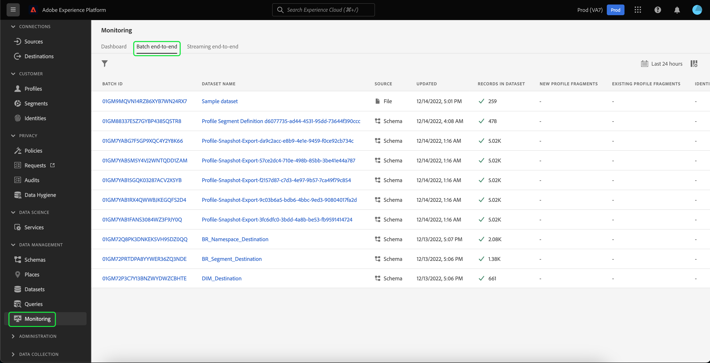

# 데이터 세트 UI 안내서

이 사용 안내서에서는 Adobe Experience Platform 사용자 인터페이스 내에서 데이터 세트를 사용할 때 일반적인 작업을 수행하는 방법에 대한 지침을 제공합니다.

## 시작하기

이 사용 안내서에서는 Adobe Experience Platform의 다음 구성 요소를 이해하고 있어야 합니다.

* [데이터 세트](overview.md): 의 데이터 지속성을 위한 스토리지 및 관리 구성 [!DNL Experience Platform].
* [[!DNL Experience Data Model (XDM) System]](../../xdm/home.md): 표준화된 프레임워크 [!DNL Experience Platform] 고객 경험 데이터를 구성합니다.
   * [스키마 작성 기본 사항](../../xdm/schema/composition.md): 스키마 컴포지션의 주요 원칙 및 모범 사례를 포함하여 XDM 스키마의 기본 빌딩 블록에 대해 알아봅니다.
   * [스키마 편집기](../../xdm/tutorials/create-schema-ui.md): 를 사용하여 고유한 사용자 지정 XDM 스키마를 구축하는 방법을 알아보십시오 [!DNL Schema Editor] 내 [!DNL Platform] 사용자 인터페이스.
* [[!DNL Real-Time Customer Profile]](../../profile/home.md): 여러 소스에서 집계된 데이터를 기반으로 통합된 실시간 소비자 프로필을 제공합니다.
* [[!DNL Adobe Experience Platform Data Governance]](../../data-governance/home.md): 고객 데이터 사용과 관련된 규정, 제한 및 정책을 준수하도록 하십시오.

## 데이터 세트 보기 {#view-datasets}

>[!CONTEXTUALHELP]
>id="platform_datasets_negative_numbers"
>title="데이터 집합 활동의 음수"
>abstract="수집된 레코드의 음수는 사용자가 선택한 시간 범위에서 특정 배치를 삭제했음을 의미합니다."
>text="Learn more in documentation"

에서 [!DNL Experience Platform] UI, 선택 **[!UICONTROL 데이터 세트]** 왼쪽 탐색에서 를 클릭하여 **[!UICONTROL 데이터 세트]** 대시보드 . 대시보드는 조직에 대해 사용 가능한 모든 데이터 세트를 나열합니다. 세부 사항은 해당 이름, 데이터 세트가 준수하는 스키마 및 가장 최근 수집 실행 상태를 포함하여 나열된 각 데이터 세트에 대해 표시됩니다.

기본적으로 수집된 데이터 세트만 표시됩니다. 시스템에서 생성한 데이터 세트를 보려면 **[!UICONTROL 시스템 데이터 세트 표시]** 토글. 시스템 생성 데이터 세트는 다른 구성 요소를 처리하는 데만 사용됩니다. 예를 들어, 시스템에서 생성한 프로필 내보내기 데이터 세트를 사용하여 프로필 대시보드를 처리합니다.

데이터 세트의 이름을 선택하여 액세스합니다 **[!UICONTROL 데이터 집합 활동]** 화면에서 선택한 데이터 세트에 대한 세부 사항을 볼 수 있습니다. 활동 탭에는 사용 중인 메시지 수와 성공 및 실패한 일괄 처리 목록을 시각화하는 그래프가 포함되어 있습니다.

## 데이터 집합 미리 보기

에서 **[!UICONTROL 데이터 집합 활동]** 화면, 선택 **[!UICONTROL 데이터 세트 미리 보기]** 최대 100개의 데이터 행을 미리 보려면 화면의 오른쪽 상단 모서리 근처에 있습니다. 데이터 세트가 비어 있으면 미리 보기 링크가 비활성화되고 대신 미리 보기를 사용할 수 없다고 표시됩니다.

미리 보기 창에서 데이터 세트에 대한 스키마의 계층 구조 보기가 오른쪽에 표시됩니다.

데이터에 액세스하는 강력한 방법을 보려면 [!DNL Experience Platform] 과 같은 다운스트림 서비스를 제공합니다. [!DNL Query Service] 및 [!DNL JupyterLab] 을 입력하여 데이터를 탐색하고 분석할 수 있습니다. 자세한 내용은 다음 문서를 참조하십시오.

* [쿼리 서비스 개요](../../query-service/home.md)
* [JupiterLab 사용 안내서](../../data-science-workspace/jupyterlab/overview.md)

## 데이터 집합 만들기 {#create}

새 데이터 세트를 만들려면 먼저 **[!UICONTROL 데이터 집합 만들기]** 에서 **[!UICONTROL 데이터 세트]** 대시보드 .

다음 화면에는 새 데이터 세트를 만들기 위한 다음 두 가지 옵션이 표시됩니다.

* [스키마에서 데이터 세트 만들기](#schema)
* [CSV 파일에서 데이터 세트 만들기](#csv)

### 기존 스키마를 사용하여 데이터 세트 만들기 {#schema}

에서 **[!UICONTROL 데이터 집합 만들기]** 화면, 선택 **[!UICONTROL 스키마에서 데이터 집합 만들기]** 빈 데이터 세트를 새로 만들려면

다음 **[!UICONTROL 스키마 선택]** 단계가 나타납니다. 선택하기 전에 스키마 목록을 탐색하고 데이터 세트에 준수할 스키마를 선택합니다 **[!UICONTROL 다음]**.

다음 **[!UICONTROL 데이터 집합 구성]** 단계가 나타납니다. 데이터 세트에 이름 및 선택적 설명을 제공한 다음 을 선택합니다 **[!UICONTROL 완료]** 데이터 세트를 만들려면

### CSV 파일로 데이터 세트 만들기 {#csv}

CSV 파일을 사용하여 데이터 세트를 만들면 임시 스키마를 만들어 데이터 세트에 제공된 CSV 파일과 일치하는 구조를 제공합니다. 에서 **[!UICONTROL 데이터 집합 만들기]** 화면, 선택 **[!UICONTROL CSV 파일에서 데이터 세트 만들기]**.

다음 **[!UICONTROL 구성]** 단계가 나타납니다. 데이터 세트에 이름 및 선택적 설명을 제공한 다음 을 선택합니다 **[!UICONTROL 다음]**.

다음 **[!UICONTROL 데이터 추가]** 단계가 나타납니다. CSV 파일을 화면 가운데로 끌어다 놓아 업로드하거나 을 선택합니다 **[!UICONTROL 찾아보기]** 파일 디렉토리를 살펴보려면 파일의 크기는 최대 10GB입니다. CSV 파일이 업로드되면 을(를) 선택합니다 **[!UICONTROL 저장]** 데이터 세트를 만들려면

>[!NOTE]
>
>CSV 열 이름은 영숫자 문자로 시작해야 하며 문자, 숫자 및 밑줄만 포함할 수 있습니다.

## 실시간 고객 프로필에 대한 데이터 세트 활성화 {#enable-profile}

모든 데이터 세트에는 수집된 데이터로 고객 프로필을 보강하는 기능이 있습니다. 이렇게 하려면 데이터 세트가 준수하는 스키마가에서 사용할 수 있어야 합니다 [!DNL Real-Time Customer Profile]. 호환 가능한 스키마는 다음 요구 사항을 충족합니다.

* 스키마에 ID 속성으로 지정된 속성이 하나 이상 있습니다.
* 스키마에는 기본 ID로 정의된 ID 속성이 있습니다.

스키마 활성화 [!DNL Profile]를 참조하고 [스키마 편집기 사용 안내서](../../xdm/tutorials/create-schema-ui.md).

프로필에 데이터 세트를 사용하려면 해당 프로필에 액세스합니다 **[!UICONTROL 데이터 집합 활동]** 화면 및 을(를) 선택하고 **[!UICONTROL 프로필]** 내에서 전환 **[!UICONTROL 속성]** 열. 활성화되면 데이터 집합에 수집되는 데이터도 고객 프로필을 채우는 데 사용됩니다.

>[!NOTE]
>
>데이터 세트에 이미 데이터가 포함되어 있고에 대해 활성화된 경우 [!DNL Profile]에서 기존 데이터를 자동으로 사용하지 않습니다. [!DNL Profile]. 데이터 세트가 다음에 대해 활성화되면 [!DNL Profile]기존 데이터를 다시 수집하여 고객 프로필에 기여하는 것이 좋습니다.

## 데이터 세트에서 데이터 거버넌스 관리 및 적용

데이터 사용 레이블을 사용하면 해당 데이터에 적용되는 사용 정책에 따라 데이터 세트와 필드를 분류할 수 있습니다. 자세한 내용은 [데이터 거버넌스 개요](../../data-governance/home.md) 레이블에 대해 자세히 알아보려면 [데이터 사용 레이블 사용 안내서](../../data-governance/labels/overview.md) 를 참조하십시오.

## 데이터 집합 삭제 {#delete}

데이터 세트에 먼저 액세스하여 데이터 세트를 삭제할 수 있습니다 **[!UICONTROL 데이터 집합 활동]** 화면. 그런 다음 **[!UICONTROL 데이터 집합 삭제]** 삭제할 수 있습니다.

>[!NOTE]
>
>Adobe 애플리케이션 및 서비스(예: Adobe Analytics, Adobe Audience Manager 또는 [!DNL Offer Decisioning])은 삭제할 수 없습니다.

확인 상자가 나타납니다. 선택 **[!UICONTROL 삭제]** 를 클릭하여 데이터 집합 삭제를 확인합니다.

## 프로필 사용 데이터 세트 삭제

프로필에 대해 데이터 세트가 활성화되어 있으면 UI를 통해 해당 데이터 세트를 삭제하면 Data Lake, Identity Service 및 Platform 내의 프로필 저장소에서 삭제됩니다.

에서 데이터 세트를 삭제할 수 있습니다 [!DNL Profile] 실시간 고객 프로필 API를 사용하여 데이터만 저장(Data Lake에 데이터 유지)합니다. 자세한 내용은 [프로필 시스템 작업 API 끝점 안내서](../../profile/api/profile-system-jobs.md).

## 데이터 수집 모니터링

에서 [!DNL Experience Platform] UI, 선택 **[!UICONTROL 모니터링]** 를 클릭합니다. 다음 **[!UICONTROL 모니터링]** 대시보드를 사용하면 일괄 처리 또는 스트리밍 수집에서 인바운드 데이터의 상태를 볼 수 있습니다. 개별 배치의 상태를 보려면 다음 중 하나를 선택합니다 **[!UICONTROL 일괄적으로]** 또는 **[!UICONTROL 처음부터 끝까지 스트리밍]**. 대시보드는 성공, 실패 또는 아직 진행 중인 일괄 처리 또는 스트리밍 수집 실행을 모두 나열합니다. 각 목록은 배치 ID, 대상 데이터 세트의 이름, 수집된 레코드 수를 포함하여 배치에 대한 세부 정보를 제공합니다. 대상 데이터 세트에 대해 활성화되어 있을 경우 [!DNL Profile]수집된 id 및 프로필 레코드 수도 표시됩니다.

개인 **[!UICONTROL 배치 ID]** 에 액세스하려면 **[!UICONTROL 배치 개요]** 대시보드를 보고 일괄 처리가 실패할 경우 오류 로그를 포함한 일괄 처리에 대한 세부 정보를 확인하십시오.

배치를 삭제하려면 **[!UICONTROL 일괄 처리 삭제]** 대시보드 오른쪽 상단 근처에 있습니다. 이렇게 하면 배치가 원래 수집된 데이터 세트에서 해당 레코드도 제거됩니다.

## 다음 단계

이 사용 안내서에서는 의 데이터 세트로 작업할 때 일반적인 작업을 수행하는 지침을 제공했습니다 [!DNL Experience Platform] 사용자 인터페이스. 일반적인 작업 수행 절차 [!DNL Platform] 데이터 세트를 포함하는 워크플로우는 다음 자습서를 참조하십시오.

* [API를 사용하여 데이터 세트 만들기](create.md)
* [데이터 액세스 API를 사용하여 데이터 집합 데이터 쿼리](../../data-access/home.md)
* [API를 사용하여 실시간 고객 프로필 및 ID 서비스에 대한 데이터 세트 구성](../../profile/tutorials/dataset-configuration.md)
