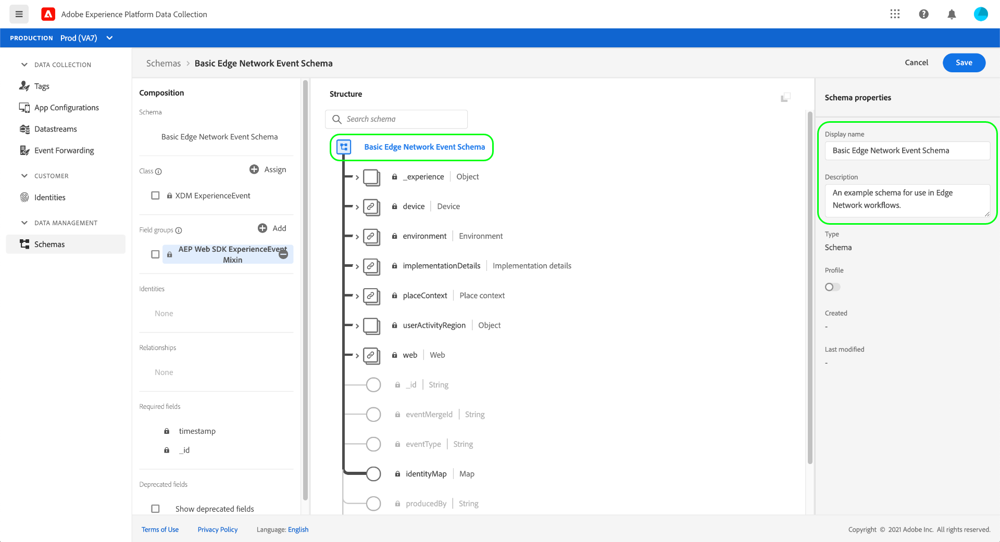

# 데이터 수집의 전체적인 개요

Adobe Experience Platform은 데이터를 수집하여 다른 Adobe 제품 및 서드파티 대상으로 전송합니다. 애플리케이션에서 Experience Platform Edge Network으로 이벤트 데이터를 보내려면 이러한 핵심 기술을 이해하고, 필요할 때 원하는 대상에 데이터를 제공하도록 구성하는 방법을 알고 있어야 합니다.

이 안내서에서는 Platform의 데이터 수집 기능을 사용하여 Edge Network을 통해 이벤트를 전송하는 방법에 대한 높은 수준의 자습서를 제공합니다. 특히, 자습서에서는 데이터 수집 UI(이전의 Adobe Experience Platform Launch) 내에서 Adobe Experience Platform Web SDK 태그 확장 기능을 설치하고 구성하는 단계를 안내합니다.

>[!NOTE]
>
>태그를 사용하지 않으려면 SDK를 수동으로 설치 및 구성하도록 선택할 수도 있지만, 주변 단계는 아래에 설명된 대로 완료해야 합니다.
>
>데이터 수집 UI와 관련된 모든 단계는 Experience Platform UI에서 수행할 수도 있습니다.

## 전제 조건

이 자습서에서는 데이터 수집 UI를 사용하여 스키마를 만들고 데이터스트림을 구성하고 웹 SDK를 설치합니다. UI에서 이러한 작업을 수행하려면 다음 [속성 권한](../tags/ui/administration/user-permissions.md#property-rights)과 함께 하나 이상의 웹 속성에 대한 액세스 권한이 부여되어야 합니다.

* 개발
* 확장 관리

속성 및 속성 권한에 대한 액세스 권한을 부여하는 방법을 알아보려면 [데이터 수집에 대한 권한 관리](./permissions.md)에 대한 안내서를 참조하십시오.

이 안내서에 언급된 다양한 데이터 수집 제품을 사용하려면 데이터스트림에 대한 액세스 권한과 스키마를 만들고 관리할 수 있는 기능도 있어야 합니다. 이러한 기능 중 하나에 액세스해야 하는 경우 Adobe 계정 팀에 연락하여 필요한 액세스 권한을 얻으십시오. Adobe Experience Platform을 구매하지 않은 경우 Adobe에서 추가 비용 없이 SDK를 사용하는 데 필요한 액세스 권한을 프로비저닝합니다.

이미 플랫폼에 액세스할 수 있는 경우 다음 범주의 모든 [권한](../access-control/home.md#permissions)이 활성화되어 있는지 확인해야 합니다.

* 데이터 모델링
* ID

사용자에게 Platform 기능에 대한 권한을 부여하는 방법을 알아보려면 [액세스 제어 UI 개요](../access-control/ui/overview.md)를 참조하십시오.

## 프로세스 요약

웹 사이트에 대한 데이터 수집을 구성하는 프로세스는 다음과 같이 요약할 수 있습니다.

1. Edge Network으로 보낼 때 데이터가 구조화되는 방식을 확인하려면 [스키마를 만듭니다](#schema).
1. 데이터를 보낼 대상을 구성하려면 [데이터 스트림을 만듭니다](#datastream).
1. 웹 사이트에서 특정 이벤트가 발생할 때 데이터스트림으로 데이터를 보내도록 [Web SDK를 설치 및 구성](#sdk)합니다.

Edge Network에 데이터를 보낼 수 있게 되면 조직에 해당 라이선스가 있는 경우 선택적으로 [이벤트 전달을 구성](#event-forwarding)할 수도 있습니다.

## 스키마 만들기 {#schema}

[XDM(Experience Data Model)](../xdm/home.md)은 스키마의 형태로 데이터에 대한 일반적인 구조와 정의를 제공하는 오픈 소스 사양입니다. 즉, XDM은 Edge Network 및 기타 Adobe Experience Cloud 애플리케이션에서 실행 가능한 방식으로 데이터를 구조화하고 형식을 지정하는 방법입니다.

데이터 수집 작업을 설정하는 첫 번째 단계는 데이터를 나타내는 XDM 스키마를 만드는 것입니다. 이 자습서의 이후 단계에서는 전송할 데이터를 이 스키마의 구조에 매핑합니다.

>[!NOTE]
>
>XDM 스키마는 사용자 지정할 수 있습니다. 아래에 설명된 단계는 지나치게 규범적이기보다는 웹 SDK에 대한 스키마 요구 사항에 중점을 둡니다. 이러한 매개 변수 외부에서 원하는 대로 데이터의 나머지 구조를 자유롭게 정의할 수 있습니다.

UI의 왼쪽 탐색에서 **[!UICONTROL 스키마]**&#x200B;를 선택합니다. 여기에서 조직에 속한 이전에 생성된 스키마 목록을 볼 수 있습니다. 계속하려면 **[!UICONTROL 스키마 만들기]**&#x200B;를 선택한 다음 드롭다운 메뉴에서 **[!UICONTROL XDM ExperienceEvent]**&#x200B;을(를) 선택하십시오.


스키마에 필드 그룹을 추가할지 묻는 대화 상자가 나타납니다. Web SDK를 사용하여 이벤트를 보내려면 필드 그룹 **[!UICONTROL AEP Web SDK ExperienceEvent Mixin]**&#x200B;을(를) 추가해야 합니다. 이 필드 그룹에는 웹 SDK 라이브러리에서 자동으로 수집하는 데이터 특성에 대한 정의가 포함되어 있습니다.

검색 창을 사용하여 목록의 범위를 좁혀 이 필드 그룹을 더 쉽게 찾을 수 있습니다. 찾은 후에는 **[!UICONTROL 필드 그룹 추가]**&#x200B;를 선택하기 전에 목록에서 선택하십시오.


웹 SDK 필드 그룹에서 제공하는 필드를 포함하는 XDM 스키마의 트리 구조를 보여 주는 스키마 캔버스 가 표시됩니다.


트리에서 루트 필드를 선택하여 오른쪽 레일에서 **[!UICONTROL 스키마 속성]**&#x200B;을 엽니다. 이 레일에서 스키마에 대한 이름과 선택적 설명을 입력할 수 있습니다.



스키마에 필드를 추가하려면 왼쪽 레일의 **[!UICONTROL 필드 그룹]** 섹션에서 **[!UICONTROL 추가]**&#x200B;를 선택하면 됩니다.


>[!NOTE]
>
>사용 사례에 맞게 다양한 필드 그룹을 검색하는 방법에 대한 자세한 단계는 XDM 설명서의 [필드 그룹 추가](../xdm/ui/resources/schemas.md#add-field-groups)에 대한 안내서를 참조하십시오.
>
>가장 좋은 방법은 Edge Network을 통해 보낼 예정인 데이터에 대해서만 필드를 추가하는 것입니다. 스키마에 필드를 추가하고 저장하면 이후에 스키마에 추가 변경만 수행할 수 있습니다. 자세한 내용은 [스키마 진화 규칙](../xdm/schema/composition.md#evolution)의 섹션을 참조하십시오.

필요한 필드를 추가한 후에는 **[!UICONTROL 저장]**&#x200B;을 선택하여 스키마를 저장합니다.


## 데이터 스트림 만들기 {#datastream}

데이터 스트림은 데이터를 전송할 위치를 Edge Network에 알려 주는 구성입니다. 특히 데이터 스트림은 데이터를 보낼 Experience Cloud 제품과 각 제품에서 데이터를 처리하고 저장할 방법을 지정합니다.

>[!NOTE]
>
>[이벤트 전달](../tags/ui/event-forwarding/overview.md)을 사용하려면(조직에 기능 라이선스가 있다고 가정할 경우) Adobe 제품을 사용하는 것과 같은 방식으로 데이터 스트림에 대해 활성화해야 합니다. 이 프로세스에 대한 자세한 내용은 [이후 섹션](#event-forwarding)에서 다룹니다.

왼쪽 탐색에서 **[!UICONTROL 데이터스트림]**&#x200B;을 선택합니다. 여기에서 편집할 기존 데이터 스트림을 목록에서 선택하거나 **[!UICONTROL 새 데이터 스트림]**&#x200B;을 선택하여 새 구성을 만들 수 있습니다.


데이터 스트림에 대한 구성 요구 사항은 데이터를 보내는 제품 및 기능에 따라 다릅니다. 각 제품의 구성 옵션에 대한 자세한 내용은 [데이터스트림 개요](../datastreams/overview.md)를 참조하세요.

## 웹 SDK 설치 및 구성 {#install}

스키마와 데이터스트림을 생성했으면 다음 단계는 Platform Web SDK를 설치하고 구성하여 Edge Network에 데이터를 전송하는 것입니다.

>[!NOTE]
>
>이 섹션에서는 데이터 수집 UI를 사용하여 웹 SDK 태그 확장을 구성하지만 대신 원시 코드를 사용하여 설치하고 구성할 수도 있습니다. 자세한 내용은 다음 안내서를 참조하십시오.
>
>* [SDK 설치](/help/web-sdk/install/overview.md)
>* [SDK 구성](/help/web-sdk/commands/configure/overview.md)
>
>또한 이벤트 전달만 사용하려는 경우에도 [이후 단계](#event-forwarding)에서 이벤트 전달을 구성하기 전에 설명한 대로 SDK를 설치하고 구성해야 합니다.

프로세스는 다음과 같이 요약할 수 있습니다.

1. [태그 속성에 Adobe Experience Platform Web SDK를 설치](#install-sdk)하여 해당 기능에 액세스할 수 있습니다.
1. [XDM 개체 데이터 요소를 만들어](#data-element) 웹 사이트의 변수를 이전에 만든 XDM 스키마의 구조에 매핑합니다.
1. [규칙을 만들어](#rule) SDK에서 Edge Network에 데이터를 보내야 하는 시기를 알려 줍니다.
1. [라이브러리를 빌드하고 설치](#library)하여 웹 사이트에 규칙을 구현합니다.

### 태그 속성에 SDK 설치 {#install-sdk}

태그 속성 목록을 표시하려면 왼쪽 탐색에서 **[!UICONTROL 태그]**&#x200B;을(를) 선택하십시오. 원하는 경우 편집할 기존 속성을 선택하거나 **[!UICONTROL 새 속성]**&#x200B;을 선택할 수 있습니다.


새 속성을 만드는 경우 수사적 이름을 입력하고 [!UICONTROL Platform]을(를) **[!UICONTROL Web]**(으)로 설정하십시오. 웹 속성의 전체 도메인을 제공한 다음 **[!UICONTROL 저장]**&#x200B;을 선택합니다.


속성에 대한 개요 페이지가 나타납니다. 여기에서 왼쪽 탐색에서 **[!UICONTROL 확장]**&#x200B;을 선택한 다음 **[!UICONTROL 카탈로그]**&#x200B;를 선택합니다. Platform Web SDK에 대한 목록을 찾아(필요한 경우 검색 창을 사용하여 결과 좁히기) **[!UICONTROL 설치]**&#x200B;를 선택합니다.


SDK에 대한 구성 페이지가 나타납니다. 대부분의 필수 값은 원하는 경우 변경할 수 있는 기본값으로 자동 채워집니다.


그러나 SDK를 설치하기 전에 데이터를 전송할 위치를 알 수 있도록 데이터 스트림을 선택해야 합니다. **[!UICONTROL 데이터스트림]**&#x200B;에서 드롭다운 메뉴를 사용하여 [이전 단계](#datastream)에서 구성한 데이터스트림을 선택합니다. 데이터 스트림을 설정했으면 **[!UICONTROL 저장]**&#x200B;을 선택하여 속성에 SDK 설치를 완료합니다.


### XDM 데이터 요소 만들기 {#data-element}

SDK가 Edge Network에 데이터를 전송하려면 해당 데이터가 [이전 단계](#schema)에서 만든 XDM 스키마에 매핑되어야 합니다. 이 매핑은 데이터 요소를 사용하여 수행됩니다.

UI에서 **[!UICONTROL 데이터 요소]**&#x200B;를 선택한 다음 **[!UICONTROL 새 데이터 요소 만들기]**&#x200B;를 선택합니다.


다음 화면에서는 [!UICONTROL 확장] 드롭다운에서 **[!UICONTROL Adobe Experience Platform Web SDK]**&#x200B;을 선택한 다음 데이터 요소 유형으로 **[!UICONTROL XDM 개체]**&#x200B;를 선택합니다.


XDM 개체 유형에 대한 구성 대화 상자가 나타납니다. 대화 상자에서 Platform 샌드박스를 자동으로 선택하며, 여기에서 해당 샌드박스에서 생성된 모든 스키마를 볼 수 있습니다. 목록에서 이전에 만든 XDM 스키마를 선택합니다.


스키마 구조가 나타납니다. 별표(**\***)가 있는 모든 필드는 이벤트가 실행될 때 자동으로 채워지는 필드를 나타냅니다. 다른 모든 필드의 경우 스키마 구조를 살펴보고 나머지 데이터를 채울 수 있습니다.


>[!NOTE]
>
>위의 스크린샷은 백분율 기호(`%`)로 둘러싸인 [!UICONTROL 값] 필드의 이름을 참조하여 웹 사이트(`cartAbandonsTotal`)의 클라이언트측에서 전역적으로 액세스할 수 있는 변수를 XDM 필드에 매핑하는 방법을 보여 줍니다.
>
>이전에 만든 다른 데이터 요소를 사용하여 이러한 필드를 채울 수도 있습니다. 자세한 내용은 태그 설명서의 [데이터 요소](../tags/ui/managing-resources/data-elements.md)에 대한 참조를 참조하십시오.

스키마에 데이터를 매핑했으면 **[!UICONTROL 저장]**&#x200B;을 선택하기 전에 데이터 요소의 이름을 입력하십시오.


### 규칙 만들기

데이터 요소를 저장한 후 다음 단계는 웹 사이트에서 특정 이벤트가 발생할 때마다(예: 고객이 장바구니에 제품을 추가할 때) Edge Network에게 보내는 규칙을 만드는 것입니다.

웹 사이트에서 발생할 수 있는 거의 모든 이벤트에 대한 규칙을 설정할 수 있습니다. 예를 들어 이 섹션에서는 고객이 양식을 제출할 때 트리거되는 규칙을 만드는 방법을 보여줍니다. 다음 HTML은 규칙의 주제가 될 &quot;장바구니에 추가&quot; 양식이 있는 간단한 웹 페이지를 나타냅니다.

```html
<!DOCTYPE html>
<html>
<body>

  <form id="add-to-cart-form">
    <label for="item">Product:</label><br>
    <input type="text" id="item" name="item"><br>
    <label for="amount">Amount:</label><br>
    <input type="number" id="amount" name="amount" value="1"><br><br>
    <input type="submit" value="Add to Cart">
  </form> 

</body>
</html>
```

데이터 수집 UI의 왼쪽 탐색에서 **[!UICONTROL 규칙]**&#x200B;을 선택한 다음 **[!UICONTROL 새 규칙 만들기]**&#x200B;를 선택합니다.


다음 화면에서 규칙 이름을 입력합니다. 여기에서 다음 단계는 규칙에 대한 이벤트를 결정하는 것입니다(즉, 규칙이 언제 실행되는지). [!UICONTROL 이벤트]에서 **[!UICONTROL 추가]**&#x200B;를 선택합니다.


이벤트 구성 페이지가 나타납니다. 이벤트를 구성하려면 먼저 이벤트 유형을 선택해야 합니다. 이벤트 유형은 확장에서 제공합니다. 예를 들어 &quot;양식 제출&quot; 이벤트를 설정하려면 **[!UICONTROL Core]** 확장을 선택한 다음 **[!UICONTROL Form]** 범주 아래에서 **[!UICONTROL Submit]** 이벤트 유형을 선택합니다.

>[!NOTE]
>
>구성 방법을 포함하여 Adobe 웹 확장에서 제공하는 다양한 이벤트 유형에 대한 자세한 내용은 태그 설명서의 [Adobe 확장 참조](../tags/extensions/client/overview.md)를 참조하십시오.

양식 제출 이벤트를 사용하면 [CSS 선택기](https://www.w3schools.com/css/css_selectors.asp)을 사용하여 규칙을 실행할 특정 요소를 참조할 수 있습니다. 아래 예에서는 ID `add-to-cart-form`이(가) 사용되므로 이 규칙은 &quot;장바구니에 추가&quot; 양식에 대해서만 실행됩니다. 규칙에 이벤트를 추가하려면 **[!UICONTROL 변경 내용 유지]**&#x200B;를 선택하십시오.


이벤트가 추가되었음을 보여주는 규칙 구성 페이지가 다시 나타납니다. 규칙에 추가 조건을 추가하여 &quot;[!UICONTROL If]&quot; 범위를 좁힐 수 있습니다.

그렇지 않은 경우, 다음 단계는 규칙이 실행될 때 수행할 작업을 추가하는 것입니다. 계속하려면 **[!UICONTROL 작업]**&#x200B;에서 **[!UICONTROL 추가]**&#x200B;를 선택하십시오.


작업 구성 페이지가 나타납니다. Edge Network에 데이터를 보내는 규칙을 가져오려면 확장에 대해 **[!UICONTROL Adobe Experience Platform Web SDK]**&#x200B;를 선택하고 작업 유형에 대해 **[!UICONTROL 이벤트 보내기]**&#x200B;를 선택합니다.


이벤트 보내기 작업을 구성하는 추가 옵션을 표시하도록 화면이 업데이트됩니다. **[!UICONTROL Type]**&#x200B;에서 사용자 지정 형식 값을 제공하여 `eventType` XDM 필드를 채울 수 있습니다. **[!UICONTROL XDM 데이터]**&#x200B;에서 이전에 만든 XDM 데이터 형식의 이름을 제공하거나(퍼센트 기호로 둘러싸임) 데이터베이스 아이콘()을 선택하여 목록에서 선택합니다. 이는 궁극적으로 Edge Network에게 전송되는 데이터입니다.

완료되면 **[!UICONTROL 변경 내용 유지]**&#x200B;를 선택합니다.


규칙 구성이 완료되면 **[!UICONTROL 저장]**&#x200B;을 선택하여 프로세스를 완료합니다.


### 라이브러리 빌드 및 설치 {#library}

규칙이 구성되면 태그 라이브러리에 추가하고, 환경에 빌드하고, 웹 사이트에 해당 빌드를 설치할 준비가 된 것입니다.

>[!NOTE]
>
>데이터 수집 UI에서 환경을 아직 설정하지 않은 경우 빌드를 만들려면 먼저 환경을 설정해야 합니다. 자세한 내용은 태그 설명서의 [웹 속성에 대한 환경 구성](../tags/ui/publishing/environments.md#web-configuration)에 대한 섹션을 참조하십시오.

라이브러리를 만들고, 라이브러리에 확장 및 규칙을 추가하고, 환경에 해당 라이브러리를 빌드하는 방법에 대해 알아보려면 태그 설명서의 [라이브러리 관리](../tags/ui/publishing/libraries.md)에 대한 안내서를 참조하십시오. 라이브러리를 만들 때 Platform 웹 SDK 확장 및 이전에 만든 데이터 수집 규칙을 포함해야 합니다.

라이브러리를 만들고 빌드를 환경에 할당하면 웹 사이트의 클라이언트측에 해당 환경을 설치할 수 있습니다. 자세한 내용은 [환경 설치](../tags/ui/publishing/environments.md#installation) 섹션을 참조하십시오.

웹 사이트에 환경을 설치한 후에는 Adobe Experience Platform Debugger을 사용하여 [구현을 테스트](../tags/ui/publishing/embed-code-testing.md)할 수 있습니다.

## 이벤트 전달 구성(선택 사항) {#event-forwarding}

>[!NOTE]
>
>이벤트 전달은 라이센스가 부여된 조직에서만 사용할 수 있습니다.

데이터를 Edge Network에 보내도록 SDK를 구성한 후에는 Edge Network에게 해당 데이터를 전달할 위치를 알려 주는 이벤트 전달을 설정할 수 있습니다.

이벤트 전달을 사용하려면 먼저 이벤트 전달 속성을 만들어야 합니다. 왼쪽 탐색 메뉴에서 **[!UICONTROL 이벤트 전달]**&#x200B;을 선택한 다음 **[!UICONTROL 새 속성]**&#x200B;을 선택합니다. **[!UICONTROL 저장]**&#x200B;을 선택하기 전에 속성의 이름을 입력하십시오.

이벤트 전달 속성을 만든 후 다음 단계는 데이터를 전송할 위치를 결정하는 규칙을 만드는 것입니다. 이벤트 전달 속성에 대한 규칙은 이벤트를 지정할 수 없다는 점을 제외하고 태그 속성과 거의 동일한 방식으로 구성됩니다(이벤트 전달에서는 데이터 스트림에서 직접 수신한 이벤트만 처리하므로). 규칙 작업의 경우 사용 가능한 이벤트 전달 확장 중 하나를 사용하거나 사용자 지정 코드를 사용하여 이벤트를 대신 전달할 수 있습니다.


전과 마찬가지로 규칙을 구성한 후에는 라이브러리에 추가하고 해당 라이브러리를 환경에 빌드해야 합니다.

빌드가 완료되면 마지막 단계는 [이전에 구성한](#datastream)데이터 스트림을 업데이트하고 이벤트 전달을 활성화하는 것입니다. 시작하려면 **[!UICONTROL 데이터스트림]**(으)로 이동하고 목록에서 해당 데이터스트림을 선택합니다. 여기에서 이벤트 전달에 대한 토글을 활성화하고 방금 구성한 속성 및 환경의 이름을 제공합니다.


## 다음 단계

이 안내서에서는 Platform Web SDK를 사용하여 Edge Network으로 데이터를 전송하는 방법에 대한 전체적인 고급 개요를 제공했습니다. 관련된 다양한 구성 요소 및 서비스에 대한 자세한 내용은 이 안내서 전체에 연결된 설명서를 참조하십시오.
