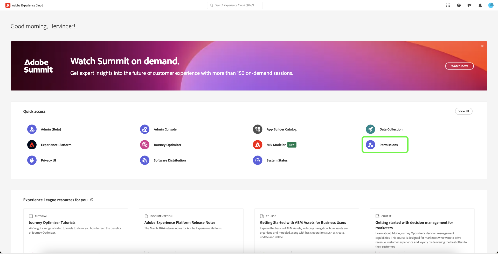

# Experience Platform에서 데이터 수집을 위한 권한 관리 {#permission-management}

>[!CONTEXTUALHELP]
>id="platform_tags_permissions"
>title="권한"
>abstract="Adobe Experience Platform에서 데이터스트림, 스키마, ID 및 샌드박스 작업에 필요한 주요 권한에 대해 알아봅니다."

[Adobe Experience Platform의 데이터 수집](./home.md)은(는) 데이터를 수집하고 전송하기 위해 함께 작동하는 여러 가지 기술로 구성되어 있습니다. 이러한 기술에 대한 액세스는 Adobe Admin Console의 세분화된 역할 기반 권한을 통해 제어됩니다.

이 안내서에서는 데이터 수집 기능에 대한 권한을 관리하는 방법을 보여 줍니다.

## 시작하기

데이터 수집에 대한 액세스 제어를 구성하려면 Adobe Experience Platform 데이터 수집과 제품 통합이 있는 조직에 대한 관리자 권한이 있어야 합니다. 권한을 부여하거나 철회할 수 있는 최소 역할은 **제품 프로필 관리자**&#x200B;입니다. 권한을 관리할 수 있는 다른 관리자 역할은 **제품 관리자**(제품 내의 모든 프로필을 관리할 수 있음) 및 **시스템 관리자**(제한 없음)입니다. 자세한 내용은 Adobe 엔터프라이즈 관리 안내서의 [관리자 역할](https://helpx.adobe.com/kr/enterprise/using/admin-roles.html)에 관한 기사를 참조하십시오.

이 안내서에서는 귀하가 제품 프로필과 같은 기본 Admin Console 개념과 개별 사용자 및 그룹에 제품 권한을 부여하는 방법에 익숙하다고 가정합니다. 자세한 내용은 [Admin Console 사용 안내서](https://helpx.adobe.com/kr/enterprise/using/admin-console.html)를 참조하십시오.

## 사용 가능한 권한

데이터 수집에 대한 관련 권한은 Admin Console에서 두 가지 제품 지정을 통해 제공됩니다. **Adobe Experience Platform** 및 **Adobe Experience Platform 데이터 수집**. 아래 섹션에서는 액세스 권한을 부여하는 특정 기능에 대한 설명과 함께 각 제품에서 제공되는 권한에 대해 간략히 설명합니다.

### Adobe Experience Platform 권한

Adobe Experience Platform 아래의 권한에는 데이터 스트림, ID, 스키마 및 샌드박스에 대한 액세스가 포함됩니다. Adobe Experience Platform 권한을 구성하는 방법에 대한 단계는 [액세스 제어 사용 안내서](../access-control/ui/overview.md)를 참조하십시오.

| 카테고리 | 사용 권한 | 설명 |
| --- | --- | --- |
| 샌드박스 | (N/A) | 조직에서 만든 [샌드박스](../sandboxes/home.md)에 따라 Admin Console의 이 권한 범주를 통해 각 샌드박스에 대한 액세스를 제어할 수 있습니다. |
| 데이터 모델링 | 스키마 관리 | [XDM(Experience Data Model) 스키마를 보고 만들고 편집할 수 있는 기능을 부여합니다](../xdm/home.md). |
| 데이터 모델링 | 스키마 보기 | 스키마에 대한 읽기 전용 액세스 권한을 부여합니다. |
| Identity Management | ID 네임스페이스 관리 | [ID 네임스페이스](../identity-service/features/namespaces.md)를 보고 만들고 편집할 수 있는 권한을 부여합니다. |
| Identity Management | ID 네임스페이스 보기 | ID 네임스페이스에 대한 읽기 전용 액세스 권한을 부여합니다. |
| 데이터 수집 | 데이터 스트림 관리 | [데이터스트림](../datastreams/overview.md)을 보고 만들고 편집할 수 있는 권한을 부여합니다. |
| 데이터 수집 | 데이터스트림 보기 | 데이터스트림에 대한 읽기 전용 액세스 권한을 부여합니다. |

{style="table-layout:auto"}

### Adobe Experience Platform 데이터 수집 권한

Adobe Experience Platform 데이터 수집 아래의 권한은 속성, 확장 및 환경을 포함한 태그 및 이벤트 전달 기능에 대한 액세스를 제어합니다. Adobe Experience Platform 데이터 수집 권한을 구성하는 방법에 대한 단계는 아래 [섹션](#manage)을 참조하세요.

| 카테고리 | 사용 권한 | 설명 |
| --- | --- | --- |
| 플랫폼 | 웹 | 다른 속성 권한과 결합할 경우 [웹 속성](../tags/ui/administration/companies-and-properties.md)에 대한 액세스 권한을 부여합니다. |
| 플랫폼 | 모바일 | 다른 속성 권한과 결합할 경우 [모바일 속성](../tags/ui/administration/companies-and-properties.md)에 대한 액세스 권한을 부여합니다. |
| 플랫폼 | Edge | 다른 속성 권한과 결합할 때 [이벤트 전달 Edge 속성](../tags/ui/event-forwarding/getting-started.md)에 대한 액세스 권한을 부여합니다. |
| 속성 | (N/A) | 조직에서 만든 속성에 따라 Admin Console에서 이 권한 범주를 통해 각 속성에 대한 액세스를 제어할 수 있습니다.  사용자에게 할당된 속성 권한은 이 권한 범주를 통해 액세스 권한이 부여된 속성에만 적용됩니다. |
| 속성 권한 | 승인 | [게시 흐름](../tags/ui/publishing/publishing-flow.md)의 일부로 라이브러리 빌드를 승인하는 기능을 부여합니다. |
| 속성 권한 | 개발 | [게시 흐름](../tags/ui/publishing/publishing-flow.md)의 일부로 라이브러리 빌드를 개발하는 기능을 부여합니다. |
| 속성 권한 | 속성 편집 | 사용자가 액세스할 수 있는 속성의 기본 구성을 편집할 수 있는 권한을 부여합니다. |
| 속성 권한 | 환경 관리 | 사용자가 액세스할 수 있는 속성의 [환경](../tags/ui/publishing/environments.md)을 관리할 수 있는 권한을 부여합니다. |
| 속성 권한 | 확장 관리 | 사용자가 액세스할 수 있는 속성에 대한 [확장](../tags/ui/managing-resources/extensions/overview.md)을 관리할 수 있는 권한을 부여합니다. |
| 속성 권한 | 게시 | 라이브러리 빌드를 [게시 흐름](../tags/ui/publishing/publishing-flow.md)의 일부로 게시할 수 있는 권한을 부여합니다. |
| 회사 권한 | 확장 개발 | 비공개 릴리스 및 공개 릴리스 요청을 포함하여 조직이 소유한 확장 패키지를 만들고 수정하는 권한을 부여합니다. |
| 회사 권한 | 앱 구성 관리 | 이 권한은 모바일 인앱 및 푸시 메시지에 대한 액세스 권한을 부여하는 Adobe Journey Optimizer 또는 다른 솔루션에 대한 라이선스가 있는 경우에만 적용할 수 있습니다. 이를 통해 Adobe Experience Cloud이 알고 있는 앱을 Firebase Cloud Messaging 서비스 및 Apple 푸시 알림 서비스와 통신하는 데 필요한 푸시 자격 증명과 함께 관리할 수 있습니다. |
| 회사 권한 | 속성 관리 | 태그(웹 속성), 이벤트 전달(에지 속성) 및 모바일 속성을 만들고 관리하는 기능을 부여합니다. |

{style="table-layout:auto"}

>[!NOTE]
>
>일반적인 시나리오에 대한 관리 전략을 포함하여 이러한 권한이 태그의 기능에 어떻게 영향을 미치는지에 대한 자세한 내용은 [사용자 권한](../tags/ui/administration/user-permissions.md)에 대한 태그 설명서를 참조하십시오.

## 권한 관리 {#manage}

데이터 수집에 대한 권한은 **Adobe Experience Platform** 및 **Adobe Experience Platform 데이터 수집**&#x200B;의 두 제품 지정을 통해 관리됩니다.

Admin Console의 각 제품에서 관련 권한을 관리하는 방법에 대한 단계는 아래 하위 섹션을 참조하십시오.

* [Adobe Experience Platform 권한](#manage-platform)
* [Adobe Experience Platform 데이터 수집 권한](#manage-collection)

### Adobe Experience Platform에서 권한 관리 {#manage-platform}

>[!NOTE]
>
>역할에 대한 권한을 관리하려면 관리자 권한이 필요합니다. 관리자 권한이 없는 경우 시스템 관리자에게 문의하십시오.

Experience Cloud의 **[!UICONTROL 권한]** 섹션에서 제품 응용 프로그램 내의 기능 및 개체에 대한 액세스를 관리하는 사용자 역할 및 정책을 정의할 수 있습니다.

[!UICONTROL 권한]을 통해 역할을 만들고 관리하며 이러한 역할에 대해 원하는 리소스 권한을 할당할 수 있습니다.

데이터 수집 기능에 액세스하려면 **[!UICONTROL 샌드박스]**, **[!UICONTROL 데이터 모델링]**, **[!UICONTROL Identity Management]** 및 **[!UICONTROL 데이터 수집]** 범주에서 모든 권한을 활성화해야 합니다.

Experience Platform 권한 관리에 대한 자세한 지침은 [액세스 제어 UI 안내서](../access-control/ui/overview.md)를 참조하세요.

>[!NOTE]
>
>조직에서 액세스할 수 있는 제품 SKU에 따라 사용 가능한 모든 Experience Platform 권한이 없을 수도 있습니다.

### Adobe Experience Platform 데이터 수집에서 권한 관리 {#manage-collection}

이러한 권한을 관리하려면 Admin Console에 로그인하고 상단 탐색에서 **[!UICONTROL 제품]**&#x200B;을 선택한 다음 **[!UICONTROL Adobe Experience Platform 데이터 수집]**&#x200B;을 선택하십시오.

#### 제품 프로필 선택 또는 만들기

다음 화면에서는 조직 아래의 데이터 수집에 사용 가능한 제품 프로필 목록을 보여 줍니다. 기본 프로필은 **[!DNL Default Data Collection All Access]**&#x200B;입니다. 원하는 경우 기본 제품 프로필을 편집하도록 선택하거나 **[!UICONTROL 새 프로필]**&#x200B;을 선택하여 만들 수 있습니다. 조직에 서로 다른 액세스 수준이 필요한 여러 역할 또는 사용자 그룹이 있는 경우 각각에 대해 별도의 제품 프로필을 만들어야 합니다.

제품 프로필을 선택하거나 만든 후 **[!UICONTROL 편집]** 아이콘을 사용하여 프로필에 대한 [편집 권한](#edit-permissions)을 시작하거나 **[!UICONTROL 사용자]** 탭을 선택하여 [프로필에 사용자 할당](#assign-users)을 시작할 수 있습니다.

#### 제품 프로필에 대한 권한 편집 {#edit-permissions}

프로필에 대한 권한을 편집할 때 사용 가능한 권한은 왼쪽 열에 나열되고 프로필에 포함된 권한은 오른쪽 열에 나열됩니다. 두 열 사이에 이동하려면 나열된 권한을 선택합니다.

권한은 카테고리로 구성됩니다. 카테고리 간에 전환하려면 왼쪽 탐색 영역에서 원하는 카테고리를 선택합니다.

구성 권한을 완료하면 **[!UICONTROL 저장]**&#x200B;을 선택합니다.

추가된 권한이 반영된 제품 프로필 보기가 다시 표시됩니다.

#### 제품 프로필에 사용자 할당 {#assign-users}

사용자를 제품 프로필에 할당하고 프로필의 구성된 권한을 부여하려면 **[!UICONTROL 사용자]** 탭을 선택한 다음 **[!UICONTROL 사용자 추가]**&#x200B;를 선택합니다.

제품 프로필에 대한 사용자 관리에 대한 자세한 내용은 [Admin Console 설명서](https://helpx.adobe.com/kr/enterprise/using/manage-product-profiles.html)를 참조하십시오.

## 다음 단계

이 안내서에서는 데이터 수집에 사용할 수 있는 권한과 Admin Console을 통해 관리하는 방법에 대해 다룹니다. 기타 Adobe Experience Platform 기능의 권한을 관리하는 방법에 대한 자세한 내용은 [액세스 제어 설명서](../access-control/home.md)를 참조하십시오.
