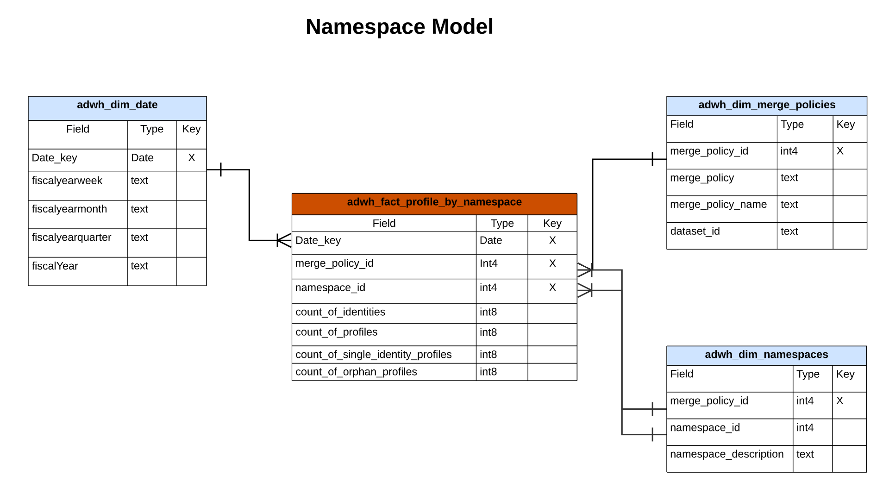

# Real-time Customer Data Platform 통찰력 데이터 모델

Real-time Customer Data Platform 인사이트 데이터 모델 기능은 다양한 프로필, 대상 및 세그멘테이션 위젯에 대한 인사이트를 제공하는 데이터 모델과 SQL을 노출합니다. 이러한 SQL 쿼리 템플릿을 사용자 정의하여 마케팅 및 주요 성능 지표(KPI) 사용 사례에 대한 Real-Time CDP 보고서를 만들 수 있습니다. 그런 다음 이러한 인사이트를 사용자 정의 대시보드에 대한 사용자 정의 위젯으로 사용할 수 있습니다. 자세한 내용은 쿼리 가속 스토어 보고 인사이트 설명서 를 참조하십시오 [가속화된 스토어 데이터 및 사용자 정의 대시보드와 함께 사용하기 위해 쿼리 서비스를 통해 보고 인사이트 데이터 모델을 구축하는 방법](../query-service/data-distiller/query-accelerated-store/reporting-insights-data-model.md).

## 사전 요구 사항

이 안내서를 사용하려면 다음을 이해할 수 있어야 합니다 [사용자 정의 대시보드 기능](./user-defined-dashboards.md). 이 안내서를 계속하기 전에 설명서를 읽어 보십시오.

## Real-Time CDP 인사이트 보고서 및 사용 사례

Real-Time CDP 보고에서는 프로필 데이터와 세그먼트 및 대상과의 관계에 대한 통찰력을 제공합니다. 다양한 일반적인 마케팅 활용 사례에 답변할 수 있도록 다양한 스타 스키마 모델을 개발하였으며, 각 데이터 모델은 여러 활용 사례를 지원할 수 있다.

>[!IMPORTANT]
>
>Real-Time CDP 보고에 사용된 데이터는 선택한 병합 정책 및 가장 최근 일별 스냅샷에서 정확합니다.

### 프로필 모델 {#profile-model}

프로필 모델은 다음 세 개의 데이터 세트로 구성됩니다.

- `adwh_dim_date`
- `adwh_fact_profile`
- `adwh_dim_merge_policies`

아래 이미지에는 각 데이터 세트의 관련 데이터 필드가 포함되어 있습니다.


#### 프로필 개수 사용 사례

프로필 개수 위젯에 사용된 논리는 스냅숏을 만들 때 프로필 저장소 내에 병합된 프로필의 총 수를 반환합니다. 다음을 참조하십시오. [[!UICONTROL 프로필 개수] 위젯 설명서](./guides/profiles.md#profile-count) 추가 정보.

다음을 생성하는 SQL [!UICONTROL 프로필 개수] 위젯은 아래의 축소 가능한 섹션에 표시됩니다.

+++SQL 쿼리

```sql
SELECT adwh_dim_merge_policies.merge_policy_name,
  sum(adwh_fact_profile.count_of_profiles) CNT
FROM qsaccel.profile_agg.adwh_fact_profile
LEFT OUTER JOIN qsaccel.profile_agg.adwh_dim_merge_policies ON adwh_dim_merge_policies.merge_policy_id=adwh_fact_profile.merge_policy_id
WHERE adwh_fact_profile.date_key='${lastProcessDate}'
AND adwh_fact_profile.merge_policy_id=${mergePolicyId}
GROUP BY adwh_dim_merge_policies.merge_policy_name;
```

+++

#### 단일 ID 프로필 사용 사례

에 사용되는 논리 [!UICONTROL 단일 ID 프로필] 위젯에서는 ID를 생성하는 한 가지 유형의 ID만 있는 조직 프로필 수를 제공합니다. 다음을 참조하십시오.[[!UICONTROL 단일 ID 프로필] 위젯 설명서](./guides/profiles.md#single-identity-profiles) 추가 정보.

다음을 생성하는 SQL [!UICONTROL 단일 ID 프로필] 위젯은 아래의 축소 가능한 섹션에 표시됩니다.

+++SQL 쿼리

```sql
SELECT adwh_dim_merge_policies.merge_policy_name,
  sum(adwh_fact_profile.count_of_Single_Identity_profiles) CNT
FROM QSAccel.profile_agg.adwh_fact_profile
LEFT OUTER JOIN QSAccel.profile_agg.adwh_dim_merge_policies ON adwh_dim_merge_policies.merge_policy_id=adwh_fact_profile.merge_policy_id
WHERE adwh_fact_profile.date_key='${lastProcessDate}'
  AND adwh_fact_profile.merge_policy_id =${mergePolicyId}
GROUP BY adwh_dim_merge_policies.merge_policy_name;
```

+++

### 네임스페이스 모델 {#namespace-model}

네임스페이스 모델은 다음 데이터 세트로 구성됩니다.

- `adwh_dim_date`
- `adwh_fact_profile_by_namespace`
- `adwh_dim_merge_policies`
- `adwh_dim_namespaces`

아래 이미지에는 각 데이터 세트의 관련 데이터 필드가 포함되어 있습니다.



#### ID별 프로필 사용 사례

다음 [!UICONTROL ID별 프로필] 위젯은 프로필 스토어에 있는 병합된 모든 프로필의 id 분류를 표시합니다. 다음을 참조하십시오. [[!UICONTROL ID별 프로필] 위젯 설명서](./guides/profiles.md#profiles-by-identity) 추가 정보.

다음을 생성하는 SQL [!UICONTROL ID별 프로필] 위젯은 아래의 축소 가능한 섹션에 표시됩니다.

+++SQL 쿼리

```sql
SELECT adwh_dim_namespaces.namespace_description,
    sum(adwh_fact_profile_by_namespace.count_of_profiles) count_of_profiles
FROM qsaccel.profile_agg.adwh_fact_profile_by_namespace
JOIN qsaccel.profile_agg.adwh_dim_namespaces ON adwh_fact_profile_by_namespace.namespace_id = adwh_dim_namespaces.namespace_id
AND adwh_fact_profile_by_namespace.merge_policy_id = adwh_dim_namespaces.merge_policy_id
WHERE adwh_fact_profile_by_namespace.merge_policy_id =${mergePolicyId}
AND adwh_fact_profile_by_namespace.date_key = '${lastProcessDate}'
GROUP BY adwh_fact_profile_by_namespace.date_key,
        adwh_fact_profile_by_namespace.merge_policy_id,
        adwh_dim_namespaces.namespace_description
ORDER BY count_of_profiles DESC
LIMIT 5;
```

+++

#### ID 사용 사례별 단일 ID 프로필

에 사용되는 논리 [!UICONTROL ID별 단일 ID 프로필] 위젯은 하나의 고유 식별자로만 식별되는 총 프로필 수를 보여 줍니다. 다음을 참조하십시오. [ID 위젯 설명서별 단일 ID 프로필](./guides/profiles.md#single-identity-profiles-by-identity) 추가 정보.

다음을 생성하는 SQL [!UICONTROL ID별 단일 ID 프로필] 위젯은 아래의 축소 가능한 섹션에 표시됩니다.

+++SQL 쿼리

```sql
SELECT
  adwh_dim_namespaces.namespace_description,
  sum(adwh_fact_profile_by_namespace.count_of_Single_Identity_profiles) count_of_Single_Identity_profiles
FROM
  qsaccel.profile_agg.adwh_fact_profile_by_namespace
  LEFT OUTER JOIN
    qsaccel.profile_agg.adwh_dim_namespaces
    ON adwh_fact_profile_by_namespace.namespace_id = adwh_dim_namespaces.namespace_id
AND adwh_fact_profile_by_namespace.merge_policy_id = adwh_dim_namespaces.merge_policy_id
WHERE
  adwh_fact_profile_by_namespace.merge_policy_id=${mergePolicyId}
  AND adwh_fact_profile_by_namespace.date_key='${lastProcessDate}'
GROUP BY
  adwh_fact_profile_by_namespace.date_key,
  adwh_fact_profile_by_namespace.merge_policy_id,
  adwh_dim_namespaces.namespace_description;
```

+++

### 세그먼트 모델 {#segment-model}

세그먼트 모델은 다음 데이터 세트로 구성됩니다.

- `adwh_dim_date`
- `adwh_fact_profile_by_segment`
- `adwh_dim_merge_policies`
- `adwh_dim_segments`
- `adwh_dim_br_segment_destinations`
- `adwh_dim_destination`
- `adwh_dim_destination_platform`

아래 이미지에는 각 데이터 세트의 관련 데이터 필드가 포함되어 있습니다.


#### 대상자 크기 사용 사례

에 사용되는 논리 [!UICONTROL 대상 크기] 위젯은 가장 최근의 스냅샷 시점에 선택한 세그먼트 내에서 병합된 프로필의 총 수를 반환합니다. 다음을 참조하십시오. [[!UICONTROL 대상 크기] 위젯 설명서](./guides/segments.md#audience-size) 추가 정보.

다음을 생성하는 SQL [!UICONTROL 대상 크기] 위젯은 아래의 축소 가능한 섹션에 표시됩니다.

+++SQL 쿼리

```sql
SELECT adwh_fact_profile_by_segment.date_key,
       adwh_dim_merge_policies.merge_policy_name,
       adwh_dim_segments.segment,
       adwh_dim_segments.segment_name,
       sum(adwh_fact_profile_by_segment.count_of_profiles)count_of_profiles
FROM qsaccel.profile_agg.adwh_fact_profile_by_segment
LEFT OUTER JOIN qsaccel.profile_agg.adwh_dim_segments ON adwh_fact_profile_by_segment.segment_id = adwh_dim_segments.segment_id
LEFT OUTER JOIN qsaccel.profile_agg.adwh_dim_merge_policies ON adwh_fact_profile_by_segment.merge_policy_id=adwh_dim_merge_policies.merge_policy_id
WHERE adwh_fact_profile_by_segment.date_key ='${lastProcessDate}'
  AND adwh_fact_profile_by_segment.merge_policy_id=${mergePolicyId}
GROUP BY adwh_fact_profile_by_segment.date_key,
         adwh_dim_merge_policies.merge_policy_name,
         adwh_dim_segments.segment,
         adwh_dim_segments.segment_name
ORDER BY count_of_profiles DESC
LIMIT 20;
```

+++

#### 대상자 크기 변경 트렌드 사용 사례

에 사용되는 논리 [!UICONTROL 대상자 크기 변경 트렌드] 위젯은 가장 최근의 일별 스냅샷 간 주어진 세그먼트에 적합한 총 프로필 수의 차이에 대한 선 그래프 일러스트레이션을 제공합니다. 다음을 참조하십시오. [[!UICONTROL 대상자 크기 변경 트렌드] 위젯 설명서](./guides/segments.md#audience-size-change-trend) 추가 정보.

다음을 생성하는 SQL [!UICONTROL 대상자 크기 변경 트렌드] 위젯은 아래의 축소 가능한 섹션에 표시됩니다.

+++SQL 쿼리

```sql
SELECT DISTINCT cast(adwh_dim_segments.create_date AS Date) Date_key, adwh_dim_merge_policies.merge_policy_name,
  count(DISTINCT adwh_dim_segments.segment_id)Segments_Added
FROM qsaccel.profile_agg.adwh_fact_profile_by_segment
JOIN qsaccel.profile_agg.adwh_dim_segments ON adwh_fact_profile_by_segment.segment_id = adwh_dim_segments.segment_id
JOIN qsaccel.profile_agg.adwh_dim_merge_policies ON adwh_fact_profile_by_segment.merge_policy_id=adwh_dim_merge_policies.merge_policy_id
WHERE Cast(adwh_dim_segments.create_date AS date) >= dateadd(DAY, - ${dayRange}, '${lastProcessDate}')
AND adwh_fact_profile_by_segment.merge_policy_id=${mergePolicyId}
GROUP BY cast(adwh_dim_segments.create_date AS date), adwh_dim_merge_policies.merge_policy_name ;
```

+++

#### 가장 많이 사용되는 대상 사용 사례

에 사용되는 논리 [!UICONTROL 가장 많이 사용한 대상] 위젯은 매핑된 세그먼트의 수에 따라 조직에서 가장 많이 사용하는 대상을 나열합니다. 이 순위는 어떤 대상이 활용되고 있는지에 대한 통찰력을 제공하는 동시에 활용도가 낮을 수 있는 대상을 잠재적으로 보여 줍니다. 다음에서 설명서를 참조하십시오. [[!UICONTROL 가장 많이 사용한 대상] 위젯](./guides/destinations.md#most-used-destinations) 추가 정보.

다음을 생성하는 SQL [!UICONTROL 가장 많이 사용한 대상] 위젯은 아래의 축소 가능한 섹션에 표시됩니다.

+++SQL 쿼리

```sql
SELECT
   adwh_dim_destination.destination_name, adwh_dim_destination.destination_id,
   count( distinct adwh_dim_br_segment_destinations.segment_id ) segment_count
FROM
   qsaccel.profile_agg.adwh_dim_destination
   join qsaccel.profile_agg.adwh_dim_br_segment_destinations
 ON
   adwh_dim_destination.destination_id = adwh_dim_br_segment_destinations.destination_id
 WHERE
   adwh_dim_destination.destination_name is not null
 group by
   adwh_dim_destination.destination_name,
   adwh_dim_destination.destination_id
   order by segment_count desc limit 5;
```

+++

#### 최근에 활성화된 세그먼트 사용 사례

에 대한 논리 [!UICONTROL 최근에 활성화된 세그먼트] 위젯은 대상에 가장 최근에 매핑된 세그먼트의 목록을 제공합니다. 이 목록은 시스템에서 활성화되는 세그먼트와 대상에 대한 스냅샷을 제공하고 잘못된 매핑 문제를 해결하는 데 도움이 됩니다. 다음을 참조하십시오. [[!UICONTROL 최근에 활성화된 세그먼트] 위젯 설명서](./guides/destinations.md#recently-activated-segments) 추가 정보.

다음을 생성하는 SQL [!UICONTROL 최근에 활성화된 세그먼트] 위젯은 아래의 축소 가능한 섹션에 표시됩니다.

+++SQL 쿼리

```sql
SELECT segment_name, segment, destination_name, a.create_time create_time
FROM qsaccel.profile_agg.adwh_dim_br_segment_destinations a
INNER JOIN qsaccel.profile_agg.adwh_dim_segments b ON a.segment_id = b.segment_id
INNER JOIN qsaccel.profile_agg.adwh_dim_destination c ON a.destination_id = c.destination_id
ORDER BY create_time desc, segment LIMIT 5;
```

+++

### 네임스페이스-세그먼트 모델

네임스페이스 세그먼트 모델은 다음 데이터 세트로 구성됩니다.

- `adwh_dim_date`
- `adwh_dim_namespaces`
- `adwh_fact_profile_by_segment_and_namespace`
- `adwh_dim_merge_policies`
- `adwh_dim_segments`
- `adwh_dim_br_segment_destinations`
- `adwh_dim_destination`
- `adwh_dim_destination_platform`

아래 이미지에는 각 데이터 세트의 관련 데이터 필드가 포함되어 있습니다.


#### 세그먼트 사용 사례에 대한 ID별 프로필

에 사용되는 논리 [!UICONTROL ID별 프로필] 위젯은 지정된 세그먼트에 대한 프로필 스토어의 병합된 모든 프로필에서 id의 분류를 제공합니다. 다음을 참조하십시오. [[!UICONTROL ID별 프로필] 위젯 설명서](./guides/segments.md#profiles-by-identity) 추가 정보.

다음을 생성하는 SQL [!UICONTROL ID별 프로필] 위젯은 아래의 축소 가능한 섹션에 표시됩니다.

+++SQL 쿼리

```sql
SELECT adwh_dim_namespaces.namespace_description,
  sum( adwh_fact_profile_by_segment_and_namespace.count_of_profiles) count_of_profiles
FROM qsaccel.profile_agg.adwh_fact_profile_by_segment_and_namespace
LEFT OUTER JOIN qsaccel.profile_agg.adwh_dim_namespaces
ON adwh_fact_profile_by_segment_and_namespace.namespace_id = adwh_dim_namespaces.namespace_id
AND adwh_fact_profile_by_segment_and_namespace.merge_policy_id = adwh_dim_namespaces.merge_policy_id
WHERE adwh_fact_profile_by_segment_and_namespace.segment_id = {segment_id}
AND adwh_fact_profile_by_segment_and_namespace.merge_policy_id = {merge_policy_id}
AND adwh_fact_profile_by_segment_and_namespace.date_key = '{date}'
GROUP BY adwh_dim_namespaces.namespace_description;
```

+++

### 네임스페이스 모델 겹치기

중첩 네임스페이스 모델은 다음 데이터 세트로 구성됩니다.

- `adwh_dim_date`
- `adwh_dim_overlap_namespaces`
- `adwh_fact_profile_overlap_of_namespace`
- `adwh_dim_merge_policies`

아래 이미지에는 각 데이터 세트의 관련 데이터 필드가 포함되어 있습니다.


#### ID 중복(프로필) 사용 사례

에 사용되는 논리 [!UICONTROL ID 중복] 위젯은 의 프로필 중복을 표시합니다. **프로필 저장소** 선택한 두 id가 포함됩니다. 자세한 내용은 [[!UICONTROL ID 중복] 의 위젯 섹션 [!UICONTROL 프로필] 대시보드 설명서](./guides/profiles.md#identity-overlap).

다음을 생성하는 SQL [!UICONTROL ID 중복] 위젯은 아래의 축소 가능한 섹션에 표시됩니다.

+++SQL 쿼리

```sql
SELECT Sum(overlap_col1) overlap_col1,
       Sum(overlap_col2) overlap_col2,
       coalesce(Sum(overlap_count), 0) overlap_count
  FROM
    (SELECT 0 overlap_col1,
            0 overlap_col2,
            Sum(count_of_profiles) overlap_count
     FROM qsaccel.profile_agg.adwh_fact_profile_overlap_of_namespace
     WHERE adwh_fact_profile_overlap_of_namespace.merge_policy_id = ${mergePolicyId}
       AND adwh_fact_profile_overlap_of_namespace.date_key = '${lastProcessDate}'
       AND adwh_fact_profile_overlap_of_namespace.overlap_id IN
         (SELECT adwh_dim_overlap_namespaces.overlap_id
          FROM qsaccel.profile_agg.adwh_dim_overlap_namespaces
          WHERE adwh_dim_overlap_namespaces.merge_policy_id=${mergePolicyId}
            AND adwh_dim_overlap_namespaces.overlap_namespaces IN ('${namespace1}',
                                                                   '${namespace2}')
          GROUP BY adwh_dim_overlap_namespaces.overlap_id
          HAVING Count(*) > 1)
     UNION ALL SELECT count_of_profiles overlap_col1,
                      0 overlap_col2,
                      0 overlap_count
     FROM qsaccel.profile_agg.adwh_fact_profile_by_namespace
     JOIN qsaccel.profile_agg.adwh_dim_namespaces ON
     adwh_fact_profile_by_namespace.namespace_id = adwh_dim_namespaces.namespace_id
     AND adwh_fact_profile_by_namespace.merge_policy_id = adwh_dim_namespaces.merge_policy_id
     WHERE adwh_fact_profile_by_namespace.merge_policy_id = ${mergePolicyId}
       AND adwh_fact_profile_by_namespace.date_key = '${lastProcessDate}'
       AND adwh_dim_namespaces.namespace_description = '${namespace1}'
     UNION ALL SELECT 0 overlap_col1,
                      count_of_profiles overlap_col2,
                      0 Overlap_count
     FROM qsaccel.profile_agg.adwh_fact_profile_by_namespace
     JOIN qsaccel.profile_agg.adwh_dim_namespaces ON
     adwh_fact_profile_by_namespace.namespace_id = adwh_dim_namespaces.namespace_id
     AND adwh_fact_profile_by_namespace.merge_policy_id = adwh_dim_namespaces.merge_policy_id
     WHERE adwh_fact_profile_by_namespace.merge_policy_id = ${mergePolicyId}
       AND adwh_fact_profile_by_namespace.date_key = '${lastProcessDate}'
       AND adwh_dim_namespaces.namespace_description = '${namespace2}' ) a;
```

+++

### 세그먼트 모델별 네임스페이스 겹치기

세그먼트 모델별 중복 네임스페이스는 다음 데이터 세트로 구성됩니다.

- `adwh_dim_date`
- `adwh_dim_overlap_namespaces`
- `adwh_fact_profile_overlap_of_namespace_by_segment`
- `adwh_dim_merge_policies`
- `adwh_dim_segments`
- `adwh_dim_br_segment_destinations`
- `adwh_dim_destination`
- `adwh_dim_destination_platform`

아래 이미지에는 각 데이터 세트의 관련 데이터 필드가 포함되어 있습니다.


#### ID 중복(세그먼트) 사용 사례

에 사용되는 논리 [!UICONTROL 세그먼트] 대시보드 [!UICONTROL ID 중복] 위젯은 특정 세그먼트에 대해 선택한 두 개의 id가 포함된 프로필의 겹침을 보여 줍니다. 자세한 내용은 [[!UICONTROL ID 중복] 의 위젯 섹션 [!UICONTROL 세분화] 대시보드 설명서](./guides/segments.md#identity-overlap).

다음을 생성하는 SQL [!UICONTROL ID 중복] 위젯은 아래의 축소 가능한 섹션에 표시됩니다.

+++SQL 쿼리

```sql
SELECT
   Sum(overlap_col1) overlap_col1,
   Sum( overlap_col2) overlap_col2,
   Sum(overlap_count) Overlap_count
FROM
   (
      SELECT
         0 overlap_col1,
         0 overlap_col2,
         Sum(count_of_profiles) Overlap_count
      FROM
         qsaccel.profile_agg.adwh_fact_profile_overlap_of_namespace_by_segment
      WHERE
         adwh_fact_profile_overlap_of_namespace_by_segment.segment_id = $ {segmentId}
         and adwh_fact_profile_overlap_of_namespace_by_segment.merge_policy_id =$ {mergePolicyId}
         and adwh_fact_profile_overlap_of_namespace_by_segment.date_key = '${lastProcessDate}'
         and adwh_fact_profile_overlap_of_namespace_by_segment.overlap_id IN
         (
            SELECT
               adwh_dim_overlap_namespaces.overlap_id
            FROM
               qsaccel.profile_agg.adwh_dim_overlap_namespaces
            WHERE
               adwh_dim_overlap_namespaces.merge_policy_id =$ {mergePolicyId}
               AND adwh_dim_overlap_namespaces.overlap_namespaces IN
               (
                  '${namespace1}',
                  '${namespace2}'
               )
            GROUP BY
               adwh_dim_overlap_namespaces.overlap_id
            HAVING
               Count(*) > 1
         )
      UNION ALL
      SELECT
         count_of_profiles overlap_col1,
         0 overlap_col2,
         0 Overlap_count
      FROM
         qsaccel.profile_agg.adwh_fact_profile_by_segment_and_namespace
         LEFT OUTER JOIN
            qsaccel.profile_agg.adwh_dim_namespaces
            ON adwh_fact_profile_by_segment_and_namespace.namespace_id = adwh_dim_namespaces.namespace_id
            and adwh_fact_profile_by_segment_and_namespace.merge_policy_id = adwh_dim_namespaces.merge_policy_id
      WHERE
         adwh_dim_namespaces.namespace_description = '${namespace1}'
         and adwh_fact_profile_by_segment_and_namespace.segment_id = $ {segmentId}
         and adwh_fact_profile_by_segment_and_namespace.merge_policy_id =$ {mergePolicyId}
         and adwh_fact_profile_by_segment_and_namespace.date_key = '${lastProcessDate}'
      UNION ALL
      SELECT
         0 overlap_col1,
         count_of_profiles overlap_col2,
         0 Overlap_count
      FROM
         qsaccel.profile_agg.adwh_fact_profile_by_segment_and_namespace
         LEFT OUTER JOIN
            qsaccel.profile_agg.adwh_dim_namespaces
            ON adwh_fact_profile_by_segment_and_namespace.namespace_id = adwh_dim_namespaces.namespace_id
            and adwh_fact_profile_by_segment_and_namespace.merge_policy_id = adwh_dim_namespaces.merge_policy_id
      WHERE
         adwh_dim_namespaces.namespace_description = '${namespace2}'
         and adwh_fact_profile_by_segment_and_namespace.segment_id = $ {segmentId}
         and adwh_fact_profile_by_segment_and_namespace.merge_policy_id =$ {mergePolicyId}
         and adwh_fact_profile_by_segment_and_namespace.date_key = '${lastProcessDate}'
   )
   a;
```

+++
