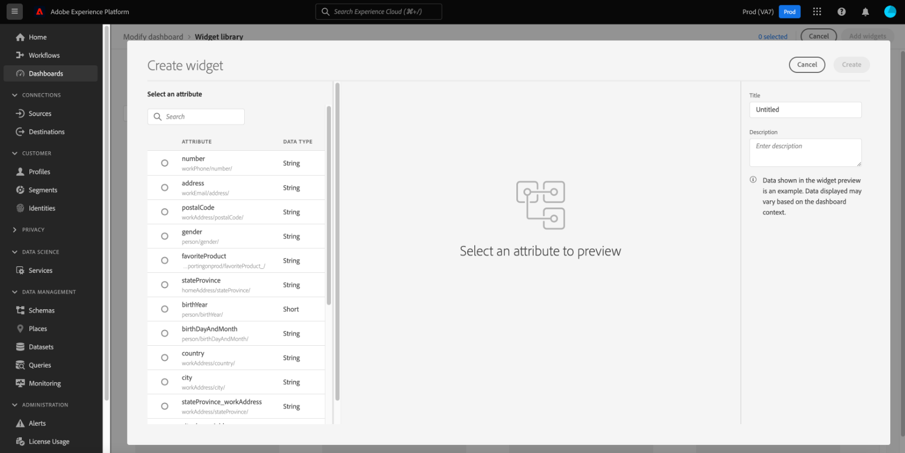

# 대시보드용 사용자 정의 위젯 만들기

Adobe Experience Platform에서는 여러 대시보드를 사용하여 조직의 데이터를 보고 상호 작용할 수 있습니다. 대시보드 보기에 새 위젯을 추가하여 특정 대시보드를 업데이트할 수도 있습니다. Adobe에서 제공하는 표준 위젯 외에도 사용자 정의 위젯을 만들고 조직 전체에서 공유할 수 있습니다.

이 안내서에서는 사용자 정의 위젯을 만들고 여기에 추가하는 단계별 지침을 제공합니다. [!UICONTROL 프로필], [!UICONTROL 세그먼트], 및 [!UICONTROL 대상] Platform UI의 대시보드

>[!NOTE]
>
>대시보드에 대한 모든 업데이트는 조직당 및 샌드박스별로 수행됩니다.

표준 위젯에 대한 자세한 내용은 다음 안내서를 참조하십시오. [대시보드에 표준 위젯 추가](standard-widgets.md).

## 위젯 라이브러리 {#widget-library}

이 안내서에서는 다음에 대한 액세스 권한이 필요합니다. [!UICONTROL 위젯 라이브러리] Experience Platform 내. 위젯 라이브러리에 대해 자세히 알아보고 UI 내에서 위젯 라이브러리에 액세스하는 방법은 [위젯 라이브러리 개요](widget-library.md).

## 사용자 정의 위젯 시작

위젯 라이브러리 내에서 **[!UICONTROL 사용자 정의]** 탭 을 사용하면 위젯을 만들고 조직의 다른 사용자와 공유하여 대시보드의 모양을 사용자 정의할 수 있습니다.

>[!IMPORTANT]
>
>조직은 위젯 라이브러리에 최대 20개의 사용자 정의 위젯을 만들 수 있습니다.

다음 항목 선택 **[!UICONTROL 사용자 정의]** 탭으로 사용자 정의 위젯 만들기를 시작하거나, 조직에서 이미 만든 사용자 정의 위젯을 볼 수 있습니다.

## 사용자 정의 위젯 만들기

사용자 정의 위젯을 만들려면 다음을 선택합니다 **[!UICONTROL 위젯 만들기]** 위젯 라이브러리의 오른쪽 상단 모서리에서 또는 조직의 첫 번째 사용자 정의 위젯인 경우 다음을 선택합니다 **[!UICONTROL 만들기]** 위젯 라이브러리의 중앙에서.

다음에서 **[!UICONTROL 위젯 만들기]** 대화 상자에서 새 위젯의 제목과 설명을 제공하고 위젯에 표시할 속성을 선택합니다.

>[!NOTE]
>
>사용 가능한 속성 목록은 조직에 대해 구성된 스키마에 따라 다릅니다. 속성 선택 및 스키마 구성에 대한 자세한 내용은 의 안내서를 참조하십시오 [스키마를 편집하여 사용자 정의 위젯 만들기](edit-schema.md).

속성을 선택하려면 추가할 속성 옆에 있는 라디오 버튼을 선택합니다.

>[!NOTE]
>
>위젯당 하나의 속성만 선택할 수 있으며 속성당 하나의 위젯만 만들 수 있습니다. 속성에 대해 위젯이 이미 생성된 경우 속성이 회색으로 표시됩니다.

## 시각화 선택

속성을 선택하면 새 위젯의 미리보기가 대화 상자에 나타납니다. 인공 지능은 속성 데이터에 가장 적합한 시각화를 자동으로 선택하고, 수동으로 선택할 수 있는 추가적인 시각화 옵션을 제공하는 데 사용됩니다.

속성에 따라 AI는 다양한 시각화 옵션을 권장합니다. 전체 시각화 목록은 다음과 같습니다.

* 가로 막대 차트: 가로 선은 값을 나타내는 데 사용됩니다.
* 세로 막대 차트: 세로 선은 값을 나타내는 데 사용됩니다.
* 도넛 차트: 파이 차트와 유사하게 값은 전체의 일부 또는 조각으로 표시됩니다.
* 산포도: 가로 및 세로 축을 사용하여 값을 표시합니다.
* 라인 차트: 일정 기간 동안의 변경 사항을 보여 주기 위해 단일 라인을 사용하여 값이 표시됩니다.
* 숫자 카드: 단일 키 값을 나타내는 요약 번호를 표시합니다.
* 데이터 테이블: 값이 테이블에 행으로 표시됩니다.

>[!NOTE]
>
>현재 모든 속성에 대해 지원되는 유일한 지표는 프로필 수입니다.
>
>예제 위젯에 표시된 데이터는 일러스트레이션으로만 사용됩니다. 미리 보기에는 조직의 실제 데이터가 표시되지 않습니다.

새 위젯을 저장하고 [!UICONTROL 사용자 정의] 탭, 선택 **[!UICONTROL 만들기]**.

이제 라이브러리에서 위젯을 선택하고 을 선택하여 대시보드에 새 위젯을 추가할 수 있습니다 **[!UICONTROL 위젯 추가]**.

## 사용자 정의 위젯 숨기기

위젯이 라이브러리에 추가되면 줄임표( )를 선택하여 숨길 수 있습니다.`...`)을 클릭하여 선택합니다. **[!UICONTROL 위젯 숨기기]**. 동일한 드롭다운에서 위젯을 미리 보고 편집할 수도 있습니다.

숨겨진 위젯을 보려면 을 선택합니다. **[!UICONTROL 숨겨진 위젯 표시]** 위젯 라이브러리의 오른쪽 상단 모서리에서 을(를) 참조하십시오.

>[!WARNING]
>
>라이브러리에서 위젯을 숨기더라도 개별 사용자의 대시보드에서 위젯이 제거되지 않습니다. 조직에서 위젯을 더 이상 사용하지 말아야 하는 경우 모든 Platform 사용자가 대시보드에서 위젯을 제거해야 하므로 모든 Platform 사용자에게 직접 전달해야 합니다.

## 사용자 정의 위젯 편집

줄임표( )를 선택하여 위젯 라이브러리에서 사용자 정의 위젯을 편집할 수 있습니다.`...`)을 클릭하여 선택합니다. **[!UICONTROL 편집]** 드롭다운 메뉴를 통해 액세스합니다.

다음에서 **[!UICONTROL 위젯 편집]** 대화 상자에서 위젯의 제목과 설명을 편집하고 다른 시각화를 미리 보고 선택할 수 있습니다. 편집한 후 다음을 선택합니다. **[!UICONTROL 저장]** 변경 사항을 저장하고 사용자 정의 위젯 탭으로 돌아갑니다.

>[!WARNING]
>
>라이브러리에서 위젯을 편집해도 개별 사용자에 대한 위젯은 업데이트되지 않습니다. 위젯이 업데이트된 경우 모든 Platform 사용자가 대시보드에서 오래된 위젯을 제거한 다음 위젯 라이브러리에서 업데이트된 위젯을 선택하고 추가해야 하므로 이를 직접 전달하십시오.

## 다음 단계

이 문서를 읽은 후에는 위젯 라이브러리에 액세스하고 이를 사용하여 조직의 사용자 정의 위젯을 만들고 추가할 수 있습니다. 대시보드에 표시되는 위젯의 크기와 위치를 수정하려면 다음을 참조하십시오. [대시보드 수정 안내서](modify.md).
