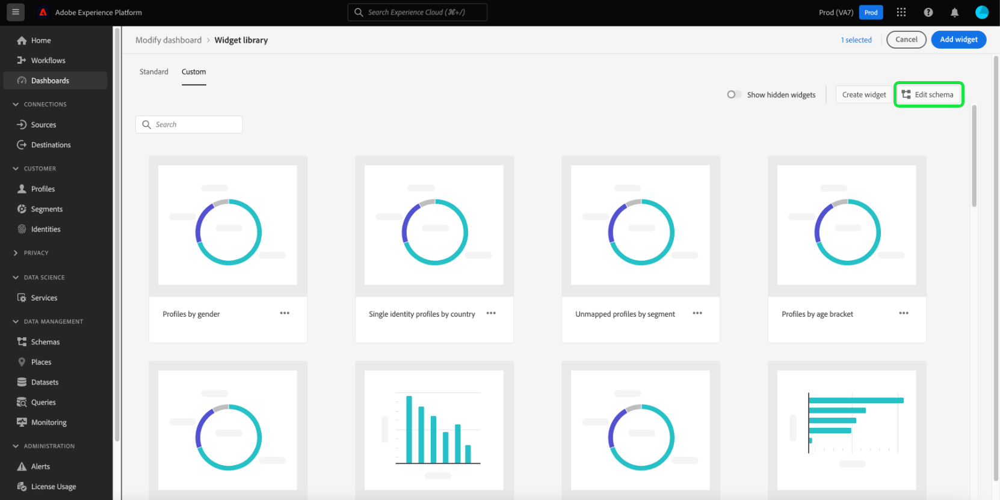

# 스키마를 편집하여 사용자 지정 위젯을 작성

Adobe Experience Platform 대시보드에 대한 사용자 지정 위젯을 만들려면 먼저 위젯이 기반으로 할 실시간 고객 프로필 속성을 식별해야 합니다.

이 안내서에서는 사용자 지정 대시보드 위젯을 만들기 위해 특성을 선택하여 조직의 스키마를 편집하는 단계별 지침을 제공합니다.

속성을 선택하고 스키마를 구성했으면 다음 단계를 계속 진행할 수 있습니다. [대시보드에 대한 사용자 지정 위젯 만들기](custom-widgets.md).

>[!NOTE]
>
>스키마를 편집하려면 사용자에게 &quot;표준 대시보드 관리&quot; 권한이 있어야 합니다. 대시보드에 대한 액세스 권한을 부여하는 단계는 다음을 참조하십시오. [대시보드 권한 안내서](../permissions.md).

## 위젯 라이브러리 {#widget-library}

이 안내서를 사용하려면 [!UICONTROL 위젯 라이브러리] Experience Platform 내에서 사용할 수 있습니다. 위젯 라이브러리에 대해 자세히 알아보고 UI 내에서 액세스하는 방법에 대해 알아보려면 [위젯 라이브러리 개요](widget-library.md).

## 스키마 편집

위젯 라이브러리 내에서 **[!UICONTROL 사용자 지정]** 탭 을 사용하면 대시보드 모양을 사용자 지정하기 위해 조직의 다른 사용자와 위젯을 만들고 공유할 수 있습니다.

사용자 지정 위젯을 만들려면 먼저 데이터가 일별 스냅숏의 일부로 포함되도록 실시간 고객 프로필 속성을 선택해야 합니다.

>[!IMPORTANT]
>
>조직은 최대 20개의 속성을 선택할 수 있습니다.

조직에서 프로필 속성을 선택하지 않은 경우, 먼저 **[!UICONTROL 구성]** 화면 중앙에 있습니다.

하나 이상의 사용자 지정 속성을 만들면 **[!UICONTROL 스키마 편집]** 를 클릭하여 선택한 속성을 보고 더 추가합니다.

## 속성 선택

에서 속성을 선택하려면 **[!UICONTROL 결합 스키마 필드 선택]** 대화 상자에서 결합 스키마의 속성으로 이동한(또는 검색 사용) 후 속성 옆에 있는 확인란을 선택합니다. 확인란을 선택하면 속성이 **[!UICONTROL 선택한 속성]** 대화 상자의 오른쪽에 있는 목록.

>[!NOTE]
>
>속성을 선택할 수 있도록 하려면 다음 중 하나여야 합니다. 문자열, 날짜, 날짜-시간, 부울, Short, Long, Integer 또는 Byte입니다. 맵 및 이중 데이터 유형은 지원되지 않으며 선택할 수 없도록 회색으로 표시됩니다.

추가할 속성을 선택한 후 을 선택합니다 **[!UICONTROL 저장]** 속성을 저장하고 사용자 지정 위젯 탭으로 돌아갑니다.

>[!WARNING]
>새로 선택한 속성은 데이터를 새로 고칠 때 다음 일별 스냅샷 다음에 사용할 수 있게 됩니다.

![속성을 사용하여 스키마 속성을 선택하고 [저장]을 강조 표시하는 대화 상자](../images/customization/select-attribute.png)

## 다음 단계

이 안내서를 읽은 후 위젯 라이브러리로 이동하고 실시간 고객 프로필 속성 을 선택하여 스키마를 구성할 수 있습니다. 프로필 속성을 선택하면 [대시보드에 대한 사용자 지정 위젯 만들기](custom-widgets.md).
