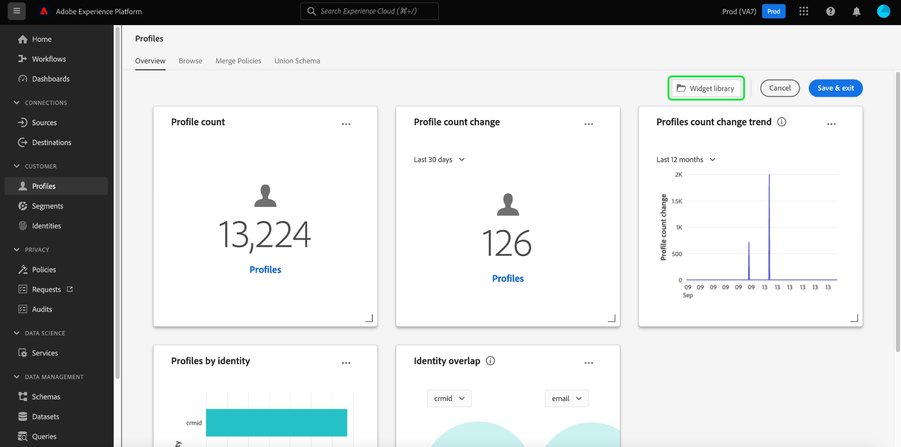

# 대시보드 사용자 지정 개요

Adobe Experience Platform 내에서 사용할 수 있는 프로필, 세그먼트 및 대상 대시보드는 다양한 방식으로 사용자 지정할 수 있습니다. 이 안내서에서는 대시보드에 표시된 위젯의 크기, 모양 및 위치뿐만 아니라 을 개인화하는 방법을 안내하는 단계별 지침과 함께 사용 가능한 사용자 정의에 대한 개요를 제공합니다.

>[!NOTE]
>
>대시보드에 대한 모든 업데이트는 조직당 및 샌드박스별로 수행됩니다.

## 대시보드 수정

프로필, 세그먼트 또는 대상 대시보드에서 **[!UICONTROL 대시보드 수정]**&#x200B;을(를) 선택하면 대시보드에 현재 표시되는 위젯의 크기, 순서 및 위치를 조정할 수 있습니다. 대시보드에서 위젯의 모양을 수정하는 방법에 대한 자세한 내용은 [대시보드 수정 안내서](modify.md)를 참조하십시오.

## 위젯 라이브러리

Experience Platform 내의 위젯 라이브러리에서 조직에서 사용할 수 있는 모든 [standard](#standard-widgets) 및 [custom](#custom-widgets) 위젯을 볼 수 있습니다. 대시보드(예: 프로필 대시보드)에서 **[!UICONTROL 대시보드 수정]**&#x200B;을 선택하여 **[!UICONTROL 위젯 라이브러리]** 단추를 표시할 수 있습니다.

![[수정] 대시보드가 강조 표시된 프로필 대시보드입니다.](../images/customization/modify-dashboard.png)

**[!UICONTROL 위젯 라이브러리]**&#x200B;를 선택하여 위젯 라이브러리를 열고 사용 가능한 모든 표준 지표를 보거나 사용자 정의 위젯을 만듭니다.

### 표준 위젯 {#standard-widgets}

표준 위젯은 Adobe이 대시보드 내에서 사용할 수 있도록 제공하는 위젯을 의미합니다. 이러한 위젯은 읽기 전용이며 조직에서 편집할 수 없습니다.

위젯 라이브러리 내에서 **[!UICONTROL 표준]** 탭에는 Adobe에서 제공하는 사용 가능한 모든 표준 위젯이 포함됩니다. 이러한 표준 지표를 사용하여 대시보드를 업데이트할 수 있습니다. 대시보드에 표준 위젯을 추가하는 방법에 대한 자세한 내용은 [대시보드에서 표준 위젯 사용](standard-widgets.md)을 참조하세요.

### 사용자 정의 위젯 {#custom-widgets}

사용자 정의 위젯은 조직의 멤버가 만들고 공유하는 위젯을 참조합니다. 이러한 위젯은 위젯 라이브러리의 **[!UICONTROL 사용자 정의]** 탭을 통해 만들어지며 조직에서 [스키마](#edit-schema)을(를) 사용하여 사용 가능한 지표를 지정해야 합니다.

나만의 위젯을 만드는 전체 단계는 [대시보드의 사용자 정의 위젯 안내서](custom-widgets.md)를 참조하십시오.

#### 스키마 편집 {#edit-schema}

대시보드에 대한 [사용자 지정 위젯](#custom-widgets)을(를) 만들려면 먼저 위젯이 기반으로 사용할 실시간 고객 프로필 속성을 식별해야 합니다.

사용자 정의 대시보드 위젯을 만들기 위해 조직의 스키마를 편집하는 방법에 대한 단계별 지침은 [대시보드 스키마 편집](edit-schema.md)을 위한 안내서를 참조하십시오.

## 다음 단계

이 문서를 읽은 후에는 기존 위젯의 크기, 모양 및 순서를 수정하거나, Adobe에서 제공하는 표준 위젯을 추가하거나, 사용자 정의 위젯을 만들고 공유하여 Experience Platform 대시보드를 사용자 정의할 준비가 되었습니다.
