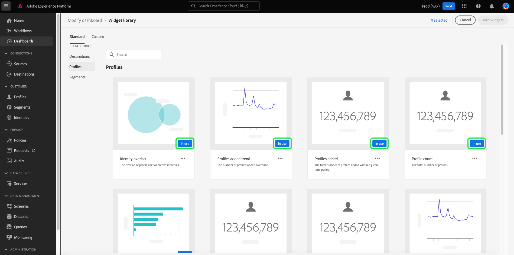

# 위젯 라이브러리 개요

Adobe Experience Platform 사용자 인터페이스 내에서 여러 대시보드를 사용하여 조직의 데이터를 보고 상호 작용할 수 있습니다. 대시보드 보기에 위젯을 추가하여 특정 대시보드를 업데이트할 수도 있습니다.

이 안내서에서는 Experience Platform 내에서 [!UICONTROL 위젯 라이브러리]에 액세스하는 방법에 대한 단계별 지침을 제공합니다. 여기에서는 표준 위젯을 선택하고 사용자 정의 위젯을 만들어 대시보드 내에 표시되는 정보를 사용자 정의할 수 있습니다.

>[!NOTE]
>
>대시보드에 대한 모든 업데이트는 조직당 및 샌드박스별로 수행됩니다.

대시보드에 이미 표시된 위젯의 위치 및 크기를 수정하는 방법에 대한 자세한 내용은 [대시보드 수정 안내서](modify.md)를 참조하십시오.

## 위젯 라이브러리 액세스 {#access}

대시보드(예: 프로필 대시보드)에서 **[!UICONTROL 위젯 추가]**&#x200B;를 선택하여 대시보드에 [위젯을 추가](#add-widgets)할 수 있는 위젯 라이브러리로 직접 이동합니다.

대시보드에서 위젯을 이동하거나, 크기를 조정하거나, 제거하려면 **[!UICONTROL 대시보드 수정]**&#x200B;을 선택하십시오. 이 디스플레이에서 **[!UICONTROL 위젯 라이브러리]**&#x200B;를 선택하여 탐색하고 [위젯을 추가](#add-widgets)할 수도 있습니다. 위젯 크기 및 레이아웃을 편집하는 방법에 대해 알아보려면 [대시보드 수정 설명서](./modify.md)를 참조하세요.

![[수정] 대시보드가 강조 표시된 프로필 대시보드 개요](../images/customization/modify-dashboard.png)

**[!UICONTROL 위젯 라이브러리]**&#x200B;를 선택하여 위젯 라이브러리를 열고 사용 가능한 모든 표준 지표를 보거나 사용자 정의 위젯을 만듭니다.

## 위젯 추가 {#add-widgets}

[!UICONTROL 위젯 라이브러리]에서 사용 가능한 표준 또는 사용자 정의 위젯 목록에서 위젯을 선택합니다. 위젯의 모서리에 있는 확인 표시는 선택 항목을 나타냅니다.

### 사용 중 레이블 {#in-use-label}

이미 대시보드에 추가된 위젯은 위젯 라이브러리에서 볼 때 [!UICONTROL 사용 중] 레이블이 첨부되어 있습니다. 이 레이블은 중복을 방지하기 위해 대시보드에 이미 추가된 위젯을 강조 표시합니다. 그러나 원할 경우 동일한 위젯을 두 번 이상 추가할 수 있습니다.

필요한 위젯을 모두 선택했으면 **[!UICONTROL 위젯 추가]**&#x200B;를 선택하여 선택을 확인하고 위젯을 대시보드에 추가합니다.

## 표준 및 사용자 정의 위젯 {#standard-and-custom}

[!UICONTROL 위젯 라이브러리]에는 두 개의 탭이 있습니다.

* **[!UICONTROL 표준]:** 표준 탭에는 Adobe에서 제공하는 위젯이 포함되어 있습니다. 이러한 표준 지표를 사용하여 대시보드를 업데이트할 수 있습니다. 대시보드에 표준 위젯을 추가하는 방법에 대한 자세한 내용은 [대시보드에서 표준 위젯 사용](standard-widgets.md)을 참조하세요.
* **[!UICONTROL 사용자 지정]:** 사용자 지정 탭에서 조직 내에서 위젯을 만들고 공유할 수 있습니다. 나만의 위젯을 만드는 전체 단계는 [대시보드의 사용자 정의 위젯 안내서](custom-widgets.md)를 참조하십시오.

## 다음 단계

이제 이 문서를 읽고 Experience Platform UI 내에서 위젯 라이브러리에 액세스할 수 있습니다. 대시보드에 표시되는 위젯의 크기와 위치를 수정하려면 [대시보드 수정 안내서](modify.md)를 참조하십시오.
