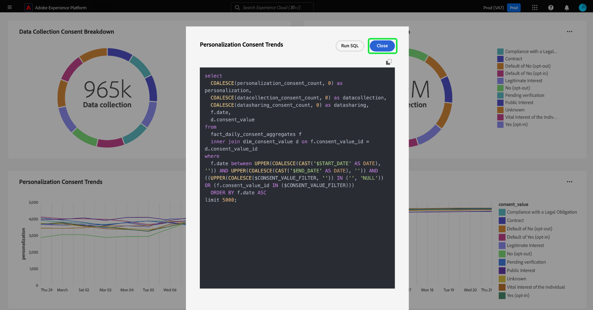

# SQL 보기 {#view-sql}

을(를) 생성한 후 [사용자 지정 인사이트](./overview.md) 포함 [query pro 모드](./query-pro-mode.md)로 설정하면 SQL 보기 기능으로 차트를 채우는 SQL을 볼 수 있습니다.

사용자 정의 대시보드에서 줄임표(`...`)을 클릭하여 액세스합니다. [!UICONTROL 더 보기] 및 [!UICONTROL SQL 보기] 옵션.

맞춤화된 인사이트 뒤에 있는 SQL을 보려면 **[!UICONTROL SQL 보기]** 옵션을 선택합니다. 이 대화 상자의 제목은 인사이트의 이름으로 지정됩니다. 이 보기에서 SQL을 클립보드에 복사하여 쿼리 프로 모드에서 향후 차트 작성의 기반으로 사용하거나 쿼리 편집기에서 직접 SQL을 열 수 있습니다. 선택 **[!UICONTROL SQL 실행]** 을 눌러 쿼리 편집기에서 쿼리를 엽니다.

![[SQL] 및 [SQL 실행] 옵션이 강조 표시된 통찰력의 SQL을 표시하는 대화상자입니다.](../../images/customizable-insights/view-sql.png)

선택 **[!UICONTROL 닫기]** 대화 상자를 닫습니다.

## 다음 단계

이 문서를 읽고 나면 이제 사용자 지정 통찰력 뒤에 있는 SQL을 보는 방법을 알 수 있습니다. 자세한 내용 보기 문서를 참조하십시오 [사용자 정의 차트를 SQL 분석의 표로 정리한 결과와 비교](./view-more.md).

또한 를 사용하여 Adobe Experience Platform UI의 기존 데이터 모델에서 차트를 생성하는 방법을 배울 수 있습니다 [안내식 디자인 모드 안내서](../../user-defined-dashboards.md).
