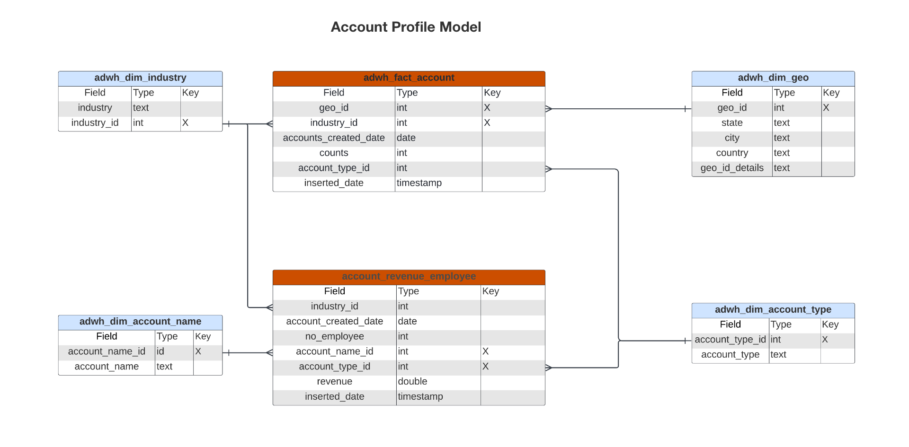

# Real-time Customer Data Platform Insights 데이터 모델 B2B 에디션

B2B 에디션용 Real-time Customer Data Platform 인사이트 데이터 모델은 인사이트를 제공하는 데이터 모델과 SQL을 노출합니다 [계정 프로필](https://experienceleague.adobe.com/en/docs/experience-platform/rtcdp/account/account-profile-overview). 이러한 SQL 쿼리 템플릿을 사용자 지정하여 B2B 마케팅 및 KPI(주요 성능 지표) 사용 사례에 대한 Real-Time CDP 보고서를 만들 수 있습니다. 그런 다음 이러한 인사이트를 대시보드의 사용자 정의 위젯으로 사용할 수 있습니다.

>[!AVAILABILITY]
>
>이 기능은 Real-Time CDP Prime 및 Ultimate 패키지를 구입한 고객이 사용할 수 있습니다. 사용 가능한 설명서 참조 [Real-Time CDP 에디션](../../rtcdp/overview.md#rtcdp-editions) 자세한 내용을 보거나 Adobe 담당자에게 문의하십시오.

<!-- 
See the query accelerated store reporting insights documentation to learn [how to build a reporting insights data model through Query Service for use with accelerated store data and user-defined dashboards](../../query-service/data-distiller/customizable-insights/reporting-insights-data-model.md).
 -->

## 전제 조건

이 안내서를 사용하려면 사용자 정의 대시보드에 대한 작업 이해가 필요합니다. 의 설명서를 읽어 보십시오. [사용자 지정 대시보드를 만드는 방법](../user-defined-dashboards.md) 이 안내서를 계속하기 전에.

## Real-Time CDP B2B 인사이트 보고서 및 사용 사례 {#B2B-insight-reports-and-use-cases}

Real-Time CDP B2B 보고에서는 계정 프로필 데이터와 계정 및 기회 간의 관계에 대한 통찰력을 제공합니다. 다음의 스타 스키마 모델은 다양한 일반적인 마케팅 사용 사례에 답변할 수 있도록 개발되었으며 각 데이터 모델은 여러 사용 사례를 지원할 수 있습니다.

>[!IMPORTANT]
>
>Real-Time CDP B2B 보고에 사용된 데이터는 선택한 병합 정책 및 가장 최근 일별 스냅샷에서 정확합니다.

### 계정 프로필 모델 {#account-profile-model}

계정 프로필 모델은 8개의 데이터 세트로 구성됩니다.

- `adwh_dim_industry`
- `adwh_dim_account_name`
- `adwh_dim_geo`
- `adwh_dim_account_type`
- `adwh_fact_account`
- `account_revenue_employee`

아래 다이어그램에는 각 데이터 세트의 관련 데이터 필드, 해당 데이터 유형 및 데이터 세트를 서로 연결하는 외래 키가 표시됩니다.



#### 업종별 새 계정 사용 사례 {#accounts-by-industry}

에 사용되는 논리 [!UICONTROL 업종별 신규 계정] insight는 계정 프로필 수와 상대적인 크기에 따라 상위 5개 업종을 반환합니다. 다음을 참조하십시오. [[!UICONTROL 업종별 계정] 위젯 설명서](../guides/account-profiles.md#accounts-by-industry) 추가 정보.

>[!TIP]
>
>이 SQL 쿼리를 사용자 지정하여 상위 5개 산업보다 많거나 적은 수의 산업을 반환할 수 있습니다.

다음을 생성하는 SQL [!UICONTROL 업종별 신규 계정] 인사이트는 아래의 축소 가능한 섹션에 표시됩니다.

+++SQL 쿼리

```sql
WITH RankedIndustries AS (
    SELECT
        i.industry,
        SUM(f.counts) AS total_accounts,
        ROW_NUMBER() OVER (ORDER BY SUM(f.counts) DESC) AS industry_rank
    FROM
        adwh_fact_account f
    INNER JOIN adwh_dim_industry i ON f.industry_id = i.industry_id
    WHERE f.accounts_created_date between UPPER(COALESCE('$START_DATE', '')) and UPPER(COALESCE('$END_DATE', ''))
    GROUP BY
        i.industry
)
SELECT
    CASE
        WHEN industry_rank <= 5 THEN industry
        ELSE 'Others'
    END AS industry_group,
    SUM(total_accounts) AS total_accounts
FROM
    RankedIndustries
GROUP BY
    CASE
        WHEN industry_rank <= 5 THEN industry
        ELSE 'Others'
    END
ORDER BY
    total_accounts DESC
LIMIT 5000;
```

+++

#### 유형별 새 계정 사용 사례 {#accounts-by-type}

에 사용되는 논리 [!UICONTROL 유형별 새 계정] insight는 계정 유형별 숫자 분류를 반환합니다. 이러한 통찰력은 리소스 할당 또는 마케팅 전략을 포함하여 비즈니스 전략 및 운영을 안내하는 데 도움이 될 수 있습니다. 다음을 참조하십시오. [[!UICONTROL 유형별 새 계정] 위젯 설명서](../guides/account-profiles.md#accounts-by-type) 추가 정보.

다음을 생성하는 SQL [!UICONTROL 유형별 새 계정] 인사이트는 아래의 축소 가능한 섹션에 표시됩니다.

+++SQL 쿼리

```sql
SELECT t.account_type,
       Sum(f.counts) AS account_count
FROM   adwh_fact_account f
       JOIN adwh_dim_account_type t
         ON f.account_type_id = t.account_type_id
WHERE  accounts_created_date BETWEEN Upper(Coalesce('$START_DATE', '')) AND
                                     Upper(
                                     Coalesce('$END_DATE', ''))
GROUP  BY t.account_type
LIMIT  5000; 
```

+++

### 영업 기회 모델 {#opportunity-model}

Opportunity 모델은 다음과 같은 7 개의 데이터 세트로 구성됩니다.

- `adwh_dim_opportunity_stage`
- `adwh_dim_person_role`
- `adwh_dim_opportunity_source_type`
- `adwh_dim_opportunity_name`
- `adwh_fact_opportunity`
- `adwh_opportunity_amount`
- `adwh_fact_opportunity_person`

아래 다이어그램에는 각 데이터 세트의 관련 데이터 필드가 표시됩니다.


