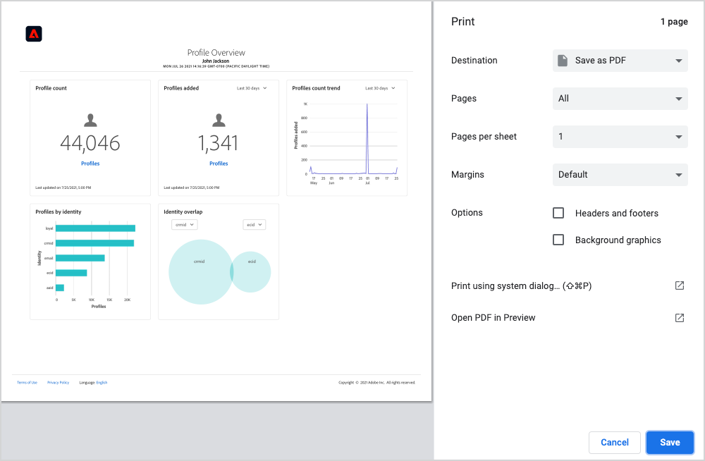
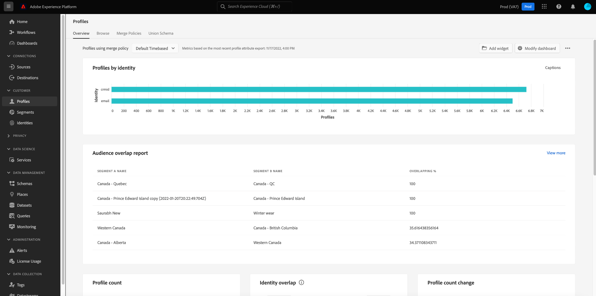

# 대시보드를 다운로드하여 PDF

Adobe Experience Platform 내의 대시보드는 Platform 사용자 인터페이스 내에서 PDF으로 다운로드하여 조직 구성원과 정보를 쉽게 공유할 수 있습니다.

이 문서에서는 Platform UI를 사용하여 대시보드를 다운로드하고 기본 브라우저 인쇄 메뉴를 사용하여 대시보드를 PDF에 저장하는 방법에 대한 요약을 제공합니다.

>[!WARNING]
>
>대시보드에 포함된 데이터에는 고객에 대한 PII(개인 식별 정보) 또는 조직과 관련된 중요한 데이터가 포함될 수 있습니다. PDF에 저장된 모든 대시보드 데이터는 조직의 데이터 개인 정보 보호 지침에 따라 적절하게 처리해야 합니다.

## 대시보드 다운로드

대시보드 다운로드를 시작하려면 다운로드할 대시보드로 이동합니다(예: [!UICONTROL 프로필] 대시보드)를 클릭한 다음 추가 옵션 메뉴(**`...`**)을 클릭하여 제품에서 사용할 수 있습니다. 그런 다음 을 선택합니다. **[!UICONTROL 다운로드]**.

## 미리 보기 PDF

선택 후 **[!UICONTROL 다운로드]**&#x200B;를 클릭하면 브라우저의 기본 인쇄 메뉴가 열립니다. 이 예에서는 Google Chrome 인쇄 메뉴가 표시됩니다.

인쇄 메뉴를 사용하면 저장할 PDF을 미리 볼 수 있습니다. PDF은 Platform UI에 표시되는 대시보드 위젯의 실제 표현이며 PDF 크기는 현재 표시되는 모든 대시보드 위젯을 단일 페이지에 표시하도록 자동으로 조정됩니다.

PDF은 Experience Platform 로고, 대시보드 이름, 사용자 이름 및 대시보드를 다운로드한 날짜 및 시간이 포함된 자동으로 생성된 헤더를 포함합니다. 이 정보는 읽기 전용이므로 PDF에서 편집할 수 없습니다.

## PDF으로 저장

PDF을 미리 본 후 다음을 선택합니다. **저장** PDF을 저장할 위치를 선택합니다.

>[!NOTE]
>
>필요한 경우 **대상** 선택할 드롭다운 **PDF으로 저장** 해당 옵션이 자동으로 선택되지 않은 경우

## 대시보드 PDF 사용자 지정

생성된 PDF은 UI에서 볼 수 있는 대시보드와 일치하며 현재 대시보드에 표시된 위젯만 포함합니다. 특정 대시보드를 사용자 정의하여 위젯의 크기와 위치를 변경하거나 보기에서 위젯을 추가 및 제거할 수 있습니다. Platform UI에서 PDF의 모양을 사용자 지정하면 생성되는 대시보드의 모양도 변경됩니다.

예를 들어 세 개의 표준 위젯 위에 스택된 여러 전체 너비 위젯을 포함하도록 프로필 대시보드의 모양을 수정할 수 있습니다.

업데이트된 대시보드를 다운로드하도록 선택하면 사용자 지정된 PDF 대시보드의 모양과 일치하는 새 프로필 미리보기가 표시됩니다. 또한 PDF의 크기를 자동으로 조정하여 모든 표시되는 위젯이 한 페이지 PDF에 포함되도록 합니다.

대시보드 맞춤화에 대한 자세한 내용은 [대시보드 사용자 지정 개요](customize/overview.md).

## 다음 단계

이제 대시보드를 다운로드하여 PDF으로 저장했으므로 이 단계를 반복하여 추가 대시보드를 다운로드하거나 조직의 구성원과 PDF을 공유할 수 있습니다.
