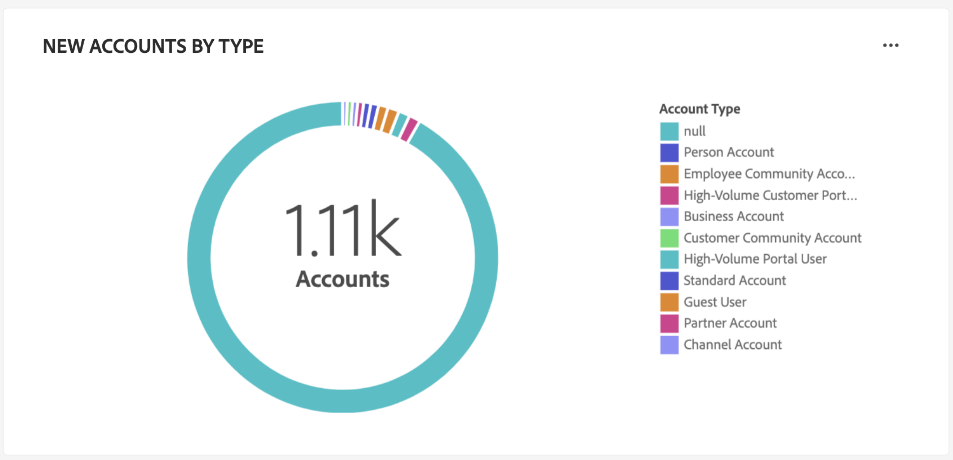

# 계정 프로필 대시보드

Adobe Experience Platform UI(사용자 인터페이스)는 일별 스냅샷 중에 캡처된 계정 프로필에 대한 중요한 정보를 볼 수 있는 대시보드를 제공합니다. 이 안내서에서는 UI에서 [!UICONTROL 계정 프로필] 대시보드에 액세스하고 작업하는 방법을 간략하게 설명하고 대시보드에 표시된 시각화에 대한 자세한 정보를 제공합니다.

이 문서에서는 [!UICONTROL 계정 프로필] 대시보드의 기능에 대한 개요를 제공하고 사용 가능한 표준 인사이트에 대해 자세히 설명합니다. 사용 가능한 기능에 대한 자세한 내용은 [[!UICONTROL 계정 프로필] UI 안내서](../../rtcdp/accounts/account-profile-ui-guide.md)를 참조하십시오.

## 시작하기

B2B [!UICONTROL 계정 프로필] 대시보드에 액세스하려면 [Adobe Real-time Customer Data Platform B2B 에디션](../../rtcdp/b2b-overview.md)에 대한 권한이 있어야 합니다.

## 계정 프로필 데이터 {#data}

[!UICONTROL 계정 프로필] 대시보드에는 통합 계정 정보의 스냅숏이 표시됩니다. 이 계정 정보는 마케팅 채널 및 조직에서 현재 고객 계정 정보를 저장하는 데 사용하는 다양한 시스템에 있는 여러 소스에서 가져온 것입니다.

스냅샷의 프로필 데이터는 스냅샷이 생성된 특정 시점에 나타나는 데이터를 정확하게 표시합니다. 즉, 스냅숏은 데이터의 근사값이나 샘플이 아니며 [!UICONTROL 계정 프로필] 대시보드는 실시간으로 업데이트되지 않습니다.

>[!NOTE]
>
>스냅숏을 만든 이후 데이터에 대한 변경 또는 업데이트는 다음 스냅숏을 만들 때까지 대시보드에 반영되지 않습니다.

## [!UICONTROL 계정 프로필] 대시보드 탐색 {#explore}

Platform UI에서 [!UICONTROL 계정 프로필] 대시보드로 이동하려면 왼쪽 탐색 패널의 [!UICONTROL 계정]에서 **[!UICONTROL 프로필]**&#x200B;을 선택합니다.

[!UICONTROL 계정 프로필] 대시보드에서 [조직에 수집된 계정 프로필을 검색하거나](#browse-account-profiles), [위젯을 사용하여 전체 계정 프로필 데이터를 한눈에 볼 수 있습니다](#standard-widgets).

### 날짜 필터 {#date-filter}

[!UICONTROL 개요] 탭은 계정 프로필에 대한 중요한 정보를 전달하기 위해 읽기 전용 지표를 제공하는 위젯으로 구성됩니다. 달력 아이콘 또는 날짜를 선택하여 위젯의 전역 날짜 필터를 변경합니다.

>[!IMPORTANT]
>
>드롭다운 달력에서 선택한 날짜 범위는 두 개의 예측 채점 위젯([배포](#predictive-scoring-distribution) 및 [가장 영향력 있는 요인](#predictive-scoring-top-influential-factors))을 제외한 모든 인사이트에 영향을 줍니다.

### 리드-계정 일치 서비스 구성 {#lead-to-account-matching-service}

[!UICONTROL 계정 설정] 대화 상자에서 계정 일치 서비스에 대한 리드를 구성하려면 **[!UICONTROL 설정]**&#x200B;을 선택하십시오. 리드-계정 일치를 구성하는 방법에 대한 자세한 내용은 [UI 안내서](../../rtcdp/accounts/account-profile-ui-guide.md#configure-lead-to-account-matching)를 참조하십시오. 리드-계정 일치에 대한 자세한 내용은 Real-Time CDP B2B 설명서의 [리드-계정 일치](../../rtcdp/b2b-ai-ml-services/lead-to-account-matching.md)를 참조하십시오.

## 계정 프로필 찾아보기 {#browse-account-profiles}

[!UICONTROL 찾아보기] 탭에서 조직에 수집된 읽기 전용 계정 프로필을 검색하고 볼 수 있습니다. 연결된 엔터프라이즈 소스의 계정 ID를 사용하거나 소스 세부 정보를 직접 입력합니다. 이 작업 공간에서는 계정 프로필에 속하는 이름, 업계, 매출 및 기타 고객 등 중요한 정보를 볼 수 있습니다.

[!UICONTROL 찾아보기] 탭에 표시된 결과에서 [!UICONTROL 프로필 ID]을(를) 선택하여 계정 프로필에 대한 [!UICONTROL 세부 정보] 탭을 엽니다.

[!UICONTROL 세부 정보] 탭에 표시되는 계정 프로필 정보가 여러 프로필 조각에서 병합되어 개별 계정에 대한 단일 보기를 형성했습니다. Platform UI의 계정 프로필 보기 기능에 대한 자세한 내용은 [Adobe Real-time Customer Data Platform에서 계정 프로필 찾아보기](../../rtcdp/accounts/account-profile-ui-guide.md#browse-account-profiles)에 대한 설명서를 참조하십시오.

## 표준 위젯 {#standard-widgets}

>[!CONTEXTUALHELP]
>id="platform_dashboards_accountprofiles_customersperaccountoverview"
>title="계정당 고객 개요"
>abstract="이 드릴스루 위젯은 B2B 데이터의 구조에 대한 통찰력을 제공합니다. 연결된 고객 프로필이 없거나 연결된 고객 프로필이 하나 이상 있는 계정 프로필 수를 식별하는 데 도움이 됩니다.<ul><li>직접 고객: `personComponents` 경로를 통해 계정에 직접 연결된 고객 프로필입니다.</li><li>간접 고객: `Account-Person` 경로를 통해 계정에 연결된 고객 프로필입니다.</li></ul>"

Adobe은 계정 프로필과 관련된 다양한 지표를 시각화하는 데 사용할 수 있는 표준 위젯을 제공합니다.

>[!IMPORTANT]
>
>날짜 필터를 제공하지 않는 경우 인사이트의 기본 동작은 전년도에서 오늘까지 추가된 데이터를 분석합니다.

사용 가능한 각 표준 위젯에 대해 자세히 알아보려면 다음 목록에서 위젯의 이름을 선택합니다.

* [계정 프로필 추가됨](#account-profiles-added)
* [업종별 신규 계정](#accounts-by-industry)
* [유형별 새 계정](#accounts-by-type)
* [개인 역할별 새로운 기회](#opportunities-by-person-role)
* [매출액별 새로운 기회](#opportunities-by-revenue)
* [상태 및 단계별 새로운 기회](#opportunities-by-status-&-stage)
* [획득한 새로운 영업 기회](#opportunities-won)
* [기회 추가됨](#opportunities-added)
* [예측 채점 분포](#predictive-scoring-distribution)
* [예측 점수에 가장 영향력 있는 요인](#predictive-scoring-top-influential-factors)

### 계정 프로필 추가됨 {#account-profiles-added}

[!UICONTROL 추가된 계정 프로필] 위젯은 선 그래프를 사용하여 일정 기간 동안 매일 추가된 계정 프로필의 수를 표시합니다. 대시보드 맨 위에 있는 글로벌 날짜 필터를 사용하여 분석 기간을 결정합니다. 날짜 필터를 제공하지 않으면 기본 비헤이비어에 오늘 이전 연도에 추가된 계정 프로필이 나열됩니다. 결과는 추가된 계정 프로필 수의 트렌드를 유추하는 데 사용할 수 있습니다.

### 업종별 신규 계정 {#accounts-by-industry}

[!UICONTROL 업종별 새 계정] 위젯은 도넛 차트 내의 단일 지표에 총 계정 수를 표시합니다. 도넛 차트는 이 합계를 구성하는 다양한 산업의 상대적 구성을 보여 줍니다. 색상으로 구분된 키는 포함된 모든 산업의 분석을 제공합니다. 커서가 도넛 차트의 각 섹션 위로 마우스를 가져가면 각 업계에 대한 개별 카운트가 대화 상자에 표시됩니다.

### 유형별 새 계정 {#accounts-by-type}

[!UICONTROL 유형별 새 계정] 위젯은 도넛 차트 내의 단일 지표에 총 계정 수를 표시합니다. 도넛 차트는 이 합계를 구성하는 다양한 계정 유형의 상대적 구성을 보여 줍니다. 색상으로 구분된 키는 포함된 모든 계정 유형에 대한 분류를 제공합니다. 커서가 도넛 차트의 각 섹션 위로 마우스를 가져가면 각 계정 유형에 대한 개별 카운트가 대화 상자에 표시됩니다.

### 개인 역할별 새로운 기회 {#opportunities-by-person-role}

[!UICONTROL 개인 역할별 새 기회] 위젯은 도넛 차트 내의 단일 지표에 총 기회 수를 표시합니다. 도넛 차트는 이 총 기회 수를 구성하는 역할의 상대적 구성을 보여 줍니다. 색상으로 구분된 키는 포함된 모든 역할에 대한 분류를 제공합니다. 커서가 도넛 차트의 각 섹션 위로 마우스를 가져가면 대화 상자에 각 역할에 대한 개별 카운트가 표시됩니다.

>[!NOTE]
>
>스키마에서 &#39;Opportunity-Person&#39; 브리지 테이블을 사용하지 않으면 [!UICONTROL 데이터를 찾을 수 없음] 또는 [!UICONTROL 로드할 수 없음] 오류가 발생합니다. 인사이트에 이러한 오류 중 하나가 표시되면 결합 스키마를 확인하고 &#39;Opportunity-Person&#39; 필드 그룹이 데이터를 수집하는지 확인하십시오.

### 매출액별 새로운 기회 {#opportunities-by-revenue}

[!UICONTROL 매출액별 새 기회] 위젯은 막대 차트를 사용하여 기회에서 생성된 총 예상 매출액을 보여 줍니다. 위젯은 최대 6개의 기회를 지원합니다.

영업 기회에 대한 특정 매출 합계가 포함된 대화 상자를 보려면 커서를 사용하여 개별 막대 위로 마우스를 가져갑니다.

### 상태 및 단계 {#opportunities-by-status-&-stage}별 새 기회

이 위젯은 막대 차트를 사용하여 마케팅/판매 단계의 모든 단계에서 열리거나 종료되는 기회의 수를 보여 줍니다. 위젯은 색상을 사용하여 기회의 단계를 구분합니다. 색상으로 구분된 키는 영업 기회에 사용할 수 있는 단계를 나타냅니다.

### 획득한 새로운 영업 기회 {#opportunities-won}

[!UICONTROL 성공한 새 기회] 위젯은 도넛 차트 내의 단일 지표로 완료된 총 기회 수를 표시합니다. 도넛 차트는 성공 또는 비성공 기회의 상대적 구성을 보여줍니다. 색상으로 구분된 키는 성공한 기회와 그렇지 않은 기회를 구분합니다. 커서가 도넛 차트의 각 섹션 위로 마우스를 가져가면 대화 상자에 각 역할에 대한 개별 카운트가 표시됩니다.

### 기회 추가됨 {#opportunities-added}

[!UICONTROL 추가된 기회] 위젯은 선 그래프를 사용하여 일정 기간 동안 매일 추가된 기회의 수를 표시합니다. 대시보드 맨 위에 있는 글로벌 날짜 필터를 사용하여 분석 기간을 결정합니다. 날짜 필터를 제공하지 않으면 기본 비헤이비어에 오늘 이전 연도에 추가된 기회가 나열됩니다. 그 결과를 이용하여 추가된 기회의 수에서의 추세를 추론할 수 있다.

<!-- Link to date filter documentation from Annamalai -->

### 예측 채점 분포 {#predictive-scoring-distribution}

[!UICONTROL 예측 점수 분포] 위젯은 모든 계정 프로필의 점수 분포를 표시하여 판매 파이프라인의 상태를 한 눈에 파악할 수 있도록 합니다. 채점 데이터는 도넛 차트와 세로 막대형 차트를 통해 전달됩니다.

도넛 차트는 높은, 중간 및 낮은 버킷 구매 성향에서 총 계정 프로필의 비율을 보여 줍니다. 키는 채점 버킷 범위 및 해당 범위의 계정 프로필 수를 포함하여 색상으로 구분된 섹션에 대한 자세한 정보를 제공합니다.

열 차트는 보다 세분화된 점수 분류를 제공합니다. 각 열에는 20개의 5포인트 증분 버킷에 있는 계정 프로필의 수가 표시됩니다.

위젯 내의 드롭다운 메뉴에서 계정 채점 모델을 선택할 수 있습니다.

>[!NOTE]
>
>글로벌 날짜 범위 필터는 예측 채점 통찰력에 적용되지 않습니다. 예측 채점 위젯은 드롭다운에서 선택한 계정 채점 모델을 기반으로 데이터를 분석합니다.

### 예측 점수에 가장 영향력 있는 요인 {#predictive-scoring-top-influential-factors}

[!UICONTROL 예측 점수 책정 가장 영향력 있는 요인] 위젯을 사용하여 각 성향 버킷의 점수를 유도하는 가장 중요한 요인을 이해할 수 있습니다.

이 위젯은 높은 성향 버킷, 중간 성향 버킷 및 낮은 성향 버킷 각각에 대해 가장 영향력 있는 요인을 표시합니다. 각 영향 요인에 대한 막대는 특정 영향 요인이 포함된 성향 버킷의 계정 프로필 백분율을 나타냅니다.

위젯 내의 드롭다운 메뉴에서 계정 채점 모델을 선택할 수 있습니다.

>[!NOTE]
>
>글로벌 날짜 범위 필터는 예측 채점 통찰력에 적용되지 않습니다. 예측 채점 위젯은 드롭다운에서 선택한 계정 채점 모델을 기반으로 데이터를 분석합니다.

## 데이터를 로드할 수 없음 오류 {#errors}

위젯에 *[!UICONTROL 이(가) 표시되는 경우 로드할 수 없습니다. 다시 시도하십시오.]* B2B 엔터티에 사용할 수 있는 데이터가 없기 때문입니다. 예를 들어 [!UICONTROL 개인 역할별 새 기회] 아래에 표시된 위젯에는 &quot;[!UICONTROL 로드할 수 없습니다&quot;라는 메시지가 표시됩니다. 다시 시도하십시오.이 샌드박스에는 사용 가능한 영업 기회 데이터가 없으므로 ]&quot;을(를) 입력하십시오.

이 문제를 해결하려면 *기회 사용자* 데이터와 같은 B2B 엔터티 데이터를 샌드박스로 수집해야 합니다. 48시간 후 데이터가 위젯에 반영됩니다.

## 다음 단계

이 문서를 팔로우하면 이제 [!UICONTROL 계정 프로필] 대시보드를 찾는 방법과 사용 가능한 위젯에 표시되는 지표를 이해할 수 있습니다. Experience Platform UI에서 B2B 데이터의 일부로 계정 프로필을 사용하는 작업에 대한 자세한 내용은 Adobe Real-Time CDP, B2B 에디션의 [계정 프로필 개요](../../rtcdp/accounts/account-profile-overview.md)를 참조하십시오.
