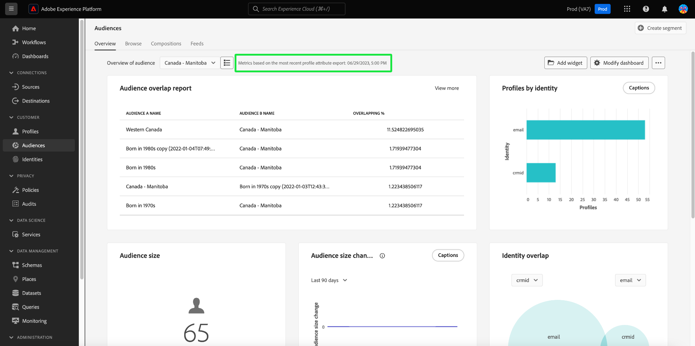
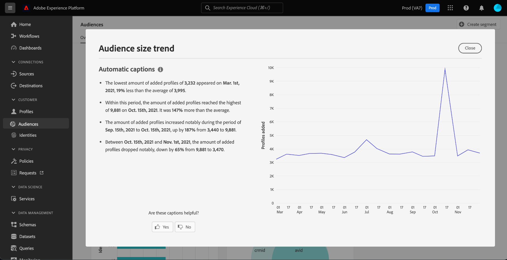

# [!UICONTROL 대상자] 대시보드 {#audiences-dashboard}

Adobe Experience Platform UI(사용자 인터페이스)는 일별 스냅샷 중에 캡처된 대상자에 대한 중요한 정보를 볼 수 있는 대시보드를 제공합니다. 이 안내서에서는 UI에서 [!UICONTROL 대상] 대시보드에 액세스하고 작업하는 방법에 대해 간략하게 설명하고 대시보드에 표시된 시각화에 대한 자세한 정보를 제공합니다.

Platform 사용자 인터페이스 내의 모든 Adobe Experience Platform 세그멘테이션 서비스 기능에 대한 개요를 보려면 [세그멘테이션 서비스 UI 안내서](../../segmentation/ui/overview.md)를 참조하십시오.

## [!UICONTROL 대상자] 대시보드 데이터

[!UICONTROL 대상] 대시보드에는 조직이 Experience Platform의 프로필 저장소 내에 가지고 있는 특성(레코드) 데이터의 스냅숏이 표시됩니다. 스냅샷에는 이벤트(시계열) 데이터가 포함되지 않습니다.

스냅샷의 속성 데이터는 스냅샷이 생성된 특정 시점에 나타나는 데이터를 정확하게 표시합니다. 즉, 스냅숏은 데이터의 근사값이나 샘플이 아니며 [!UICONTROL 대상] 대시보드가 실시간으로 업데이트되지 않습니다.

>[!NOTE]
>
>스냅숏을 만든 이후 데이터에 대한 변경 또는 업데이트는 다음 스냅숏을 만들 때까지 대시보드에 반영되지 않습니다.

## [!UICONTROL 대상] 대시보드 탐색 {#explore}

Platform UI에서 [!UICONTROL 대상] 대시보드로 이동하려면 왼쪽 레일에서 **[!UICONTROL 대상]**&#x200B;을 선택한 다음 **[!UICONTROL 개요]** 탭을 선택하여 대시보드를 표시합니다.

>[!NOTE]
>
>Platform을 처음 사용하는 조직에 아직 활성 프로필 데이터 세트 또는 병합 정책을 만들지 않은 경우 [!UICONTROL 대상] 대시보드가 표시되지 않습니다. 대신 [!UICONTROL 개요] 탭에는 세그먼테이션을 시작하는 데 도움이 되는 링크 및 설명서가 표시됩니다.

![[!UICONTROL 대상] 및 [!UICONTROL 개요]가 강조 표시된 [!UICONTROL 대상] 대시보드 [!UICONTROL 개요] 탭](../images/audiences/dashboard-overview.png)

### [!UICONTROL 대상] 대시보드 수정 {#modify}

**[!UICONTROL 대시보드 수정]**&#x200B;을 선택하여 [!UICONTROL 대상] 대시보드의 모양을 수정할 수 있습니다. 이를 통해 대시보드에서 위젯을 이동, 추가 및 제거하고 **[!UICONTROL 위젯 라이브러리]**&#x200B;에 액세스하여 사용 가능한 위젯을 탐색하고 조직에 대한 사용자 정의 위젯을 만들 수 있습니다.

자세한 내용은 [대시보드 수정](../customize/modify.md) 및 [위젯 라이브러리 개요](../customize/widget-library.md) 설명서를 참조하십시오.

### 위젯 추가 {#add-widget}

**[!UICONTROL 위젯 추가]**&#x200B;를 선택하여 위젯 라이브러리로 이동하고 대시보드에 추가할 사용 가능한 위젯 목록을 확인합니다.

![[!UICONTROL 위젯 추가]가 강조 표시된 [!UICONTROL 대상] 대시보드 개요](../images/audiences/audiences-overview-add-widget.png)

위젯 라이브러리에서 표준 및 사용자 정의 대상 위젯의 선택을 검색할 수 있습니다. 위젯을 추가하는 방법에 대한 자세한 내용은 [위젯을 추가](../customize/widget-library.md#add-widgets)하는 방법에 대한 위젯 라이브러리 설명서를 참조하십시오.

### SQL 보기 {#view-sql}

[!UICONTROL 개요] 작업 영역에서 토글을 사용하여 대시보드에 시각화된 인사이트를 생성하는 SQL을 볼 수 있습니다. 기존 인사이트의 SQL에서 영감을 얻어 비즈니스 요구 사항에 따라 플랫폼 데이터에서 고유한 인사이트를 도출하는 새 쿼리를 만들 수 있습니다. 이 기능에 대한 자세한 내용은 [SQL UI 보기 가이드](../view-sql.md)를 참조하세요.

## 대상자 선택 {#select-audience}

대시보드는 표시할 대상을 자동으로 선택합니다. 그러나 드롭다운 메뉴 또는 대상 선택기를 사용하여 대상을 변경할 수 있습니다.

다른 대상을 선택하려면 대상 이름 옆에 있는 드롭다운을 선택하거나 대상 선택기를 사용하여 대상 선택 대화 상자를 엽니다.

>[!IMPORTANT]
>
>프로필 카운트가 0보다 큰 대상만 선택 가능한 대상 목록에 표시됩니다.

![사용 가능한 모든 대상을 표시하는 [!UICONTROL 대상 선택] 대화 상자입니다.](../images/audiences/select-audience-dialog.png)

## 위젯 및 지표 {#widgets-and-metrics}

[!UICONTROL 대상] 대시보드는 선택한 대상과 관련된 중요한 정보를 제공하는 읽기 전용 지표인 위젯으로 구성됩니다.

대상 드롭다운 옆에 있는 [!UICONTROL 개요] 탭 맨 위에 가장 최근 스냅숏의 날짜와 시간이 표시됩니다. 모든 위젯 데이터는 해당 날짜 및 시간을 기준으로 정확합니다. 스냅샷의 타임스탬프는 UTC로 제공되며 개별 사용자 또는 조직의 시간대에 있지 않습니다.

## 기본 위젯 {#default-widgets}

데이터에서 사용 가능한 최신 인사이트를 강조 표시하는 Adobe Experience Platform의 모든 새 인스턴스에 대해 기본 위젯 로드 아웃이 제공됩니다. 다음 위젯은 처음부터 세그먼트 보기에 사전 구성되어 있습니다. 위젯의 목적과 기능에 대한 전체 세부 정보는 각각의 섹션에서 찾을 수 있습니다.

* [[!UICONTROL 대상자 크기]](#audience-size)
* [[!UICONTROL 대상 크기 변경 트렌드]](#audience-size-change-trend)
* [[!UICONTROL ID 중첩]](#identity-overlap)
* [[!UICONTROL ID별 프로필]](#profiles-by-identity)

>[!NOTE]
>
>2023년 7월 26일부터 [!UICONTROL 프로필], [!UICONTROL 대상] 및 [!UICONTROL 대상] 개요 대시보드는 이전 6개월 동안 보기를 수정하지 않은 모든 사용자에 대한 새 기본 위젯 로드 아웃으로 재설정되었습니다.
>기본 위젯 로드 아웃의 일부로 포함된 위젯에 대한 자세한 내용은 [프로필](./profiles.md#default-widgets) 및 [대상](./destinations.md#default-widgets) 기본 위젯 섹션의 설명서를 참조하십시오. 이전과 같이 대시보드 위젯을 계속 사용자 정의할 수 있습니다.

## 고객 AI 위젯 {#customer-ai-audiences-widgets}

고객 AI는 규모에 따라 개별 프로필에 대한 이탈 및 전환과 같은 사용자 정의 성향 점수를 생성하는 데 사용됩니다. 고객 AI는 기존 고객 경험 이벤트 데이터를 분석하여 **이탈 또는 전환 성향 점수**&#x200B;를 예측하여 이를 수행합니다. 이러한 정확도가 높은 고객 성향 모델을 통해 보다 정확한 세분화 및 타기팅을 수행할 수 있습니다. [점수 배포](#customer-ai-distribution-of-scores) 및 [점수 요약](#customer-ai-scoring-summary) 인사이트는 대상의 분할을 보여 줍니다. 이 섹션에서는 높음/낮음/중간 성향인 프로필과 이러한 프로필이 프로필 수에 걸쳐 배포되는 방법을 강조합니다.

* [[!UICONTROL 고객 AI 채점 요약]](#customer-ai-scoring-summary)
* [[!UICONTROL 고객 AI 점수 분포]](#customer-ai-distribution-of-scores)

### [!UICONTROL 고객 AI 점수 분포] {#customer-ai-distribution-of-scores}

>[!CONTEXTUALHELP]
>id="platform_dashboards_segments_distributionOfScores"
>title="점수 분배"
>abstract="이 위젯은 성향 점수별로 총 프로필 수의 분포를 5% 단위로 시각화합니다. 프로필 수의 분포는 AI 모델과 선택한 병합 정책에 따라 결정됩니다. 위젯 제목 아래의 드롭다운 메뉴에서 AI 모델을 변경할 수 있습니다."

[!UICONTROL 고객 AI 점수 분포] 위젯은 성향 점수로 총 프로필 수를 분류합니다. 프로필 수의 분포는 AI 모델과 선택한 병합 정책에 의해 결정된 다음 성향을 나타내는 5퍼센트 증분으로 시각화됩니다. 프로필의 카운트는 Y축을 따라 제공되고, 성향 점수는 X축을 따라 제공된다.

>[!NOTE]
>
>시각화가 전환 성향 점수인 경우, 높은 점수는 녹색으로 표시되고 낮은 점수는 빨간색으로 표시됩니다. 이탈 성향을 예측하는 경우 이것이 뒤집히면, 높은 점수는 빨간색이고 낮은 점수는 녹색이다. 중간 버킷은 선택한 성향 유형에 관계없이 노란색으로 유지됩니다.

성향 점수를 결정하는 AI 모델은 위젯 제목 아래의 드롭다운 선택기에서 선택됩니다. 드롭다운에는 구성된 모든 Customer AI 모델 목록이 포함되어 있습니다. 사용 가능한 모델 목록에서 분석에 적합한 AI 모델을 선택합니다. 사용 가능한 고객 AI 모델이 없는 경우 위젯 내의 메시지를 통해 하나 이상의 고객 AI 모델을 구성하도록 안내하고 고객 AI 모델 구성 페이지에 하이퍼링크를 제공합니다. [고객 AI 인스턴스를 구성하는 방법](../../intelligent-services/customer-ai/user-guide/configure.md)에 대한 지침은 설명서를 참조하세요.

>[!NOTE]
>
>개요 탭 바로 아래에 있는 드롭다운을 선택하여 분석에 포함된 프로필을 결정하는 병합 정책을 변경합니다. 자세한 내용은 [병합 정책](#merge-policies)의 섹션을 참조하십시오. 자세한 설명은 [병합 정책 개요](../../profile/merge-policies/overview.md)를 참조하십시오.

선택한 Customer AI 모델에 대한 자세한 인사이트 페이지로 이동하려면 **[!UICONTROL 모델 세부 정보 보기]**&#x200B;를 선택합니다.

![점수가 [!UICONTROL 고객 AI 배포] 위젯이고 [!UICONTROL 모델 세부 정보를 보기]가 강조 표시된 Experience Platform 대상 대시보드입니다.](../images/segments/customer-ai-distribution-of-scores.png)

자세한 모델 인사이트 페이지가 표시됩니다.

고객 AI에 대한 자세한 내용은 [인사이트 찾기 UI 안내서](../../intelligent-services/customer-ai/user-guide/discover-insights.md)를 참조하세요.

### [!UICONTROL 고객 AI 채점 요약] {#customer-ai-scoring-summary}

>[!CONTEXTUALHELP]
>id="platform_dashboards_segments_scoringSummary"
>title="채점 요약"
>abstract="이 위젯은 채점된 총 프로필 수를 표시하고 높은, 중간 및 낮은 성향을 포함하는 버킷으로 분류합니다. 도넛 차트는 높은, 중간 및 낮은 성향에 걸쳐 전체 프로필의 비례 컴포지션을 보여 줍니다."

이 위젯은 채점된 총 프로필 수를 표시하고 높은 성향, 중간 성향 및 낮은 성향을 각각 녹색, 노란색 및 빨간색으로 포함하는 버킷으로 분류합니다. 도넛 차트는 높음, 중간 및 낮은 성향 사이의 총 프로필의 비례 구성을 각각 녹색, 노란색 및 빨간색으로 표시하는 데 사용됩니다. 프로필은 75세 이상의 높은 성향, 25세에서 74세 사이의 중간 성향 및 24세 미만의 낮은 성향이 적합합니다. 범례는 색상 코드 및 성향의 임계값을 나타냅니다. 커서가 도넛 차트의 각 섹션 위로 마우스를 가져가면 높은, 중간 및 낮은 성향에 대한 프로필 수가 대화 상자에 표시됩니다.

>[!NOTE]
>
>시각화가 전환 성향 점수인 경우, 높은 점수는 녹색으로 표시되고 낮은 점수는 빨간색으로 표시됩니다. 이탈 성향을 예측하는 경우 이것이 뒤집히면, 높은 점수는 빨간색이고 낮은 점수는 녹색이다. 중간 버킷은 선택한 성향 유형에 관계없이 노란색으로 유지됩니다.

위젯 제목 아래의 드롭다운 메뉴는 구성된 모든 Customer AI 모델의 목록을 제공합니다. 사용 가능한 모델 목록에서 분석에 적합한 AI 모델을 선택합니다. 사용 가능한 고객 AI 모델이 없는 경우 위젯 내의 메시지를 통해 하나 이상의 고객 AI 모델을 구성하도록 안내하고 고객 AI 모델 구성 페이지에 하이퍼링크를 제공합니다. 자세한 지침은 [Customer AI 인스턴스를 구성하는 방법](../../intelligent-services/customer-ai/user-guide/configure.md)에 대한 설명서를 참조하십시오.

>[!NOTE]
>
>계산된 총 프로필 수는 선택한 병합 정책에 따라 다릅니다. 사용된 병합 정책을 변경하려면 개요 탭 바로 아래에 있는 드롭다운을 선택합니다. 자세한 내용은 [병합 정책](#merge-policies)의 섹션을 참조하십시오. 자세한 설명은 [병합 정책 개요](../../profile/merge-policies/overview.md)를 참조하십시오.

**[!UICONTROL 모델 세부 정보 보기]**&#x200B;를 선택하여 선택한 고객 AI 모델의 세부 인사이트 페이지로 이동합니다. 고객 AI에 대한 자세한 내용은 [인사이트 찾기 UI 안내서](../../intelligent-services/customer-ai/user-guide/discover-insights.md)를 참조하세요.

## 표준 위젯 {#standard-widgets}

Adobe은 대상과 관련된 다양한 지표를 시각화하는 데 사용할 수 있는 여러 표준 위젯을 제공합니다. [!UICONTROL 위젯 라이브러리]를 사용하여 조직과 공유할 사용자 정의 위젯을 만들 수도 있습니다. 사용자 지정 위젯을 만드는 방법에 대한 자세한 내용은 [위젯 라이브러리 개요](../customize/widget-library.md)를 참조하세요.

사용 가능한 각 표준 위젯에 대해 자세히 알아보려면 다음 목록에서 위젯의 이름을 선택합니다.

* [[!UICONTROL 대상자 크기]](#audience-size)
* [[!UICONTROL 대상자 활성화 순서]](#audience-activation-order)
* [[!UICONTROL 대상자 크기 트렌드]](#audience-size-trend)
* [[!UICONTROL 대상 크기 변경 트렌드]](#audience-size-change-trend)
* [ID별 [!UICONTROL 대상 크기 트렌드]](#audience-size-trend-by-identity)
* [[!UICONTROL 대상자 겹치기]](#audience-overlap)
* [[!UICONTROL 대상 중복 보고서]](#audience-overlap-report)
* [[!UICONTROL ID 중첩]](#identity-overlap)
* [[!UICONTROL ID별 프로필]](#profiles-by-identity)
* [[!UICONTROL 예약된 활성화]](#scheduled-activations)

### [!UICONTROL 대상자 크기] {#audience-size}

>[!CONTEXTUALHELP]
>id="platform_dashboards_segments_audiencesize"
>title="대상자 크기"
>abstract="이 위젯은 선택한 대상자 내 병합 프로필의 총 개수를 표시합니다. 이 숫자는 데이터에 적용된 병합 정책에 따라 다르고 최근 스냅샷이 생성된 시점에서 정확합니다."

**[!UICONTROL 대상 크기]** 위젯은 스냅숏을 만들 때 선택한 대상 내에 병합된 총 프로필 수를 표시합니다. 이 숫자는 프로필 데이터에 대상 병합 정책을 적용하여 프로필 조각을 함께 병합하고 대상의 각 개인에 대해 단일 프로필을 형성한 결과입니다.

조각 및 병합된 프로필에 대한 자세한 내용은 [실시간 고객 프로필 개요](../../profile/home.md)를 참조하세요.

![대상 크기] 위젯이 강조 표시된 [!UICONTROL 대상] 대시보드 개요.](../images/audiences/audience-size.png)[!UICONTROL 

### [!UICONTROL 대상자 크기 트렌드] {#audience-size-trend}

>[!CONTEXTUALHELP]
>id="platform_dashboards_segments_audiencesizetrend"
>title="대상자 크기 트렌드"
>abstract="이 위젯은 지난 30일, 90일 또는 12개월 동안 매일 스냅샷을 생성하는 도중 캡처된 **임의의** 세그먼트 정의 기준을 충족하는 총 프로필 개수 관련 정보를 제공합니다."

**[!UICONTROL 대상 크기 트렌드]** 위젯은 지정된 기간 동안 **모든** 대상의 자격을 규정하는 총 프로필 수에 대한 선 그래프 일러스트레이션을 제공합니다. 대상자 크기 트렌드는 30일, 90일, 12개월 기간에 걸쳐 시각화할 수 있습니다. 위젯의 드롭다운 메뉴에서 기간이 선택됩니다. 대상자 크기는 y축에 반영되고 시간은 x축에 반영됩니다.

이 위젯에는 머신 러닝 모델이 차트 및 대상 데이터를 분석하고 캡션을 자동으로 생성하여 주요 트렌드 및 중요 이벤트를 설명하는 자동 [!UICONTROL 캡션] 기능도 포함됩니다. **[!UICONTROL 캡션]**&#x200B;을 선택하여 자동 캡션 대화 상자를 엽니다.

![대상] 개요에 대상 크기 트렌드 위젯이 표시됩니다.](../images/audiences/audience-size-trend-captions.png)[!UICONTROL 

데이터에 대한 통찰력을 제공하는 자동 캡션 대화 상자가 열립니다.

대상 평가 및 프로필이 대상 자격을 부여하고 대상에서 종료하는 방법에 대한 자세한 내용은 [세그먼테이션 서비스 설명서](../../segmentation/home.md)를 참조하세요.

### [!UICONTROL 대상 크기 변경 트렌드] {#audience-size-change-trend}

이 위젯은 최신 일별 스냅샷 간 주어진 대상자에 대해 자격이 있는 총 프로필 수의 차이에 대한 선 그래프 일러스트레이션을 제공합니다. 분석을 위해 선택한 대상자가 개요 드롭다운에서 선택됩니다. 추세 분석 기간은 30일, 90일, 12개월 기간으로 시각화할 수 있다. 위젯의 드롭다운 메뉴에서 기간이 선택됩니다. 대상자 크기는 y축에 반영되고 시간은 x축에 반영됩니다.

### ID별 [!UICONTROL 대상 크기 트렌드] {#audience-size-trend-by-identity}

이 위젯은 위젯 드롭다운 메뉴에서 선택한 ID 유형을 기반으로 특정 대상에 대한 대상 크기 트렌드를 보여 줍니다. 분석에 사용되는 대상자는 개요 드롭다운에서 선택됩니다. 추세 분석 기간은 30일, 90일, 12개월 기간으로 시각화할 수 있다. 위젯의 드롭다운 메뉴에서 기간이 선택됩니다.

### [!UICONTROL 대상자 활성화 순서] {#audience-activation-order}

[!UICONTROL 대상 활성화 순서] 위젯은 대상 이름, 플랫폼 및 대상의 활성화 날짜를 나열하는 3열 테이블을 제공합니다. 목록은 최신성에 따라 높음에서 낮음 순으로 정렬되며 최대 10개의 행을 수용할 수 있습니다.

### [!UICONTROL 대상자 겹치기] {#audience-overlap}

이 위젯은 벤 다이어그램을 사용하여 두 대상의 기준과 일치하는 사람 수를 시각화합니다. 비교에 사용되는 대상자는 위젯 드롭다운 메뉴에서 선택됩니다. 관련 세그먼트 정의 내에 포함된 총 프로필 수는 원 위 또는 벤 다이어그램의 교차 지점을 마우스로 가리키면 확인할 수 있습니다.

이 위젯을 사용하면 세그먼트 정의 결과의 유사성을 시각화하여 세분화 전략을 최적화할 수 있습니다.

### [!UICONTROL 대상 중복 보고서] {#audience-overlap-report}

이 위젯은 특정 대상자에 대한 프로필 중복 데이터를 표로 표시합니다. 화면 상단의 드롭다운 메뉴에서 선택한 대상에 대해 가장 높은 오버랩 백분율부터 가장 낮은 오버랩 백분율까지 5개의 대상자 목록이 제공됩니다. 명확성을 위해 선택한 대상이 [!UICONTROL 대상 A 이름] 열에 나열됩니다. [!UICONTROL 대상 B 이름] 열에 나열된 두 번째 대상에 대해 대상 중복 분석이 제공됩니다. 백분율 겹침은 소수점 이하 12자리까지 정확한 세 번째 열에 제공됩니다.

대상 중복 보고서는 새로운 고성능 대상을 구축하는 데 도움이 됩니다. 높은 비율의 겹침을 관찰하면 대상을 표시하지 않고 동일한 대상을 다른 대상으로 보내지 않을 수 있습니다. 또한 더 나은 세그멘테이션에 도움이 될 수 있는 숨겨진 인사이트를 식별하는 데 도움이 됩니다. 겹치는 비율이 낮으면 추적할 고유 프로필을 찾는 데 도움이 됩니다.

**[!UICONTROL 자세히 보기]**&#x200B;를 선택하여 더 많은 대상 중복 데이터가 포함된 전체 화면 대화 상자를 엽니다.

[!UICONTROL 대상 중복 보고서] 대화 상자가 나타납니다. 이 대화 상자에는 최대 50개의 대상 중복 분석 행이 6개의 열로 분류되어 포함될 수 있습니다. 설정 아이콘() 테이블에서 열을 제거하거나 추가합니다.

>[!NOTE]
>
>**[!UICONTROL Overlapping]** 열 헤더를 선택하여 결과의 순위를 가장 높은 항목에서 가장 낮은 항목이나 가장 낮은 항목에서 가장 높은 항목순으로 변경합니다.

전체 보고서를 PDF 형식으로 다운로드하려면 옵션 메뉴(**`...`**) 다음에 **[!UICONTROL 다운로드]**&#x200B;를 선택합니다.

보고서에서 행을 선택하여 중복 분석의 벤 다이어그램을 엽니다. 벤 다이어그램의 섹션을 마우스로 가리키면 대화 상자에서 프로필 카운트가 표시됩니다.

[!UICONTROL 대상] 대시보드로 돌아가려면 **[!UICONTROL 닫기]**&#x200B;를 선택하십시오.

### [!UICONTROL ID 중첩] {#identity-overlap}

>[!CONTEXTUALHELP]
>id="platform_dashboards_segments_identityoverlap"
>title="ID 중첩"
>abstract="이 위젯은 선택한 두 ID가 포함된 대상자의 프로필 중첩을 표시합니다. 원은 각 ID에 대한 상대적 크기를 표시합니다. 두 네임스페이스가 포함된 프로필 개수는 원 사이의 겹침으로 표시됩니다."

**[!UICONTROL ID 겹치기]** 위젯은 벤 다이어그램 또는 집합 다이어그램을 표시하여 여러 ID를 포함하는 대상의 프로필 겹침을 표시합니다.

위젯의 드롭다운 메뉴를 사용하여 비교할 ID를 선택합니다. 원은 선택한 각 ID의 상대적 크기를 표시하며 두 네임스페이스가 모두 포함된 프로필 수는 원 간의 겹침 크기로 표시됩니다.

고객이 둘 이상의 채널에서 브랜드와 상호 작용하는 경우 여러 ID가 해당 개별 고객과 연결됩니다. 이러한 상황으로 인해 조직에 둘 이상의 ID의 조각이 포함된 프로필이 여러 개 있을 수 있습니다.

ID에 대한 자세한 내용은 [ID 서비스 설명서](../../identity-service/home.md)를 참조하세요.

![ID 중복 위젯이 강조 표시된 [!UICONTROL 대상] 대시보드 개요.](../images/audiences/identity-overlap.png)

### [!UICONTROL ID별 프로필] {#profiles-by-identity}

>[!CONTEXTUALHELP]
>id="platform_dashboards_segments_profilesbyidentity"
>title="ID별 프로필"
>abstract="이 위젯은 선택한 대상자에 병합된 모든 프로필에 있는 ID의 분석을 표시합니다."

**[!UICONTROL ID별 프로필]** 위젯은 선택한 대상에 있는 병합된 모든 프로필의 ID 분류를 표시합니다. ID별 총 프로필 수는 한 프로필에 연관된 여러 ID가 있을 수 있으므로 대상자의 총 프로필 수보다 많을 수 있습니다. 즉, 각 ID에 대해 표시된 값을 함께 추가하면 전체 대상자 크기보다 합계가 더 클 수 있습니다. 고객이 둘 이상의 채널에서 브랜드와 상호 작용하는 경우 여러 ID가 해당 개별 고객과 연결될 수 있기 때문입니다.

**[!UICONTROL 캡션]**&#x200B;을 선택하여 자동 캡션 대화 상자를 엽니다.

![ID 위젯 및 캡션별 프로필 옵션이 강조 표시된 [!UICONTROL 대상] 대시보드 개요.](../images/audiences/profiles-by-identity.png)

머신 러닝 모델은 데이터의 전체 분포 및 주요 차원을 분석하여 데이터 인사이트를 자동으로 생성합니다.

ID에 대한 자세한 내용은 [ID 서비스 설명서](../../identity-service/home.md)를 참조하세요.

### 예약된 활성화 {#scheduled-activations}

[!UICONTROL 예약된 활성화] 위젯은 가장 최근에 활성화된 대상을 표로 정리한 보기를 제공합니다. 이 표에는 대상 플랫폼, 이 대상에 대한 활성화 흐름의 이름 및 선택한 대상에 대한 활성화 시작 및 종료 날짜가 포함됩니다. 활성화에 대해 입력한 종료 날짜가 없으면 [!UICONTROL 진행 중]으로 표시됩니다. 페이지 상단의 드롭다운에서 분석 대상을 선택합니다.

위젯을 사용하면 대상이 활성화되는 위치와 시기를 한 눈에 파악할 수 있으며 중복되거나 불필요한 활성화를 더 투명하게 만듭니다. 이렇게 축적된 정보에서는 활성화가 제외된 위치도 강조합니다.

## 다음 단계

이제 이 문서를 팔로우하여 [!UICONTROL 대상] 대시보드를 찾고 볼 대상을 선택할 수 있습니다. 사용 가능한 위젯에 표시되는 지표도 이해해야 합니다. Experience Platform UI에서 대상자를 사용하여 작업하는 방법에 대한 자세한 내용은 [세그먼테이션 서비스 UI 안내서](../../segmentation/ui/overview.md)를 참조하십시오.
