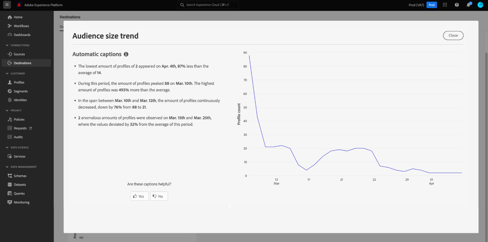

# [!UICONTROL 대상] 대시보드

Adobe Experience Platform UI(사용자 인터페이스)는 일별 스냅샷 중에 캡처된 조직의 활성 대상에 대한 중요한 정보를 볼 수 있는 대시보드를 제공합니다. 이 안내서에서는 UI에서 대상 대시보드에 액세스하고 작업하는 방법을 간략하게 설명하고 대시보드에 표시된 지표에 대한 자세한 정보를 제공합니다.

대상에 대한 개요와 Experience Platform 내에서 사용 가능한 모든 대상의 카탈로그를 보려면 [대상 설명서](../../destinations/home.md)를 참조하십시오.

## [!UICONTROL 대상] 대시보드 데이터 {#destinations-dashboard-data}

대상 대시보드에는 조직이 Experience Platform 내에서 활성화한 대상의 스냅샷이 표시됩니다. 스냅샷의 데이터는 스냅샷이 생성된 특정 시점에 표시된 것과 동일하게 표시됩니다. 즉, 스냅샷은 데이터의 근사값이나 샘플이 아니며 대상 대시보드가 실시간으로 업데이트되지 않습니다.

>[!NOTE]
>
>스냅숏을 만든 이후 데이터에 대한 변경 또는 업데이트는 다음 스냅숏을 만들 때까지 대시보드에 반영되지 않습니다.

## [!UICONTROL 대상] 대시보드 탐색 {#explore}

Experience Platform UI 내의 대상 대시보드로 이동하려면 왼쪽 레일에서 **[!UICONTROL 대상]**&#x200B;을 선택한 다음 **[!UICONTROL 개요]** 탭을 선택하여 대시보드를 표시합니다.

대상 드롭다운 옆에 있는 [!UICONTROL 개요] 맨 위에 가장 최근 스냅숏의 날짜와 시간이 표시됩니다. 모든 위젯 데이터는 해당 날짜 및 시간을 기준으로 정확합니다. 스냅샷의 타임스탬프는 UTC로 제공되며 개별 사용자 또는 조직의 시간대에 있지 않습니다.

>[!NOTE]
>
>조직이 Experience Platform을 처음 사용하고 아직 활성 대상이 없는 경우 대상 대시보드 및 [!UICONTROL 개요] 탭이 표시되지 않습니다. 대신 왼쪽 탐색에서 [!UICONTROL 대상]을 선택하면 [!UICONTROL 카탈로그] 탭이 표시됩니다. [!UICONTROL 카탈로그] 탭에 대한 자세한 내용은 [[!UICONTROL 대상] 작업 영역 가이드](../../destinations/ui/destinations-workspace.md)를 참조하세요.

### [!UICONTROL 대상] 대시보드 수정 {#modify}

대상 대시보드의 모양을 변경하려면 **[!UICONTROL 대시보드 수정]**&#x200B;을 선택합니다. 대시보드에 대한 변경 사항은 사용자별로 다르며 조직 전체가 아닙니다. 대시보드에서 위젯을 이동, 추가, 크기 조정 및 제거하고 위젯 라이브러리에 액세스하여 대시보드를 사용자 정의할 수 있습니다. 위젯 라이브러리에서 사용 가능한 위젯을 탐색하고 조직에 대한 사용자 정의 위젯을 만들 수 있습니다.

자세한 내용은 [대시보드 수정](../customize/modify.md) 및 [위젯 라이브러리 개요](../customize/widget-library.md) 설명서를 참조하십시오.

### 위젯 추가 {#add-widget}

**[!UICONTROL 위젯 추가]**&#x200B;를 선택하여 위젯 라이브러리로 이동하고 대시보드에 추가할 사용 가능한 위젯 목록을 확인합니다.

![[위젯 추가]가 강조 표시된 대상 대시보드 개요](../images/destinations/destinations-overview-add-widget.png)

위젯 라이브러리에서 표준 및 사용자 정의 대상 위젯의 선택을 검색할 수 있습니다. 위젯을 추가하는 방법에 대한 자세한 내용은 [위젯을 추가](../customize/widget-library.md#add-widgets)하는 방법에 대한 위젯 라이브러리 설명서를 참조하십시오.

### SQL 보기 {#view-sql}

[!UICONTROL 개요] 작업 영역에서 토글을 사용하여 대시보드에 시각화된 인사이트를 생성하는 SQL을 볼 수 있습니다. 기존 인사이트의 SQL에서 영감을 얻어 비즈니스 요구 사항에 따라 Experience Platform 데이터에서 고유한 인사이트를 도출하는 새 쿼리를 만들 수 있습니다. 이 기능에 대한 자세한 내용은 [SQL UI 보기 가이드](../view-sql.md)를 참조하세요.

## 기본 위젯 {#default-widgets}

데이터에서 사용 가능한 최신 인사이트를 강조 표시하는 Adobe Experience Platform의 모든 새 인스턴스에 대해 기본 위젯 로드 아웃이 제공됩니다. 다음 위젯은 처음부터 세그먼트 보기에 사전 구성되어 있습니다. 위젯의 목적 및 기능에 대한 전체 세부 정보는 아래에서 찾을 수 있습니다.

* [[!UICONTROL 가장 많이 사용하는 대상]](#most-used-destinations)
* [[!UICONTROL 최근에 생성된 대상]](#recently-created-destinations)
* [[!UICONTROL 최근에 활성화된 세그먼트]](#recently-activated-segments)

>[!NOTE]
>
>2023년 7월 26일부터 [!UICONTROL 프로필], [!UICONTROL 대상] 및 [!UICONTROL 대상] 개요 대시보드는 이전 6개월 동안 보기를 수정하지 않은 모든 사용자에 대한 새 기본 위젯 로드 아웃으로 재설정되었습니다.
>기본 위젯 로드 아웃의 일부로 포함된 위젯에 대한 자세한 내용은 [프로필](./profiles.md#default-widgets) 및 [대상](./audiences.md#default-widgets) 기본 위젯 섹션의 설명서를 참조하십시오. 이전과 같이 대시보드 위젯을 계속 사용자 정의할 수 있습니다.

## 표준 위젯 {#standard-widgets}

Adobe은 대상과 관련된 다양한 지표를 시각화하고 데이터 분석에 사용할 수 있는 대상의 완전성을 평가하는 데 사용할 수 있는 여러 표준 위젯을 제공합니다. [!UICONTROL 위젯 라이브러리]를 사용하여 조직과 공유할 사용자 정의 위젯을 만들 수도 있습니다. 사용자 지정 위젯을 만드는 방법에 대한 자세한 내용은 [위젯 라이브러리 개요](../customize/widget-library.md)를 참조하세요.

### 전제 조건 {#prerequisites}

표준 위젯에 대한 설명을 계속하기 전에 설명서 전체에서 사용되는 다음 주요 용어의 정의를 잘 알고 있는지 확인하십시오.

* **세그먼트 정의:** 세그먼트 정의는 대상 대상의 주요 특성 또는 동작을 설명하는 데 사용되는 **규칙 집합**&#x200B;입니다. 이러한 규칙에는 프로필을 대상의 일부로 규정하는 속성 및 이벤트 데이터가 포함됩니다.
* **대상자**: 사람이나 계정, 가구 또는 기타 공통된 특성과 행동을 공유하는 엔티티의 집합입니다.
* **매핑됨/매핑**: 데이터 매핑은 원본 데이터 필드를 대상의 관련 대상 필드에 매핑하는 프로세스입니다.
* **ID**: ID는 쿠키 ID, 장치 ID 또는 전자 메일 ID와 같이 개별 고객을 고유하게 나타내는 식별자입니다.
* **활성화**: 활성화는 대상자나 프로필을 Oracle Eloqua, Google 또는 Salesforce Marketing Cloud과 같은 대상에 매핑하기 위해 사용자가 수행하는 작업입니다.

사용 가능한 각 표준 위젯에 대해 자세히 알아보려면 다음 목록에서 위젯의 이름을 선택합니다.

* [[!UICONTROL 가장 많이 사용하는 대상]](#most-used-destinations)
* [[!UICONTROL 최근에 생성된 대상]](#recently-created-destinations)
* [[!UICONTROL 최근 활성화된 대상자]](#recently-activated-audiences)
* [[!UICONTROL 대상별로 최근 활성화된 대상자]](#recently-activated-audiences-by-destination)
* [[!UICONTROL 대상자 크기 트렌드]](#audience-size-trend)
* [[!UICONTROL ID별로 매핑되지 않은 대상자]](#unmapped-audiences-by-identity)
* [[!UICONTROL ID별로 매핑된 대상자]](#mapped-audiences-by-identity)
* [[!UICONTROL 공통 대상]](#common-audiences)
* [[!UICONTROL 매핑된 대상자]](#mapped-audiences)
* [[!UICONTROL 매핑된 대상자 상태]](#mapped-audience-health)
* [[!UICONTROL 대상 개수]](#destinations-count)
* [[!UICONTROL 대상 상태]](#destination-status)
* [대상 플랫폼별 [!UICONTROL 활성 대상]](#active-destinations-by-destination-platform)
* [[!UICONTROL 모든 대상에 대해 활성화된 대상자]](#activated-audiences-across-all-destinations)
* [[!UICONTROL 활성화된 대상자]](#activated-audiences)

### [!UICONTROL 가장 많이 사용하는 대상] {#most-used-destinations}

>[!CONTEXTUALHELP]
>id="platform_dashboards_destinations_mostuseddestinations"
>title="가장 많이 사용하는 대상"
>abstract="이 위젯은 매핑된 대상자 수에 따라 조직에 가장 많이 방문한 대상을 표시합니다. 마지막 스냅샷이 생성된 시점에서 이 숫자는 정확합니다. 이 등급은 현재 가장 많이 사용되는 대상을 보여 주고 활용도가 낮을 수 있는 대상을 강조 표시합니다."

**[!UICONTROL 가장 많이 사용되는 대상]** 위젯은 마지막 스냅숏을 기준으로 매핑된 대상자 수별로 조직의 최상위 대상을 표시합니다. 이 순위는 대상이 활용되는 insight을 제공하는 동시에 활용도가 낮을 수 있는 대상을 잠재적으로 보여 줍니다.

예를 들어 어제 대상을 구성했지만 대상에 대상을 매핑하지 않은 경우 대상의 활용도가 현재 낮음을 알 수 있습니다.

[!UICONTROL 대상 수] 열에 표시된 매핑된 대상 수는 마지막 일일 스냅숏을 기준으로 정확합니다. 새 대상을 대상에 매핑하면 다음 스냅샷을 가져올 때까지 카운트가 업데이트되지 않습니다.

특정 대상에 대한 대상 세부 정보로 이동하려면 위젯에 표시된 목록에서 대상 이름을 선택합니다. **[!UICONTROL 모두 보기]**&#x200B;를 선택하여 **[!UICONTROL 찾아보기]** 탭으로 이동한 다음 대상 이름을 선택하여 세부 정보를 볼 수도 있습니다.

### [!UICONTROL 최근에 생성된 대상] {#recently-created-destinations}

>[!CONTEXTUALHELP]
>id="platform_dashboards_destinations_recentlycreateddestinations"
>title="최근에 생성된 대상"
>abstract="이 위젯은 조직에서 가장 최근에 구성된 대상 목록을 표시합니다."

**[!UICONTROL 최근에 만든 대상]** 위젯을 사용하면 조직에서 가장 최근에 구성한 대상 목록을 볼 수 있습니다.

표시된 생성 날짜는 마지막 일별 스냅샷과 정확합니다. 즉, 새 대상을 만들면 다음 스냅샷을 만들 때까지 목록에 표시되지 않습니다.

위젯에 표시된 목록에서 대상 이름을 선택하면 **[!UICONTROL 찾아보기]** 탭에서 연결된 대상 세부 정보로 이동합니다. **[!UICONTROL 모두 보기]**&#x200B;를 선택하여 **[!UICONTROL 찾아보기]** 탭으로 이동한 다음 대상 이름을 선택하여 세부 정보를 볼 수도 있습니다.

특정 유형의 대상을 구성하는 방법에 대한 자세한 내용은 [대상 설명서](../../destinations/home.md)를 참조하세요.

### [!UICONTROL 최근 활성화된 대상자] {#recently-activated-audiences}

>[!CONTEXTUALHELP]
>id="platform_dashboards_destinations_recentlyactivatedsegments"
>title="최근 활성화된 대상자"
>abstract="이 위젯은 가장 최근에 대상에 매핑된 대상자 목록을 제공합니다. 이 목록은 시스템에서 활성화되는 대상자와 대상에 대한 스냅샷을 제공하고 잘못된 매핑 문제를 해결하는 데 도움이 됩니다."

**[!UICONTROL 최근에 활성화된 대상]** 위젯은 대상에 가장 최근에 매핑된 대상 목록을 제공합니다. 이 목록은 시스템에서 활성화되는 대상자와 대상에 대한 스냅샷을 제공하고 잘못된 매핑 문제를 해결하는 데 도움이 됩니다.

표시된 [!UICONTROL 업데이트됨] 날짜는 대상이 대상에 대해 마지막으로 활성화된 시간을 표시하며 마지막 일일 스냅숏에 정확합니다. 즉, 대상에 대한 대상을 활성화하면 다음 스냅샷을 생성할 때까지 업데이트된 날짜가 변경되지 않습니다.

위젯에 표시된 목록에서 대상 이름을 선택하면 대상 세부 사항으로 이동합니다. **[!UICONTROL 모두 보기]**&#x200B;를 선택하여 [!UICONTROL 대상] [!UICONTROL 찾아보기] 탭으로 이동한 다음 대상의 이름을 선택하여 세부 정보를 볼 수도 있습니다.

Experience Platform에서 대상자를 사용하여 작업하는 방법에 대한 자세한 내용은 [세그먼테이션 서비스 개요](../../segmentation/home.md)를 참조하십시오.

### [!UICONTROL 대상별로 최근 활성화된 대상자] {#recently-activated-audiences-by-destination}

>[!CONTEXTUALHELP]
>id="platform_dashboards_destinations_recentlyactivatedsegmentsbydestination"
>title="대상별로 최근 활성화된 대상자"
>abstract="이 위젯은 개요 드롭다운에서 선택한 대상에 따라 가장 최근에 활성화된 상위 5개의 대상자를 내림차순으로 표시합니다."

**[!UICONTROL 대상별로 최근에 활성화된 대상]** 위젯은 개요 드롭다운에서 선택한 대상에 따라 가장 최근에 활성화된 상위 5개의 대상을 내림차순으로 표시합니다. [!UICONTROL 최근에 활성화된 대상] 위젯과 유사하지만 표시된 데이터 **만**&#x200B;이 선택한 대상에 적용됩니다.

이 위젯에는 대상 이름 및 대상이 대상에 대해 마지막으로 활성화된 날짜의 두 가지 지표가 포함되어 있습니다. 표시된 데이터는 마지막 일별 스냅샷을 기준으로 올바른 데이터입니다.

표시된 목록에서 대상자의 이름을 선택하여 대상자의 세부 정보를 볼 수 있습니다.

이 설명에서 [사용된 용어의 정의](#prerequisites)에 대한 필수 구성 요소 섹션을 참조하십시오.

### [!UICONTROL 대상자 크기 트렌드] {#audience-size-trend}

>[!CONTEXTUALHELP]
>id="platform_dashboards_destinations_audiencesizetrend"
>title="대상자 크기 트렌드"
>abstract="이 위젯은 대상 계정으로 매일 전송되는 대상자에 포함된 프로필 수를 보여 줍니다. 첫 번째 드롭다운 메뉴는 대상자 트렌드의 기간을 조정합니다. 두 번째 위젯 드롭다운 메뉴는 분석할 대상자를 선택합니다. 개요 드롭다운에서 대상을 선택합니다."

**[!UICONTROL 대상 크기 트렌드]** 위젯은 해당 대상 계정에 매핑된 대상에 대해 일정 기간 동안의 프로필 수 관계를 보여 줍니다. 위젯은 선 그래프를 사용하여 매일 대상 계정으로 전송되는 대상에 포함된 프로필의 수를 보여줍니다.

지난 30일, 90일 또는 12개월 동안의 대상 트렌드에 대한 기간은 첫 번째 드롭다운 메뉴를 사용하여 조정할 수 있습니다.

두 번째 드롭다운 메뉴에는 대시보드 맨 위에서 선택한 대상 계정으로 보낼 수 있는 사용 가능한 모든 대상이 나열됩니다.

**[!UICONTROL 대상 크기 트렌드]** 위젯은 위젯의 오른쪽 상단에 [!UICONTROL 캡션] 단추를 제공합니다. **[!UICONTROL 캡션]**&#x200B;을 선택하여 자동 캡션 대화 상자를 엽니다. 머신 러닝 모델은 차트 및 대상 데이터를 분석하여 주요 트렌드 및 중요한 이벤트를 설명하는 캡션을 자동으로 생성합니다.

### [!UICONTROL ID별로 매핑되지 않은 대상자] {#unmapped-audiences-by-identity}

>[!CONTEXTUALHELP]
>id="platform_dashboards_destinations_unmappedsegmentsbyidentity"
>title="ID별로 매핑되지 않은 대상자"
>abstract="이 위젯은 특정 대상의 ID 개수와 ID를 내림차순으로 정렬한 **매핑되지 않은** 상위 5개의 대상자를 나열합니다. 위젯 드롭다운에 나열된 필터 ID는 개요 페이지 상단에서 선택한 대상 계정에 따라 달라집니다."

**[!UICONTROL ID별 매핑되지 않은 대상]** 위젯은 지정된 대상 및 ID에 대한 ID 수를 내림차순으로 하여 순위가 매겨진 상위 5개의 **매핑되지 않은** 대상을 나열합니다. 선택한 ID를 기반으로 선택한 대상 계정에 매핑하는 것이 가장 효과적인 대상을 강조 표시합니다.

대상 ID 드롭다운은 사용 가능한 대상을 필터링합니다. 드롭다운에 나열된 필터 ID는 개요 페이지의 맨 위에서 선택한 대상 계정에 따라 변경됩니다.

ID 열은 대상 내에서 위젯 ID 드롭다운에서 선택한 ID에 매핑될 수 있는 소스 ID의 수를 계산합니다.

이 설명에서 [사용된 용어의 정의](#prerequisites)에 대한 필수 구성 요소 섹션을 참조하십시오.

### [!UICONTROL ID별로 매핑된 대상자] {#mapped-audiences-by-identity}

>[!CONTEXTUALHELP]
>id="platform_dashboards_destinations_mappedsegmentsbyidentity"
>title="ID별로 매핑된 대상자"
>abstract="이 위젯은 상위 5개의 **매핑된** 대상자 목록을 제공합니다. 목록은 대상자 내에 포함된 소스 ID 수에 따라 높은 순에서 낮은 순으로 정렬됩니다. 위젯 제목 아래의 드롭다운 메뉴에서 계산할 대상 ID를 선택합니다. 위젯 드롭다운에서 사용 가능한 대상 ID는 개요 대시보드 상단에서 선택한 대상에 따라 다릅니다."

이 위젯은 상위 5개의 **매핑된** 대상자 목록을 제공합니다. 목록은 대상자 내에 포함된 소스 ID 수에 따라 높은 순에서 낮은 순으로 정렬됩니다. 위젯 제목 아래의 드롭다운 메뉴에서 계산할 대상 ID를 선택합니다. 위젯의 드롭다운에서 사용할 수 있는 대상 ID는 개요 대시보드 맨 위에서 선택한 대상 계정 필터에 따라 변경됩니다.

**[!UICONTROL ID별 매핑된 대상자]** 위젯은 선택한 대상 내에서 캠페인에 대한 프로필 기회를 타겟팅할 가능성을 한눈에 강조 표시합니다. 효율적인 타겟팅된 캠페인은 대상으로 전송된 프로필 수가 아니라 대상 ID와 일치하여 유용하고 실행 가능한 데이터를 제공할 수 있는 소스 ID 수에 따라 달라집니다.

### 공통 대상자 {#common-audiences}

>[!CONTEXTUALHELP]
>id="platform_dashboards_destinations_commonaudiences"
>title="공통 대상자"
>abstract="이 위젯은 페이지 상단에서 선택한 대상 계정과 위젯 드롭다운에서 선택한 대상에서 활성화된 상위 5개의 대상자 목록을 제공합니다. 대상자 목록은 최근에 활성화된 정도에 따라 정렬됩니다. 가장 최근에 활성화된 대상자가 맨 위에 표시됩니다."

**[!UICONTROL 공통 대상]** 위젯은 페이지 맨 위에서 선택한 대상 계정 전체에 걸쳐 활성화된 상위 5개의 대상 목록과 위젯 드롭다운에서 선택한 대상을 제공합니다. 대상자 목록은 최근에 활성화된 정도에 따라 정렬됩니다. 가장 최근에 활성화된 대상자가 맨 위에 표시됩니다.

[!UICONTROL 대상 크기] 열은 나열된 각 대상의 총 프로필 수를 제공합니다.

### 매핑된 대상자 {#mapped-audiences}

[!UICONTROL 매핑된 대상자] 위젯은 페이지 맨 위에서 선택한 대상에 대해 활성화할 수 있는 매핑된 대상자의 총 수를 표시합니다.

대상자 대시보드 [!UICONTROL 찾아보기] 탭으로 이동하려면 **[!UICONTROL 대상자]**&#x200B;를 선택하십시오. 이 작업 공간에는 조직의 모든 세그먼트 정의 목록이 표시됩니다.

### 매핑된 대상자 상태 {#mapped-audience-health}

>[!CONTEXTUALHELP]
>id="platform_dashboards_destinations_mappedaudiencehealth"
>title="매핑된 대상자 상태"
>abstract="이 위젯은 총 프로필 개수가 해당 대상에 매핑된 30일 평균 대상자 크기와 비교해 한 단계 이상의 표준 편차가 발생하는 최대 20개의 매핑된 대상자 목록을 제공합니다. 지난 30일간 평균 대상자 크기를 분산하는 데 계산된 지표가 제공됩니다. 대상자 크기는 높은 순에서 낮은 순으로 정렬됩니다."

위젯은 마지막 일별 스냅샷에서 총 프로필 수가 해당 대상에 매핑된 30일 평균 대상 크기보다 최소 하나 이상의 표준 편차만큼 벗어난 최대 20개의 매핑된 대상 목록을 제공합니다.

간단히 말해, 지난 30일 동안의 평균에서 대상 크기의 분산에 대한 계산된 지표를 제공합니다. 오늘의 대상자 크기가 지난 30일 동안의 데이터에서 볼 수 있는 과거 표준 편차를 벗어나는지 비교합니다.

시스템의 모든 대상 크기는 [!UICONTROL 최신 크기] 열에 표시된 대로 높은 대상 크기에서 낮은 대상 크기로 정렬됩니다.

매핑된 대상자 프로필 카운트가 지난 30일 동안 매핑된 평균 프로필 크기에서 표준 편차를 벗어난 경우 시스템의 예외 항목이 있음을 나타내므로 조사해야 합니다.

[!UICONTROL 매핑된 대상 상태] 위젯의 대상이 큰 폭으로 벗어나는 경우 대상 크기 트렌드 차트를 참조하여 비정상적인 대상을 찾아야 합니다. 트렌드는 대상의 건강에 추가적인 insight을 제공할 수 있습니다.

>[!NOTE]
>
>매핑된 대상자 상태 위젯의 기본 크기로 인해 테이블 정보가 방해를 받을 수 있습니다. 매핑된 대상자 이름 및 열 제목의 가독성을 향상시키려면 위젯 크기를 수정하십시오. [위젯 크기 조정 방법](../customize/modify.md)에 대한 지침은 대시보드 수정 설명서를 참조하십시오.

### [!UICONTROL 대상 개수] {#destinations-count}

>[!CONTEXTUALHELP]
>id="platform_dashboards_destinations_destinationscount"
>title="대상 개수"
>abstract="이 위젯은 대상자를 시스템에서 활성화하고 게재할 수 있는 가능한 총 엔드포인트 수를 제공합니다. 이 개수에는 활성 대상과 비활성 대상이 모두 포함됩니다."

[!UICONTROL 대상 개수] 위젯은 시스템 내에서 대상을 활성화하고 전달할 수 있는 사용 가능한 총 끝점 수를 제공합니다. 이 개수에는 활성 대상과 비활성 대상이 모두 포함됩니다.

총 개수 아래에서 **[!UICONTROL 대상]**&#x200B;을(를) 선택하여 대상 찾아보기 탭으로 이동합니다. 이 페이지에는 지금까지 연결한 모든 대상이 나열됩니다.

### [!UICONTROL 대상 상태] {#destination-status}

[!UICONTROL 대상 상태] 위젯은 활성화된 대상의 총 수를 단일 지표로 표시하며 도넛 차트를 사용하여 활성화된 대상과 비활성화된 대상 간의 비례 차이를 나타냅니다.

커서가 도넛 차트의 각 섹션을 가리키면 활성화 또는 비활성화 대상에 대한 개별 카운트가 대화 상자에 표시됩니다.

### 대상 플랫폼별 [!UICONTROL 활성 대상] {#active-destinations-by-destination-platform}

위젯은 활성 대상 플랫폼 목록과 각 대상 플랫폼에 대한 총 활성 대상 수를 보여주는 두 개의 열 테이블을 제공합니다. 대상 플랫폼 목록은 높음에서 낮음 순으로 정렬됩니다.

### [!UICONTROL 모든 대상에 대해 활성화된 대상자] {#activated-audiences-across-all-destinations}

[!UICONTROL 모든 대상에 대해 활성화된 대상] 위젯은 단일 지표의 모든 대상에 대해 활성화된 총 대상 수를 제공합니다. 이 숫자는 가장 최근 스냅샷에 정확합니다.

대상 [!UICONTROL 찾아보기] 탭으로 이동하려면 **[!UICONTROL 대상]**&#x200B;을 선택하십시오. 이 페이지에서는 활성화된 모든 대상 목록과 다양한 관련 지표를 제공합니다. [[!UICONTROL 찾아보기] 탭](../../destinations/ui/destinations-workspace.md#browse)에 대한 자세한 내용은 설명서를 참조하세요.

이 설명에서 [사용된 용어의 정의](#prerequisites)에 대한 필수 구성 요소 섹션을 참조하십시오.

### [!UICONTROL 활성화된 대상자] {#activated-audiences}

이 위젯은 대상에 대해 활성화된 총 대상 수에 대한 단일 지표를 제공합니다.

대상 대시보드의 세부 정보 페이지로 이동하려면 **[!UICONTROL 대상]**&#x200B;을(를) 선택하십시오. [!UICONTROL 활성화 데이터] 탭에는 시작 날짜와 종료 날짜(해당하는 경우)를 포함하여 대상에 매핑된 대상자의 목록과 데이터 내보내기를 위한 기타 관련 정보(내보내기 유형, 일정 및 빈도)가 표시됩니다. 특정 대상에 대한 세부 정보를 보려면 [!UICONTROL 대상 이름] 열에서 해당 이름을 선택하십시오.

이 위젯을 사용하면 활성화된 대상 수를 한눈에 기준으로 대상의 가치를 이해할 수 있습니다. 또한 추가 분석을 위해 보다 자세한 정보에 쉽게 액세스할 수 있습니다.

이 설명에서 [사용된 용어의 정의](#prerequisites)에 대한 필수 구성 요소 섹션을 참조하십시오.

## 다음 단계

이제 이 문서를 따라 대상 대시보드를 찾고 사용 가능한 위젯에 표시되는 지표를 이해할 수 있습니다. Experience Platform에서 대상 작업에 대한 자세한 내용은 [대상 설명서](../../destinations/home.md)를 참조하세요.
