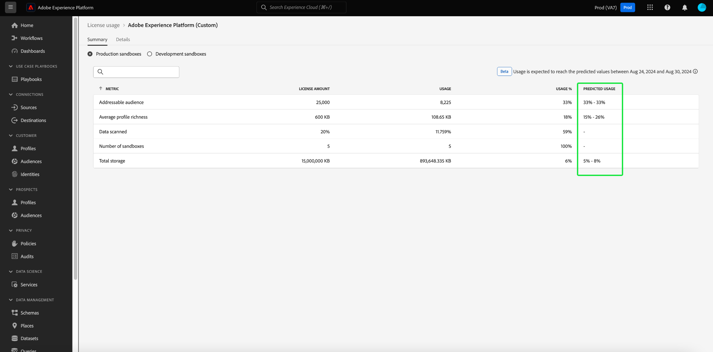

# 라이선스 사용 대시보드 {#license-usage-dashboard}

>[!CONTEXTUALHELP]
>id="testy-mctestface"
>title="표시되면 안 되는 테스트 대화 상자"
>abstract="{date}에 {name} 오브젝트를 조회 중입니다."

>[!CONTEXTUALHELP]
>id="platform_dashboards_licenseusage_core"
>title="핵심 제품 테이블"
>abstract="테이블에 나열된 핵심 제품에는 샌드박스 수준의 자체 지표, 사용 추적 및 드릴 스루 보기가 있습니다. 이러한 핵심 제품은 추적에 대한 주요 지표를 제공하며, 모든 추가 기능은 이러한 지표에 포함됩니다."

>[!CONTEXTUALHELP]
>id="platform_dashboards_licenseusage_addons"
>title="추가 기능 테이블"
>abstract="추가 기능 테이블에는 라이선스 금액이 핵심 제품에서 지원하는 지표와 결합된 제품이 나열되어 있습니다. 이러한 추가 기능에는 별도의 지표가 없지만, 연결된 핵심 제품의 사용 추적을 향상시킵니다."

>[!CONTEXTUALHELP]
>id="platform_dashboards_licenseUsage"
>title="라이선스 사용 대시보드"
>abstract="라이선스 사용 대시보드는 구매한 Adobe Experience Platform 제품에 대한 인사이트를 제공합니다. 대시보드 개요에는 각 기본 지표에 대한 사용량과 계약된 라이선스 금액 등 제품에 대한 기본 지표가 표시됩니다. 세부 정보 작업 영역에는 특정 샌드박스 내에 있는 각 제품에 대한 지표의 분류가 표시됩니다."
>additional-url="https://experienceleague.adobe.com/ko/docs/experience-platform/data-lifecycle/ui/dataset-expiration" text="자동화된 데이터 세트 만료 일정"
>additional-url="https://experienceleague.adobe.com/ko/docs/experience-platform/profile/pseudonymous-profiles" text="익명 프로필 데이터 만료"

>[!CONTEXTUALHELP]
>id="platform_licenseusage"
>title="라이선스 사용 대시보드"
>abstract="라이선스 사용 대시보드는 구매한 Adobe Experience Platform 제품에 대한 인사이트를 제공합니다. 대시보드 개요에는 각 기본 지표에 대한 사용량과 계약된 라이선스 금액 등 제품에 대한 기본 지표가 표시됩니다. 세부 정보 작업 영역에는 특정 샌드박스 내에 있는 각 제품에 대한 지표의 분류가 표시됩니다."
>additional-url="https://experienceleague.adobe.com/ko/docs/experience-platform/data-lifecycle/ui/dataset-expiration" text="자동화된 데이터 세트 만료 일정"
>additional-url="https://experienceleague.adobe.com/ko/docs/experience-platform/profile/pseudonymous-profiles" text="익명 프로필 데이터 만료"

Adobe Experience Platform [!UICONTROL 라이선스 사용] 대시보드를 통해 조직의 라이선스 사용에 대한 중요한 정보를 볼 수 있습니다. 여기에 표시되는 정보는 Platform 인스턴스의 일별 스냅샷 중에 캡처됩니다.

라이선스 사용 보고서는 라이선스 사용 지표에 비해 높은 수준의 세부기간을 제공합니다. 대시보드는 구매한 각 제품(및 관련 추가 기능)에 대한 사용 지표, 모든 프로덕션 또는 개발 샌드박스에서 지표의 통합 사용 및 특정 샌드박스의 사용 지표를 제공합니다. 사용 지표를 사용하여 Real-time Customer Data Platform, Adobe Journey Optimizer 및 Customer Journey Analytics Experience Platform 애플리케이션을 추적할 수 있습니다.

이 안내서에서는 UI에서 라이선스 사용 대시보드에 액세스하고 작업하는 방법에 대해 간략하게 설명하고 대시보드에 표시된 시각화에 대한 자세한 정보를 제공합니다.

플랫폼 UI에 대한 일반적인 개요는 [Experience Platform UI 안내서](../../landing/ui-guide.md)를 참조하십시오.

## [!UICONTROL 라이선스 사용량] 대시보드 데이터

[!UICONTROL 라이선스 사용량] 대시보드에는 구입한 모든 Experience Platform 제품 목록과 해당 제품에 대한 추가 기능이 표시됩니다. 이 대시보드에서 연결된 모든 샌드박스에서 Experience Platform을 위한 조직의 라이선스 관련 데이터의 스냅샷을 찾을 수 있습니다.

이 대시보드의 데이터는 스냅샷이 생성된 특정 시점에 나타나는 것과 동일하게 표시됩니다. 즉, 스냅샷은 데이터의 근사치나 샘플이 아니며 대시보드가 실시간으로 업데이트되지 않는다.

>[!NOTE]
>
>스냅숏을 만든 이후 데이터에 대한 변경 또는 업데이트는 다음 스냅숏을 만들 때까지 대시보드에 반영되지 않습니다.

## 라이선스 사용 대시보드 살펴보기 {#explore}

Platform UI 내의 라이선스 사용 대시보드로 이동하려면 왼쪽 레일에서 **[!UICONTROL 라이선스 사용]**&#x200B;을 선택합니다. 사용 가능한 제품 목록을 표시하는 [!UICONTROL 개요] 탭이 열립니다.

>[!NOTE]
>
>라이선스 사용 대시보드는 기본적으로 활성화되어 있지 않습니다. 대시보드를 볼 수 있으려면 사용자에게 &quot;라이선스 사용 대시보드 보기&quot; 권한이 부여되어야 합니다. 라이선스 사용 대시보드를 볼 수 있는 액세스 권한을 부여하는 단계는 [대시보드 사용 권한 안내서](../permissions.md)를 참조하세요.

## [!UICONTROL 개요] 탭 {#overview-tab}

[!UICONTROL 라이선스 사용량] 대시보드에는 두 개의 별도 테이블이 표시됩니다. **핵심 제품** 및 **추가 기능**.

- **[!UICONTROL 핵심 제품] 표**: 이 표에는 조직에서 라이선스를 부여한 기본 Adobe Experience Platform 제품이 나열됩니다. 각 핵심 제품에는 샌드박스 수준에서 자체 지표, 사용 추적 및 드릴스루 보기가 있습니다. 이러한 핵심 제품은 추적에 대한 주요 지표를 제공하며, 모든 추가 기능은 이러한 지표에 포함됩니다.

- **[!UICONTROL 추가 기능] 테이블**: 이 테이블에는 라이선스 금액이 핵심 제품에서 지원하는 지표와 결합된 추가 제품이 나열됩니다. 추가 기능에는 별도의 지표가 없지만 연결된 핵심 제품의 사용 추적을 개선합니다.

| 열 이름 | 설명 |
|---|---|
| **[!UICONTROL 제품]** | 조직에서 라이선스를 부여한 Adobe 솔루션입니다. |
| **[!UICONTROL 기본 지표]** | 해당 제품 내에서 추적하는 데 사용되는 기본 지표입니다. |
| **[!UICONTROL 라이선스 금액]** | 제품 라이선스 계약에 합의된 기본 지표의 최대 금액에 대해 계약된 값입니다. |
| **[!UICONTROL 사용]** | 사용된 기본 지표의 양입니다. 이 값은 프로덕션 또는 개발의 모든 샌드박스에서 해당 지표의 총 사용량을 제공합니다. |
| **[!UICONTROL 사용량 %]** | 라이선스 금액에 따라 사용되는 기본 지표의 비율입니다. |
| **[!UICONTROL 예측 사용]** | 라이선스 금액에 따른 기본 지표의 예상 사용 비율입니다. |

>[!NOTE]
>
>추가 기능의 라이선스 금액은 핵심 제품의 [!UICONTROL 라이선스 금액]에 포함되어 있습니다. 예를 들어, 추가 기능으로 샌드박스 5개 팩 1개를 구매하면 기본 제품 금액에 금액이 추가됩니다. 추가 기능 테이블에는 추가 기능에 해당하는 [!UICONTROL 라이선스 양]이 표시되지만 실제 사용량은 기본 제품을 통해 추적됩니다.

각 제품이 다양한 지표를 추적할 수 있으므로 표는 각 제품에 대한 기본 지표를 나타냅니다.

### 예상 사용량 {#predicted-usage}

>[!CONTEXTUALHELP]
>id="platform_dashboards_licenseUsage_prediction"
>title="예상 사용량"
>abstract="예측은 지난 6~7개월 동안의 사용량을 기반으로 하며 매월 15일에 생성됩니다. 라이선스 사용량 예측은 과거 사용량을 기반으로 한 추정치입니다. 귀하는 조직의 실제 사용량을 파악하고 사용량이 Adobe와 조직의 라이선스 범위를 벗어나지 않도록 할 책임이 있습니다. 사용량을 줄이려면 샌드박스 및 데이터 세트에 대한 데이터 세트 또는 익명 프로필 데이터 만료를 구성하십시오."
>additional-url="https://experienceleague.adobe.com/ko/docs/experience-platform/data-lifecycle/ui/dataset-expiration" text="자동화된 데이터 세트 만료 일정"
>additional-url="https://experienceleague.adobe.com/ko/docs/experience-platform/profile/pseudonymous-profiles" text="익명 프로필 데이터 만료"

>[!CONTEXTUALHELP]
>id="platform_licenseusage_prediction"
>title="예상 사용량"
>abstract="예측은 지난 6~7개월 동안의 사용량을 기반으로 하며 매월 15일에 생성됩니다. 라이선스 사용량 예측은 과거 사용량을 기반으로 한 추정치입니다. 귀하는 조직의 실제 사용량을 파악하고 사용량이 Adobe와 조직의 라이선스 범위를 벗어나지 않도록 할 책임이 있습니다. 사용량을 줄이려면 샌드박스 및 데이터 세트에 대한 데이터 세트 또는 익명 프로필 데이터 만료를 구성하십시오."
>additional-url="https://experienceleague.adobe.com/ko/docs/experience-platform/data-lifecycle/ui/dataset-expiration" text="자동화된 데이터 세트 만료 일정"
>additional-url="https://experienceleague.adobe.com/ko/docs/experience-platform/profile/pseudonymous-profiles" text="익명 프로필 데이터 만료"

통찰력 있는 사용 예측에 따라 라이센스 리소스를 사전 예방적으로 관리 및 최적화합니다. [!UICONTROL 예상 사용량] 열은 구입한 모든 제품에 대해 모든 프로덕션 및 개발 샌드박스에서 샌드박스 수준에서 향후 라이선스 사용량을 정확하게 예측합니다. 이 경고 기능은 이달 15일까지의 사용량을 기반으로 향후 6주 동안의 라이선스 사용량을 예측합니다. 예측은 하한값과 상한값으로 제공됩니다.

>[!IMPORTANT]
>
>예측은 월별로 새로 고쳐집니다. 새로 고침 날짜가 정보 아이콘() 있습니다.

제품의 권한 사용 요약을 보려면 [!UICONTROL 핵심 제품] 테이블에서 제품을 선택하십시오.

<!-- update image ... -->
![제품 및 예상 사용 열이 강조 표시된 [!UICONTROL 라이선스 사용량] [!UICONTROL 개요].](../images/license-usage/product-predicted-usage.png)

요약 탭이 나타납니다. [!UICONTROL 요약] 및 [!UICONTROL 세부 정보] 탭에서 사용할 수 있는 세분화된 예측을 사용하여 효율적인 라이선스 사용을 위한 올바른 의사 결정을 보장할 수 있습니다.

>[!NOTE]
>
>라이선스 사용량 예측은 과거 사용량을 기반으로 한 추정치입니다. 조직의 실제 사용을 이해하고 사용이 Adobe으로 조직의 라이선스 범위를 벗어나지 않도록 해야 합니다.

<!-- update image ... -->

예측된 사용의 비율은 다음과 같이 결정됩니다.

- 하한과 상한이 크게 다른 경우 범위로 표시됩니다(예: 32% - 35%).
- 하한과 상한이 거의 동일하고 0이 아닌 경우 근사값(예: ~34%)으로 표시됩니다.
- 하한과 상한이 거의 동일하고 0이면 정확히 0%로 표시됩니다.

>[!NOTE]
>
>이 컨텍스트에서 &quot;거의 같음&quot;은 값이 소수점 이하 두 자리로 통계적으로 중요함을 의미합니다(예: 하한 0.342와 상한 0.344는 모두 34%로 반올림됨).

예측된 사용 기능은 다음 지표를 지원합니다.

- [!UICONTROL 대응 가능 대상]
- [!UICONTROL 평균 프로필 풍부도]
- [!UICONTROL 시간 계산]
- [!UICONTROL 고객 여정 대상 행 수]
- [!UICONTROL 전체 저장소]

## [!UICONTROL 요약] 탭 {#summary-tab}

제품 라이선스 사용에 대한 더 많은 지표와 자세한 통찰력을 보려면 목록에서 제품 이름을 선택하십시오. 해당 제품에 대한 [!UICONTROL 요약] 보기가 나타납니다. 사용 가능한 모든 지표가 [!UICONTROL 요약] 탭에 표시됩니다. 사용 가능한 지표는 사용 허가된 제품에 따라 다릅니다. 이 보기는 **모든 프로덕션 또는 개발 샌드박스에 대한 모든 지표의 통합 보기**&#x200B;를 제공합니다. 프로덕션 및 개발 샌드박스 모두에 대해 동일한 수준의 분석이 제공됩니다.

요약 탭의 테이블에는 [!UICONTROL 지표] 열이 포함되어 있습니다. 사람이 인식할 수 있는 이러한 설명은 해당 유형의 샌드박스에 사용되는 모든 지표를 나타냅니다.

### 샌드박스 선택 {#select-sandbox}

프로덕션 및 개발 샌드박스 유형 간의 보기를 변경하려면 [!UICONTROL 프로덕션 샌드박스] 또는 [!UICONTROL 개발 샌드박스]를 선택하십시오. 선택한 샌드박스 유형은 샌드박스 이름 옆에 있는 라디오 버튼으로 표시됩니다.

샌드박스에 대한 소비 보고는 동일한 유형의 모든 샌드박스에 대해 누적됩니다. 즉, [!UICONTROL 프로덕션] 또는 [!UICONTROL 개발]을 선택하면 각각 모든 프로덕션 또는 개발 샌드박스에 대한 사용량 보고서가 제공됩니다.

>[!WARNING]
>
>라이선스 사용 대시보드를 볼 수 있는 권한은 샌드박스 수준에서 지정해야 합니다. 각 개별 샌드박스에 권한을 추가하여 대시보드 내에서 볼 수 있습니다. 이 제한은 향후 릴리스에서 해결될 예정입니다. 당분간은 다음 해결 방법을 사용할 수 있습니다.
>
>1. Adobe Admin Console에서 제품 프로필을 만듭니다.
>2. 샌드박스 범주의 권한 아래에 라이선스 사용 대시보드에서 보려는 모든 샌드박스를 추가합니다.
>3. 사용자 대시보드 권한 범주 아래에 &quot;라이선스 사용량 대시보드 보기&quot; 권한을 추가합니다.

## [!UICONTROL 세부 정보] 탭 {#details-tab}

**특정 샌드박스에서 특정 사용 지표**&#x200B;를 보려면 [!UICONTROL 세부 정보] 탭으로 이동하십시오. [!UICONTROL 세부 정보] 탭에는 프로덕션 또는 개발 샌드박스 내에서 사용 가능한 모든 샌드박스가 표시됩니다.

이 보기에서 이(가) 있습니다. 해당 지표에 대한 시각화와 함께 대화 상자가 열립니다.

### 시각화 {#visualizations}

각 시각화 위젯에는 다음과 같은 측면이 포함되어 있습니다.

- 시간 경과에 따른 지표 변경을 추적하는 선 그래프
- 선 그래프의 키
- 샌드박스 이름
- 선 그래프의 기간을 조정하는 드롭다운 메뉴

꺾은선형 그래프는 조직의 사용 번호를 조직의 라이선스와 함께 사용할 수 있는 합계와 비교하고 총 사용의 백분율을 제공합니다.

분석 전환 확인 기간은 드롭다운 메뉴에서 조정할 수 있습니다. 지난 30일의 기본값

날짜 범위를 선택하려면 날짜 범위 드롭다운을 사용하여 대시보드에 표시할 기간을 선택할 수 있습니다. 최근 30일의 기본값을 포함하여 여러 옵션을 사용할 수 있습니다.

**[!UICONTROL 사용자 지정 날짜]**&#x200B;를 선택하여 표시되는 기간을 선택할 수도 있습니다.

## 사용 가능한 지표 {#available-metrics}

라이선스 사용 대시보드는 조직의 여러 제품에 적용할 수 있는 몇 가지 고유한 지표에 대해 보고합니다. 사용 가능한 지표는 다음과 같습니다.

| 지표 | 설명 |
|---|---|
| [!UICONTROL Audience Activation 크기] | 1년 동안 파일 기반 대상에 활성화된 프로필의 총 크기입니다. 참고: 여기에는 스트리밍 대상을 통해 전송된 프로필이 포함되지 않습니다. |
| [!UICONTROL 대응 가능 대상] | 비즈니스 대상 권한 및 소비자 대상 권한의 합계. 소비자 대상은 판매 주문에서 &quot;소비자 대상&quot;으로 식별되는 개인 프로필 수로 정의됩니다. 비즈니스 대상자는 판매 주문에서 &quot;비즈니스 대상자&quot;로 식별되는 비즈니스 개인 프로필 수로 정의됩니다. |
| [!UICONTROL 임시 쿼리 서비스 사용자 팩] | 승인된 동시 쿼리 서비스 사용자 권한을 5명의 추가 동시 쿼리 서비스 사용자와 한 팩당 동시에 실행되는 임시 쿼리를 한 개 더 증가시키는 추가 기능입니다. 여러 추가 Ad Hoc Query 사용자 팩에 라이센스가 부여될 수 있습니다. |
| [!UICONTROL 사용 가능한 CJA 행] | Customer Journey Analytics 내에서 분석에 사용할 수 있는 일일 평균 데이터 행입니다. |
| [!UICONTROL 계산된 특성] | 집계된 프로필 동작 데이터의 총 수입니다. 집계된 프로필 행동 데이터는 프로필 속성으로 변환되고 개인 프로필 또는 비즈니스 개인 프로필에 포함될 수 있는 경험 이벤트를 기반으로 합니다. |
| [!UICONTROL 소비자 대상] | 판매 주문에서 &quot;소비자 대상&quot;으로 식별된 개인 프로필 수입니다. |
| [!UICONTROL 데이터 내보내기 크기] | 1년 동안 데이터 세트 활성화를 통해 전송된 데이터의 양입니다. |
| [!UICONTROL 데이터 내보내기] | 1년 동안 Adobe이 아닌 솔루션으로 (직접 또는 간접적으로) 내보낼 수 있는 데이터 세트의 총 크기입니다. |
| [!UICONTROL 데이터 레이크 저장소] | Adobe Experience Platform 내 분석 데이터 저장소의 사용 수량입니다. |
| [!UICONTROL 참여 가능한 대상] | 이 지표는 참여 가능한 프로필의 대상자를 나타냅니다. 참여 가능 프로필은 개인을 나타내는 정보 레코드이며 프로필 서비스에 표시됩니다. 이러한 레코드는 지난 12개월 동안 Journey Optimizer의 작성, 의사 결정, 게재, 실험 또는 오케스트레이션 기능을 사용하여 관여하려고 한 프로필입니다. |
| [!UICONTROL 유사 대상] | 기존 소비자 대상을 모델링하여 해당 기존 소비자 대상과 유사한 개인 프로필을 식별하여 생성된 대상의 수입니다. |
| [!UICONTROL AMM 모델 수] | 투자를 기반으로 지정된 결과를 측정 및/또는 예측하는 데 사용되는 머신 러닝 모델(내장 Adobe Mix Modeler)의 개수입니다. |
| [!UICONTROL 샌드박스 수] | Adobe Experience Platform 격리 데이터 및 작업에 액세스하는 Adobe On-demand Service 인스턴스 내의 논리 구분 개수입니다. |
| [!UICONTROL Pack의 프로필 풍부성 아니요] | 승인된 총 데이터 볼륨에서 각 추가 프로필 풍부도 팩의 프로필당 25KB 증가. |
| [!UICONTROL 쿼리 서비스 계산 시간] | 일괄 처리 쿼리가 실행될 때 쿼리 서비스 엔진이 데이터를 읽고 처리하고 데이터 레이크에 다시 쓰는 데 걸린 시간을 측정한 것입니다. |
| [!UICONTROL 팩 중 스트리밍 세분화 없음] | 새 데이터가 스트리밍 플로우를 통해 세분화 서비스로 들어감에 따라 팩은 개인 프로필의 세그먼트 멤버십을 업데이트합니다. 세그먼트 멤버십은 이전 동작을 고려하지 않고 현재 개인 프로필 속성과 현재 이벤트의 값을 기반으로 평가됩니다. 스트리밍 세분화는 공유 기능입니다. |
| [!UICONTROL 총 데이터 볼륨] | Adobe Experience Platform 프로필 서비스가 참여 워크플로우에서 사용할 수 있는 총 데이터 양입니다. |

<!-- |  [!UICONTROL Sandbox No of Packs] |  A logical separation within your instance of any Adobe On-demand Service that accesses Adobe Experience Platform isolating data and operations | -->

>[!TIP]
>
>판매 주문에서 라이선스 권한을 확인하여 &#39;스토리지 허용량&#39;과 같은 지표를 계산할 수 있습니다. 예:<ul><li>저장 허용 = 계약에 포함된 &quot;승인된 프로필&quot; 수 X 평균 프로필 풍부도</li></ul>

이러한 지표의 사용 가능 여부 및 이러한 각 지표의 특정 정의는 조직이 구입한 라이선스에 따라 다릅니다. 각 지표에 대한 자세한 정의는 해당 제품 설명 설명서를 참조하십시오.

| 라이선스 | 제품 설명 |
| --- | --- |
| <ul><li>ADOBE EXPERIENCE PLATFORM:OD LITE</li><li>ADOBE EXPERIENCE PLATFORM:OD 표준</li><li>ADOBE EXPERIENCE PLATFORM:OD HEAVY</li></ul> | [Adobe Experience Platform](https://helpx.adobe.com/legal/product-descriptions/adobe-experience-platform.html) |
| <ul><li>ADOBE EXPERIENCE PLATFORM:OD</li></ul> | [Experience Platform, 앱 서비스 및 지능형 서비스](https://helpx.adobe.com/legal/product-descriptions/exp-platform-app-svcs.html) |
| <ul><li>RT CUSTOMER DATA PLATFORM:OD</li><li>RT 고객 데이터 플랫폼: PRFL에서 10M로 업그레이드</li><li>RT CUSTOMER DATA PLATFORM: PRFL ~ 50M</li></ul> | [Adobe Real-time Customer Data Platform](https://helpx.adobe.com/legal/product-descriptions/real-time-customer-data-platform.html) |
| <ul><li>AEP:OD 활성화</li><li>AEP:OD 활성화 PRFL ~ 10M</li><li>AEP:OD 활성화 PRFL 최대 50M</li></ul> | [Adobe Experience Platform 활성화](https://helpx.adobe.com/legal/product-descriptions/adobe-experience-platform0.html) |
| <ul><li>AEP:OD INTELLIGENCE</li></ul> | [Adobe Experience Platform 인텔리전스](https://helpx.adobe.com/legal/product-descriptions/adobe-experience-platform-intelligence---product-description.html) |
| <ul><li>JOURNEY OPTIMIZER SELECT:OD</li><li>JOURNEY OPTIMIZER PRIME:OD</li><li>JOURNEY OPTIMIZER ULTIMATE:OD</li><li>AJO PRIME STARTER:OD 실행</li><li>UNP AJO ULTIMATE STARTER:OD</li><li>Real-Time CDP 실행:OD 프로필 오케스트레이션</li></ul> | [Adobe Journey Optimizer](https://helpx.adobe.com/kr/legal/product-descriptions/adobe-journey-optimizer.html) |

>[!WARNING]
>
>라이선스 사용 대시보드는 조직에 대해 프로비저닝된 최신 라이선스에 대해서만 보고합니다. 조직에 대해 프로비저닝된 최신 라이센스가 위의 표에 표시되지 않으면 라이센스 사용 대시보드가 제대로 표시되지 않을 수 있습니다. 향후 릴리스를 위해 단일 조직에서 추가 라이선스 및 여러 라이선스를 지원할 예정입니다.

## 다음 단계

이 문서를 읽고 나면 구입한 각 제품, 모든 프로덕션 또는 개발 샌드박스 및 특정 샌드박스에 대한 라이선스 사용량 대시보드를 찾고 사용량 지표를 볼 수 있습니다. 조직에서 구입한 라이선스에 따라 조직에서 사용 가능한 지표에 대한 자세한 내용을 찾을 수 있습니다.

Experience Platform UI에서 사용할 수 있는 다른 기능에 대한 자세한 내용은 [플랫폼 UI 안내서](../../landing/ui-guide.md)를 참조하세요.
